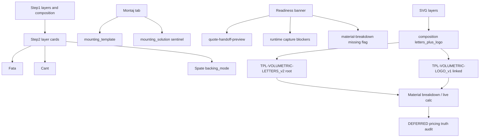

# feat: Intake V6 Step2 layer UI + mounting + readiness UX

**Task:** `WORKOS-INTAKE-V6-STEP1-TO-STEP2-LAYER-UI-AND-MOUNTING-CONTRACT-PLAN-V1` (amended)  
**Starting HEAD (docs baseline):** `47cc4c1`  
**Workspace fixture (read-only):** `11891d68-c4c8-4719-acc5-f8fcb22a44af`  
**SVG fixture:** `C:\Users\offic\Desktop\fisiere-teste-svg\gradi-curat.svg`  
**Status:** `INTAKE V6 STEP 2 LAYER UI + MOUNTING + READINESS UX PLAN READY FOR OWNER REVIEW`  
**Mode:** PLAN ONLY — no product-code implementation, no runtime writes, no Build Locally, no commit until owner accepts amended docs.

**Companion artifacts:**
- [decision-log.md](./decision-log.md)
- [docs/worklog/realignment/2026-07-16_intake_v6_step2_layer_ui_and_mounting_contract_audit.md](../../docs/worklog/realignment/2026-07-16_intake_v6_step2_layer_ui_and_mounting_contract_audit.md)

---

## 0. Product Contract preservation (unchanged)

- Individual letter/logo rear closure = `backing_mode` (Forex/PVC) — **PRESENT**
- Common continuous Forex/ACM panel = **ABSENT** (never encoded via `backing_mode=none`)
- Mounting = installation template + site install YES; no ACM/metal support child for that combination
- FRONT_LIT / COOL_WHITE; plexi face no vinyl; white Al return 60 mm; logos print+laminate
- Composition: letters + linked logos (`letters_plus_logo`)

**Semantic firewall:** never use `backing_mode` for common panel or mounting template.

---

## 1. Problem frame (three operator surfaces, one GO)

| Surface | Defect | Operator effect |
|---------|--------|-----------------|
| Layer cards | Collapsed cards still expose Forex select; Spate unlabeled; letter/logo DOM order differs | “Floating Forex”, blank tall cards |
| Mounting | `mounting_solution=null` + template enabled → `MOUNTING_SOLUTION_MISSING`; “Fără soluție suplimentară” writes null | Confirm blocked despite intentional template-only |
| Readiness banner | Oversized red “Acțiune necesară înainte de Confirmare” with residual vector / missing tariff / generic technical copy | Panic UI; hard to act; may include stale/false-positive |



---

## 2. Key technical decisions (locked for this plan)

### KTD-1 — UI: shared LayerCardShell (Approach B)
Collapsed: identity + labeled `Fata:` / `Cant:` / `Spate:` + status; **no editable selects**.  
Expanded order: Fata → Cant → Spate → component-specific.  
Primary files: `IntakeV6ReviewLetterGroupsSection.tsx`, `IntakeV6ArtworkFinishSection.tsx`, `IntakeV6ReviewBackingFinishRow.tsx`.

### KTD-2 — Mounting: explicit `installation_template` sentinel
```text
mounting_solution = { kind: "installation_template", template_code: null, configuration: {} }
```
Accept for readiness only when `mounting_template_enabled` + required template fields complete. Bare `null` still blocks. No ACM/metal PD child for sentinel. Never abuse `backing_mode`.

### KTD-3 — Readiness banner: compact actionable summary (this amendment)
Same Step 2 GO phase. Do **not** delete real readiness protection. Remove only **proven** STALE / DUPLICATE / FALSE_POSITIVE messages. Map unmapped runtime codes (especially `MOUNTING_SOLUTION_MISSING`) to specific operator copy — forbid generic “Există blocaje tehnice…” when exact codes exist.

### KTD-4 — Pricing non-regression (this GO)
Step 2 may only preserve configuration semantics, expose accurate readiness/warning summaries, avoid accidental canonical pricing-input mutation, and show traceable warning details. **No numerical pricing correction** in this phase.

### KTD-5 — Next mandatory phase after Step 2
**GRADI-CURAT PRICING TRUTH AUDIT** (separate GO) before ProductAggregate/commercial continuation and Quote/Order E2E.

---

## 3. Readiness banner correction

### 3.1 Current UI stack
- Component: [`IntakeV6ReviewOperatorBlockerBanner.tsx`](../../frontend/src/components/workos/intake-v6/IntakeV6ReviewOperatorBlockerBanner.tsx)
- Display builder: [`intakeV6OperatorBlockerBannerDisplay.ts`](../../frontend/src/lib/intakeV6/intakeV6OperatorBlockerBannerDisplay.ts)
- Handoff reasons: [`intakeV6QuoteHandoffReadiness.ts`](../../frontend/src/lib/intakeV6/intakeV6QuoteHandoffReadiness.ts) `buildReviewHandoffSurfacing`
- Wired in ReviewStep via `reviewHandoffSurfacing` + runtime/planner models

### 3.2 Future UI contract (owner-visible)
| State | Presentation |
|-------|----------------|
| No issues | Banner absent |
| One blocker | Compact actionable issue + focus/nav target |
| Multiple blockers | Compact count: e.g. `2 probleme blochează Confirmarea · 1 avertisment` |
| Warnings only | Amber/warning styling — not critical red |
| Details | Expandable; each item names layer/pricing line when known |
| Resolution | Messages disappear after refresh when underlying condition clears |
| Forbidden | Generic “Există blocaje tehnice…” when exact codes exist |

Cap of 3 full messages today (`OPERATOR_BLOCKER_BANNER_MAX_MESSAGES`) is replaced by count summary + expandable details.

### 3.3 Message provenance matrix (gradi-curat workspace, read-only 2026-07-16)

#### M1 — Residual unclassified vector
| Field | Value |
|-------|--------|
| Operator copy | “Artwork confirmat, dar există vector rezidual neclasificat în SVG…” / artwork residual notice |
| FE condition | `buildReviewHandoffSurfacing`: `hasUnclassifiedVectorArtworkWarning(review_warnings)` while `allArtworkProductConfigured !== false` |
| Warning code | `unclassified_vector_artwork_requires_decision` (handoff `review_warnings` + also listed in `blockers`) |
| BE source | `has_unclassified_vector_artwork` in `intake_v4_internal_draft_quote_policy_service.py`: raw cutting perimeter (`path_geometry_summary` ≈ **31.637 m**) > confirmed vector total |
| Observed numbers | Letter perimeters sum ≈ **26.747 m**; artwork return ≈ **4.891 m**; delta ≈ artwork when artwork rows are **not** `confirmed: true` |
| Layer/path | Residual equals unconfirmed artwork contribution (Logo 1 / Logo 2), not an unknown SVG layer |
| Step1 roles | Logos already `confirmed_role=printed_artwork`; letters `face` |
| Artwork rows | `execution_type=print_laminate` but `confirmed=false` for both logos; letter_group `confirmed=false` |
| Blocking? | Review warning path (banner attention/block mix); handoff not allowed for other fatal reasons too |
| Classification | **WARNING_ACTIONABLE** (confirm artwork/letter finish rows) with **wording risk FALSE_POSITIVE** (“neclasificat” overstates — roles are classified; finish confirmation lag). Not STALE. |
| Operator action | Confirm Logo 1/2 (and letter) finish cards so confirmed perimeter includes artwork; re-check residual after refresh. Do not “delete” protection until confirmation semantics are honest. |

#### M2 — Live calculation lines without configured tariff
| Field | Value |
|-------|--------|
| Operator copy | “Calculul live conține linii fără tarif configurat.” |
| FE condition | `containsMissingPrices: breakdown?.totals.contains_missing_prices === true` |
| BE source | `intake_v4_material_breakdown_service.py` totals flag via `_is_price_missing_for_quantity` / `_is_price_missing_for_operation` |
| Observed rows | All material/ops have unit prices except `led_total_watts` (`price_source=informational_only`, correctly excluded by helper) |
| Local predicate replay | **zero hits** while API still returns `contains_missing_prices=true` |
| Commercial dry-run | `commercial_line_items` (9) have **null** `unit_price`/`amount` under `V6_PRICED_DRY_RUN_BLOCKED` — separate from material-breakdown EUR lines |
| Classification | **FALSE_POSITIVE** (or unresolved flag bug) for material-breakdown banner reason on this fixture; commercial null lines are **INFORMATIONAL / deferred** to pricing audit, not Step2 pricing edits |
| Operator action (Step2 UX) | Show expandable detail listing **exact** offending line keys when predicate hits; if flag true with empty list, treat as diagnostic inconsistency (do not invent a fake tariff fix). No registry tariff changes in this GO. |

#### M3 — Generic technical blockers
| Field | Value |
|-------|--------|
| Operator copy | “Există blocaje tehnice care trebuie verificate în Detalii tehnice și diagnostic.” |
| FE condition | Runtime/planner codes present but not in `RUNTIME_BLOCKER_OPERATOR_MESSAGES` map → generic fallback |
| Exact fixture codes | `MOUNTING_SOLUTION_MISSING` (and related `readiness_not_ready:runtime_capture_blocked`); not in FE map today |
| Classification | **DUPLICATE** of mounting sentinel work + **BLOCKING_ACTIONABLE** root cause; generic text itself is **STALE wording** once codes are mapped |
| Operator action | Complete Montaj: installation-template sentinel + template fields (Step2 U4). Banner must name mounting specifically. |

#### M4 — Other fatal handoff codes (banner context)
| Code | Classification | Step2 action |
|------|----------------|--------------|
| `runtime_capture:MOUNTING_SOLUTION_MISSING` | **BLOCKING_ACTIONABLE** | U4 sentinel |
| `readiness_not_ready:runtime_capture_blocked` | **DUPLICATE** of capture blockers | Collapse into mapped codes |
| `operator_confirmation_missing` | **INFORMATIONAL** on Review (Confirm-step only for banner reason) | Do not red-banner on Review for this alone |
| `pricing_adapter_not_ready` | **WARNING_ACTIONABLE** / pricing-phase | Surface as warning detail; no numeric fix here |
| Canonical unresolved warnings (dossier/trigger mismatch) | **INFORMATIONAL** | Expandable diagnostic only |

### 3.4 Banner implementation unit (U7 — same GO as U1–U5)
1. Characterization tests for count summary, severity split, expand, no generic when codes known.
2. Extend `RUNTIME_BLOCKER_OPERATOR_MESSAGES` for mounting (+ other known codes used on this path).
3. Replace oversized list with compact header + expandable issue rows (layer/line anchors where possible).
4. Severity: blockers → red; warnings-only → amber.
5. Never clear `MOUNTING_SOLUTION_MISSING` by weakening readiness — only by sentinel + template completeness.

---

## 4. Residual vector provenance

See §3.3 M1. Summary:

| Quantity | Value (fixture) |
|----------|-----------------|
| Raw cutting perimeter | ≈ 31.637 m |
| Confirmed letter perimeter sum | ≈ 26.747 m |
| Artwork return perimeter | ≈ 4.891 m |
| Residual | ≈ raw − letters when artwork unconfirmed ≈ logo contribution |

**Not** an unknown third vector family in Step1 roles. Wording must shift from “neclasificat” toward “neconfirmat în finisaje” when roles already exist.

---

## 5. Missing tariff warning provenance

See §3.3 M2. Summary:

| Layer | Finding |
|-------|---------|
| Material breakdown EUR rows | Priced (plexi, forex, print, laminate, CNC, LED modules, PSU, adhesives, …) |
| Informational LED watts | Null price by design — must not drive banner |
| Totals flag | `true` with no predicate hits → treat as **FALSE_POSITIVE** candidate |
| Commercial dry-run lines | Null commercial unit prices while dry-run blocked — **out of Step2 pricing scope** |

Step2 may surface “which line / which flag” only; numerical correction deferred.

---

## 6. Logo template existence / resolution

| Check | Result on fixture DB (read-only) |
|-------|-----------------------------------|
| Composition recommendation | Includes `TPL-VOLUMETRIC-LOGO_v1` for `logo_instance_001/002` |
| Composition confirmed | Yes — `letters_plus_logo` with logo item |
| Root binding / selected_template | `TPL-VOLUMETRIC-LETTERS_v2` only |
| `/api/v1/product-system/template-availability` | **No LOGO rows at all** (only `TPL-VOLUMETRIC-LETTERS_v2` among volumetric offerable/active; 8 items total) |
| Docs expectation | Logo = `candidate_product` / linked child, not Work Intake root |
| Runtime materialization | Linked logo **material/ops rows present** under letters-root breakdown (`artwork_*_logo_instance_*`) |

**Read-only determination:** on this workspace DB, `TPL-VOLUMETRIC-LOGO_v1` is **absent from the Product System availability registry surface** (not merely hidden by a UI filter on an existing row). Composition + linked-segment pricing still resolve the **code** as linked child under the letters root. It is **not** processed as a separate offerable root. Double-count risk is at **geometry/BOM line** level (letter face/back + per-logo face/back), not “two roots.”

Owner implication: Product System UI not listing logo is consistent with **missing/inactive registry row on this DB** and/or candidate omission — Step2 must not invent a second root selector; provenance UI should show linked template code on logo cards.

---

## 7. Layer-to-template matrix

| Layer (UI name) | Layer key | Confirmed role | Target template | Binding path |
|-----------------|-----------|----------------|-----------------|--------------|
| pseudo maria | `pseudo:maria` | `face` | `TPL-VOLUMETRIC-LETTERS_v2` | composition item `letters` |
| pseudo soare | `pseudo:soare` | `face` | `TPL-VOLUMETRIC-LETTERS_v2` | letters |
| pseudo ana | `pseudo:ana` | `face` | `TPL-VOLUMETRIC-LETTERS_v2` | letters |
| pseudo gradinita | `pseudo:gradinita` | `face` | `TPL-VOLUMETRIC-LETTERS_v2` | letters |
| Logo 1 | `logo_instance_001` | `printed_artwork` | `TPL-VOLUMETRIC-LOGO_v1` | composition item `logo` (linked) |
| Logo 2 | `logo_instance_002` | `printed_artwork` | `TPL-VOLUMETRIC-LOGO_v1` | composition item `logo` (linked) |

Expected mapping matches analyzer recommendation. Root offer path remains letters_v2.

---

## 8. Layer-to-pricing-line provenance matrix

Lineage (intended):

```text
SVG layer → confirmed role → target template code
  → ProductDefinition child/component (linked segment for logos)
  → ProductAggregate component/material/operation
  → CommercialPriceProposal line (dry-run currently blocked/null commercial prices)
  → EstimatedInternalCost / material-breakdown line (EUR estimates present)
```

### 8.1 Visible material / operation lines (material-breakdown)

| Line key / label | Contributing layers | Template / component | Geometry metric | Qty | Unit | Commercial rule (now) | Internal-cost rule | Currency | Missing tariff | In total | Duplicate-count risk |
|------------------|---------------------|----------------------|-----------------|-----|------|----------------------|--------------------|----------|----------------|----------|----------------------|
| `plexiglas_face` Plexiglas 3 mm | letter groups | letters face | nesting quoteable face area | 1.2638 | m² | deferred (CPP null) | pricing_registry sheet | EUR | no | yes | baseline letters only |
| `forex_backing` Forex 10 mm | letter groups | letters back | fallback from face quoteable area | 1.2638 | m² | deferred | pricing_registry | EUR | no | yes | **fallback** warning; not common panel |
| `artwork_plexiglas_logo_instance_00x` | Logo 1/2 | linked logo face | bbox footprint | 0.4002 each | m² | deferred | pricing_registry | EUR | no | yes | separate from letter plexi — **not omitted** |
| `artwork_forex_backing_logo_instance_00x` | Logo 1/2 | linked logo back | bbox = face fallback | 0.4002 each | m² | deferred | pricing_registry | EUR | no | yes | linked logo backing fallback warning |
| `return_material` cant/volume | letters + artwork | letters return (+artwork perim) | perimeter with waste | 31.6382 | m | deferred | pricing_registry | EUR | no | yes | combined letter+logo perimeter — watch double-count vs separate logo return |
| print vinyl `artwork_*_print_vinyl` | Logo 1/2 | logo finish | bbox | 0.4002 | m² | deferred | pricing_registry | EUR | no | yes | logo-only |
| laminate vinyl `artwork_*_laminated_vinyl` | Logo 1/2 | logo finish | bbox | 0.4002 | m² | deferred | pricing_registry | EUR | no | yes | logo-only |
| CNC face plexi | letters | letters face op | face cutting perim | 24.6488 | m | deferred | CNC rate | EUR | no | yes | letters contours |
| CNC backing forex | letters (+policy) | letters back op | backing cut perim | 26.7471 | m | deferred | CNC rate | EUR | no | yes | 3 passes |
| print/lamination/application services | Logo 1/2 | logo finish ops | print area + waste | 0.4802 | m² | deferred | workcenter / owner rates | EUR | no | yes | per logo instance |
| LED modules 145 buc | letters LED scope | letters lighting | estimated modules | 145 | buc | commercial line null | pricing_registry | EUR | no | yes | letters perimeter policy excludes artwork |
| LED PSU | assembly | letters lighting | sized PSU | 1 | buc | commercial line null | pricing_registry | EUR | no | yes | |
| LED total watts | informational | — | modules×W | 108.75 | W | excluded | informational_only | EUR | n/a | no $ | must not banner |
| edge bond cant | letters+artwork perim | return bonding | 31.6382 m | 31.6382 | m | deferred | registry bonding | EUR | no | yes | |

### 8.2 Logo geometry verdict
| Hypothesis | Verdict |
|------------|---------|
| Omitted | **No** — linked logo face/back/print/laminate/ops present |
| Treated as letters | **Partially** — root template is letters; LED/cant aggregates may include or exclude artwork by policy |
| Correctly linked logo | **Yes** for material keys namespaced `artwork_*_logo_instance_*` |
| Double-counted | **Risk yes** on face/back area (letter nesting + logo bbox) and combined return perimeter — quantify in pricing audit, do not “fix” totals in Step2 |

### 8.3 Commercial dry-run snapshot (blocked)
Nine commercial lines (face cut, cant form, back cut, LED modules, PSU, finishes, mounting template Forex, packaging, site install) with **null** unit prices; totals null RON. Status `V6_PRICED_DRY_RUN_BLOCKED`. Step2 must not rewrite these.

---

## 9. Pricing non-regression tests (Step2 GO)

Required tests (characterization / contract — **no new pricing formulas**):

1. Collapsed/expanded UI does not change `backing_mode`, face, cant, artwork execution payloads on open/close alone.
2. Mounting sentinel persist does not clear `backing_mode` or drop Forex material rows when `forex_10_*`.
3. Banner severity/count helpers: blockers vs warnings; generic forbidden when mapped codes exist.
4. Residual vector message classification stable given confirmed vs unconfirmed artwork fixtures.
5. `contains_missing_prices` UI shows line-level detail; empty-hit + flag true asserted as diagnostic inconsistency (fixture test), not silently ignored.
6. Snapshot: material-breakdown line keys for gradi-like letters+2 logos remain present after UI/mounting changes (namespaced logo rows still present).
7. PD freeze with installation_template sentinel: no metal/ACM child; letter/logo back modules unchanged.

**Explicit:** numerical pricing correction, RON/EUR presentation, VAT, CPP vs EIC alignment are **out of scope** here.

---

## 10. Explicit deferral — numerical pricing correction

**Numerical pricing correction is deferred to the next phase: GRADI-CURAT PRICING TRUTH AUDIT.**

That audit must verify:
- RON versus EUR presentation
- Commercial total versus internal cost
- VAT/net interpretation
- Missing tariffs (real vs false-positive flag)
- Partial versus complete total
- Geometry quantities
- Logo pricing (omit / letters / linked / double-count)
- Duplicate or omitted lines
- No hourly commercial pricing
- CPP versus EIC separation

Step2 implementation may only preserve inputs, summarize readiness accurately, and avoid accidental pricing-input mutation.

---

## 11. Owner-visible verification checklist

After Step2 implementation (separate GO), on the same workspace URL:

1. Collapsed letter/logo cards: labeled Fata/Cant/Spate; no floating Forex select.
2. Expanded: Fata → Cant → Spate; Forex still available; individual back preserved.
3. Montaj: installation-template sentinel selectable; `MOUNTING_SOLUTION_MISSING` clears when template complete; bare null still blocks.
4. Banner compact form e.g. `N probleme blochează Confirmarea · M avertisment`; expandable details; no generic technical sentence when codes exist.
5. Residual / tariff messages show provenance (layer or line) or are gone if classified false-positive with tests.
6. Logo cards / diagnostic show linked `TPL-VOLUMETRIC-LOGO_v1` even if Product System catalog omits it.
7. Material-breakdown still lists letter + linked logo lines; no silent drop of Forex/print/laminate.
8. No commit of pricing registry / commercial formula changes in the Step2 PR.

---

## 12. Recommended order (mandatory)

```text
1) Step 2 UI + mounting + readiness UX implementation
2) GRADI-CURAT PRICING TRUTH AUDIT
3) ProductAggregate / commercial continuation
4) Quote / Order same-scenario E2E
```

Do not start (2) pricing numeric work inside (1). Do not skip (2) before claiming commercial truth.

---

## 13. Implementation units (one GO after owner GO)

| Unit | Goal |
|------|------|
| U1 | Characterization tests (cards + mounting + banner classes) |
| U2 | LayerCardShell + collapsed summary |
| U3 | Expanded Fata→Cant→Spate |
| U4 | Mounting `installation_template` sentinel + readiness + thin PD |
| U5 | Responsive/a11y + same-workspace verify |
| U6 | Docs/status (this pack) |
| U7 | Compact readiness banner + code→message map + expandable provenance |

**Out of this GO:** pricing math, Product System seed/reactivation of logo catalog row (document only; optional follow-up), quote/order E2E, analyzer redesign, `backing_mode=none` resurrection.

---

## 14. Risks

- Weakening readiness to hide banner without sentinel — **forbidden**
- Treating residual vector as deletable false-positive without fixing confirmation semantics
- “Fixing” `contains_missing_prices` by forcing false — only fix with proven predicate + tests
- Stabilizing incorrect logo-as-letters totals in UI copy before pricing audit
- Product System logo absence misread as “logos not in product” while BOM already includes linked rows

---

## 15. Owner decisions locked

1. UI = shared shell (B)  
2. Mounting = explicit `installation_template` solution + required template fields  
3. No common-panel field this GO  
4. Banner compact UX in same Step2 phase; protect real blockers; remove only proven STALE/DUPLICATE/FALSE_POSITIVE  
5. Pricing numeric correction deferred to GRADI-CURAT PRICING TRUTH AUDIT  

**Implementation blocked until owner GO.** Do not click Build Locally from this plan amendment.
