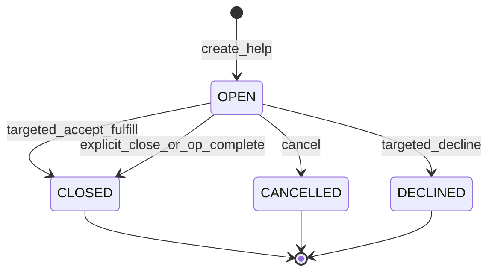

# PROD-FLEX-COLLABORATION-PHASE-2 — Implementation Plan

**Task:** PROD-FLEX-COLLABORATION-PHASE-2-RESEARCH-AND-IMPLEMENTATION-PLAN  
**Date:** 2026-07-16  
**Starting HEAD:** `18398c1`  
**Mode:** PLAN ONLY — implementation **NOT AUTHORIZED** until owner GO  
**Verdict:** `PROD_FLEX_COLLABORATION_PHASE_2_PLAN_READY`  
**Upstream:** Phase 1 accepted with documented limitations; OWNER-DECISION-08 binding rules  
**Decision log:** `.compound-engineering/prod-flex-collaboration-phase-2/decision-log.md`  
**Worklog:** `docs/worklog/realignment/2026-07-16_prod_flex_collaboration_phase_2_plan.md`

---

## Executive summary

**Phase 2 = Collaboration Work Authority (backend only).**

One coherent phase groups help lifecycle + split pools + helper work authority + scoped session-guard realignment. UI / Mobile UX remain Phase 3.

**Help model (locked):** Broadcast OPEN + membership-as-acceptance.  
Open help may authorize many helpers; each accept creates/reactivates HELPER membership; the request stays OPEN. Targeted help fulfills on accept → CLOSED. No singular `accepted_by` authority. No acceptance child table. No helper quota in Phase 2.

---

## Product outcome

After Phase 2 implementation:

1. Principal/operator can request or expose help (open or targeted).
2. Helpers accept (or use self_join / manager_add) under clear rules.
3. Membership and help remain distinct from assignment and claim.
4. Authorized helpers discover correct pools.
5. Helpers start/stop **only their own** sessions (`role=helper`, required `employee_id`).
6. Multiple workers can work the same operation safely.
7. Session stop does not complete the operation.
8. Assignment stays stable unless an explicit assignment command changes it.
9. Claim does not become membership.
10. Single-worker flows remain valid.
11. Phase 3 UI consumes capability flags without inventing business rules.

---

## Current authority model

| Truth | Authority today | Phase 2 gap |
|-------|-----------------|-------------|
| Principal | `assigned_employee_id` + claim | OK |
| Collaboration auth | `execution_task_participants` HELPER | Exists |
| Actual work/time | `execution_reality` sessions | Helper product path missing |
| Help need | None | Missing |
| My Tasks | assignee / own session / completed_by | Membership ignored |
| Available/claim | + `_has_active_session_by_other` | Blocks helpers (D6) |
| `can_assist` | Hardcoded `false` | Lying |

Binding (unchanged): membership ≠ work; JOIN ≠ start; LEAVE ≠ stop/complete; no PRINCIPAL membership row; no `participants_json`.

---

## Options compared

| Option | Decision |
|--------|----------|
| A Help-first only | Reject — cannot work (D6 / My Tasks) |
| B Pools+work, defer help | Reject — `ajutor_solicitat` needs OPEN help |
| **C Integrated help+pools+work** | **Accept** |
| D Minimal / docs only | Reject — no product value |
| E Event-only help | Reject — weak OPEN pool queries |

---

## Correction summary (ambiguity lock)

| Topic | Locked correction |
|-------|-------------------|
| Open multi-accept | Broadcast OPEN; membership stores acceptance; no singular acceptor |
| Status ACCEPTED | Dropped; targeted fulfill → `CLOSED` |
| Quota | No `requested_helpers` in Phase 2 |
| Acceptance table | Not required |
| Visibility | Capability flags; My Tasks ≠ principal powers |
| can_assist | Split into three flags |
| Legacy sessions | Helper start requires `employee_id`; no-id rows ≠ that helper |

---

## 1. Help acceptance model

### Broadcast OPEN + membership-as-acceptance

| Question | Answer |
|----------|--------|
| One vs many helpers | **Open:** many. **Targeted:** one (target). |
| First accept closes? | **Open:** no. **Targeted:** yes → `CLOSED`. |
| Helper count quota? | **No** (Phase 2). |
| Separate acceptance table? | **No** — membership + `join_source=help_accept`. |
| After leave | Membership inactive; re-accept while OPEN reactivates. Leave does not cancel help. |
| Closure | `CANCELLED` / `DECLINED` / `CLOSED`; cancel/close **does not** revoke memberships. |
| Idempotency | Already-member accept → 200. Concurrent open accepts → many memberships. Second OPEN → 409. |

**Rejected:** singular `accepted_by` + multi-accept; first-accept-closes for open; child acceptances + quota; ACCEPTED status; event-only help.

### Persistence direction

**`execution_task_help_requests`**

- Soft `order_id`, `task_id`, `requested_by_employee_id`
- Optional `targeted_employee_id` (null = open)
- `status`: `OPEN` | `CANCELLED` | `DECLINED` | `CLOSED`
- Optional reason / competence hint
- `created_at`, `updated_at`, `closed_at`
- **No** singular `accepted_by_employee_id` as authority
- At most one **OPEN** per `(order_id, task_id)`

Membership remains acceptance store (`join_source=help_accept`; optional `source_help_request_id` implementer choice).  
Do **not** reuse `TaskClarificationRequest`.

### Lifecycle matrix

| Scenario | Behavior |
|----------|----------|
| Accept while active member | 200 idempotent; open request unchanged |
| Accept after leave | Reactivate membership; open stays OPEN |
| Cancel after accepts | `CANCELLED`; memberships remain |
| Op complete while OPEN | Auto `CLOSED`; memberships unchanged |
| Targeted decline | `DECLINED`; no membership |
| Open + several eligible | All may accept while OPEN |
| Second OPEN | 409 |
| `manager_add` / `self_join` without help | Allowed |

---

## 2. Visibility versus authority

Membership-aware My Tasks **does not** grant claim, assignment change, or operation completion.

### Capability read model (Phase 3 contract)

| Capability | True when |
|------------|-----------|
| `visible_as_principal` | Principal ownership path |
| `visible_as_helper` | Active HELPER membership and/or ajutor discovery rules |
| `can_start_helper_session` | Active membership + eligible + not terminal/done + no own active session |
| `can_stop_own_session` | Viewer has own active session (`employee_id` match) |
| `can_complete_operation` | Principal/assignee policy only — never from helper membership alone |

### Pools

| Pool | Rules |
|------|-------|
| `taskurile_mele` | Principal ownership **or** active HELPER membership **or** own id’d session |
| `disponibile_pentru_principal_claim` | Keep `_has_active_session_by_other` |
| `ajutor_solicitat` | OPEN help + eligible; bypass other-session guard; discovery until membership |

Defer workcenter `in_lucru_in_zona_mea`.

---

## 3. Helper session authority

| Rule | Locked |
|------|--------|
| Identity | Start **must** set `employee_id`; reject if missing |
| Duplicate | One active session per employee per task |
| Multi-worker | Concurrent sessions for different employees OK |
| Principal | No claim/reassign; claim guard not applied |
| Stop | Own session only; no `completed_by_*`; no op complete |
| Legacy no-id sessions | Not treated as that helper’s session |
| Role | `role=helper`, `session_type=assist` |
| Leave vs stop | Distinct; no leave+stop combo in Phase 2 |

---

## 4. Help capability flags (replace lying `can_assist`)

| Flag | True when |
|------|-----------|
| `can_view_help` | Eligible + OPEN help + order not terminal + op not explicitly complete (still true if already member) |
| `can_accept_help` | `can_view_help` + (open **or** viewer is target) |
| `can_start_helper_work` | Active HELPER membership + eligibility + no own active session + startable |

Prefer three flags in v1.2; do not use a single `can_assist` as authority.

---

## 5. Migration and Alembic

| Rule | Detail |
|------|--------|
| Revision | `s58_*` ← `s57_create_execution_task_participants` |
| Orphan `s50_execution_plan_*` | Out of scope |
| Bare `upgrade head` | Forbidden |
| Proof | Explicit upgrade `s58` / downgrade `s57` on temp DB |
| Future authors | Parent next migration on **`s58`** |
| Local boot | `create_all` + feature flag |

Flag: `FLEX_COLLAB_PHASE2_ENABLED` (help writes, pool inclusion, helper verbs). Phase 1 join/leave remain when flag off.

---

## 6. API boundary

**Keep:** Phase 1 join/leave/memberships; collab read (bump to **v1.2** additive).

**Add (Operator + employee-mobile self):** help create/accept/decline/cancel/close; helper session start/stop; pool/capability projections.

**Mobile/Operator:** API extension authorized; **no UX** in Phase 2.

Legacy: V2 materialized only; honest errors otherwise.

---

## 7. One-GO implementation boundary

**Authorizes:**

1. `s58` help requests (broadcast model)  
2. Help lifecycle APIs  
3. Accept → membership `help_accept`  
4. Wire `manager_add`  
5. Membership-aware My Tasks + ajutor + principal guard retained  
6. Helper session start/stop with required `employee_id`  
7. Capability + split help flags  
8. Collab read v1.2  
9. Feature flag, tests, runtime proof, BUILD/OpenAPI/docs  

**Does not authorize:** UI/Mobile UX; Product System; snapshots; pricing; PRINCIPAL membership; leave+stop; quotas/acceptance child table; orphan Alembic merge; auto assign/claim/complete; stopping others’ sessions.

---

## 8. Implementation units (for `/ce-work`)

| ID | Unit | Depends |
|----|------|---------|
| U1 | s58 help model + flags | — |
| U2 | Help lifecycle + accept→membership | U1 |
| U3 | Pools + capabilities + guard scoping | U2 |
| U4 | Helper session start/stop | U3 |
| U5 | Collab read v1.2 + blueprint flags + OpenAPI | U2–U4 |
| U6 | Tests + runtime proof + BUILD | U5 |

**Commits (4):** persistence → help lifecycle → pools/capabilities/guards → helper sessions + read + docs.

**Test files (create/extend):**  
`backend/tests/test_execution_task_help_requests.py`,  
`backend/tests/test_helper_work_sessions.py`,  
extend `test_execution_task_collaboration_read.py`,  
regressions: claim / assignment / sessions.

---

## 9. Runtime verification (order 23099)

| Role | Actor |
|------|-------|
| Principal | Assignee on V2 materialized task |
| Helper(s) | Distinct eligible employee(s) |

Prove: open multi-accept while OPEN stays open; targeted fulfill closes; cancel leaves memberships; helper start requires membership + `employee_id`; helper stop does not complete; principal complete closes remaining OPEN; capabilities never grant helper `can_complete_operation`. Pre-check legacy sessions without `employee_id`.

---

## 10. Binding rules (preserve)

- `assigned_employee_id` optional principal  
- No PRINCIPAL membership without new owner decision  
- HELPER membership = authorization  
- Sessions = actual work/time  
- Membership ≠ work proof  
- JOIN ≠ session start; LEAVE ≠ op complete  
- No stop of another worker’s session  
- No auto assign / claim / complete  
- No employee IDs in Product System; no team in frozen snapshots  
- No `participants_json`; no fixed team size; no pricing impact  

---

## 11. Phase 3 (deferred)

Operator/Mobile UX, timeline UI, workcenter pool, rich audit stream, leave+stop combo, helper quotas / acceptance child table, orphan Alembic hygiene.

---

## 12. Risks

- Dual-head Alembic misuse (mitigate: explicit `s58`)  
- Fixture session noise on 23099  
- My Tasks widen accidentally enabling helper complete — helpers use **stop** only  
- Mobile API grows without UX — document limitation  

---

## 13. Owner-visible result

| After Phase 2 | After Phase 3 |
|---------------|---------------|
| Full API loop on order 23099 | Floor UI/Mobile consuming capability flags |
| No new Operator/Mobile screens | First human-visible collaboration chrome |
