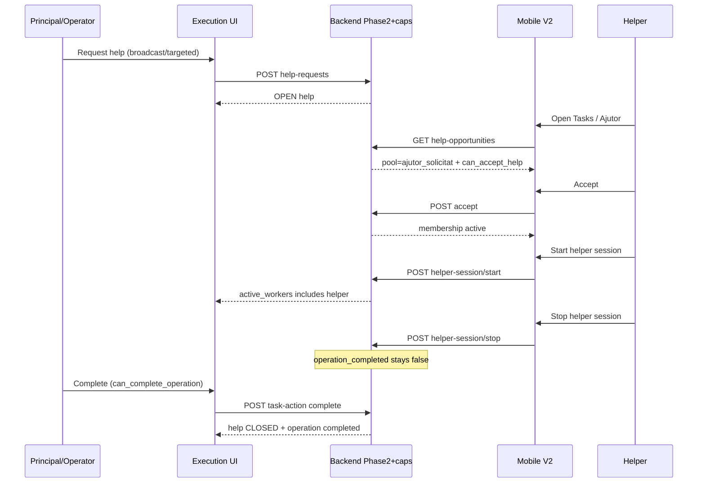
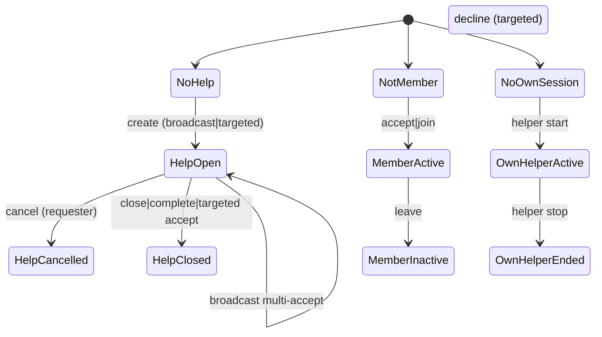

# PROD-FLEX-COLLABORATION-PHASE-3 — Integrated Operator + Mobile V2 Plan

**Task:** PROD-FLEX-COLLABORATION-PHASE-3-INTEGRATED-OPERATOR-MOBILE-V2-PLAN  
**Date:** 2026-07-16  
**Mode:** PLAN ONLY — implementation **NOT AUTHORIZED** until owner GO  
**Starting HEAD:** `d29e047`  
**Status:** `PROD_FLEX_COLLABORATION_PHASE_3_COMPLETE`  
**Verdict:** PHASE 3 INTEGRATED HUMAN LOOP IMPLEMENTED  

```yaml
artifact_contract: ce-unified-plan/v1
artifact_readiness: implementation-ready
execution: code
product_contract_source: ce-plan-bootstrap
plan_type: feat
```

---

## Goal Capsule

Ship the first **complete human-visible collaboration loop** on WorkOS:

1. Principal/operator requests help from Execution/Operator task context.  
2. Eligible helper discovers the opportunity on Employee Mobile V2.  
3. Helper accepts → HELPER membership becomes visible.  
4. Helper starts/stops **only** their own helper session.  
5. Both surfaces show honest help / membership / worker / completion state.  
6. Complete remains principal-only; UI consumes backend capabilities only.

One owner GO authorizes thin capability projections + Operator chrome + Mobile V2 helper experience + tests + runtime proof.

---

## Summary

Phase 2 backend is sufficient for the loop. Frontend has **zero** collaboration clients. Operator collab-read returns viewer `can_*` as **null**. Mobile already projects helper capabilities on my-tasks / ajutor pool. Phase 3 adds thin viewer-scoped capability fields, then wires **ExecutionDetail** (primary request/control) + **Employee Mobile V2** (discovery/work) into one coherent product phase. Mobile V1 unchanged. No Phase 2 redesign, no migration, no mock data.

---

## Problem Frame

Floor collaboration exists only as APIs. Operators cannot request help in product UI; helpers cannot discover or work as helpers without inventing rules. Risk of fragmented widgets or frontend business logic is higher than backend risk.

---

## Product Contract

### Actors

| Actor | Role in Phase 3 |
|-------|-----------------|
| Principal / Operator | Request/cancel help; see helpers & workers; complete when `can_complete_operation` |
| Helper (eligible employee) | Discover ajutor; accept/decline; start/stop own helper session |
| Unrelated employee | No cancel; no accept on targeted-to-other; no complete |

### Requirements

| ID | Requirement |
|----|-------------|
| R1 | Operator/Execution can request broadcast or targeted help from task context |
| R2 | Operator sees OPEN/CANCELLED/CLOSED help, authorized helpers, active workers, completion |
| R3 | Cancel only when `can_cancel_help`; complete only when `can_complete_operation` |
| R4 | Mobile V2 exposes ajutor pool and accept/decline from backend flags |
| R5 | After accept, task appears in helper My Tasks; membership visible |
| R6 | Helper start/stop via `can_start_helper_work` / `can_stop_own_session` |
| R7 | Helper never gains claim/complete from membership or help alone |
| R8 | STOP ≠ complete; LEAVE ≠ STOP; acceptance ≠ session start |
| R9 | UI never infers eligibility, authority, membership, or help status |
| R10 | Mobile V1 unchanged; Product System / pricing / redesign out |

### Success criteria

Owner verifies two-user loop on local stack (`:8001` / `:3000`) with exact URLs below; all actions match capability flags; operation remains incomplete after helper stop; principal complete closes help and shows completed on both surfaces.

### Scope Boundaries

**In:** Thin capability projections; Operator Execution (+ thin OperatorView mirror); Mobile V2 ajutor + helper work room; shared collab client types; Vitest + API regression + two-user runtime proof; docs.

**Out:** Mobile V1; TabletMode demo “Ajutor”; leave+stop combo; quotas; PRINCIPAL membership; workcenter pool; timeline audit UI; Product System; pricing; DB migration; Phase 2 architecture reopen.

**Deferred to Follow-Up:** Rich timeline; leave+stop UX; targeted employee picker polish; Playwright collab E2E; shared design-system package beyond one collab client module.

---

## Options Compared

| Option | Completeness | Cost | API fit | Dead UI risk | Recommendation |
|--------|--------------|------|---------|--------------|----------------|
| **A. Integrated Operator + Mobile V2** | Full loop | Medium-high | Excellent | Low | **CHOOSE** |
| B. Mobile-first + minimal Operator | Incomplete without request surface | Medium | Good | Medium (orphan pool) | Reject for Phase 3 GO |
| C. Operator-first, helper deferred | No floor helper work | Medium | Partial | High | Reject |
| D. Shared panel only, surfaces later | Abstraction without journey | Medium | OK | High | Reject as primary; reuse **types/client** only |

**Recommendation:** A — Owner affirmation + repo reality (help create on operator routes; discovery/work caps on mobile).

---

## Key Technical Decisions

| ID | Decision | Rationale |
|----|----------|-----------|
| KTD1 | Primary Operator surface = `/execution/:orderId` RealityCapturePanel task rows | Existing Start/Complete action column; task-scoped |
| KTD2 | Secondary mirror = `/operator` current-task card | Floor operators live here; keep chrome thin |
| KTD3 | Helper surface = `/employee-app-v2` only | Affirmed; V1 untouched |
| KTD4 | Ajutor discovery = new section on V2 Tasks page (alongside Available) | Matches `GET .../help-opportunities`; avoids claim pool confusion |
| KTD5 | Shared `frontend/src/api/collaboration*.ts` + types; **surface adapters** for render | One contract, two UIs — avoid premature mega-panel |
| KTD6 | No optimistic help mutations; refetch after commands | Conflicts (409/403) must reconcile from server |
| KTD7 | Feature flag `VITE_FEATURE_FLEX_COLLAB_UI` (default false) + backend `FLEX_COLLAB_PHASE2_ENABLED` | Dual kill switch |
| KTD8 | Thin backend: `can_request_help`, `can_cancel_help`, viewer-scoped caps on collab-read | Live `:8001` returns null viewer caps today |
| KTD9 | Broadcast = omit `targeted_employee_id`; targeted = employee picker from known employees API | Body already exists on create |
| KTD10 | Do not show Complete when `can_complete_operation === false` | Protect principal authority |

### Assumptions

- Operator user is linked to an employee for cancel/request actor identity (dev auth / production link already required for helper-session on operator).  
- Order `23099` is usable for **read smoke**; destructive two-user mutation prefers a dedicated seed order (see Runtime).  
- `can_start_helper_work` (shipped name) is the helper start flag — not a new rename.

---

## High-Level Technical Design

### Loop sequence



### Orthogonal state machines (compose UI; never invent ACCEPTED help status)



### Capability → action map

| Action | Capability / truth | Surfaces |
|--------|-------------------|----------|
| Request help | `can_request_help` | Execution, Operator |
| Cancel help | `can_cancel_help` | Execution, Operator, Mobile (requester) |
| Close help | Prefer complete path; optional close if projected later | Execution |
| View ajutor | `can_view_help` + pool row | Mobile V2 |
| Accept | `can_accept_help` | Mobile V2 |
| Decline | targeted + eligible (server enforces) | Mobile V2 |
| Start helper | `can_start_helper_work` | Mobile V2 (Operator helper path optional later) |
| Stop own | `can_stop_own_session` | Mobile V2 |
| Complete | `can_complete_operation` | Execution / Operator / Mobile principal |
| Claim | existing `can_claim` — **false** for helpers | Mobile V2 |

---

## Backend Additions (thin, in Phase 3 GO)

| Addition | Where | Why |
|----------|-------|-----|
| `can_request_help` | Mobile my-tasks / blueprint; operator collab-read when viewer known | Honest Request button |
| `can_cancel_help` | Same | Requester-only cancel already enforced; UI must not guess |
| Viewer-scoped `visible_as_*` / `can_*` on `GET .../task-collaboration-read` | Optional query `viewer_employee_id` **or** auth-linked employee | Live fields are null without viewer |
| Pass-through existing help/membership/session fields | Unchanged semantics | No new lifecycle |

**Not authorized:** new statuses, membership roles, session semantics, claim/complete rules, migrations.

If implementer discovers a truth gap beyond projections → **STOP** for owner review.

---

## API Contracts Reused

| Method | Path |
|--------|------|
| GET | `/api/v1/operator/orders/{order_id}/task-collaboration-read` |
| POST/GET | `.../tasks/{task_id}/collaboration/help-requests` |
| POST | `.../help-requests/{id}/accept\|decline\|cancel\|close` |
| POST | `.../helper-session/start\|stop` |
| GET | `/api/v1/employee-mobile/tasks/help-opportunities` |
| GET | `/api/v1/employee-mobile/tasks` (membership-aware My Tasks) |
| GET | `/api/v1/employee-mobile/tasks/truth` |
| PATCH/POST | existing Mobile claim/start/complete (principal only) |

---

## UI Architecture

### Operator / Execution

| Surface | Route | Section | Content |
|---------|-------|---------|---------|
| Primary | `/execution/:orderId` | RealityCapturePanel Actions + identity sub-row | Request Help; Cancel when flagged; badges: Help OPEN, helpers count, active workers; Complete gated by `can_complete_operation` |
| Secondary | `/operator` | Current-task card | Same actions when a task is selected; open-help chip |

**Request UX:** Dialog — Broadcast vs Targeted; optional reason; targeted picks employee id from existing operator employees list. No new console app.

**Visibility:** Separate chips/lists — Principal | Authorized helpers | Active workers (from `active_workers` / sessions) | Historical ended helpers. Never label membership-only as “working”.

### Employee Mobile V2

| Surface | Route | Section |
|---------|-------|---------|
| Discovery | `/employee-app-v2/tasks` | New **Ajutor** section under Available |
| Work | `/employee-app-v2/tasks/:taskId?orderId=` | Work room: Accept/Decline if still open; Start/Stop helper; hide Claim/Complete unless flags true |

Refresh: reuse `EmployeeMobileV2TaskTruthProvider.reload({ background: true })` after mutations; Operator refetch collab-read after help commands.

---

## Visible State Model

| UX state | Backend composition |
|----------|---------------------|
| No help | `has_open_help=false` |
| Broadcast OPEN | OPEN + `targeted_employee_id=null` |
| Targeted OPEN | OPEN + targeted set |
| Eligible not accepted | On ajutor list with `can_accept_help` |
| Accepted / member | `helper_memberships` active / `visible_as_helper` |
| Working | Own session active `role=helper` |
| Stopped | Session ended; membership may remain; `operation_completed=false` |
| Left | membership inactive |
| Cancelled / Closed | help status terminal |
| Completed | `operation_completed=true` |

---

## Refresh / Conflict / A11y

- **Refresh:** Explicit refetch after every mutating command; no optimistic help status.  
- **Conflicts:** Surface API `detail.error` (403 `help_cancel_forbidden`, 409 session conflicts, 422).  
- **Stale:** If refetch shows terminal help, disable Accept and show CLOSED/CANCELLED.  
- **Mobile:** Touch targets on action bar pattern (`EmployeeMobileV2WorkRoomActionBar`); Romanian labels consistent with existing V2 copy.  
- **A11y:** Buttons disabled + `aria-disabled` when capability false; status text not color-only.

---

## Implementation Units

### U1. Thin capability / viewer projections

**Goal:** Expose `can_request_help`, `can_cancel_help`, and viewer-scoped collab-read caps.  
**Dependencies:** none  
**Files:** `backend/services/execution_task_collaboration_read_service.py`, `backend/schemas/execution_task_collaboration_read.py`, `backend/services/employee_mobile_tasks_service.py`, `backend/services/employee_mobile_order_blueprint_service.py`, `backend/tests/test_execution_task_collaboration_read.py`, `backend/tests/test_execution_task_help_phase2.py`  
**Approach:** Compute flags from existing membership/assignment/help requester identity; optional `viewer_employee_id` on operator read. No schema migration.  
**Test scenarios:**
- Principal assignee → `can_request_help=true` when Phase2 on and no contradictory rule  
- Non-requester → `can_cancel_help=false`  
- Operator read without viewer → caps null or omitted consistently  
- Operator read with viewer → caps populated  
- Helper membership alone → `can_complete_operation=false`  
**Verification:** Targeted pytest green; OpenAPI/manifest paths unchanged except query param if added.

### U2. Frontend collaboration API client + types

**Goal:** Typed clients for all Phase 2 collab routes; no business logic.  
**Dependencies:** U1 (types include new flags)  
**Files:** `frontend/src/api/collaboration.ts` (new), `frontend/src/api/collaboration.types.ts` (new), `frontend/src/api/collaboration.test.ts` (new)  
**Approach:** Mirror `employeeMobileTasks.ts` fetch style; parse errors.  
**Test scenarios:** Happy parse of help + collab-read DTOs; error detail passthrough.  
**Execution note:** Contract tests against fixture JSON from OpenAPI/real shapes.

### U3. Operator / Execution collaboration chrome

**Goal:** Request/cancel/state/workers on ExecutionDetail; thin OperatorView mirror.  
**Dependencies:** U1, U2  
**Files:** `frontend/src/pages/ExecutionDetail.tsx`, `frontend/src/pages/OperatorView.tsx`, `frontend/src/components/workos/ExecutionTaskCollaborationRow.tsx` (new), `frontend/src/components/workos/ExecutionTaskCollaborationRow.test.tsx` (new), `frontend/src/pages/ExecutionDetail.collaboration.test.tsx` (new)  
**Approach:** Gate behind `VITE_FEATURE_FLEX_COLLAB_UI`; load collab-read with viewer employee when known.  
**Test scenarios:**
- `can_request_help` false → no Request button  
- OPEN badge when `has_open_help`  
- Active workers list ≠ membership-only helpers  
- Complete hidden when `can_complete_operation` false  
- Cancel hidden when `can_cancel_help` false  
**Verification:** Vitest; manual Execution URL check.

### U4. Employee Mobile V2 ajutor + helper work

**Goal:** Ajutor section + accept/decline + helper start/stop in work room.  
**Dependencies:** U1, U2  
**Files:** `frontend/src/pages/EmployeeMobileV2TasksPage.tsx`, `frontend/src/components/workos/employee-mobile-v2/EmployeeMobileV2HelpOpportunitiesSection.tsx` (new), `EmployeeMobileV2WorkRoomActionBar.tsx`, `frontend/src/lib/employeeMobileV2HelpActions.ts` (new), matching `*.test.tsx` / `*.test.ts`  
**Approach:** Follow claim/start capability gating pattern; never map accept→claim.  
**Test scenarios:**
- Ajutor row shows when `can_accept_help`  
- Accept then Start appears when `can_start_helper_work`  
- Stop when `can_stop_own_session`  
- Complete/Claim absent for helper-only flags  
- Stop does not call complete  
**Verification:** Vitest + mobile viewport smoke.

### U5. Flag, docs, runtime two-user proof

**Goal:** Feature flag wiring, BUILD/worklog, scripted two-actor HTTP+UI checklist.  
**Dependencies:** U3, U4  
**Files:** `frontend` env example / flag util, `docs/qa/BUILD_PROD_FLEX_COLLAB_PHASE_3.md` (new), `backend/scripts/phase3_collab_ui_runtime_proof.md` or `.py` checklist, worklog updates  
**Test expectation:** none for checklist doc — runtime evidence recorded.  
**Verification:** Owner verification section executed; evidence JSON under `docs/qa/`.

---

## Testing Strategy

| Layer | Scope |
|-------|-------|
| Backend pytest | U1 capability projections + existing Phase 2 regressions |
| Vitest | Capability rendering; principal/helper separation; stop≠complete |
| Integration | Refetch after commands; 403/409 surfaces |
| Runtime E2E | Two actors; request→accept→start→stop→principal complete |
| Playwright | **Deferred** until one happy path is stable |

---

## Runtime E2E Plan

**Stack:** Backend `http://127.0.0.1:8001`, Frontend `http://127.0.0.1:3000`.  
**Fixture:** Prefer **dedicated local order** cloned from V2 materialization (safer than mutating exhausted `23099`). If using `23099`, pick a startable incomplete task and document IDs.  
**Actors:** Principal employee (assignee) + Helper employee (eligible for operation).

Steps: request broadcast → helper sees ajutor → accept → membership → helper start → operator sees active worker → helper stop → op incomplete → principal complete → help CLOSED + completed on both.

---

## Exact Owner Verification

### A. Execution — request help

| Field | Value |
|-------|-------|
| URL | `http://127.0.0.1:3000/execution/23099` (or dedicated order id) |
| Page | Execution Detail |
| Section | Task row Actions / collaboration sub-row |
| Actor | Principal/Operator (linked employee) |
| Task | Chosen operational task id |
| Visible | **Request help**; no OPEN badge initially |
| Clicks | Request → Broadcast → Confirm |
| Result | Badge **Help OPEN**; `has_open_help` true on refetch |

### B. Mobile V2 — discover & accept

| Field | Value |
|-------|-------|
| URL | `http://127.0.0.1:3000/employee-app-v2/tasks` |
| Section | Ajutor |
| Actor | Helper employee |
| Visible | Opportunity card; **Accept** (if `can_accept_help`) |
| Clicks | Accept |
| Result | Task in My Tasks as helper; membership active |

### C. Mobile V2 — session

| Field | Value |
|-------|-------|
| URL | `http://127.0.0.1:3000/employee-app-v2/tasks/{taskId}?orderId=...` |
| Visible | **Start** helper; no Complete |
| Clicks | Start → Stop |
| Result | Active worker then stopped; operation **incomplete** |

### D. Execution — complete

| Field | Value |
|-------|-------|
| URL | Execution detail same order |
| Visible | Complete when `can_complete_operation` |
| Clicks | Complete |
| Result | Operation completed; help CLOSED; Mobile shows completed |

---

## Implementation Workstreams (one GO)

1. Backend thin projections (U1)  
2. FE client (U2)  
3. Operator/Execution UI (U3)  
4. Mobile V2 UI (U4)  
5. Flag + proof + docs (U5)

---

## Commit Strategy

1. `fix(execution): project viewer collab capabilities for UI`  
2. `feat(frontend): add collaboration API client`  
3. `feat(frontend): Operator/Execution collaboration chrome`  
4. `feat(frontend): Mobile V2 ajutor and helper sessions`  
5. `docs(qa): Phase 3 BUILD, runtime evidence, STATUS`

No push / no PR until owner asks.

---

## Rollout / Rollback

- Ship behind `VITE_FEATURE_FLEX_COLLAB_UI=false` by default.  
- Backend `FLEX_COLLAB_PHASE2_ENABLED=false` disables writes/pools.  
- UI chrome disappears without schema rollback.

---

## Risks

| Risk | Mitigation |
|------|------------|
| Dual Operator surfaces drift | Primary Execution; OperatorView thin mirror same component |
| 23099 fixture exhaustion | Dedicated seed order for mutation proof |
| Null caps if viewer omitted | Require viewer param or linked employee before enabling Request |
| Confusion with clarifications | Distinct “Help” copy vs clarification panel |
| TabletMode demo Ajutor | Explicitly out of path |

---

## Owner Decisions Required (phase-level)

| ID | Question | Plan recommendation |
|----|----------|---------------------|
| **G1** | Authorize Phase 3 integrated Operator + Mobile V2 one-GO? | **YES** |
| **G2** | Authorize thin capability projections (`can_request_help`, `can_cancel_help`, viewer-scoped collab-read)? | **YES** |
| **G3** | Primary request surface = ExecutionDetail; OperatorView mirror only? | **YES** |
| **G4** | Mobile V2 only; V1 untouched? | **YES** |
| **G5** | Feature-flag UI default off until runtime proof? | **YES** |
| **G6** | Defer Playwright / leave+stop / timeline / quotas? | **YES** |

---

## One-GO Boundary

Authorized after G1–G6: U1–U5 only. Not authorized: Mobile V1, Product System, pricing, migrations, Phase 2 redesign, broad UI redesign.

---

## What Remains After Phase 3

Leave+stop combo UX; timeline/audit UI; workcenter pool; Playwright collab suite; shared design-system collaboration package; targeted picker UX polish; optional operator-as-helper session chrome.

---

## Definition of Done

- U1–U5 landed  
- Focused tests green  
- Two-user runtime proof recorded  
- BUILD + worklog updated  
- STATUS: Phase 3 implementation complete only after GO+ship — **this plan does not start implementation**

---

## Sources & Research

- Live `:8001` collab-read v1.2 (viewer `can_*` null)  
- `backend/routers/operator_tasks.py`, `employee_mobile_tasks.py`  
- `frontend/src/pages/ExecutionDetail.tsx`, `OperatorView.tsx`, `EmployeeMobileV2*`  
- Phase 2 worklogs / integrity correction  
- `docs/solutions/collaboration-phase2-integrity-correction.md`

**Product Contract preservation:** Bootstrap from owner Phase 3 prompt + affirmations (integrated loop, thin caps, V2-only) — no separate brainstorm file.
