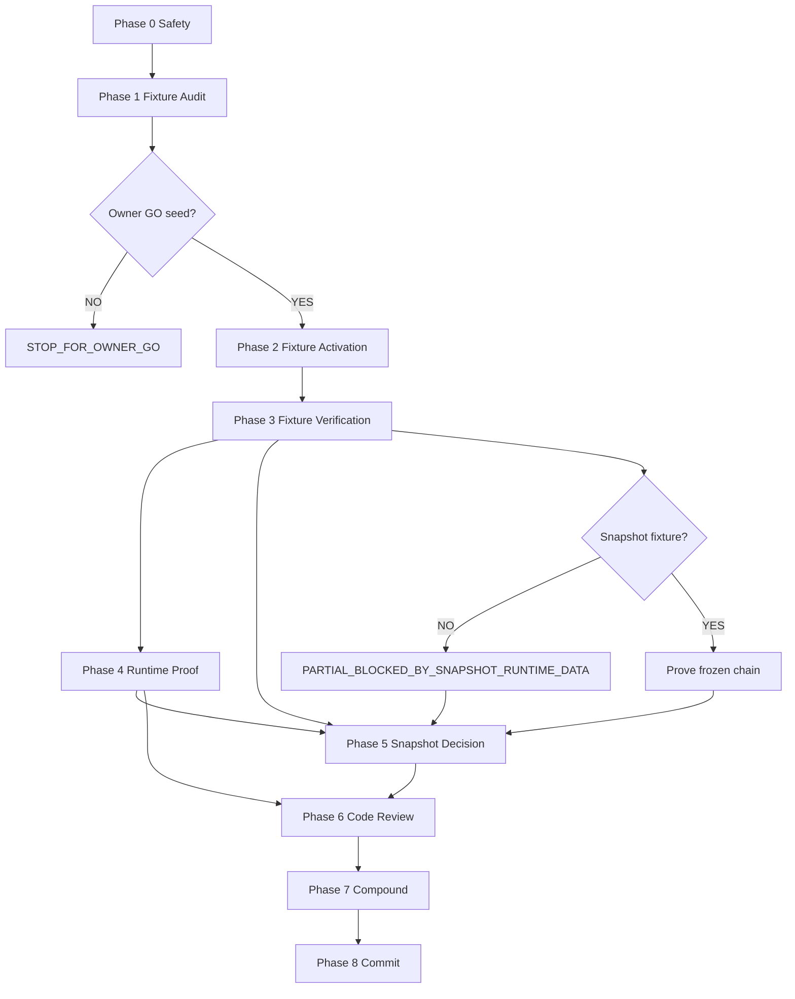

# Product System Active Path Isolation — Closeout Plan

## Goal Capsule

Move `feature/product-system-active-path-isolation-v1` from **implemented + test-proven + runtime-blocked by empty fixture** to a **scoped commit** with honest V2 pilot evidence, without restoring deprecated Intake paths, without repo-wide Dossier PASS claims, and without mutating main workspace.

## Verification Contract

Closeout is complete only when:

1. `SAFETY_PASS` → `OWNER_FIXTURE_DECISION_REQUIRED` → `FIXTURE_ACTIVATION_PASS` → `FIXTURE_TRUTH_PASS` → `RUNTIME_PROOF_ACCEPTED` → `SNAPSHOT_DECISION_RECORDED` → `CODE_REVIEW_PASS` → `COMPOUND_COMPLETE` → `SCOPED_COMMIT_CREATED`.
2. Runtime verdict is one of the allowed tokens (not repo-wide PASS).
3. Commit excludes `backend/dev.db`, transient probes, and main-workspace paths.

## Definition of Done

- Implementation + tooling + tests committed on branch with evidence artifacts.
- V2 catalog/capability/dossier authority proven live (snapshot may remain partial with documented owner decision).
- `/ce-code-review` and `/ce-compound` completed after runtime evidence exists.

---

## 1. Executive verdict

**`PLAN_READY`**

Viable closeout route exists: canonical catalog seed (`backend/scripts/seed_sync_all.py`) + final runtime proof + review + scoped commit. Snapshot V2 chain remains **partial by design** unless owner authorizes a separate fixture build later.

**Phase 1 (fixture audit) is already complete** — see `.compound-engineering/product-system-active-path-isolation-v1/fixture-activation-audit.md` verdict `PARTIAL_SEED_FOUND_SNAPSHOT_FIXTURE_MISSING`.

---

## 2. Current truth

| Layer | Status | Evidence |
|-------|--------|----------|
| **Implemented** | YES | Identity resolver, dossier consumption policy, canonical contracts, usage-mode policy, consumer gates — uncommitted diff vs `9366a74` |
| **Test-proven (offline)** | YES | 40 PASS targeted identity + dossier isolation tests |
| **Runtime-proven (stack)** | YES | Single stack stable; health/OpenAPI/frontend 200; stale gate fix works |
| **Runtime-proven (V2 pilot)** | PARTIAL | Legacy alias 422 live; catalog/capability/dossier/snapshot blocked by empty DB |
| **Runtime-blocked** | YES | `backend/dev.db`: `product_templates=0`, `product_blueprint_dossier=0` |
| **Intentionally deferred** | YES | Non-V2 canonical promotion; full snapshot fixture; Product Detail implementation; Pricing Registry; materialization; Employee Mobile |

**Latest runtime verdict:** `FAIL_CAPABILITY_TRUTH` (classification: `ENVIRONMENT_FIXTURE_GAP` — not identity/dossier regression).

---

## 3. Scope

**In scope for closeout:**

- Worktree `C:/w/psiso` only
- Branch `feature/product-system-active-path-isolation-v1`
- V2 Product System active-path isolation (Letters v2, ACM boxed mounting, Premount structure)
- Tooling fixes: parser + stale Intake V3 readiness gate (`scripts/start-dev.ps1`)
- Evidence artifacts under `.compound-engineering/product-system-active-path-isolation-v1/` and `docs/qa/product-system-active-path-isolation-v1/`
- Controlled fixture activation via existing `seed_sync_all`
- Final runtime proof (one stack)
- Code review, compound, scoped commit

**Out of scope:**

- Main workspace `C:/Users/offic/workos_app_vs` (except approved Python interpreter path)
- Repo-wide Dossier isolation PASS
- Intake V3 route restoration
- New seed invention, raw SQL, DB copy from main workspace
- Materialization, repricing, migrations (unless separate owner GO)

---

## 4. Non-goals

- Product Detail full implementation vs Figma `7:18` populated state (prove shell + canonical detail when seeded; unavailable state already matches `7:29`)
- Figma fidelity for Dossier operator/admin (`NO_RELEVANT_FIGMA_FRAME`)
- Legacy `TPL-VOLUMETRIC-LETTERS` as active compile truth
- Automatic seed execution without owner GO
- Commit during planning or runtime phases

---

## 5. Acceptance matrix

| Area | Current evidence | Missing evidence | Required action | Blocking |
|------|------------------|------------------|-----------------|----------|
| Repository isolation | Worktree/branch/HEAD confirmed | — | Phase 0 safety gate | LOW |
| Canonical identity | 40 pytest PASS; live 422 legacy reject | Live canonical accept | Post-seed identity matrix | **HIGH** until seed |
| Legacy alias rejection | Live 422 `rejected_alias` | — | Re-verify post-seed | LOW |
| V2 Dossier isolation | pytest PASS | Live dossier authority with seeded rows | Runtime workstream C | **HIGH** until seed |
| ACM capability | Policy code + tests | Live catalog/API proof | Post-seed capability checks | **HIGH** |
| Premount capability | Policy code + tests; seed creates template | Live proof | Post-seed capability checks | **HIGH** |
| Catalog UI | Shell OK; empty state captured | Populated catalog vs Figma `7:6` | Phase 4 UI + screenshot 01 | **HIGH** until seed |
| Product Detail UI | Unavailable deep links vs `7:29` | Populated detail vs `7:18` | Phase 4 screenshots 02–04 | **HIGH** until seed |
| Figma reconciliation | Plugin verified; refs captured | Populated catalog compare | Phase 4 workstream E | MEDIUM |
| Dossier operator | Empty catalog state screenshot | Metadata with seeded dossier | Screenshot 05 post-seed | MEDIUM |
| Dossier admin | Advanced placeholder screenshot | Inspection UX if data exists | Screenshot 06; honest partial | LOW |
| Snapshot chain | pytest helpers only | Production V2 fixture rows | Phase 5 decision: partial OK | **MEDIUM** (non-blocking for isolation commit if documented) |
| Tooling | Parser + stale gate fixed | Re-validate parser before stack | Phase 4 pre-flight | LOW |
| Tests | 40 targeted PASS | Re-run before commit | Phase 6 | MEDIUM |
| Runtime | Stack PASS; pilot FAIL_CAPABILITY | Full pilot after seed | Phase 4 | **HIGH** |
| Documentation | Artifacts exist | Update final-report after Phase 4 | Phase 4–8 | LOW |
| Commit readiness | Dirty tree; uncommitted impl | All gates | Phase 8 | **HIGH** |

---

## 6. Dependency graph



**Parallelism after Phase 3:** Runtime workstreams A–F (A–D + F parallel; E after frontend stable). Single runtime coordinator owns stack lifecycle.

---

## 7. Phase-by-phase plan

### Phase 0 — Process and repository safety

| Field | Value |
|-------|--------|
| **Objective** | Confirm clean baseline; no stale stack; protected main workspace |
| **Owner** | Operator or `/ce-work` coordinator |
| **Mode** | Read-only (+ stop only worktree stack PIDs if listening) |
| **Actions** | `Get-Location`; `git rev-parse --show-toplevel`; `git branch --show-current`; `git rev-parse --short HEAD`; `git status --short`; `netstat`/`Get-NetTCPConnection` on :8000/:3000; kill only known dev-stack PIDs |
| **Allowed files** | None modified |
| **Forbidden** | Main workspace commands; unrelated process kills |
| **Evidence** | Safety checklist in worklog |
| **Exit criteria** | `SAFETY_PASS`: worktree `C:/w/psiso`, branch correct, HEAD `9366a74`, ports free or documented ghost-only |
| **Failure verdict** | `FAIL_SCOPE` |
| **Next** | Phase 1 (already done) or Phase 2 after owner GO |

---

### Phase 1 — Fixture audit ✅ COMPLETE

| Field | Value |
|-------|--------|
| **Objective** | Locate safe canonical seed; document write-set and DB target |
| **Owner** | `/ce-work` (completed) |
| **Mode** | Read-only |
| **Result** | `PARTIAL_SEED_FOUND_SNAPSHOT_FIXTURE_MISSING` |
| **Artifact** | `.compound-engineering/product-system-active-path-isolation-v1/fixture-activation-audit.md` |
| **Exit criteria** | `OWNER_FIXTURE_DECISION_REQUIRED` |
| **Next** | **STOP_FOR_OWNER_GO** → Phase 2 |

**Key findings (do not re-audit unless contradiction):**

- **Recommended seed:** `backend/scripts/seed_sync_all.py`
- **Command:** `python -m scripts.seed_sync_all` from `backend/` with explicit `DATABASE_URL=sqlite+aiosqlite:///C:/w/psiso/backend/dev.db`
- **Idempotent:** YES (`backend/tests/test_seed_integrity_guard.py`)
- **Three templates:** YES via `seeds/seed_tpl_volumetric_letters_v2.py` + `seeds/seed_tpl_acm_boxed_mounting_support_v1.py`
- **Snapshot V2 production seed:** NO (pytest `_seed_v2_order_with_snapshot` only)
- **Reject:** `scripts/seed_commercial_e2e_fixture.py` (legacy alias), `scripts/seed_canonical_order_for_e2e.py` (legacy snapshot)

---

### Phase 2 — Controlled fixture activation

| Field | Value |
|-------|--------|
| **Objective** | Populate worktree `dev.db` with canonical Product System truth |
| **Owner** | Operator executes; agent only with explicit **Owner GO** |
| **Mode** | **MUTATION** (DB only) |
| **Owner GO** | **REQUIRED** before any command |

**Exact command sequence (plan only — do not run from planning):**

```powershell
# Pre-flight: echo DATABASE_URL and confirm path ends with psiso/backend/dev.db
$env:APP_ENV='development'
$env:ENVIRONMENT='development'
$env:DATABASE_URL='sqlite+aiosqlite:///C:/w/psiso/backend/dev.db'
$env:JWT_SECRET_KEY='local-dev-secret-not-for-production'
cd C:\w\psiso\backend
C:\Users\offic\workos_app_vs\backend\.venv\Scripts\python.exe -m scripts.seed_sync_all
```

| Pre-counts | Post-counts (expected) |
|------------|------------------------|
| `product_templates` = 0 | ≥ 3 canonical codes present |
| `product_blueprint_dossier` = 0 | ≥ 3 dossier rows |
| Legacy `TPL-VOLUMETRIC-LETTERS` | Removed if cleanup succeeds |

**Side effects (owner must accept):**

- Pricing registry upserts (`inventory_materials`, `workcenter_rates`, owner rate snapshots)
- No Intake workspace rows
- No quote/order rows
- Conditional delete of legacy letters template

**Rollback:** Delete `backend/dev.db` and re-run stack `create_tables` OR restore from backup if one was taken pre-seed (recommended: copy `dev.db` → `dev.db.pre-seed.bak` before GO).

| **Exit criteria** | `FIXTURE_ACTIVATION_PASS`: command exit 0; post-counts show three canonical templates |
| **Failure verdict** | `BLOCKED_NO_SAFE_CANONICAL_SEED` / `BLOCKED_DB_TARGET_AMBIGUOUS` |
| **Next** | Phase 3 read-only verification |

---

### Phase 3 — Fixture verification

| Field | Value |
|-------|--------|
| **Objective** | Read-only proof that seed output matches V2 architecture |
| **Owner** | `/ce-debug` or `/ce-work` read-only workstreams |
| **Mode** | Read-only (SQL probe / API smoke, no writes) |

**Checks:**

| Check | PASS means |
|-------|------------|
| `TPL-VOLUMETRIC-LETTERS_v2` exists | Exact canonical casing in DB |
| `TPL-ACM-BOXED-MOUNTING-SUPPORT_v1` exists | Same |
| `TPL-METAL-PREMOUNT-STRUCTURE_v1` exists | Same |
| No active legacy duplicate | `TPL-VOLUMETRIC-LETTERS` not active truth |
| Usage modes | `root_offerable=true`, linked child allowed for ACM/Premount (policy + API) |
| Module links | Letters ↔ premount, letters ↔ ACM links present |
| Dossier rows | Exist; consumption still gated at runtime (not compiler authority) |
| Forbidden mutations | No intake rows; no commercial quote/order rows from seed |

**Parallel:** Template identity probes + module link query + policy read can run together.

| **Exit criteria** | `FIXTURE_TRUTH_PASS` |
| **Failure verdict** | STOP — do not start runtime; report seed incompatibility |
| **Next** | Phase 4 |

---

### Phase 4 — Final V2 runtime proof

| Field | Value |
|-------|--------|
| **Objective** | One-stack live proof with screenshots and Figma compare |
| **Owner** | Single runtime coordinator (`/ce-debug`) |
| **Mode** | Read-only runtime; **no application code changes** |

**Pre-flight:**

```powershell
$env:WORKOS_PYTHON='C:\Users\offic\workos_app_vs\backend\.venv\Scripts\python.exe'
npm run dev:stack   # exactly once
```

**Health gate (coordinator only):** one listener :8000, one :3000; `/health` 200; `/openapi.json` 200; frontend 200; stability recheck after wait.

**Parallel workstreams (after health PASS):**

| WS | Owner | Mode | Verifies |
|----|-------|------|----------|
| A | Coordinator | Read-only | PIDs, stability |
| B | Sub-agent | Read-only API | Identity matrix (canonical, trim, case, legacy read bridge, legacy compile 422, unknown) |
| C | Sub-agent | Read-only API | V2 dossier authority YES/NO answers |
| D | Sub-agent | Read-only | Snapshot chain (existing rows only) |
| E | Sub-agent | Browser + Figma | UI routes + frame compare |
| F | Sub-agent | Read-only | Git scope — no app diffs during runtime |

**UI routes:**

- `/product-system/products`
- `/product-system/products/TPL-VOLUMETRIC-LETTERS_v2`
- `/product-system/products/TPL-ACM-BOXED-MOUNTING-SUPPORT_v1`
- `/product-system/products/TPL-METAL-PREMOUNT-STRUCTURE_v1`
- `/inventory/pricing` (read-only sanity)
- Dossier operator/admin surfaces (honest partial)

**Screenshots (required, under `docs/qa/product-system-active-path-isolation-v1/`):**

`01-canonical-catalog.png` … `06-dossier-advanced-admin-state.png`

**Allowed runtime verdicts:**

- `PASS_V2_PILOT_WITH_LEGACY_BRIDGE` (target if catalog + capability + dossier live pass)
- `PARTIAL_BLOCKED_BY_SNAPSHOT_RUNTIME_DATA` (if snapshot chain still empty)
- Failure tokens if regression detected

| **Exit criteria** | `RUNTIME_PROOF_ACCEPTED` — honest verdict recorded in `final-report.md` + `RUNTIME_PROOF_REPORT.md` |
| **STOP if** | Duplicate stack; app code changed; fabricated data; invented Figma frames |

---

### Phase 5 — Snapshot/execution decision

| Field | Value |
|-------|--------|
| **Objective** | Record snapshot proof status without fabrication |
| **Recommendation** | **Does not block isolation commit** if catalog/capability/dossier/identity runtime pass and snapshot remains `PARTIAL_BLOCKED_BY_SNAPSHOT_RUNTIME_DATA` with explicit follow-up build ID |

| Branch | Action |
|--------|--------|
| Existing V2 snapshot rows in DB | Prove Quote → Order → ExecutionPlan frozen chain read-only |
| No rows (expected today) | Document partial; no materialize/reprice |

| **Exit criteria** | `SNAPSHOT_DECISION_RECORDED` in decision-log + risk-register |

---

### Phase 6 — Final code review

| Field | Value |
|-------|--------|
| **Objective** | Review uncommitted implementation + tooling + tests + evidence |
| **Owner** | `/ce-code-review` (after Phase 4 evidence exists) |
| **Mode** | Read-only review; fixes require separate owner GO per finding |
| **Scope** | Branch diff vs merge base; exclude runtime-only artifacts if stale |
| **Exit criteria** | `CODE_REVIEW_PASS` or documented accepted residuals |

---

### Phase 7 — Compound

| Field | Value |
|-------|--------|
| **Objective** | Capture durable learnings |
| **Owner** | `/ce-compound` |
| **Topics** | Canonical identity isolation; dossier metadata-only; stale readiness gate; fixture precondition; Figma/runtime audit method; worktree process ownership |
| **Exit criteria** | `COMPOUND_COMPLETE` |

---

### Phase 8 — Commit

| Field | Value |
|-------|--------|
| **Objective** | Scoped commit after all gates |
| **Owner GO** | **REQUIRED** |
| **Mode** | Git write |

**Include:**

| Group | Paths |
|-------|-------|
| Implementation | `backend/services/*` (identity, dossier policy, aggregate, consumers), `backend/data/canonical_*`, `backend/schemas/intake_v4.py`, `backend/schemas/intake_v6.py` |
| Tests | `backend/tests/test_product_system_identity_boundary.py`, `test_dossier_*`, `test_product_aggregate_dossier_gating.py`, `test_intake_v6_option_contract_dossier_gating.py` |
| Tooling | `scripts/start-dev.ps1` |
| Evidence | `.compound-engineering/product-system-active-path-isolation-v1/*` (excluding transient validators if any) |
| QA | `docs/qa/product-system-active-path-isolation-v1/` (reports + screenshots; not `_runtime_db_probe.py` unless owner wants) |
| Worklog | `docs/worklog/realignment/2026-07-13_product_system_active_path_isolation_v1.md` |

**Exclude:**

- `backend/dev.db`, `backend/dev.db.*`, `backend/logs/`
- `.cursor/mcp.json`, local plugin configs
- `docs/qa/**/_runtime_db_probe.py` (helper)
- Main workspace paths
- Unrelated `.compound-engineering/windows-ghost-listener-*` unless owner explicitly scopes

**Suggested message:** `feat(product-system): isolate canonical v2 active path`

| **Exit criteria** | `SCOPED_COMMIT_CREATED` |

---

## 8. Owner GO gates

| # | Gate | Blocks |
|---|------|--------|
| 1 | DB seed (`seed_sync_all`) | Phase 2 |
| 2 | Migration | Any schema change |
| 3 | New fixture implementation | Snapshot production seed |
| 4 | Raw SQL | Ad-hoc DB fixes |
| 5 | Snapshot row creation | Fabricated proof |
| 6 | Application code fix found at runtime | Phase 4 code changes |
| 7 | Tooling semantic change beyond committed scope | New dev scripts |
| 8 | Final commit | Phase 8 |

**No implicit approval.**

---

## 9. Fixture decision tree

```
Phase 1 complete?
  YES → seed_sync_all recommended?
    YES → Owner accepts pricing upsert + legacy cleanup on empty dev.db?
      YES → Owner confirms DATABASE_URL = psiso/backend/dev.db?
        YES → Phase 2 GO
        NO  → STOP (BLOCKED_DB_TARGET_AMBIGUOUS)
      NO  → STOP (owner rejects side effects)
    NO  → STOP (BLOCKED_NO_SAFE_CANONICAL_SEED) — not current state
  NO  → Run Phase 1 via /ce-work (already done)
```

---

## 10. Runtime proof matrix

| Case | Endpoint / surface | Method | Expected | Verifier |
|------|-------------------|--------|----------|----------|
| Canonical exact | Product aggregate / product-definition | GET | 200; canonical code in response | WS B |
| Trim/case | Same | GET | 200; stored canonical identity | WS B |
| Legacy read bridge | Explicit read paths only | GET | `legacy_read_bridge` where designed | WS B |
| Legacy compile | Aggregate compile with `TPL-VOLUMETRIC-LETTERS` | POST | 422 `rejected_alias` | WS B |
| Unknown alias | Any compile | POST | 404/422 explicit; no write | WS B |
| ACM root offerable | Catalog + API | GET | visible; capability true | WS B + E |
| Premount root offerable | Catalog + detail route | GET | visible; capability true | WS B + E |
| Dossier not compiler | V2 authority questions | inspect | All behavior NO except admin inspect YES | WS C |
| Catalog UI | `/product-system/products` | browser | Letters + ACM + Premount visible | WS E |
| Pricing sanity | `/inventory/pricing` | browser | loads; no crash | WS E |

---

## 11. Figma proof matrix

| Runtime surface | Figma file | Node | Screenshot | Result standard |
|-----------------|------------|------|------------|-----------------|
| Catalog | `911Q6oRKcEursrRoT4Qj0h` | `7:6` | `01-canonical-catalog.png` | PASS if product cards match structure (post-seed) |
| Letters detail | same | `7:18` | `02-canonical-product-detail-letters.png` | PASS if overview tabs; PARTIAL if detail not implemented |
| ACM detail | same | (detail pattern) | `03-canonical-product-detail-acm.png` | Capability + layout |
| Premount detail | same | (detail pattern) | `04-canonical-product-detail-premount.png` | Capability + layout |
| Unavailable | same | `7:29` | deep-link captures | PASS if matches unavailable pattern |
| Dossier operator | — | — | `05-dossier-operator-state.png` | `NO_RELEVANT_FIGMA_FRAME`; honest runtime only |
| Dossier admin | — | — | `06-dossier-advanced-admin-state.png` | `NO_RELEVANT_FIGMA_FRAME`; placeholder OK |

---

## 12. Test strategy

| Layer | Command | When | Owner |
|-------|---------|------|-------|
| Targeted identity + dossier | `pytest backend/tests/test_product_system_identity_boundary.py backend/tests/test_dossier_true_isolation.py backend/tests/test_dossier_consumption_policy.py backend/tests/test_product_aggregate_dossier_gating.py backend/tests/test_intake_v6_option_contract_dossier_gating.py -q` | Pre-commit | `/ce-work` or CI |
| Seed idempotency | `pytest backend/tests/test_seed_integrity_guard.py -q` | After Phase 2 (optional) | Operator |
| Parser validation | `powershell -NoProfile` parse `scripts/start-dev.ps1` | Pre Phase 4 stack | Coordinator |
| Runtime API | Live calls with `Bearer __DEV_BYPASS_TOKEN__` | Phase 4 WS B | Sub-agent |
| Browser | MCP browser routes + screenshots | Phase 4 WS E | Sub-agent |
| Full backend suite | `npm run test:backend` | Optional; known noise | Non-blocking |

---

## 13. Review strategy

1. `/ce-code-review` on branch diff (implementation + tooling + tests).
2. Cross-check runtime `final-report.md` verdict against live evidence.
3. Confirm no repo-wide Dossier PASS language.
4. Confirm legacy bridge documented for non-V2.
5. Residuals → `docs/residual-review-findings/` if accepted.

---

## 14. Commit strategy

**Logical groups (may squash or 2-commit max):**

1. `feat(product-system): isolate canonical v2 active path` — backend implementation + tests
2. `fix(dev): remove stale intake v3 readiness paths` — `scripts/start-dev.ps1` (or squash into one if owner prefers)

Evidence/docs can be same commit or follow-up docs commit — prefer **single scoped commit** for feature closeout.

---

## 15. Risks

| Risk | Mitigation |
|------|------------|
| Empty dev DB | Phase 2 seed_sync_all |
| Ambiguous seed target | Mandate explicit `DATABASE_URL`; never copy AGENTS.md main-workspace path blindly |
| Seed side effects | Document pricing upsert + legacy delete; owner GO |
| Dossier authority regression | Re-run dossier tests + live WS C |
| Non-V2 legacy bridge | Document LEGACY_BRIDGE_DOCUMENTED; no repo-wide PASS |
| Missing snapshot fixtures | Phase 5 partial verdict + follow-up build |
| Stale runtime processes | Phase 0; single coordinator |
| Dirty worktree contamination | WS F during runtime; commit scope table |
| Figma/runtime mismatch | Honest PARTIAL/BLOCK; no invented frames |
| Ghost :8000 listener | Document; verify with tasklist + HTTP probe |

---

## 16. Rollback strategy

| Stage | Rollback |
|-------|----------|
| Pre-seed | No action |
| Post-seed | Restore `dev.db.pre-seed.bak` or delete `backend/dev.db` and restart stack |
| Post-runtime | Stop stack; no DB rollback required if read-only |
| Post-commit | `git revert` scoped commit; do not force-push without owner GO |

---

## 17. Remaining roadmap after closeout

1. Non-V2 canonical contract promotion
2. V2 snapshot fixture completeness (production seed or documented Intake V6 freeze path)
3. Product Detail implementation gaps vs Figma `7:18`
4. Pricing Registry alignment
5. CNC settings UI
6. Materialization (separate owner GO only)
7. Employee Mobile (last)

---

## 18. Recommended next shortcut

**`/ce-work`** — execute **Phase 2 (Controlled fixture activation)** only after explicit **Owner GO** in chat.

Do **not** run seed from planning. Phase 1 audit artifact already exists; next work is owner decision → seed → Phase 3 verification.

Alternative if owner wants re-validation only: **`/ce-work`** Phase 3 read-only verification (after manual seed).

---

## 19. Roadmap awareness checkpoint

- **Roadmap awareness:** 9/10
- **Current position:** V2 active-path isolation closeout; blocked on controlled fixture activation, not implementation
- **Dead pieces check:** Intake V3 deprecated routes remain disabled ✓
- **Forbidden scope confirmed:** YES (planning run: no code/DB/runtime changes)
- **Direction:** 93/100%

---

## 20. Delivery footer

| Field | Value |
|-------|--------|
| Task | `PRODUCT_SYSTEM_ACTIVE_PATH_ISOLATION_V1_CLOSEOUT_PLAN` |
| Worktree | `C:/w/psiso` |
| Branch | `feature/product-system-active-path-isolation-v1` |
| Candidate HEAD | `9366a74` |
| Accepted HEAD | `82a713e` |
| Planning only | **YES** |
| Application code changed | **NO** |
| DB mutated | **NO** |
| Runtime started | **NO** |
| Safe seed proven | **YES** (`seed_sync_all`; snapshot partial) |
| Owner GO required | **YES** |
| Plan ready | **YES** |
| Recommended next shortcut | **`/ce-work` Phase 2 after Owner GO** |

---

## Implementation Units (execution mapping)

| U-ID | Phase | Skill | Status |
|------|-------|-------|--------|
| U0 | 0 | `/ce-work` or manual | Pending |
| U1 | 1 | `/ce-work` fixture audit | **Complete** |
| U2 | 2 | `/ce-work` + Owner GO | Blocked on GO |
| U3 | 3 | `/ce-work` read-only | After U2 |
| U4 | 4 | `/ce-debug` | After U3 |
| U5 | 5 | `/ce-work` or `/ce-debug` | After U4 |
| U6 | 6 | `/ce-code-review` | After U4/U5 |
| U7 | 7 | `/ce-compound` | After U6 |
| U8 | 8 | `/ce-commit` | After U7 |
