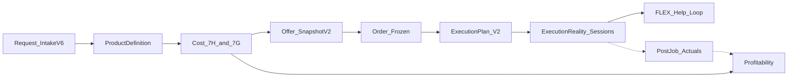

# WORKOS Post-FLEX Roadmap Reentry — Next Major Phase

**Verdict:** `WORKOS_POST_FLEX_ROADMAP_REENTRY_PLAN_READY`  
**Status stamp:** **POST-FLEX ROADMAP REENTRY PLAN READY FOR OWNER REVIEW**  
**Branch:** `feature/product-system-active-path-isolation-v1`  
**Planning HEAD:** `0cd82d9` (PROD-FLEX-COLLABORATION-PHASE-3 COMPLETE; FLEX lane CLOSED)  
**Date:** 2026-07-16  

**Recommended next implementation phase (one owner GO later):**  
`WORKOS-POST-JOB-ACTUALS-RECONCILIATION-AND-PROFITABILITY-TRUTH-V1`

Implementation is **not** started by this planning task. Separate owner GO via `/ce-work` required.

---

## 1. Current post-FLEX position

| Layer | Truth (runtime/code over stale flow docs) |
|-------|------------------------------------------|
| Waves 1–7 frozen spine | **CLOSED** — desktop operator path proven with controlled fixtures ([`WORKOS_E2E_STATUS.md`](../../docs/master/workos-e2e/WORKOS_E2E_STATUS.md)) |
| FLEX Phases 1–3 | **COMPLETE** (Phase 2/3 with nonblocking limitations) — lane **CLOSED** |
| Live `:8001` order `23099` | Plan `v2_operational_ready`, reality **17** session rows / **1605** actual minutes, collab-read live |
| Profitability on `23099` | Commercial **1500** / estimated **620** populated; **`actual_total_cost` null**; warnings `actual_costing_not_available`, `hr_labor_cost_missing` |
| Canonical STATUS drift | Pre-reentry docs still mentioned Phase 3 “plan ready” in places — corrected by this stamp to Phase 3 COMPLETE @ `0cd82d9` |

**Important:** [`08_EXECUTION_PLAN_FLOW.md`](../../docs/architecture/app-flows/08_EXECUTION_PLAN_FLOW.md) still says materialize blocked — **false at runtime**. Do not reopen Wave 5 materialization as the next major phase.

---

## 2. What is operational now

- Intake V6 readiness/finish spine; PD/Aggregate wave 2 with known debt
- 7G/7H commercial spine on V6 dry-run / snapshots (W3); CostEngine internal-only
- Order Snapshot V2 freeze → Execution Plan V2 preview/persist/materialize → task start guards → reality sessions
- Operator `/execution/:orderId` task-truth, start/complete, collab UI behind `VITE_FEATURE_FLEX_COLLAB_UI`
- Employee Mobile V2 claim/start/complete + Phase 3 ajutor/helper sessions; **V1 unchanged**
- Stock deduction panel exists on ExecutionDetail ([`StockDeductionPanel.tsx`](../../frontend/src/components/inventory/StockDeductionPanel.tsx)); inventory deduction service exists

---

## 3. Preview-only / misleading / blocked

- Profitability panel: quoted vs estimated **real**; actual side **preview/null** ([`10_PROFITABILITY_AND_ACTUALS_FLOW.md`](../../docs/architecture/app-flows/10_PROFITABILITY_AND_ACTUALS_FLOW.md) — status PARTIAL; live API confirms)
- Plan-vs-reality divergence often noisy (e.g. planned minutes 0 vs huge actual) without an honest reconciliation contract
- Product System catalog/UI partially wired / fixture-sensitive; **PS is configuration authority, not a workflow stage** (D-004)
- Same continuous customer scenario Intake→…→completed measurable job: **not proven as one unbroken owner journey** (Wave 7 used controlled stage fixtures)
- Module Chain / Governance: documentation/demo surfaces — not control plane
- UI-TRUTH-01B+, APP-AUTH-06G: **PAUSED**

---

## 4. Main roadmap work paused (pre-FLEX)

- UI-TRUTH banner polish, APP-AUTH-06G evidence collection
- Optional `/operator` collab mirror; FLEX F2/F3 projection polish; quantity-progress FLEX-06+; ShopFloor
- PD standalone operator page (D-011)
- FLEX polish items — **must stay deferred**

---

## 5. Candidate phases compared (choose one)

| Candidate | Current truth | Product value | Owner-visible | Dependency readiness | Size | Dead-infra risk | Next? |
|-----------|---------------|---------------|---------------|----------------------|------|-----------------|-------|
| **A** Product System / Aggregate active-path | Partially wired; config authority | Medium (templates) | Medium (`/product-system`) | Parallel to floor jobs | Large | Medium (fixture loops) | **No** — not the customer→job path bottleneck after FLEX |
| **B** Plan materialize hardening | Already live on `23099` | Low incremental | Low | Done (W5) | Medium | High (reopens closed wave) | **No** |
| **C** Workcenters / machines / capacity | Partial registry | Medium later | Medium | Needs actuals feedback | Large | Medium | **No** — premature capacity without measured jobs |
| **D** Employee eligibility / APP-AUTH | Paused by owner | Medium | Medium | Paused | Medium | Low | **No** — not a FLEX blocker; reopen only if assignment fraud proven |
| **E** Plan vs Reality reconciliation | Divergence services partial; UI noisy | High | High on `/execution/:id` | Ready (sessions exist) | Medium | Low | **Yes — include inside recommended phase** |
| **F** Actual materials / machine / employee / post-job | Sessions real; materials/cost null | **Highest** for “measurable production” | High (profitability + stock + reality) | Ready after FLEX sessions | Large-bounded | Low if no hourly invention | **Yes — primary** |
| **G** Offer/Order/Execution same-scenario E2E | Spine proven in pieces | High trust | High | Ready | Large | Medium (fixture theater) | **Defer as follow-on proof**, not primary build |
| **H** FLEX polish / operator mirror | Nonblocking | Low | Low | N/A | Small | High | **No** — owner forbids |

---

## 6. Recommended major phase

### Name

**`WORKOS-POST-JOB-ACTUALS-RECONCILIATION-AND-PROFITABILITY-TRUTH-V1`**

### Product outcome

After a job has real sessions (and optional stock movements), the owner can open Execution and see **honest post-job truth**:

- actual labor **minutes** from sessions (multi-worker / helper-aware)
- actual **material** cost/qty from inventory deduction path (when deducted)
- plan vs reality reconciliation that does not treat missing planned minutes as “0 planned / huge actual” without explanation
- profitability panel with non-null actual fields where authority exists — **without** rewriting accepted commercial price and **without** commercial hourly pricing

### Why this comes next

1. Canonical architecture already places **ExecutionActuals → ProfitabilityAnalysis** as the missing end of the spine ([`WORKOS_REALIGNMENT_MASTER_PLAN.md`](../../docs/architecture/WORKOS_REALIGNMENT_MASTER_PLAN.md), flow `10`).
2. FLEX just made multi-session work real; those minutes are not yet learning/measurement truth.
3. Live proof: profitability warnings on `23099` are exactly this gap.
4. Alternatives either reopen closed waves (B), polish (H), or move sideways into catalog/capacity (A/C) before “completed job is measurable.”

### Exact boundaries

**In**

- Thin read models / projections composing existing sessions + stock movements into profitability/actuals contracts
- Plan-vs-reality reconciliation contract + ExecutionDetail surfaces
- Stock deduction honesty tied to reality quality flags already present ([`execution_reality_invalidation_service.py`](../../backend/services/execution_reality_invalidation_service.py))
- Focused backend/frontend tests + runtime verification on a suitable local order (prefer existing `23099` or temporary real-flow data; **no new canonical seed**)
- Worklogs / BUILD qa doc

**Out**

- FLEX reopen / operator collab mirror / F2–F3 polish
- Commercial hourly labor rates; quote/order price write-back
- Product System redesign; ACM activation; Intake redesign
- HR product redesign; pontaj as standalone product
- Workcenter capacity optimization product
- DB migration unless a later GO proves schema is unavoidable (plan assumes **additive JSON/read fields first**; stop and escalate if migration required)
- Employee Mobile V1; Mobile V2 expansion unless a single thin read is required for helper-minute honesty
- Same-scenario full Intake→Offer marketing E2E as the build itself (defer to post-phase proof)

### Architecture rules (binding)

- CostEngine / 7H = internal cost; 7G = commercial; actuals never rewrite accepted offer
- Order snapshot frozen; Execution Plan orchestration; Execution Reality runtime; sessions = work/time
- Product System has no employee assignment
- No `participants_json` authority; no mock production data

### Data/schema

Prefer **no migration**: extend profitability response + optional reality/quality read fields. If true schema is required, implementation **STOPs** for owner GO.

### API (directional)

- Extend `GET /api/v1/profitability-analysis/order/{order_id}` with session-derived labor minutes and inventory-derived material actuals
- Optional thin `plan-reality-reconciliation` read on operator/execution (new or folded into task-truth / observability) — implementer chooses reuse vs new route
- Reuse stock deduction APIs; do not invent parallel inventory authority

### UI

Primary: [`/execution/:orderId`](../../frontend/src/pages/ExecutionDetail.tsx) — ProfitabilityAnalysisPanel, Reality quality, StockDeductionPanel, plan/reality reconciliation section  
Secondary (thin only if natural): Operator current-task card — no second console

### Internal workstreams (one GO)

1. **Actual labor minutes projection** from reality sessions (role-aware; helpers included as work time, not membership)
2. **Material actuals** from stock deduction / consumption path
3. **Plan vs reality reconciliation** read + UI
4. **Profitability panel truth** — populate actuals; keep warnings honest when HR money absent
5. **Tests + runtime proof + docs**

### Testing

- Backend: profitability actual field contracts; session aggregation; stock linkage; no write-back
- Frontend: panel rendering for null vs populated actuals; reconciliation empty/error
- Regression: execution start/complete; FLEX phase2 help suite smoke; snapshot immutability untouched

### Runtime verification

- Stack `:8001` / `:3000`
- Order `23099` (or safer local order if 23099 too polluted)
- Prove: sessions → non-null actual labor minutes on profitability; material actuals when stock deducted; reconciliation explains plan/actual; commercial totals unchanged

### Owner-visible verification (must be in final BUILD)

| Item | Value |
|------|--------|
| URL | `http://127.0.0.1:3000/execution/23099` |
| Page | Detaliu execuție |
| Sections | Profitability analysis; Colaborare (unchanged); Deducere stoc; new/updated plan-vs-reality block |
| Role | Operator / production_blueprint |
| Click | Open order → scroll Profitability → confirm accepted/estimated still set → confirm actual minutes/material fields populated or explicit honest empty → confirm no quote rewrite |
| API | `GET /api/v1/profitability-analysis/order/23099` — actual labor/material fields; warnings reduced or precise |
| Still unavailable | Full HR money cost if no rate authority; capacity dashboard; PS catalog polish |

### Rollback

Feature-flag optional read enrichment if needed; default keeps today’s null actuals + warnings. No migration cleanup.

### Commit strategy (implementation later)

1. Backend actuals projections + profitability contract  
2. Reconciliation read + Execution UI  
3. Tests, runtime evidence, worklog/BUILD  

No push/PR unless separately asked.

### One-GO authorization boundary

Owner authorizes **this whole phase** as one implementation GO (G1-style phase decisions only — see decision log). Not per-endpoint approvals.

### Remains paused after GO

FLEX polish; `/operator` mirror; UI-TRUTH; APP-AUTH-06G; PS isolation closeout as primary; capacity product; Mobile V1; ShopFloor; Module Chain runtime

### After this phase

Likely: (1) same-scenario Intake→completed-job owner proof, then (2) capacity/workcenter using measured actuals, or (3) HR labor-money authority if owner wants `actual_total_cost` complete.

---

## 7. Owner decisions required at implementation GO (phase-level)

1. **G1:** Approve post-job actuals phase as next (vs Product System or APP-AUTH)?
2. **G2:** Labor money out of scope — minutes-only labor actuals OK?
3. **G3:** Material actuals require real stock deduction on the fixture order — authorize temporary local deduction/cleanup?
4. **G4:** Primary surface remains `/execution/:orderId` only (no `/operator` mirror)?

---

## 8. Confidence

High on **problem frame and sequencing**. Medium on exact API shape (left to `/ce-work`). Live runtime + profitability nulls are the strongest evidence.

---

## Artifact index

| Artifact | Path |
|----------|------|
| This plan | `.compound-engineering/workos-post-flex-roadmap-reentry/plan.md` |
| Decision log | `.compound-engineering/workos-post-flex-roadmap-reentry/decision-log.md` |
| Worklog | `docs/worklog/realignment/2026-07-16_workos_post_flex_roadmap_reentry.md` |
| Cursor plan (do not edit as authority) | `.cursor/plans/post-flex_roadmap_reentry_*.plan.md` |
