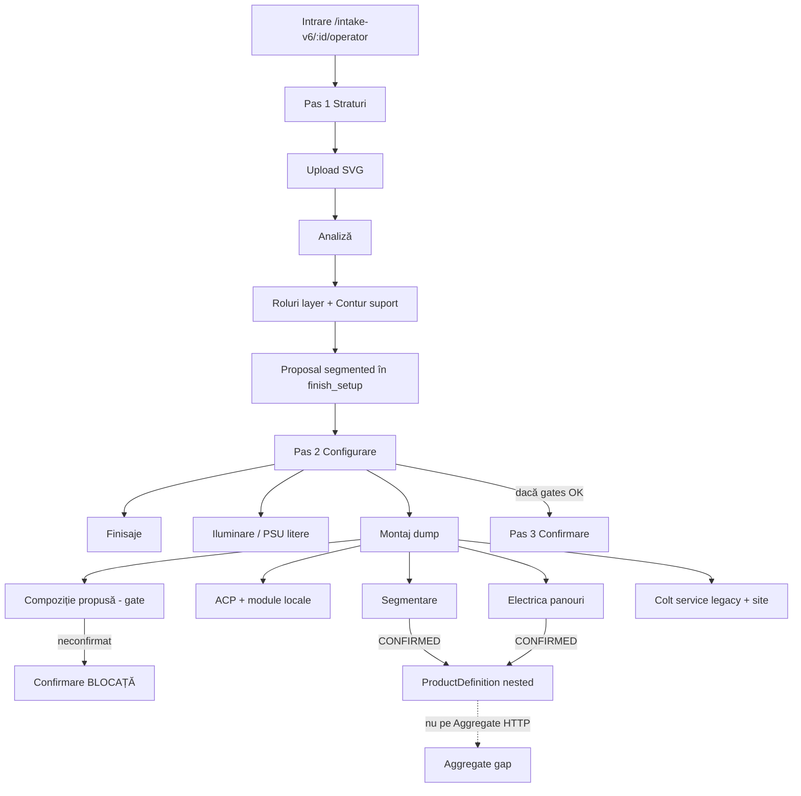

# Intake V6 — Complete Technical, Logic and UI/UX Audit

**Date:** 2026-07-19  
**Branch:** `feature/product-system-active-path-isolation-v1`  
**HEAD at audit:** `7f3e507` (`feat(product-system): add segmented panel electrical routing`)  
**Baseline expected:** `7f3e507` — **confirmed match**  
**Mode:** Read-only product code. Docs/QA evidence only. No plugin installs. No UI/backend implementation.  
**Evidence root:** `docs/qa/intake-v6-complete-ui-ux-audit-2026-07-19/`  
**Primary live workspace:** `e1ba14f2-ceca-4239-9e8e-e87c0e21d65f` (`IV6-030823F5`)  
**Audit stack:** FE `http://127.0.0.1:3001` (Vite proxy `BACKEND_PORT=8003`) · BE `http://127.0.0.1:8003` · Compat **PASS**

---

## 1. Verdict general

**PARTIAL**

Intake V6 works as a **stack of capable subsystems** (SVG analyze → roles → finish_setup → segmented confirm → electrical confirm → PD projection → reload). It does **not** yet work as a **coherent operator product** on Page 2 (Configurare), especially Montaj and the Iluminare↔Montaj electrical split.

| Dimension | Rating |
|-----------|--------|
| End-to-end technical path (SVG → PD) | **Works** for segmented + electrical on real Desktop SVGs |
| Persist / reload | **Works** for confirmed segmented + nested electrical |
| ProductDefinition authority | **Works** (confirmed nested; Aggregate HTTP gap remains) |
| Page 1 (Straturi) operator clarity | **Partial** — usable, dense, prepares Montaj poorly |
| Page 2 information architecture | **Fails coherence** — additive cards, competing blockers, nested scroll |
| Last two tabs (Iluminare / Montaj) | **Incoherent as a pair** — two “Electrică” concepts; Montaj is a vertical dump |
| Visual / design-system discipline | **Partial** — local `v6` tokens, fragmented status dialects |
| Hidden errors | **Present** — silent 404 cost-draft, 422 finish races, Confirmare blocked while Montaj looks “done” |

**Audit acceptance for this task:** evidence collection **PASS**. Product readiness for operators: **PARTIAL**.

---

## 2. Mini decizia agentului

Nu mai optimizăm carduri izolate. Următorul build trebuie să fie un **singur redesign de information architecture pentru Pas 2 (Configurare)**, cu:

1. **o ierarhie de decizie** (compoziție → finisaje litere → iluminare litere → carcasă/fundal → alimentare carcasă → montaj/site);  
2. **un singur cluster “Fundal / carcasă ACM”** care conține segmentare + electrica panourilor;  
3. **separarea clară** Electrică litere (PSU/LED) vs Alimentare carcasă 220V;  
4. **blocker sticky global** care spune *exact* ce blochează Confirmarea (compoziție vs finisaje vs montaj), nu trei mesaje concurente.

Nu instalăm pluginuri acum. Folosim Playwright + Figma MCP deja disponibile. Runtime rămâne autoritatea de verificare.

---

## 3. Pre-flight / git / runtime

| Item | Value |
|------|--------|
| Branch | `feature/product-system-active-path-isolation-v1` |
| HEAD | `7f3e507b6f0fae5b5528f86e8bceb00763a5c576` |
| Foreign WIP | Present (many unrelated dirty files) — **untouched** |
| Ports observed | `:3000` FE (default proxy → `:8001` ghost) · `:8001` **no compat** · `:8002` compat but release label `c4ff585` · audit used `:3001`/`:8003` |
| Compatibility | `GET /api/v1/system/local-compatibility` **PASS** on `:8003` |
| Release label quirk | Version endpoint reports `git_commit: bf2df42` from release file even when code tree is `7f3e507` — identity by capability, not label |
| Intake route | `/intake-v6/:workspaceId/operator` |
| Steps | `layers` (Straturi) → `review` (Configurare) → `confirm` (Confirmare) |
| Review tabs | `finisaje` · `iluminare` · `montaj` |

### Critical local-runtime finding

Default FE on `:3000` with empty `VITE_API_BASE_URL` proxies to **`BACKEND_PORT` default 8001**. `:8001` returns **404** on local-compatibility → ghost/stale backend risk. Cross-origin `VITE_API_BASE_URL=http://127.0.0.1:8003` is **CORS-blocked**. Correct audit pattern: same-origin Vite proxy with `BACKEND_PORT=8003`.

---

## 4. Real SVG fixtures

Desktop dir: `C:/Users/offic/Desktop/fisiere-teste-svg/`

| File | Bytes | Structure (verified) | Used for |
|------|------:|----------------------|----------|
| `litere-cu-fundal-acm-segmentat.svg` | 5136 | 2× rect `gravare-cnc-135gr` + letter path `decupare-cnc-outside`; 200×35 cm | Primary happy path |
| `litere-cu-fundal-acm-segmentat-litera-peste-imbinare.svg` | 5136 | Same panels; letter geometry shifted over joint | Applied crossing |
| `situatie-3.svg` | 5136 | Same panels; taller viewBox / offset Y | Calm / overhang-adjacent |

No synthetic substitutes used for primary evidence.

---

## 5. Compound Engineering tracks (reconciled)

| # | Track | Verdict | Confidence |
|---|-------|---------|------------|
| 1 | Flow E2E | Partial — Confirmare blocked by composition gate | High |
| 2 | Frontend architecture | Dual state owners; Montaj monolith; debounce vs immediate mix | High |
| 3 | Backend / persistence | Coalesce + confirm 422s solid; wipe on demotion intentional | High |
| 4 | ProductDefinition | Confirmed segmented + electrical projected | High |
| 5 | ProductAggregate | No top-level segmented; PD-nested only | High |
| 6 | SVG Analyzer | Proposal path live via Contur suport | High |
| 7 | Component binding | Works; applied crossing often needs inject | High |
| 8 | Finish setup | Hydration improved; still debounce races elsewhere | Medium-High |
| 9 | Segmented ACM/ACP | Live confirm/reload/PD OK | High |
| 10 | Segmented electrical | Live draft→shared→confirm OK; UI buried | High |
| 11 | UI/UX + IA | **Primary failure mode** | High |
| 12 | Tabs / navigation | 3 tabs OK as chrome; content placement wrong | High |
| 13 | Validation / blockers | Competing banners; Confirmare reason unclear | High |
| 14 | Hydration / reload | Segmented+elec survive reload | High |
| 15 | Hidden failures | 404 cost-draft; Confirmare vs Montaj done mismatch | High |
| 16 | Visual / tokens | Local hex/`v6`; no Storybook; docs `--wo-*` unused | High |
| 17 | Accessibility | Tablist OK; unlabeled buttons; nested scroll | Medium |
| 18 | Plugin marketplace | Research only — see §22 | High |
| 19 | Figma tooling | Files exist; stale vs runtime segmented/electrical | Medium |
| 20 | Dead / duplicate truths | Orphan panels; three “corner” namespaces; dual Electrică | High |

---

## 6. Flow map (operator)



### Per-step operator questions (canonical)

| Step | Goal | Must understand | Must decide | Must confirm | Automatic | Proposal | Authority | Blocker | Saves |
|------|------|-----------------|-------------|--------------|-----------|----------|-----------|---------|-------|
| Straturi | Identitate geometrică + roluri | Ce e literă vs fundal | Roluri layer | Roluri + fișier | Analiză SVG | Segmentare când Contur suport | Operator pe roluri | Roluri incomplete | analysis-bundle + finish patches |
| Configurare | Config produs ofertabil | Ce e confirmat vs draft | Finisaje, LED, carcasă, montaj | Compoziție + segmented + (elec) | Preview calc | Compoziție / segmented | finish_setup + PD confirmed | Compoziție + readiness + finish gaps | finish_setup (debounce/immediate mix) |
| Confirmare | Handoff readiness | Ce e gata de ofertă | Accept final | Checkbox / handoff | Summaries | — | Operator + readiness | Incomplete truth | confirmation flags |

---

## 7. Page 1 audit (Straturi / `layers`)

**Works:** upload, analyzer, role selects, Contur suport association, offer-scope presets, footer gate to Configurare.  
**Partial:** operator is not told that Contur suport *creates* a Montaj proposal; segmented truth is invisible until Page 2 Montaj.  
**Risks:** technical layer ids; offer scope + composition later reappear; density of operator panel vs preview.

**Handoff to Page 2:** roles + analysis + optional `segmented_background=PROPOSED` — but Page 2 opens on Finisaje with composition banner, not on the proposal the operator just caused.

---

## 8. Page 2 audit (Configurare / `review`)

### Chrome above tabs (always-on noise)

1. **Compoziție produs propusă** — badge “Necesită confirmare”, legacy Bond warning, primary CTA.  
2. **Scope ofertă** — read-only echo of Page 1.  
3. **Blocker banner** — “N probleme blochează Confirmarea” (count changes by tab context).  
4. **Calcul estimativ live** — commercial preview + missing rates, even while composition unconfirmed.  
5. **Footer sticky** — “Confirmă compoziția…” + “Probleme și avertizări — N” + Continuă disabled.

Live evidence: screenshots `06`–`11`, `19_pas3_not_reached.png`.  
Footer remained **disabled** after segmented+electrical confirm because **composition gate** still open — operator can finish “hard” Montaj work and still be blocked by a banner above the tabs.

### Density evidence

From `inv_montaj.json` tall cards:

| Surface | Approx height |
|---------|--------------:|
| Scope comercial montaj wrapper | **1674 px** |
| Pregătire și montaj | **1507 px** |
| Configurație Panou ACP | **1250 px** |
| Segmented panel | **324 px** (buried) |

Body `scrollHeight === viewport` (`metrics_*.json`) → **nested scroll container**; full-page body screenshots understate depth. This is itself a UX defect for auditability and for operators who miss content below the fold of the inner pane.

---

## 9. Tab-by-tab audit

### 9.1 Finisaje

| Declared | Real |
|----------|------|
| Față · cant · Vector Logo | Letter/artwork finish configuration |

**OK:** natural first technical tab for letters.  
**Problems:** composition/blocker chrome dominates; letter cards compete with live calc; pending badge noise historically reduced but still present as readiness wall.

### 9.2 Iluminare (penultimate tab)

| Declared | Real |
|----------|------|
| LED · backing | LED system + **Electrică / PSU** subsection |

**OK:** letter lighting belongs here.  
**Critical confusion:** subsection labeled **Electrică** is **PSU/LED job-level**, not panel 220V. Same Romanian word as shell electrical on Montaj.

Live: `intake-v6-electrical-subsection` visible (`findings.json`).

### 9.3 Montaj (last tab) — highest severity IA failure

Declared: “Șablon · sistem”.  
Real: chronological dump of every mounting/ACP/segmented/electrical/service-corner/site control.

Order observed (live + code):

1. Ownership notes  
2. Scope comercial montaj  
3. Pregătire / șablon  
4. Soluție metal vs ACP  
5. ACP product config  
6. ACP local face modules (**OWNER_GATE_REQUIRED** noise)  
7. **Segmented background** (proposal/confirm)  
8. **Segmented electrical** (only after confirm + ≥2 panels)  
9. Sistem prindere  
10. Colt service transformator (`power_supply_service_corner`)  
11. Process electrical cable length  
12. Finisaj șuruburi / module aluminiu / montaj la locație  

**This is additive implementation order, not operator decision order.**

---

## 10. Last-two-tabs deep audit (Iluminare + Montaj)

### Do operators understand the difference?

**No, not reliably.** Both tabs expose “electric” concerns with different schemas:

| Concern | Tab today | Schema / field |
|---------|-----------|----------------|
| LED / PSU watts | Iluminare | `selected_psu_watts`, `psu_configuration`, … |
| Panel 220V / shared feed | Montaj | `finish_setup.segmented_background.electrical_connection_management` |
| Legacy service corner | Montaj | `power_supply_service_corner` |
| ACP service corner fields | Montaj | selection / ACP config |

### Mix on Montaj

Configurare + verificare + montaj comercial + electrica carcasă + finisaje aux + blockere + note ownership — **all same visual weight**.

### Explicit answers

| Question | Answer |
|----------|--------|
| Purpose of Iluminare? | Letter illumination + PSU — **keep**, rename Electrică → **Alimentare LED / PSU** |
| Purpose of Montaj? | Shell, mounting, site — **keep name**, **restructure content** |
| Content belonging elsewhere? | Segmented+panel electrical should be one **Fundal/carcasă** cluster; PSU stays Iluminare |
| Chronological cards? | **Yes** |
| Components to move? | Segmented + electrical up under ACP shell; demote OWNER_GATE ACP modules; collapse commercial scope |
| Repeated info? | Scope (Page1 + Review); composition vs segmented; three corners |
| Action too low? | Confirm segmented/electrical below 1200px+ of ACP noise |
| Blocker without scroll? | Global composition blocker yes; segmented cutout/insert only after scroll to panel |
| Conflicting messages? | Footer “confirmă compoziția” vs Montaj green “ansamblu confirmat” vs electrical draft |
| Status color inconsistency? | rose/amber/emerald + AtomsBadge remap risks |
| Badge noise? | Composition + system banner + missing rates + tab pending + OWNER_GATE |
| Collapse candidates? | Live calc details, ACP advanced, ownership notes, commercial scope when inactive |
| Always visible? | Global blocker reason; assembly status; next required decision |

### Single recommended structure (not five variants)

**Keep 3 tabs**, rename hints, regroup Montaj:

1. **Finisaje** — litere / artwork only (+ short “ce urmează: carcasă”).  
2. **Iluminare** — LED + **PSU litere** (never panel 220V).  
3. **Montaj / carcasă** — fixed sections with progressive disclosure:

```
A. Decizie obligatorie: Compoziție produs          [sticky until confirmed]
B. Fundal / carcasă ACM
   B1. Segmentare panouri (proposal → confirm/reject)
   B2. Alimentare 220V pe panouri (after B1 CONFIRMED)
   B3. Interfață litere↔panou (crossing / cutout / insert)
C. Montaj comercial & site (scope, șablon, locație) [collapsed if scope = fără montaj]
D. Detalii avansate ACP / prindere / legacy corner [collapsed]
```

**Iluminare vs Montaj difference in one sentence for UI copy:**  
*Iluminare = lumina literelor. Montaj = carcasa, panourile și alimentarea 220V a carcasei.*

---

## 11. Frontend code audit (summary)

**Hierarchy:** `IntakeV6OperatorWorkspaceApp` → `IntakeV6OperatorWorkspace` → steps `SvgAnalyzer` / `Review` / `Confirm`.  
**State:** workspace hook owns analysis/roles; Review owns local `finish_setup` form + hydrate via `finishFromPayload`.  
**Persist:** segmented/electrical **immediate**; most fields **700–1400ms debounce**; analysis-bundle **900ms**.  
**Risks:**

1. Leave-page race on debounced fields (segmented path fixed; siblings not).  
2. Dual render: contract `renderSectionByKey` + hardcoded Montaj.  
3. Orphan UIs: `IntakeV6AlucobondContourPanel` / `IntakeV6SupportContourGeometryCard` not on live path.  
4. `mounting_fixing_system` hydrate wipe risk (medium).  
5. CORS + wrong proxy → silent “backend unavailable” wall (seen when `VITE_API_BASE_URL` cross-origin).

---

## 12. Backend / persistence audit (summary)

**Truth store:** `intake_v6_workspaces.payload_json.finish_setup`.  
**PUT** `/api/v1/intake-v6/workspaces/{id}/finish-setup` → normalize → coalesce segmented → persist (422 on confirm blockers).  
**Coalesce** prevents sparse wipe for PROPOSED/CONFIRMED/REJECTED.  
**Electrical** nested; wiped if assembly demoted from CONFIRMED.  
**Compat** endpoint protects schema presence, not nested semantics.

Live: segmented+electrical **CONFIRMED** survived reload (`workspace_after_reload.json`).

---

## 13. Validation / blocker audit

| Surface | Behavior | Operator impact |
|---------|----------|-----------------|
| Footer issues | Count 7–11 | Anxiety without priority |
| Review blocker banner | Composition / roles / handoff | Blocks Confirmare |
| Segmented confirm blockers | On panel | Good when visible |
| Electrical blockers | On panel | Good when visible |
| Live missing rates | Commercial | Looks like product blocker |
| OWNER_GATE_REQUIRED | ACP modules | Technical leak |

**Hidden:** Confirmare disabled while Montaj shows green assembly confirmed — **trust break**.

---

## 14. ProductDefinition audit

Live PD keys include `segmented_background` + nested `electrical_connection_management` when confirmed; proposal uses non-authoritative markers.  
Draft electrical uses non-authoritative projection path when not confirmed.  
**Canonical:** confirmed nested docs.  
**Not authority:** analyzer detection messages, UI display strings, Aggregate HTTP root.

---

## 15. ProductAggregate audit

| Check | Result |
|-------|--------|
| Top-level segmented on Aggregate HTTP | **Absent** (`has_segmented_top_level: false`) |
| Materials/processes/tasks from segmented/electrical | **Empty by design** |
| Pricing effects | **None** (`no_pricing`) |
| Task materialization | **False** |
| Letters ownership absorbed | **No** (EXTERNAL) |
| Duplicate Aggregate truths | Avoided by nesting under PD |

**Documented gap remains:** consumers of Aggregate-only miss shell electrical/segmented.

---

## 16. Segmented ACM/ACP live audit

Path proven: Desktop SVG → Contur suport → PROPOSED → Montaj panel → Confirm → reload → PD `CONFIRMED` → Aggregate projection nested under PD.

| Check | Result |
|-------|--------|
| Proposal location | Montaj (late) — functionally OK, IA late |
| Operator why? | RO copy present (“Am gasit mai multe fundaluri…”) |
| Confirm/Reject | Clear when scrolled into view |
| Panel list / joint | Readable |
| Distributed graphic | Calm copy present |
| Applied crossing | Often needs binding inject (cross SVG) |
| Cutout/insert blockers | Wired in panel; not exercised as hard fail in this run |
| After confirm | Banner useful; should collapse details |
| Electrical timing | Appears after confirm — correct gating; still too deep in page |

---

## 17. Segmented electrical live audit

| Mode / concept | Live |
|----------------|------|
| DIRECT_220V | Configured panel_1 |
| SHARED_FROM_PANEL | Configured panel_2 ← panel_1 |
| Confirm | Succeeded; PD nested CONFIRMED |
| NO_LOCAL_220V / UNCONFIRMED | Available in UI |
| Workshop / install flags | Present per panel |
| Legacy `power_supply_service_corner` | Still visible alongside |
| Pricing / tasks | Zero (meta flags) |

**UI:** fields logical per panel but **overwhelming** next to ACP modules + legacy corner + BOM cable lines that look related but are letter/process pricing, not shell routing authority.

**Recommendation:** same cluster as segmentation; progressive disclosure; hide legacy corner when segmented electrical CONFIRMED (or show single “precedence” note).

---

## 18. Hidden error audit

| Issue | Severity | Evidence |
|-------|----------|----------|
| Confirmare blocked by composition while segmented/electrical done | **HIGH** | `19_pas3_not_reached.png`, footer disabled |
| Competing blocker narratives (compoziție / roles / handoff / rates) | **HIGH** | banners on `07`–`11` |
| Nested scroll hides Montaj depth; body scrollDepth=1 | **HIGH** | `metrics_montaj.json` vs tall cards 1674px |
| Dual Electrică (Iluminare PSU vs Montaj 220V) | **HIGH** | code + live subsection |
| Three corner namespaces | **HIGH** | BE map + UI both corners visible |
| `PUT finish-setup` 422 during walkthrough | **MED** | `api_hits_sample.json` |
| `volumetric-face-back-prep/cost-draft` **404** silent | **MED** | same |
| CORS when FE points absolute API base | **MED** | debug_header_fail |
| Default `:3000` → `:8001` ghost | **HIGH** (local ops) | preflight |
| Aggregate-only consumers miss shell truth | **MED** | `agg_basic.json` |
| Raw OWNER_GATE / LOCAL_CONFIGURATION_REQUIRED | **MED** | shot `12` |
| Unlabeled icon buttons | **LOW-MED** | `a11y_quick.json` |

No critical data-loss wipe observed on confirmed segmented+electrical reload in this run.

---

## 19. Visual consistency / design system inventory

| Layer | Status |
|-------|--------|
| Intake `v6` presentation (`intakeV6Presentation.tsx`) | Primary runtime |
| WorkOS `design-system/tokens.ts` | Parallel; little V6 adoption |
| Docs `--wo-*` CSS vars | **Not in CSS** |
| Storybook | **Absent** |
| Status dialects | AtomsBadge / header / confirm tiers / PreOrder Badge — fragmented |
| Cards | Many equal-weight bordered wells |
| Danger color | rose vs red drift |

---

## 20. Accessibility audit

- Tablist/tabs present (`role=tablist`, 3 tabs).  
- No horizontal overflow on sampled page.  
- Unlabeled controls: 2 buttons.  
- Nested scroll + sticky footer reduces discoverability of deep Montaj actions.  
- Technical English enums leak in ACP gates.

---

## 21. Information architecture proposal (operator-first)

### Pas 1 — Straturi

**Question:** Ce este în fișier și ce rol are fiecare strat?  
**Done when:** SVG confirmed + all roles confirmed (+ Contur suport if present).  
**Show:** short “dacă există fundal multi-panou, îl vei confirma la Montaj”.

### Pas 2 — Configurare

**Question:** Cum construim și alimentăm produsul?  
Tabs as in §10.  
**Done when:** composition confirmed + required finish/lighting + (if segmented) assembly confirmed + electrical resolved or explicitly deferred policy.

### Pas 3 — Confirmare

**Question:** Putem trece la ofertă?  
Only readiness summary + explicit confirm — no new configuration cards.

### Vocabulary locks

| Term | Meaning |
|------|---------|
| Configurare | Edit truth candidates |
| Confirmare (step) | Final operator acceptance |
| Confirmă (button on card) | Promote proposal→authority for that domain |
| Blocker | Prevents step advance / handoff |
| Warning | Does not block |
| Review (word) | Avoid as tab name — conflicts with step mental model |

---

## 22. Recommended Page 2 structure

See §10 single structure. **One direction only.**

---

## 23. Recommended last-two-tabs structure

See §10. Keep Iluminare + Montaj; rename Electrică on Iluminare; cluster shell power under Montaj/carcasă.

---

## 24. UI governance system (permanent)

### Before any UI code

1. user goal  
2. operator workflow  
3. target page/tab  
4. why that location  
5. neighboring components  
6. hierarchy (primary / secondary / advanced)  
7. normal / incomplete / warning / blocker / confirmed states  
8. responsive safety  
9. accessibility  
10. screenshot plan (top/mid/bottom + full inner scroll)  
11. regression plan (reload + sibling tabs)

### After code

1. component test  
2. page test  
3. tab flow test  
4. full inner-scroll screenshot  
5. reload test  
6. error-state test  
7. hidden-state test  
8. visual audit vs neighbors  
9. compare to plan  
10. honest agent opinion  

**PASS UI** requires: functional ∧ persistent ∧ coherent ∧ understandable ∧ visually integrated ∧ no hidden regressions.

---

## 25. Marketplace / plugin research (no installs)

### Already available in this Cursor environment

| Tool | Status | Use for WorkOS |
|------|--------|----------------|
| Figma MCP (`user-figma` / `plugin-figma`) | Ready | Design review before code |
| cursor-ide-browser | Ready | Live walkthrough |
| Playwright (repo) | Ready | Visual/regression E2E |
| Context7 | Ready | Library docs |
| shadcn MCP | Ready | **Low fit** — V6 not shadcn-driven |
| Subtext | needsAuth | Not used; do not auth in this task |

### Candidates evaluated

| Candidate | Availability | Purpose | Cont/auth | Data | R/W | Overlap | Recommendation |
|-----------|--------------|---------|-----------|------|-----|---------|----------------|
| Figma (existing MCP) | Yes | Design authority drafts | Figma account | Design files | R/W design | Existing polish files | **KEEP / use process** — not new install |
| Playwright + screenshot protocol | In repo | Visual regression / flow | None | Local | Local | Replaces Percy for now | **INSTALL NOW = already present — standardize** |
| Chromatic / Percy | Marketplace SaaS | Visual CI | Cloud account | UI snapshots | Upload | Overlaps Playwright | **KEEP AS REFERENCE** until company account exists |
| Sentry / similar | Not in MCP | Runtime errors | Cloud | Error PII | Upload | Partial local banners | **DO NOT INSTALL** without company decision |
| Session replay (FullStory/Hotjar) | SaaS | Operator replay | Cloud | Session PII | Upload | Privacy heavy | **DO NOT INSTALL** (internal ERP) |
| Storybook | Absent | Component docs | None | Local | Local | Would help atoms | **PILOT** later as local-only, not this sprint |
| axe / pa11y | CLI | a11y | None | Local | Local | Complements Playwright | **PILOT** local in FE CI later |
| Semgrep | Optional CLI | Pattern risks | None | Local | Local | Scoped only | **KEEP AS REFERENCE** (`--metrics=off`) |

### Max recommendations (owner gate)

1. **Design:** Figma MCP + existing files — process, not new plugin.  
2. **Visual/browser:** Playwright evidence protocol (already) — formalize as governance.  
3. **Runtime/error:** keep Local API Compatibility banner; no Sentry yet.  
4. **Analytics/replay:** **reject** for Intake operator UI.

**Nothing installed in this task.**

---

## 26. Figma / design-system tooling

| File | Role | Freshness vs runtime |
|------|------|----------------------|
| https://www.figma.com/design/0CDPIuqoaZ1OQgNnvNyl1F | Configurare polish / color fidelity | Pre-segmented-electrical; useful shell |
| https://www.figma.com/design/911Q6oRKcEursrRoT4Qj0h | UI/UX audit frames Jul 10 | Pre-Montaj segmented cluster |

**Rules:** Figma = proposal for IA/visual. Runtime screenshots = verification. Do not treat Figma as Product Truth. Update Figma only after IA decision GO, before implementing cards.

---

## 27. Screenshots index (live)

Base: `docs/qa/intake-v6-complete-ui-ux-audit-2026-07-19/screenshots/`  
Workspace primary: `IV6-030823F5` · SVG basic unless noted · UI `http://127.0.0.1:3001`

| File | Page/tab | Expected | Finding |
|------|----------|----------|---------|
| `01_pas1_empty.png` | Straturi | Empty upload | Clear empty state |
| `02_pas1_imported.png` | Straturi | Imported | OK |
| `05_pas1_after_contur_suport.png` | Straturi | Roles after Contur suport | Proposal not shown here |
| `06_pas2_entry_finisaje.png` | Finisaje | Entry | Composition gate dominates |
| `07_finisaje_*` | Finisaje | Tab content | Nested scroll; chrome heavy |
| `08`/`09_iluminare_*` | Iluminare | LED/PSU | Electrică=PSU naming clash |
| `10`/`11_montaj_*` | Montaj top | Assembly tab | Segmented not in first viewport |
| `12_segmented_proposal.png` | Montaj | Proposal | After ACP OWNER_GATE noise |
| `13_segmented_confirmed.png` | Montaj | Confirmed | OK |
| `14_electrical_draft.png` | Montaj | Draft elec | Draft badges clear |
| `15_electrical_shared_configured.png` | Montaj | Shared feed | OK |
| `16_electrical_confirmed.png` | Montaj | Confirmed elec | OK |
| `17_montaj_service_corner_region.png` | Montaj | Legacy corner coexistence | Duplicate truths |
| `18_reload_montaj.png` | Montaj | Persist | Truth OK; chrome still blocking Confirmare |
| `19_pas3_not_reached.png` | Configurare | Confirmare blocked | HIGH |
| `20_cross_montaj.png` | Montaj | Cross SVG | Panel present |
| `21_sit3_after_action.png` | Montaj | situție-3 | Calm path |
| `22_cross_applied_crossing.png` | Montaj | Crossing bind | Inject path |
| `debug_header_fail.png` | — | CORS wall | Wrong API base pattern |

Runner: `docs/qa/intake-v6-complete-ui-ux-audit-2026-07-19/run-complete-audit.mjs`

---

## 28. Functional truth

**Works:** SVG import; Contur suport proposal; segmented confirm/reject UI; electrical draft/shared/confirm; PD nested projection; reload persistence; compat fail-loud (when correctly wired).  
**Partial:** Page1→Page2 mental handoff; applied crossing auto-bind; Confirmare reachability; commercial preview honesty under unconfirmed composition.  
**Broken (product sense):** Page2 IA; dual Electrică; blocker priority; Montaj as chronological dump.

---

## 29. UI/UX truth

**Coherent:** 3-step chrome; tab labels as high-level domains; segmented panel copy when found.  
**Incoherent:** equal-weight cards; composition vs Montaj success mismatch; PSU vs 220V naming; OWNER_GATE raw enums; live price beside unconfirmed composition.  
**Must change:** Montaj information architecture + naming + sticky “next decision” — not more cards.

---

## 30. Dead pieces / duplicate truths

| Item | Type |
|------|------|
| Orphan Alucobond/SupportContour panels | Dead UI |
| `TPL-BOND-CASETAT` messaging vs live ACM boxed | Duplicate template narrative |
| `power_supply_service_corner` vs elec `service_point_position` vs ACP `service_corner` | Duplicate truths |
| Iluminare Electrică vs Montaj Alimentare 220V | Duplicate concept label |
| Offer scope Page1 + Review summary | Duplicate surface |
| Contract section renderer + hardcoded Montaj | Duplicate render paths |

---

## 31. Risks

1. Operator confirms shell electrical/segmented, thinks job done, Confirmare still blocked.  
2. Ghost backend `:8001` on default FE.  
3. Aggregate-only downstream miss shell truth.  
4. Status demotion wipes electrical.  
5. Further additive Montaj cards without IA governance.

---

## 32. Owner decisions required

1. **Approve single Page2 IA** in §10 (yes/no).  
2. **Rename** Iluminare “Electrică” → “Alimentare LED / PSU” (yes/no).  
3. **Precedence:** when segmented electrical CONFIRMED, hide or demote legacy service corner (yes/no).  
4. **Composition gate:** must it block all Configurare tabs, or only Confirmare? (recommend: block Confirmare + sticky top CTA, allow editing tabs).  
5. **Figma update** before implementation GO? (recommend yes, frames for new Montaj cluster only).  
6. **Plugin policy:** accept “no new installs; Playwright+Figma only” (yes/no).

---

## 33. Phased remediation roadmap (max 3 builds)

### Build 1 — Intake V6 Page2 IA & Montaj cluster (recommended next)

Scope: FE UI structure/copy only for Configurare tabs + sticky decision hierarchy; no pricing/CPP/Quote; no schema change.  
Outcome: operator can find segmentare+220V without scrolling through OWNER_GATE; Confirmare reason single-sourced.

### Build 2 — Electrical vocabulary + legacy corner precedence

Scope: naming, visibility rules, blocker copy; optional small persist precedence rules with tests.  
Outcome: one mental model for shell power vs letter PSU.

### Build 3 — Visual system alignment for Intake cards/badges

Scope: map V6 to shared status tones; reduce badge dialects; screenshot regression suite.  
Outcome: coherent surfaces without feature changes.

**Forbidden in these builds:** Employee Mobile, LIGHT-ROUTED migration, Pricing formula, Order/Execution, DB migrations, plugin installs.

---

## 34. Worklog pointer

`docs/worklog/realignment/2026-07-19_intake_v6_complete_ui_ux_and_flow_audit.md`

---

## 35. Confidence

Overall audit confidence: **0.88** (live walkthrough + code tracks + PD/Agg inspection).  
IA recommendation confidence: **0.90**.  
Plugin recommendation confidence: **0.85** (environment surveyed; no company SaaS accounts verified).

---

## 36. Operator vocabulary & placement (governance — 2026-07-19)

**Accepted Page 2 IA** (post `fc9c21b`): tabs Finisaje · Iluminare și surse · Montaj; Montaj clusters: Montaj comercial · Fundal și carcasă · Avansat.  
**Mapping layer:** `frontend/src/lib/intakeV6/intakeV6OperatorVocabulary.ts`  
**Rule:** primary operator UI uses Romanian labels; raw tokens only in Avansat / module advanced disclosure / logs / tests.

| Concept | Operator label | Technical/internal label | Primary location | Advanced/debug location |
|---------|----------------|--------------------------|------------------|-------------------------|
| Owner gate | Necesită confirmarea administratorului | `OWNER_GATE` / `OWNER_GATE_REQUIRED` | Module ACP readiness (RO) | Module „Detalii tehnice” accordion |
| Informational-only intent | Informativ | `INFORMATIONAL_ONLY` | Severity / status badges | Raw token in advanced |
| Segmented proposal | Propunere | `PROPOSED` | Fundal și carcasă status | Segmented panel diagnostics |
| Confirmed segmented assembly | Ansamblu confirmat | `CONFIRMED` (segmented) | Fundal și carcasă status | PD / debug dumps |
| Direct 220V | Alimentare directă 220V | `DIRECT_220V` | Fundal — electrical panel options | Raw mode in tests/logs |
| Shared panel supply | Alimentare din alt panou | `SHARED_FROM_PANEL` | Fundal — electrical panel options | Raw mode in tests/logs |
| Unresolved electrical state | Neconfirmat | `UNCONFIRMED` | Fundal — electrical + blockers | Raw mode in tests/logs |
| Cutout blocker | (blocker message RO via sticky banner) | cutout / crossing codes | Sticky blocker summary | Diagnostic tehnic accordion |
| Insert blocker | (blocker message RO) | insert / acrylic codes | Sticky blocker summary | Diagnostic tehnic accordion |
| Commercial installation | Montaj la locație / scope comercial | `site_installation_included`, `mounting_scope` | Montaj comercial accordion | — |
| Advanced diagnostics | Avansat (opțional / tehnic) | ownership notes, template IDs, gate paths | Collapsed Avansat cluster | Same (expanded) |

**Severity vocabulary (consistent):** Informativ · Necesită verificare · Avertizare · Blocant · Confirmat · Neconfirmat · Necesită decizie owner/admin.  
Owner approval is **not** presented as a technical failure (amber owner-decision tone, not rose blocker unless it truly blocks Confirmare).
