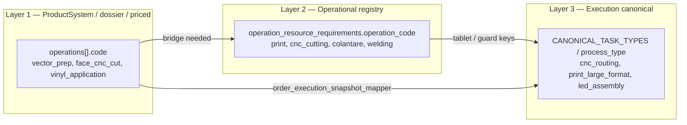

# Operational Resource Mapping — Architecture Reference

**Date:** 2026-06-10  
**Status:** Architecture lock (documentation only — no runtime change)  
**Audience:** Product owner, Cursor agents, developers  
**Branch at lock:** `local/integration-pr4-plus-svg-path`  
**HEAD at lock:** `af9dc93` — `fix(quotes): open created commercial quote from handoff`  
**Related builds:**

- `docs/qa/BUILD_OPERATIONAL_WORKFORCE_RESOURCE_REGISTRY_FOUNDATION.md` — s43 schema + seed script
- `docs/qa/BUILD_OPERATOR_EMPLOYEE_SELECTION_AUTHORIZATION_GUARD.md`
- `docs/qa/BUILD_TABLET_LIVE_WIRING_STATION_EMPLOYEE.md`
- `docs/qa/BUILD_FIELD_INSTALLATION_TEAM_ALLOCATION.md`
- `docs/qa/BUILD_EXECUTION_REALITY_WORKFORCE_CAPTURE.md`
- `docs/qa/BUILD_OPERATIONAL_REPORTS_FOUNDATION.md`
- `docs/qa/BUILD_OPERATIONAL_RESOURCE_MAPPING_ARCHITECTURE.md` — this lock’s QA record

---

## 1. Current state — what already exists

WorkOS does **not** start from zero. An **Operational Workforce & Resource Registry** foundation is already implemented (migration `s43`, services, API, tests, manual seed script).

### 1.1 Employees

| Artifact | Path / table | Role |
|----------|--------------|------|
| ORM | `backend/models/employees.py` → `employees` | Canonical employee record |
| CRUD API | `GET/POST/PUT/DELETE /api/v1/entities/employees` | Admin / CostEngine labour inputs |
| Registry API | `GET /api/v1/operational-registry/employees` | Operator-safe view (no salary exposure on shop floor) |
| Salary fields | `cost_lunar_firma`, `salary_currency`, `salary_period`, `ore_productive_luna` | HR + aggregate CostEngine input |
| User link | `user_id` (optional OIDC sub) | Future account linkage |

**Note:** Two parallel UI tracks exist today:

- **Real DB:** `/employees` (`Employees.tsx`) — CostEngine entity admin.
- **HR demo:** `/employees-records`, `/attendance`, `/employee-payments` — static data in `frontend/src/lib/employeeRecordsData.ts`; **not** connected to registry.

Dev boot may load **5 generic mock employees** from `backend/mock_data/employees.json` when the table is empty — distinct from the 8 real names in the manual seed script.

### 1.2 Employee M2M authorizations

Table / ORM: `backend/models/operational_registry.py`

| Junction table | Pattern | Purpose |
|----------------|---------|---------|
| `employee_skill_authorizations` | `(employee_id, skill_code)*` | Many skills per employee |
| `employee_workcenter_authorizations` | `(employee_id, workcenter_code)*` | Authorized workcenters |
| `employee_resource_authorizations` | `(employee_id, resource_code)*` | Authorized machines/tools/work areas |

Legacy JSON mirrors on `employees.skills` and `employees.machines` exist but are **non-canonical**; M2M tables are the source of truth.

Service: `backend/services/operational_registry_service.py` — `set_employee_authorizations`, `get_employee_authorizations`.

### 1.3 Machines / resources / work areas

Unified registry: **`machines`** table via `MachineRegistry`.

| Field | Values / role |
|-------|---------------|
| `machine_code` | Stable identifier (e.g. `MCH-CNC-4020`, `WA-ASSEMBLY-01`) |
| `resource_kind` | `machine` \| `tool` \| `work_area` |
| `workcenter_code` | Operational workcenter (`WC_*`) |
| `capacity_metadata` | JSON — dimensions, software, limits |
| `operational_status`, `is_active`, `is_available` | Availability |

Read APIs:

- `GET /api/v1/machines` — M19 read-only list
- `GET /api/v1/operational-registry/resources` — full registry including work areas

Frontend `/utilaje` is read-only; `capacity_metadata` from DB is **not yet surfaced** in the Utilaje specs panel (mock fills gaps).

### 1.4 Operation resource requirements

Table: `operation_resource_requirements`  
ORM: `OperationResourceRequirement`

Per `operation_code` (unique):

- `required_skill_codes[]` (JSON text)
- `allowed_workcenter_codes[]`
- `allowed_resource_codes[]`
- `notes`

Frontend type alias: `OperationResourceMapping` in `frontend/src/api/operationalRegistry.ts`.

**Today:** 9 operation mappings seeded manually (print, cnc_cutting, colantare, welding, etc.). No direct `operation ↔ employee` junction table yet.

### 1.5 Operational registry API

Router: `backend/routers/operational_registry.py`  
Prefix: `/api/v1/operational-registry`

Key endpoints:

- Employees + authorizations (`PUT .../authorizations`)
- Resources + `GET .../resources/{code}/authorized-employees`
- Operation mappings (`GET/PUT .../operation-mappings`)
- Field installation teams (multi-employee montaj teren)

Explicit boundary in service headers: **no CostEngine, Pricing, or Quote imports**.

### 1.6 Operator guard (soft)

Service: `backend/services/operator_employee_guard.py`

| Guard | Behaviour |
|-------|-----------|
| Hard | Unknown or inactive `employee_id` → block task start |
| Soft | Skill/workcenter/resource mismatch vs `operation_resource_requirements` → **warn only** |
| Legacy | Missing `employee_id` → allowed (legacy operator mode) |

Router: `backend/routers/operator_tasks.py` — accepts `employee_id` on task actions.

### 1.7 Tablet bridge

Frontend routing config: `frontend/src/lib/workstationRouting.ts` (8 tablet stations).  
Live bridge: `frontend/src/lib/tabletLiveBridge.ts` — maps operator tasks + registry mappings to station queues.

Backend mirror (review links): `backend/services/operational_reality_review_service.py`.

Volumetric process-id bridge exists **frontend-only** (`VOLUMETRIC_PROCESS_ID_ROUTING`).

### 1.8 Field installation teams

Tables: `field_installation_teams`, `field_installation_team_members`  
UI: `frontend/src/components/workos/FieldInstallationTeamPanel.tsx` on order detail.

Multi-employee allocation for **montaj teren** (`field_installation`), distinct from atelier `colantare`.

### 1.9 Execution reality capture

Model: `execution_reality` → `tasks_json`  
Service: `backend/services/execution_reality_workforce.py` — annotates tasks with `employee_id`, operation/workcenter/resource context on start.

### 1.10 Operational reports

Service: `backend/services/operational_reports_service.py`  
UI: `OperationalReports.tsx` — aggregates from execution reality + field teams.

### 1.11 Manual seed (not auto-run)

Script: `backend/seeds/seed_operational_workforce_registry.py`

- **8 real employees** (names and salaries from owner)
- **14 resources** (machines, tools, work areas)
- **9 operation mappings**
- Idempotent on name / machine_code / operation_code

**Does not run on dev boot.** Must be invoked explicitly. **Not approved for auto-run** until Build 2+ owner sign-off.

---

## 2. Boundary — salaries and CostEngine

### 2.1 Where salary lives

| Location | Field | Purpose |
|----------|-------|---------|
| `employees` | `cost_lunar_firma` | Monthly company cost (RON) — HR / labour cost input |
| HR demo UI | static generators | **Not canonical** — do not use for production decisions |

### 2.2 CostEngine relationship

`backend/services/cost_engine_config.py` aggregates **active productive** employees:

- Sums `cost_lunar_firma` and `ore_productive_luna`
- Derives firm-level `cost_ora_manopera_default`

This is an **indirect / aggregate** labour rate — not per-employee, not per-operation pricing in quotes.

### 2.3 Locked decisions

| Decision | Status |
|----------|--------|
| Salaries stored on `employees` | ✅ Allowed |
| Aggregate labour rate in CostEngine config | ✅ Exists today — keep as separate concern |
| Individual salary tied to a specific operation in quoting | ❌ **Forbidden** without Build 6 + explicit owner decision |
| Salaries exposed on operator/tablet surfaces | ❌ Forbidden (registry API strips salary for operator-safe types) |
| Payroll / pontaj / plăți angajați integration | ❌ Out of scope until dedicated HR backend build |

**Operational authorization and costing remain orthogonal bounded contexts.**

---

## 3. Operation code namespaces (three layers)

Three parallel code systems exist today. **They must not be conflated.**



### Layer 1 — ProductSystem / dossier / priced operation codes

| Source | Examples |
|--------|----------|
| `product_templates.operations_json` / component ops | Template studio operations |
| `seed_tpl_volumetric_letters_dossier.py` → `_task_rules()` | `vector_prep`, `face_cnc_cut`, `back_cut`, `side_forming`, `vinyl_application`, `led_install_letters`, … |
| CostEngine `component_breakdown` | Priced operation codes from quote calculation |

Used for: **what to make, how long it costs, dossier task order**.

### Layer 2 — Operational registry operation codes

| Source | Examples |
|--------|----------|
| `operation_resource_requirements` | `print`, `print_roll`, `cnc_cutting`, `cant_modelare`, `colantare`, `assembly`, `welding`, `montaj_led`, `field_installation` |
| Operator guard / eligibility | Keys on `process_type` when matching registry |

Used for: **who is authorized, where it runs, which resources apply**.

### Layer 3 — Execution canonical task / process codes

| Source | Examples |
|--------|----------|
| `execution_plan_gate_service.CANONICAL_TASK_TYPES` (20 values) | `cnc_routing`, `print_large_format`, `laminating`, `vinyl_cutting`, `led_assembly`, `installation_onsite`, … |
| `order_execution_snapshot_mapper.py` | Maps Layer 1 priced codes → Layer 3 |
| `workstationRouting.ts` + `tabletLiveBridge.ts` | Maps Layer 3 / legacy types → tablet stations |

Used for: **execution plan gate, operator task types, tablet station routing**.

### Additional namespaces (do not use for shop-floor authorization)

| Namespace | Example codes | Purpose |
|-----------|---------------|---------|
| Foundation `public.workcenters` | Catalog rows | Reference registry (may be absent in local SQLite) |
| Pricing `workcenter_rates` | `CNC_ROUTER`, `LARGE_FORMAT_PRINT` | Quote / CostEngine rates only |
| Frontend mock workcenters | `wc_print`, `wc_cnc` | Demo Utilaje / Shop Floor |

---

## 4. Critical gap — ProductSystem ↔ registry bridge

### 4.1 Problem

- ProductSystem dossier uses codes like `face_cnc_cut`, `side_forming`, `vinyl_application`.
- Operational registry uses codes like `cnc_cutting`, `cant_modelare`, `colantare`.
- Execution uses canonical types like `cnc_routing`, `vinyl_cutting`.
- Frontend `workstationRouting.ts` contains ~50 operation entries; backend seed has **9** registry mappings.
- Volumetric bridge (`VOLUMETRIC_PROCESS_ID_ROUTING`) exists **frontend-only**.

### 4.2 Locked constraints

| Constraint | Rationale |
|------------|-----------|
| **Do not hardcode mappings in CostEngine** | Costing and workforce authorization are separate bounded contexts |
| **Do not infer authorization from quote pricing** | Quote answers “how much”; registry answers “who / where” |
| **Introduce a canonical bridge** | Single approved alias table or service mapping Layer 1 ↔ Layer 2 ↔ Layer 3 |
| **Extend registry mappings** | Missing today: `laminare`, `cutter_plotter`, `prepress` / `vector_prep` |

### 4.3 Proposed bridge artifact (design only — not implemented)

```
operation_code_aliases (future)
  source_namespace   — product_system | dossier | execution_legacy
  source_code        — e.g. face_cnc_cut
  registry_code      — e.g. cnc_cutting
  canonical_task_type — e.g. cnc_routing (optional denormalized)
  notes
```

Implementation deferred to **Build 3**.

---

## 5. Recommended data model

Reuse existing s43 structures. Minimal extensions for explicit multi-employee authorization.

### 5.1 Employee (existing)

```
employees
  id, name, status, role, department, employee_type
  cost_lunar_firma, salary_currency, salary_period
  ore_lucru_luna, ore_productive_luna
  user_id?, observatii?, data_angajare?
```

### 5.2 Skill / Capability catalog

```
skills (catalog — future table or foundation public.skills when wired)
  skill_code     — e.g. SK_PRINT_OPERATOR
  label_ro       — e.g. Operator Imprimantă
  category       — design | production | field | management
  active

employee_skill_authorizations (existing M2M)
  employee_id, skill_code
```

Romanian role labels map to stable `SK_*` codes (see section 7).

### 5.3 Machine / Equipment (existing `MachineRegistry`)

```
machines
  machine_code, name, machine_type
  resource_kind = machine | tool
  workcenter_code, operational_status
  capacity_metadata, capabilities, description
```

### 5.4 WorkArea (existing — no separate table)

Physical zones modeled as:

```
machines WHERE resource_kind = 'work_area'
  e.g. WA-ASSEMBLY-01, WA-WELD-TABLE
```

Grouped logically by `workcenter_code` (`WC_ASSEMBLY`, `WC_METAL_FAB`, …).

### 5.5 OperationResourceRequirement (existing)

```
operation_resource_requirements
  operation_code (unique)
  required_skill_codes[]
  allowed_workcenter_codes[]
  allowed_resource_codes[]
  notes
```

Optional future fields (Build 3 approval required):

- `default_resource_code`
- `authorization_mode` — `skill` | `explicit` | `hybrid`

### 5.6 OperationAuthorization — explicit employees (future)

**Option A — junction table (preferred for queryability):**

```
operation_employee_authorizations
  operation_code, employee_id
  authorization_type — primary | backup | override
  UNIQUE (operation_code, employee_id)
```

**Option B — JSON list on mapping row:**

```
operation_resource_requirements.authorized_employee_ids[]
```

Both satisfy: **multiple authorized employees per operation**; one employee on many operations.

---

## 6. Authorization model — HYBRID (locked decision)

### 6.1 Three mechanisms

| Mechanism | Role | When |
|-----------|------|------|
| **Skill-based (rule)** | `required_skill_codes` + workcenter/resource constraints define eligible pool | Default for all operations |
| **Explicit employee authorization (override)** | `operation_employee_authorizations` or `authorized_employee_ids[]` | When business requires named individuals regardless of skill pool breadth |
| **Manual runtime assignment** | Operator/tablet picks one employee from eligible pool; field team picks multiple | Task start / order team panel |

### 6.2 Eligibility computation (target behaviour)

```
eligible_employees(operation) =
  IF explicit list non-empty:
    explicit_employees ∩ active_employees
  ELSE:
    employees WHERE skills ⊇ required_skills
              AND (workcenters ∩ allowed_workcenters OR allowed_workcenters empty)
              AND (resources ∩ allowed_resources OR allowed_resources empty)
```

### 6.3 Guard policy (locked)

| Policy | Status |
|--------|--------|
| Soft guard on authorization mismatch | ✅ **Keep** — warn, do not block |
| Hard guard on unknown/inactive employee | ✅ **Keep** |
| Hard block when not authorized | ❌ **Not yet** — requires complete registry + owner approval |

### 6.4 ProductSystem vs Employee Authorization Boundary (locked — 2026-06-11)

**Decision:** Option **B + C** — ProductSystem defines product/operation structure; Operational Registry owns people, authorizations, and eligibility. The ProductSystem studio may open a **contextual editor** for registry mappings; it does **not** store employee ownership on the product template.

| Rule | Detail |
|------|--------|
| ProductSystem stores | Operation codes, labels, dossier/template structure (`components_json` / `operations_json`), costing hooks — **not** nominal employee assignments |
| ProductSystem may | Display and edit **Operational Registry** mappings in context (tab *Resurse operaționale* → `PUT /api/v1/operational-registry/operation-mappings`) |
| Explicit employees | Stored in `operation_employee_authorizations` (registry override), **not** in `product_templates` |
| Eligible pool | Computed from registry: skills + workcenters + resources + optional explicit overrides; only `employees.status = active` |
| Employee leaves | Set `Employee.status = inactive`; **do not** change ProductSystem; inactive employees drop out of the current eligible pool; execution history (`execution_reality` task `employee_id`) remains |
| Employee deletion | Avoid — `ON DELETE CASCADE` on `operation_employee_authorizations` removes explicit overrides; prefer **inactive**, not delete |
| Operator guard | **Soft** on authorization mismatch (warn, start allowed); **hard** only for invalid / inactive `employee_id` on task start |
| CostEngine / pricing / payroll | Must **not** consume per-operation individual employee picks from ProductSystem; aggregate labour inputs use `employees` HR fields and productive headcount, not template operation→employee links |

**UI contract:** Labels in the ProductSystem mapping panel must state that explicit employee multi-select is an **operational registry override**, not a product template property. Eligible pool preview is read-only guidance (soft guard).

---

## 7. Real employee mapping (proposed — manual seed / not auto-run)

Data below matches `backend/seeds/seed_operational_workforce_registry.py` as **proposed canonical mapping**. Presence in DB depends on explicit seed execution.

| Employee | Role (HR text) | Skill codes (`SK_*`) | Workcenters | Key resources | Salary RON/mo |
|----------|----------------|----------------------|-------------|---------------|---------------|
| Calin Cimpean | Grafician / Operator | GRAPHIC_DESIGN, QUOTING, PRINT_OPERATOR, LAMINATOR_OPERATOR, CUTTER_OPERATOR | WC_PRINT, WC_LAMINATE, WC_CUT | Epson 60800, Laminator X-Pro, Cutter Plotter | 8500 |
| Octavian Dumitru | Grafician / Operator | same as Calin | same as Calin | same as Calin | 7000 |
| Florin CNC | Operator CNC | CNC_OPERATOR, CNC_PREP, LETTER_CANT_OPERATOR | WC_CNC_ROUTING, WC_LETTER_FORMING | CNC 4020, CNC Cant Litere | 8000 |
| Putaru Sandu | Lăcătuș / Montator | LOCKSMITH, ASSEMBLY, VINYL_APPLICATOR, ELECTRICIAN, FIELD_INSTALLER | WC_METAL_FAB, WC_ASSEMBLY, WC_LED_ASSEMBLY, WC_FIELD_INSTALLATION | Weld steel/alu, masă sudură, mese ansamblare | 8000 |
| Vali Colantator | Colantator / Montator | ASSEMBLY, VINYL_APPLICATOR, ELECTRICIAN, FIELD_INSTALLER | WC_ASSEMBLY, WC_LED_ASSEMBLY, WC_VINYL_APPLICATION, WC_FIELD_INSTALLATION | Mese ansamblare, laminator folie rigidă | 5000 |
| Costi Modelator | Modelator / Colantator | ASSEMBLY, VINYL_APPLICATOR, ELECTRICIAN, FIELD_INSTALLER, LETTER_MODELING | WC_ASSEMBLY, WC_LED_ASSEMBLY, WC_LETTER_FORMING, WC_VINYL_APPLICATION | Masă ansamblare 1, CNC Cant Litere | 7000 |
| Andrei Goghi | Producție / CNC | ASSEMBLY, VINYL_APPLICATOR, ELECTRICIAN, FIELD_INSTALLER, CNC_OPERATOR | WC_ASSEMBLY, WC_CNC_ROUTING, WC_LED_ASSEMBLY, WC_FIELD_INSTALLATION | CNC 4020, masă ansamblare 2 | 8000 |
| Chirila Cristian | Direct comercial / tehnic | COMMERCIAL_TECH, QUOTING | *(none — administrative)* | *(none)* | 7000 |

Romanian competence labels → `SK_*` reference:

| Label RO | Code |
|----------|------|
| Grafician | SK_GRAPHIC_DESIGN |
| Ofertare | SK_QUOTING |
| Operator Imprimantă | SK_PRINT_OPERATOR |
| Operator Laminator | SK_LAMINATOR_OPERATOR |
| Operator Cutter Plotter | SK_CUTTER_OPERATOR |
| CNC | SK_CNC_OPERATOR |
| Pregătire materiale CNC | SK_CNC_PREP |
| Operator CNC cant litere | SK_LETTER_CANT_OPERATOR |
| Lăcătuș | SK_LOCKSMITH |
| Ansamblare | SK_ASSEMBLY |
| Colantator | SK_VINYL_APPLICATOR |
| Electrician | SK_ELECTRICIAN |
| Montator (teren) | SK_FIELD_INSTALLER |
| Director comercial / tehnic | SK_COMMERCIAL_TECH |

---

## 8. Real machines / resources (proposed — MachineRegistry)

All modeled in `machines` with `resource_kind`. Seed codes in parentheses.

| Resource | Code | Kind | Workcenter | Capacity / notes |
|----------|------|------|------------|------------------|
| CNC 4020 | MCH-CNC-4020 | machine | WC_CNC_ROUTING | 4000×2000 mm, ARTCAM, auto tool change |
| Imprimantă Epson 60800 | MCH-EPSON-60800 | machine | WC_PRINT | max print width 1600 mm |
| Laminator X-Pro | MCH-LAMINATOR-XPRO | machine | WC_LAMINATE | max laminate width 1600 mm |
| Laser CNC | MCH-LASER-CNC | machine | WC_LASER_CUTTING | 1300×900 mm, RDWORKS |
| CNC Cant Litere | MCH-CNC-CANT-LITERE | machine | WC_LETTER_FORMING | cant up to 100 mm width |
| Aparat sudură oțel | MCH-WELD-STEEL | tool | WC_METAL_FAB | |
| Aparat sudură aluminiu | MCH-WELD-ALU | tool | WC_METAL_FAB | |
| Debitator metale automat | MCH-METAL-CUTTER-AUTO | machine | WC_METAL_FAB | table dimensions TBD (`table_dimensions_confirmed: false`) |
| Masă sudură | WA-WELD-TABLE | work_area | WC_METAL_FAB | |
| Masă ansamblare 1 | WA-ASSEMBLY-01 | work_area | WC_ASSEMBLY | |
| Masă ansamblare 2 | WA-ASSEMBLY-02 | work_area | WC_ASSEMBLY | |
| Debitare polistiren | MCH-STYRO-CUTTER | machine | WC_CNC_ROUTING | |
| Laminator folie plăci rigide | MCH-RIGID-FILM-LAMINATOR | machine | WC_VINYL_APPLICATION | |
| Cutter Plotter | MCH-CUTTER-PLOTTER | machine | WC_CUT | contour / vinyl cut |

Work zone grouping (logical, via workcenter):

| Zone | Workcenter |
|------|------------|
| Grafică / Prepress | *(skill-only — no fixed machine)* |
| Print | WC_PRINT |
| Laminare | WC_LAMINATE |
| Cutter plotter | WC_CUT |
| CNC router | WC_CNC_ROUTING |
| Laser | WC_LASER_CUTTING |
| Modelare cant litere | WC_LETTER_FORMING |
| Sudură | WC_METAL_FAB |
| Ansamblare | WC_ASSEMBLY |
| Colantare | WC_VINYL_APPLICATION |
| Electric / LED | WC_LED_ASSEMBLY |
| Montaj teren | WC_FIELD_INSTALLATION |

---

## 9. TPL-VOLUMETRIC-LETTERS — conceptual operation mapping

Conceptual bridge for **Build 3**. Not runtime truth until registry + alias layer is implemented.

| Business operation | ProductSystem / dossier code | Registry code (target) | Resource / zone | Authorized employees (conceptual) |
|--------------------|------------------------------|------------------------|-----------------|-------------------------------------|
| Grafică / prepress | `vector_prep` | `prepress` *(to add)* | Grafică (skill-only) | Calin, Octavian, Chirila |
| Print autocolant | *(material / print shop)* | `print` / `print_roll` | MCH-EPSON-60800 | Calin, Octavian |
| Laminare print | *(print shop)* | `laminare` *(to add)* | MCH-LAMINATOR-XPRO | Calin, Octavian |
| Debitare folie / cutter | *(vinyl cut)* | `cutter_plotter` *(to add)* | MCH-CUTTER-PLOTTER | Calin, Octavian |
| CNC față/spate plexi/Forex | `face_cnc_cut`, `back_cut`, `mounting_template_cnc_cut` | `cnc_cutting` | MCH-CNC-4020 | Florin, Andrei |
| Formare cant / șanfren | `side_forming` | `cant_modelare` | MCH-CNC-CANT-LITERE | Florin |
| Sudură structură / lipire cant | `return_face_bonding` | `welding` | MCH-WELD-*, WA-WELD-TABLE | Putaru |
| Colantare față | `vinyl_application` | `colantare` | MCH-RIGID-FILM-LAMINATOR, mese | Putaru, Vali, Costi, Andrei |
| Montaj LED | `led_install_letters` | `montaj_led` | mese ansamblare | Putaru, Vali, Costi, Andrei |
| Electric / cablare | `electrical_letters` | `montaj_led` | WC_LED_ASSEMBLY | Putaru, Vali, Costi, Andrei |
| Asamblare litere | `assembly_letters`, `painting` | `assembly` | WA-ASSEMBLY-* | Putaru, Vali, Costi, Andrei |
| Montaj teren | *(order-level)* | `field_installation` | echipă multi (field teams) | Putaru, Vali, Costi, Andrei |

Execution mapper reference (`order_execution_snapshot_mapper.py`):

| Priced code | Canonical task type |
|-------------|---------------------|
| `vector_prep` | `file_preparation` |
| `face_cnc_cut`, `back_cut` | `cnc_routing` |
| `side_forming` | `edge_bending` |
| `return_face_bonding` | `welding` |
| `vinyl_application` | `vinyl_cutting` |
| `led_install_letters` | `led_assembly` |
| `electrical_letters` | `led_wiring` |
| `assembly_letters`, `painting` | `volumetric_letter_assembly` |

---

## 10. What we do NOT do yet

| Item | Reason |
|------|--------|
| Hard-block authorization on shop floor | Registry incomplete; soft guard only |
| Payroll / pontaj / plăți angajați backend | HR demo is static; separate build |
| CostEngine salary-per-operation | Forbidden without Build 6 + owner decision |
| Auto-run operational workforce seed | Requires Build 2 approval + migration hygiene |
| DB migration for explicit employee authorization | Model must be approved in this doc first |
| ProductSystem runtime refactor | Build 3 scoped separately |
| Hardcode mappings inside CostEngine | Breaks bounded context |
| Treat individual salary as quote line price | Commercial pricing uses workcenter_rates / formulas |
| Unify HR demo pages with registry without backend | Avoid false source of truth |
| Production dispatch / inventory changes | Out of scope |

---

## 11. Build roadmap

| Build | Name | Scope |
|-------|------|-------|
| **Build 1** | **Operational Resource Mapping Architecture Lock** | **This document + QA record — docs only** |
| **Build 2** | Employee Skills & Machine Registry Foundation UI | Admin CRUD, skill catalog, Utilaje `capacity_metadata`, HR vs registry separation |
| **Build 3** | ProductSystem Operation Resource Mapping | Alias bridge, extend registry mappings (laminare, cutter, prepress), ProductSystem studio panel |
| **Build 4** | Production Task Assignment by Skill / Authorized Employees | Eligible pool UI, explicit overrides, optional firmer guard (owner decision) |
| **Build 5** | Operational Reports by Employee / Machine / WorkArea | Extend existing reports foundation |
| **Build 6** | Cost reality integration | **Only if owner decides** — real labour cost per operation; explicit boundary rewrite required |

**Next recommended implementable build:** **Build 2** — admin foundation without CostEngine or ProductSystem runtime changes.

---

## 12. Risk register (architecture)

| Risk | Mitigation |
|------|------------|
| Conflating three operation code namespaces | Alias bridge (Build 3); never key CostEngine on registry codes |
| Using HR demo data as canonical employees | Document separation; wire Personal sub-features only via dedicated HR build |
| Interpreting aggregate `cost_ora_manopera` as per-person operation cost | Keep section 2 boundary visible in all workforce builds |
| Frontend-only routing diverging from backend registry | Move bridge to backend-canonical service in Build 3 |
| Enabling hard-block before mappings complete | Keep soft guard until Build 4 owner sign-off |
| Running manual seed over mock employees without plan | Idempotent seed documented; explicit operator procedure in Build 2 |

---

## 13. File index (implementation reference)

| Area | Primary paths |
|------|---------------|
| Employee model | `backend/models/employees.py` |
| Registry ORM | `backend/models/operational_registry.py` |
| Registry service | `backend/services/operational_registry_service.py` |
| Registry router | `backend/routers/operational_registry.py` |
| Operator guard | `backend/services/operator_employee_guard.py` |
| Execution mapper | `backend/services/order_execution_snapshot_mapper.py` |
| Manual seed | `backend/seeds/seed_operational_workforce_registry.py` |
| Frontend registry client | `frontend/src/api/operationalRegistry.ts` |
| Tablet bridge | `frontend/src/lib/tabletLiveBridge.ts`, `workstationRouting.ts` |
| Eligibility | `frontend/src/lib/operatorEmployeeEligibility.ts` |
| HR demo (non-canonical) | `frontend/src/lib/employeeRecordsData.ts` |

---

*End of architecture lock document.*
