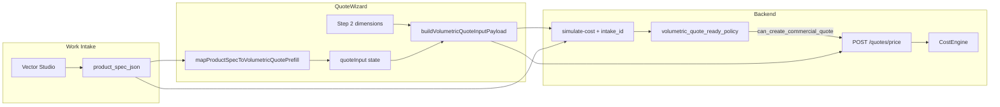

# Template-Specific Form Architecture — Audit & Proposal

**Date:** 2026-06-07  
**Scope:** Work Intake + QuoteWizard form surfaces for ProductSystem / WorkOS  
**Mode:** Audit + proposal only — **no runtime changes** in this task  
**Active template reference:** `TPL-VOLUMETRIC-LETTERS` (process maturity example, not universal form shape)

**Related docs:**

- `docs/architecture/TPL_VOLUMETRIC_LETTERS_CURRENT_STATE.md`
- `docs/architecture/PRODUCTSYSTEM_TEMPLATE_ONBOARDING_PLAYBOOK.md` — §2, §14–§16
- `docs/architecture/TPL_VOLUMETRIC_LETTERS_INPUT_CONTRACT_AUDIT.md`

---

## 1. Purpose

This document audits how Work Intake and QuoteWizard currently mix generic request capture, Product 001 / volumetric-specific fields, vector readiness, and costing `quote_input`. It proposes a **template-specific form contract** so each ProductSystem template can ship its own intake form, quote form, and field ownership — without forcing future products (business cards, exhibition systems, simple print, etc.) into a volumetric-letters-shaped UI.

**Goals:**

1. Explain what is generic vs family-generic vs template-specific today.
2. Classify every major volumetric field by ownership (intake / quote / production / readiness / internal).
3. Propose UI structure, registry architecture, dossier extension, and staged migration.
4. Define PASS/FAIL criteria for template form readiness.

**Out of scope (this task):** runtime refactor, pricing, CostEngine, quote/order creation, copying volumetric rules into universal forms.

**Update 2026-06-07:** `TPL-VOLUMETRIC-LETTERS` intake form **v1** implemented in `Product001IntakeSpecEditor.tsx` — 10 numbered sections, field tags, geometry block, integrated quote-prep panel. JSON contract unchanged; see `TPL_VOLUMETRIC_LETTERS_CURRENT_STATE.md` §Form v1.

---

## 2. Problem observed

The current operator experience blends several concerns into one visual flow:

| Concern | Where it appears today | Risk |
|---------|------------------------|------|
| Generic customer request | `IntakeDetail`, `NewIntakeDialog` | OK as base layer |
| Product family selection | `product_family` string, mock `getTemplateByFamilyId` | Family ≠ template; weak binding |
| **Product 001 volumetric spec** | `Product001IntakeSpecEditor` gated by `isLitereVolumetriceFamily()` | Named/labeled as Product 001, not `template_code` |
| Vector / readiness | Vector Studio inside intake spec editor | Operators may think mapping fills geometry |
| Costing `quote_input` | QuoteWizard Step 3 (`VOLUMETRIC_QUOTE_INPUT_FIELDS`) | Duplicates many intake fields |
| Final commercial gate | QuoteWizard Step 4 (`can_create_commercial_quote`) | Separated for volumetric only |
| Archived template fields | `ACP_LIGHT_ROUTED_FIELDS` still in `QuoteWizard.tsx` | Dead path if template archived |

**Core architectural gap:** There is no **template form registry** or dossier `intake_form_schema_json` / `quote_form_schema_json`. The volumetric form is wired by **product family string** (`litere_volumetrice`) and hardcoded file names (`Product001IntakeSpecEditor`, `intakeProductSpec.ts` as global type).

**Operator confusion hotspots:**

1. **Same business option in two places** — e.g. `face_finish_type`, `mounting_system`, `back_bevel_enabled`, `paint_tube_count` in intake and again in QuoteWizard.
2. **Dimensions split across steps** — intake `width_mm` / `height_mm` / `return_depth_mm` vs QuoteWizard Step 2 `user_config.dimensions` vs Step 3 `return_depth_mm` in `quote_input`.
3. **Geometry ownership unclear** — intake footer says geometry goes to QuoteWizard; intake still exposes `letter_face_area_m2`, `letter_perimeter_m`, `letter_count` keys in validator/types but not prominently in UI; vector mapping does not auto-fill them.
4. **Product 001 label** — implies default product model for all intake, not one template package.
5. **Simulate vs commercial quote** — only volumetric uses `simulate-cost` + separate create button; other templates still use direct `POST /price` on Step 4.

---

## 3. Why one universal form will fail

Future ProductSystem templates require **different form shapes**, not just extra optional fields:

| Product type | Typical form structure | Volumetric overlap |
|--------------|------------------------|-------------------|
| Business cards / flyers | format, run size, paper, gsm, sides, colors, finishing | None — no vector gate, no letter perimeter |
| Exhibition systems | system type, modules, stand dims, panels, logistics | Partial dims only |
| Illuminated signs (non-volumetric) | face material, illumination, mounting, RAL | Some visual overlap; different costing keys |
| Roll-ups / banners | width, height, material, cassette | Dimensions only |
| TPL-VOLUMETRIC-LETTERS | vector studio, Oracal, CNC bevel, PSU, premount bars | Full custom form |

**Anti-patterns to avoid:**

- One `IntakeProductSpec` type growing unbounded with every template's fields.
- `Product001IntakeSpecEditor` becoming the default intake form for new templates.
- QuoteWizard `fieldsForTemplate()` if/else chain without dossier-driven contract.
- Assuming all products need vector/SVG, RAL, Oracal, CNC, mounting bars, or LED PSU fields.

**Owner position (aligned with playbook §2):** A mature template package includes its own Work Intake form, QuoteWizard form, `quote_input` contract, readiness mapping, dossier, task rules, and output blocks — not a shared monolith.

---

## 4. Current form surfaces

### 4.1 Work Intake base form

**Pages:** `IntakeDetail.tsx`, `NewIntakeDialog.tsx`

**Generic / request-level fields (all families):**

| Area | Fields | Storage |
|------|--------|---------|
| Client | client name, CUI/fiscal lookup, contact | intake entity + identity section |
| Request | status, source/channel, priority | intake |
| Product selection | `product_family` (family_id string) | intake |
| Free text | description, dimensions (unstructured string), quantity | intake |
| Logistics | delivery_type | intake |
| Notes | general notes | intake |
| Attachments | (context-dependent) | intake |
| Site audit | address, photos, power, foundation (totem-specific branches) | local/audit state |

**Where product-specific form begins:**

- `NewIntakeDialog`: after family select, if `isLitereVolumetriceFamily(family_id)` → embeds `Product001IntakeSpecEditor` draft → saved as `product_spec_json`.
- `IntakeDetail`: same gate → `Product001IntakeSpecEditor` + "Calcul preliminar ofertă" panel → navigates to QuoteWizard with `TPL_VOLUMETRIC_LETTERS`.

**Gap:** Template selection is indirect (family → mock template assist / hardcoded `TPL_VOLUMETRIC_LETTERS` on quote button). No `template_code` on intake row drives which spec form renders.

### 4.2 Product 001 / volumetric product spec form

**Component:** `Product001IntakeSpecEditor.tsx`  
**Types / validation:** `intakeProductSpec.ts`, `intakeVolumetricSpec.ts`, `backend/validators/intake_product_spec.py`  
**Persistence:** `intake_requests.product_spec_json`

| Section | Fields | Role |
|---------|--------|------|
| Text / identitate | `text`, `font`, `indoor_outdoor` | Production / capture |
| Dimensiuni | `width_mm`, `height_mm`/`letter_height_mm`, `return_depth_mm`/`depth_mm`, `illumination_type` | Early dims; may prefill wizard |
| CNC / spate | `back_bevel_enabled`, `backing_chamfer`, `face_miter_chamfer` | Business option → quote |
| Finisaj față | `face_finish_type`, `volume_finish`, Oracal metadata | Business + production metadata |
| Vopsea / RAL | `paint_ral_*`, `paint_finish`, `paint_tube_count` | Production metadata + optional prefill |
| Iluminare | `selected_psu_watts`, `lighting_notes` | Quote prefill + production |
| Montaj | `mounting_system`, `mounting_template_enabled`, bar fields, `mounting_notes` | Business option → quote |
| Vector Studio | vector file metadata, `svg_layer_mappings`, manual review, analysis summary | Readiness (not geometry) |
| Note producție | `notes` | Production metadata |

**Explicit UX rule in UI:** geometry metrics (mp, perimeter, letter count) are **not invented** in intake; footer points operators to QuoteWizard.

**Not shown in intake UI but allowed in schema:** `letter_face_area_m2`, `letter_perimeter_m`, `letter_count` (optional explicit entry).

### 4.3 Quote form (volumetric workspace vs generic wizard)

**Volumetric (`TPL-VOLUMETRIC-LETTERS`):** `VolumetricLettersQuoteFlow.tsx` — method-first workspace inside WorkOS shell. Routed when `template_code === TPL-VOLUMETRIC-LETTERS` (`QuoteWizard` early delegate; `/quotes` full workspace).

**Generic (all other templates):** `QuoteWizard.tsx` modal — inline `ACP_LIGHT_ROUTED_FIELDS`, etc.

**Volumetric field contract:** still `VOLUMETRIC_QUOTE_INPUT_FIELDS` from `volumetricQuoteInput.ts`; effective state in `volumetricQuoteFlowState.ts` (user edit > intake > defaults).

| Surface | Content | Volumetric-specific |
|---------|---------|---------------------|
| Method cards | `vector_first` / `manual_geometry` / `quick_estimate` | Primary UX — not generic wizard steps |
| Geometry | `width_mm`, `height_mm`, `depth_mm` + letter metrics | Active state from intake — not banner-only |
| Cost options | Collapsed details | RAL, tubes, PSU, montaj, Forex |
| Simulate / gate | Right rail + lower panel | `simulate-cost` then `can_create_commercial_quote` |

**Readiness / gate:** `simulationResult.readiness.quote_gate` → `simulate_ready`, `can_create_commercial_quote`; blocker panel via `volumetricQuoteReady.ts`.

**Intake bridge:** `mapProductSpecToVolumetricQuotePrefill` → `buildInitialVolumetricQuoteFlowState` (replaces banner-only prefill bug).

### 4.4 Shared / generic fields (today)

| Field group | Truly generic? | Notes |
|-------------|----------------|-------|
| Client name | Yes | All quotes |
| Request status, channel, priority, notes | Yes | Intake only |
| Attachments | Yes | Intake |
| `product_family` / template selection | Generic **mechanism**, not generic **fields** | Should evolve to `template_code` |
| quantity | Mostly generic | Quote `user_config` |
| width / height / depth | **Product-family generic** | Many signage products; not all print products |
| Margin, VAT, discount | Yes | Quote pricing layer |

### 4.5 Volumetric-specific fields (must not become global defaults)

| Field | Why template-specific |
|-------|----------------------|
| `letter_count`, `letter_perimeter_m`, `letter_face_area_m2` | Letter geometry costing |
| `return_depth_mm` (30/60/80/100 profile tiers) | Volumetric lateral profile |
| `back_bevel_enabled` | Volumetric CNC back passes |
| `face_finish_type`, Oracal metadata | Volumetric face finish pricing |
| `paint_ral_*`, `paint_tube_count` | Volumetric whole-tube paint |
| `selected_psu_watts`, `led_module_count` | Illuminated letters LED |
| `mounting_bar_profile`, `mounting_system` steel/alu bars | Volumetric premount |
| `svg_layer_mappings`, vector analysis fields | Vector gate for this template |
| `vector_manual_review_approved` | This template's file policy |
| `volume_finish`, `face_miter_chamfer` | Volumetric production paths |

### 4.6 Duplications (intake ↔ QuoteWizard)

| Intake key | QuoteWizard key | Same name? | Prefill? | Notes |
|------------|-----------------|------------|----------|-------|
| `width_mm` | Step 2 `widthMm` + payload `width_mm` | Partial | Optional | Step 2 not auto-prefilled from intake except `return_depth_mm` → `depthMm` |
| `height_mm` | Step 2 `heightMm` | Partial | Via prefill map to quote_input only | Step 2 defaults 2000 |
| `return_depth_mm` | Step 2 `depthMm` + Step 3 `return_depth_mm` | Split | Yes | Two UX locations for depth |
| `face_finish_type` | `face_finish_type` | Yes | Yes | Duplicated editing |
| `mounting_system` | `mounting_system` | Yes | Yes | Duplicated |
| `back_bevel_enabled` | `back_bevel_enabled` | Yes | Yes | Duplicated |
| `mounting_template_enabled` / area | same | Yes | Yes | Duplicated |
| Bar profile/count/length | same | Yes | Yes | Duplicated |
| `paint_tube_count` | `paint_tube_count` | Yes | Yes | Intake "estimate"; wizard **required** for cost |
| `selected_psu_watts` | `selected_psu_watts` | Yes | Yes | Duplicated |
| Oracal / RAL metadata | metadata keys in payload | Yes | Yes | Production metadata duplicated |
| `letter_*` geometry | Step 3 | Yes | Only if explicitly in intake | Usually wizard-only |
| Vector fields | readiness via `intake_id` | N/A | N/A | Not in wizard form; gate only |

### 4.7 Confusing UX (summary)

Operators may not know whether they are editing:

- **Request context** — top of IntakeDetail (client, delivery, audit)
- **Product spec (capture)** — purple Product 001 panel
- **Quote input (costing)** — QuoteWizard Step 3
- **Vector readiness** — Vector Studio (file ≠ geometry)
- **Final quote gate** — QuoteWizard Step 4 after simulate
- **Production metadata** — RAL/Oracal in intake (labeled production) but also block commercial quote if missing

### 4.8 Data flow (current)



| Transition | Rule |
|------------|------|
| Intake → Wizard | Safe prefill only; no invented geometry |
| Wizard → CostEngine | `quote_input` + `user_config.dimensions` |
| Intake → Readiness | `intake_id` loads `product_spec_json` for vector gate |
| Vector Studio → Intake | Metadata + mappings; **not** auto geometry |
| Gate → Quote create | `can_create_commercial_quote=false` disables button + HTTP 422 on price |

---

## 5. Field classification table (TPL-VOLUMETRIC-LETTERS)

Legend:

- **Capture now:** Intake / Wizard / Both / Backend-generated
- **Should live:** Target ownership after architecture maturity
- **Prefill QW:** Should prefill QuoteWizard from intake?
- **Price:** Affects CostEngine total?
- **Readiness:** Affects `can_create_commercial_quote` or vector gate?
- **Production only:** No price effect (may still be soft blocker)
- **Template-specific:** Must not appear in default universal form?
- **Future default:** Should future templates inherit without explicit contract?

| Field | Capture now | Should live | Prefill QW | Price | Readiness | Production only | Template-specific | Future default |
|-------|-------------|-------------|------------|-------|-----------|-----------------|-------------------|----------------|
| `width_mm` | Intake + QW Step 2 | Both (intake early, quote confirm) | Yes | Indirect (bar length) | If missing for bars | No | No (family-generic dim) | Optional section |
| `height_mm` | Intake + QW Step 2 | Both | Partial | No direct | No | No | No | Optional section |
| `depth_mm` | QW Step 2 | Quote confirm | From `return_depth_mm` | No direct | No | No | Volumetric alias | No |
| `return_depth_mm` | Intake + QW Step 3 | Quote input (intake early) | Yes | Yes (profile ml) | If missing | No | **Yes** | No |
| `letter_face_area_m2` | QW Step 3 (intake optional) | **Quote input** | Only if explicit in intake | Yes | Yes (geometry gate) | No | **Yes** | No |
| `letter_perimeter_m` | QW Step 3 | **Quote input** | Only if explicit | Yes | Yes | No | **Yes** | No |
| `letter_count` | QW Step 3 | **Quote input** | Only if explicit | Yes | Yes | No | **Yes** | No |
| `face_finish_type` | Both | Intake choice → quote confirm | Yes | Yes | Soft metadata | No | **Yes** | No |
| `face_vinyl_color_code` | Both (metadata) | Intake production → quote carry | Yes | No | **Yes** (Oracal gate) | Mostly | **Yes** | No |
| `face_vinyl_color_name` | Both | Production metadata | Yes | No | No | **Yes** | **Yes** | No |
| `face_vinyl_roll_width_mm` | Both | Production metadata | Yes | No | **Yes** (Oracal) | **Yes** | **Yes** | No |
| `face_vinyl_finish` | Both | Production metadata | Yes | No | No | **Yes** | **Yes** | No |
| `paint_ral_code` | Both | Production metadata | Yes | No | **Yes** if tubes > 0 | **Yes** | **Yes** | No |
| `paint_ral_name` | Both | Production metadata | Yes | No | No | **Yes** | **Yes** | No |
| `paint_finish` | Both | Production metadata | Yes | No | No | **Yes** | **Yes** | No |
| `paint_tube_count` | Both | **Quote input** (required cost) | Yes | **Yes** | If missing (cost) | No | **Yes** | No |
| `selected_psu_watts` | Both | Quote input | Yes | Yes | If missing | No | **Yes** | No |
| `back_bevel_enabled` | Both | Intake choice → quote | Yes | Yes | No | No | **Yes** | No |
| `mounting_system` | Both | Intake choice → quote | Yes | Partial | ACM capture blocker | No | **Yes** | No |
| `mounting_template_enabled` | Both | Quote input | Yes | Yes (conditional) | Conditional | No | **Yes** | No |
| `mounting_template_area_m2` | Both | Quote input | Yes | Yes | If template on | No | **Yes** | No |
| `mounting_bar_profile` | Both | Quote input | Yes | Yes (if priced) | Unknown profile blocker | No | **Yes** | No |
| `mounting_bar_count` | Both | Quote input | Yes | Yes (derived length) | No | No | **Yes** | No |
| `mounting_bar_length_m` | Both | Quote input override | Yes | Yes | No | No | **Yes** | No |
| `vector_file_name` | Intake | Intake / readiness | No | No | **Yes** (file gate) | No | **Yes** | No |
| `vector_file_type` | Intake | Intake / readiness | No | No | Yes | No | **Yes** | No |
| `vector_analysis_status` | Intake | Readiness / internal | No | No | Yes | No | **Yes** | No |
| `vector_parse_status` | Intake (generated) | Internal / readiness | No | No | Yes | No | **Yes** | No |
| `svg_layer_mappings` | Intake | Intake / readiness | No | No | **Yes** (mapping gate) | No | **Yes** | No |
| `vector_detected_layers_summary` | Intake (generated) | Internal | No | No | No | **Yes** | **Yes** | No |
| `vector_manual_review_approved` | Intake | Readiness | No | No | **Yes** | No | **Yes** | No |
| `vector_manual_review_notes` | Intake | Production metadata | No | No | No | **Yes** | **Yes** | No |
| Readiness blockers (codes) | Backend | Readiness policy | N/A | N/A | **Yes** | N/A | Per template | No |
| `can_create_commercial_quote` | Backend → QW Step 4 | Gate UI | N/A | N/A | **Yes** | N/A | Per template | No |
| `simulate_ready` | Backend → QW Step 4 | Gate UI | N/A | N/A | Partial | N/A | Per template | No |

**Deprecated / duplicated / confusing:**

| Item | Classification |
|------|----------------|
| `Product001IntakeSpecEditor` name | Deprecated naming — volumetric-specific |
| `IntakeProductSpec` global type | Confusing — volumetric fields in universal type name |
| `backing_chamfer` vs `back_bevel_enabled` | Duplicated legacy + canonical |
| `face_finish` vs `face_finish_type` | Duplicated legacy + canonical |
| `mounting_type` + `premounting_type` vs `mounting_system` | Duplicated legacy + canonical |
| `letter_height_mm` vs `height_mm` | Duplicated aliases |
| `ral_color` vs `paint_ral_code` | Duplicated |
| Step 2 vs Step 3 dimensions | Confusing split |
| `intakeProductSpec.ts` comment "Product 001" | Implies universal model |

---

## 6. Generic vs family-generic vs template-specific

### 6.1 Truly generic (all templates)

- Client / request identity (name, contact, channel, priority, status)
- General attachments and free-text notes
- Delivery / logistics preferences (where applicable)
- Template / product selection entry point
- Quote pricing controls (margin, VAT, discount) — commercial layer
- Simulate vs final quote **pattern** (process) — not volumetric field set

### 6.2 Product-family generic (shared UI sections possible)

- Physical dimensions (`width`, `height`, `depth`) — **when product is dimension-driven**
- Quantity / run size
- Indoor vs outdoor
- Installation location notes
- Delivery deadline

Use **hybrid** forms: shared "Dimensions" section + template-specific options.

### 6.3 Template-specific (TPL-VOLUMETRIC-LETTERS example)

- Letter geometry metrics and LED/PSU
- Oracal / RAL / paint tubes / CNC bevel
- Premount bars and Forex template
- Vector Studio + layer mapping + manual review
- Volumetric production notes (`volume_finish`, `face_miter_chamfer`)

Each new `template_code` defines its own set. **No default inheritance.**

---

## 7. Proposed Work Intake UI

### Structure

```
┌─────────────────────────────────────────────────────────┐
│ 1. REQUEST HEADER (generic)                             │
│    client · title · status · source · attachments · notes│
├─────────────────────────────────────────────────────────┤
│ 2. PRODUCT / TEMPLATE CARD (generic shell)              │
│    template_code · family · form_mode badge             │
│    readiness summary · link to dossier                  │
├─────────────────────────────────────────────────────────┤
│ 3. TEMPLATE-SPECIFIC PRODUCT SPEC (from registry)      │
│    [TPL-VOLUMETRIC-LETTERS → VolumetricLettersIntakeForm]│
│    [TPL-BUSINESS-CARDS → schema-driven sections]        │
├─────────────────────────────────────────────────────────┤
│ 4. QUOTE PREPARATION PANEL (generic shell)              │
│    simulate-ready? · missing for simulate · missing quote│
│    [Continuă în QuoteWizard] + explanation              │
└─────────────────────────────────────────────────────────┘
```

### TPL-VOLUMETRIC-LETTERS sections (unchanged content, clearer ownership)

1. Basic dimensions (optional early)
2. Visual / face finish
3. Paint / RAL (production metadata emphasis)
4. Lighting
5. Mounting / support
6. Vector Studio (readiness)
7. Production notes

### Copy recommendations (quick wins — docs only until approved)

- Label: **"Formular specific template-ului: Litere volumetrice luminoase"**
- Note: **"Câmpurile diferă în funcție de template."**
- Quote panel: **"Valorile completate aici pot precompleta oferta; oferta finală are propriul gate de validare."**

---

## 8. Proposed QuoteWizard UI

### Structure

```
Step 1 — Template confirmation (template_code locked or selected)
Step 2 — Prefilled intake review (read-only summary + gaps)
Step 3 — Missing quote input / geometry (template field contract)
Step 4 — Options affecting cost (if not merged into 3)
Step 5 — Preliminary simulation (volumetric pattern; optional per template)
Step 6 — Commercial quote readiness gate + create (disabled/enabled)
```

### Visual separation (avoid mixed modes)

| Zone | Style / label |
|------|----------------|
| Request context | Gray banner — intake id, client |
| Product spec review | Purple — "Din cerere (nu editabil aici)" |
| Quote input | Blue — "Parametri costing" |
| Vector readiness | Amber — blockers from intake |
| Final gate | Red/green — `can_create_commercial_quote` |

### Per-template quote forms (examples)

| Template | Form shape |
|----------|------------|
| Business cards | format, qty, paper, gsm, sides, colors, finishing, deadline |
| Flyers | format, qty, paper, sides, folding, finishing |
| Exhibition system | system, modules, dims, panels, accessories, lighting, transport |
| Volumetric letters | geometry, vector gate (from intake), finish, LED, mounting |

---

## 9. Template form strategy modes

Registry field: `form_mode`

| Mode | When to use | Examples |
|------|-------------|----------|
| `custom_component` | Rich interaction, file workflows, multi-section logic | TPL-VOLUMETRIC-LETTERS, exhibition systems, modular stands |
| `schema_driven` | Simple products, mostly enums/numbers | Business cards, flyers, stickers |
| `hybrid` | Shared generic sections + custom tail | Roll-up, banner, ACM panel |

**Rule:** Do not pick one mode globally. Each template declares its mode in dossier / ProductSystem metadata.

---

## 10. Dossier-driven form contract

Proposed optional dossier fields (future schema extension):

| Field | Purpose |
|-------|---------|
| `form_mode` | `custom_component` \| `schema_driven` \| `hybrid` |
| `intake_form_schema_json` | Sections, fields, labels, help, conditionals, defaults |
| `quote_form_schema_json` | QuoteWizard field contract mirror of `quote_input` audit |
| `field_ownership_json` | Per key: `intake` \| `quote` \| `production_metadata` \| `readiness` \| `internal` |
| `readiness_field_policy_json` | Which fields feed which blocker codes |
| `production_metadata_schema_json` | Fields required for production output blocks, not costing |

### Field ownership example (volumetric excerpt)

```json
{
  "letter_perimeter_m": { "owner": "quote", "prefill_from_intake": "explicit_only", "affects_price": true },
  "paint_ral_code": { "owner": "production_metadata", "prefill_from_intake": true, "affects_readiness": true },
  "svg_layer_mappings": { "owner": "readiness", "template_specific": true }
}
```

---

## 11. TemplateFormRegistry proposal

### Frontend

**File:** `frontend/src/features/product-templates/registry.ts`

```typescript
// Illustrative — not implemented
export const TEMPLATE_FORM_REGISTRY = {
  "TPL-VOLUMETRIC-LETTERS": {
    formMode: "custom_component",
    intake: () => import("./volumetric-letters/VolumetricLettersIntakeForm"),
    quoteFields: () => import("./volumetric-letters/volumetricLettersQuoteFields"),
  },
  "TPL-BUSINESS-CARDS": {
    formMode: "schema_driven",
    intakeSchema: () => import("./business-cards/businessCardsIntakeSchema"),
    quoteFields: () => import("./business-cards/businessCardsQuoteFields"),
  },
};
```

**Work Intake routing:** `template_code` (or resolved template from family) → registry → component/schema renderer.

**QuoteWizard routing:** Replace `fieldsForTemplate()` if/else with registry lookup.

### Avoid

- One `volumetricQuoteInput.ts`-sized file for all products
- Family string `isLitereVolumetriceFamily()` as long-term gate

---

## 12. Backend validation proposal

### Dispatcher pattern

```python
validate_product_spec(template_code: str, product_spec_json: dict) -> ValidationResult
validate_quote_input(template_code: str, quote_input: dict) -> ValidationResult
```

### Per-template modules (proposed paths)

| Template | Spec validator | Quote input validator |
|----------|----------------|----------------------|
| TPL-VOLUMETRIC-LETTERS | `validators/templates/volumetric_letters_spec.py` | `validators/templates/volumetric_letters_quote_input.py` |
| TPL-BUSINESS-CARDS | `validators/templates/business_cards_spec.py` | `validators/templates/business_cards_quote_input.py` |

**Today:** `intake_product_spec.py` ALLOWED_KEYS is volumetric-heavy — acceptable for single active template but **must not** grow for every future product without split.

### Readiness

Keep per-template policy modules (pattern: `volumetric_quote_ready_policy.py`, `volumetric_vector_readiness_policy.py`).

---

## 13. Quick wins / medium / later

### Quick wins (documentation + micro-copy; no refactor until approved)

- [ ] Document `Product001IntakeSpecEditor` as **volumetric-specific** (this doc + current-state note)
- [ ] UI label: "Formular specific template-ului: Litere volumetrice luminoase"
- [ ] Section separators: Cerere · Specificație produs · Date pentru ofertare · Readiness ofertă
- [ ] Note: "Câmpurile diferă în funcție de template."
- [ ] Improve QuoteWizard intake banner copy (prefill vs final gate)

### Medium build

- [ ] `TemplateFormRegistry` + move volumetric form to `features/product-templates/volumetric-letters/`
- [ ] Rename `Product001IntakeSpecEditor` → `VolumetricLettersIntakeForm` (behavior identical)
- [ ] Gate intake form by `template_code` not only family string
- [ ] QuoteWizard field contract from registry
- [ ] Dossier seed fields: `form_mode`, `field_ownership_json` (read-only metadata first)

### Later

- [ ] Schema-driven renderer for print products
- [ ] Template form builder in ProductSystem admin
- [ ] Form versioning per template
- [ ] Per-template form preview in ProductSystem UI

### Staged migration plan

| Stage | Action |
|-------|--------|
| **1** (this task) | Document architecture, classify fields, label Product001 as volumetric-specific |
| **2** | Registry + rename/move volumetric module; identical behavior |
| **3** | Schema-driven forms for simple print templates |
| **4** | Extend dossier with form contract JSON |
| **5** | Onboarding playbook requires form contract PASS before activation |

---

## 14. Rules for future templates

1. **Dossier + input contract audit before** QuoteWizard / CostEngine / quote gate implementation.
2. **Do not** add fields to `IntakeProductSpec` / `intake_product_spec.py` ALLOWED_KEYS without `template_code` ownership.
3. **Do not** reuse `Product001IntakeSpecEditor` for new templates — register new form or schema.
4. **Separate** intake capture, quote input, production metadata, readiness in `field_ownership_json`.
5. **Prefill rules** must be documented per key (`safe`, `explicit_only`, `never`).
6. **Vector/file gates** are optional per template — not global.
7. **Simulate vs commercial quote** pattern is reusable; blocker **lists** are not.
8. **PASS/FAIL** onboarding must include form contract smoke (see §15).

---

## 15. PASS/FAIL criteria for template form readiness

### PASS (template may activate for quote flows)

- [ ] `template_code` has registered `form_mode`
- [ ] Work Intake renders **only** that template's intake form when selected
- [ ] QuoteWizard loads **only** that template's quote field contract
- [ ] `field_ownership_json` (or audit doc) lists every key
- [ ] Prefill map documented and tested (no invented geometry unless template allows)
- [ ] Readiness policy linked to correct fields (vector, metadata, geometry)
- [ ] `simulate_ready` vs `can_create_commercial_quote` documented
- [ ] No volumetric-only fields leak into other templates' UI
- [ ] Backend validators scoped per template
- [ ] Smoke: intake save → wizard open → simulate → gate behavior — **no quote unless approved**

### FAIL

- New template uses `Product001IntakeSpecEditor` or global `IntakeProductSpec` without split
- QuoteWizard hardcodes another template's fields in shared arrays without registry
- Universal form shows Oracal/RAL/CNC/vector fields by default
- Family string gates form without `template_code` contract
- Missing quote form while CostEngine expects `quote_input` keys
- Operators cannot tell intake vs quote vs readiness sections apart

---

## 16. Architecture principles (summary)

### A. Work Intake base form

**Purpose:** Customer request + template entry.

**Contains:** client, request meta, attachments, notes, template selection.  
**Excludes:** CostEngine internals, unrelated template fields, quote-only geometry unless prefilled by policy.

### B. Template-specific Work Intake form

**Purpose:** Early product decisions, production metadata, file requirements, safe prefill source.

### C. QuoteWizard template-specific form

**Purpose:** Final `quote_input` for simulate and commercial quote.  
**Not** a full copy of intake — review + gap-fill + costing fields.

### D. Dossier-driven form contract

Single source for schemas, ownership, readiness mapping, labels.

### E. Template package rule

Incomplete without: intake form + quote form + readiness mapping + task rules + output blocks + tests.

### F. Three form strategies

`custom_component` | `schema_driven` | `hybrid` — per template, not global.

---

## 17. Answers to audit questions

| # | Question | Answer |
|---|----------|--------|
| 1 | What is truly generic? | Client/request, attachments, notes, template selection shell, pricing margin/VAT |
| 2 | What is product-family generic? | Dimensions, quantity, indoor/outdoor, delivery — **optional shared sections** |
| 3 | What is template-specific? | All volumetric letter, vector, Oracal, RAL, PSU, bar, CNC fields — and each future template's own set |
| 4 | How does a template ship its own forms? | Registry + dossier `intake_form_schema_json` / `quote_form_schema_json` + per-template validators |
| 5 | How to avoid volumetric-shaped default? | Never route by `Product001` / family alone; require `template_code` form contract; schema-driven print templates |

---

## 18. PASS/FAIL for this audit task

| Criterion | Status |
|-----------|--------|
| Mixed-form issue explained | **PASS** |
| Future diverse products considered | **PASS** |
| Field categories classified | **PASS** |
| Template-specific principle documented | **PASS** |
| No runtime behavior changes | **PASS** (docs only) |
| Implementation path clear | **PASS** |

**Overall: PASS**

---

*Maintained with `TPL_VOLUMETRIC_LETTERS_CURRENT_STATE.md`. Update when Stage 2+ registry work lands.*
