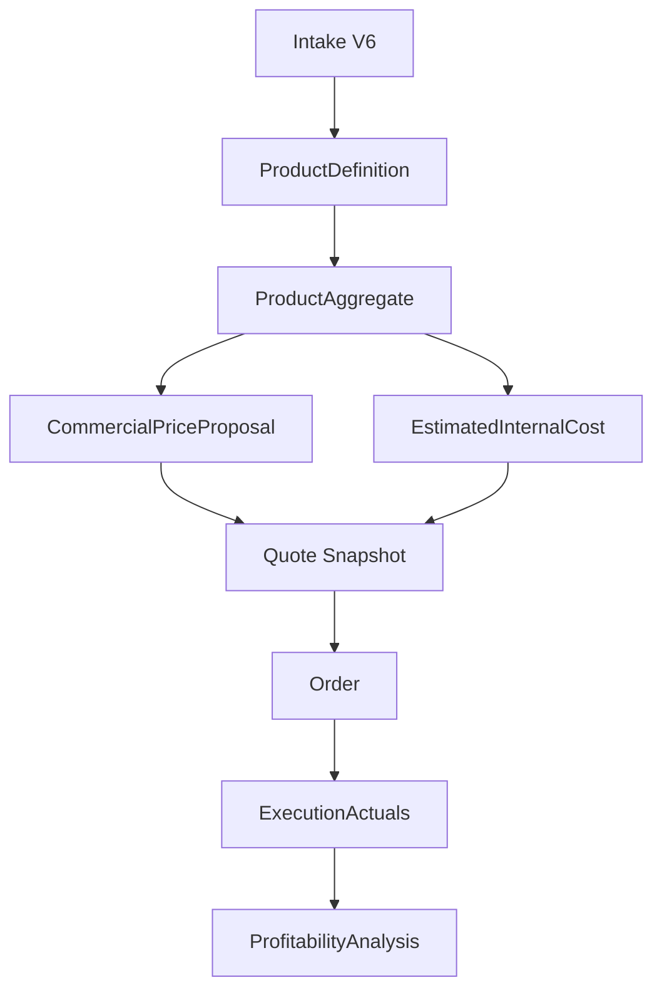

# WORKOS_REALIGNMENT_MASTER_PLAN

**Version:** 1.0.0  
**Status:** Start documentation — foundation for Steps 7G–12 (no implementation)  
**Date:** 2026-06-07  
**Repo:** `C:\Users\offic\Desktop\workos-active`

**Related:**
- `docs/audits/WORKOS_FULL_SYSTEM_REALITY_AUDIT.md`
- `docs/architecture/WORKOS_FULL_SYSTEM_REALITY_AUDIT_ACCEPTANCE.md`
- `docs/architecture/WORKOS_COMMERCIAL_PRICING_VS_INTERNAL_COST_CONTRACT.md`

---

## 1. Scopul documentului

### De ce există

WorkOS a trecut prin audit complet (**Full System Reality Audit**). Verdictul **`HIGH_RISK_DEVIATED`** este acceptat. Acest document este **punctul de start** pentru tot ce construim de acum înainte — nu o teorie abstractă, ci un plan aplicat pentru pașii **7G → 12**.

### Ce problemă rezolvă

| Problemă | Efect |
|----------|--------|
| Minute / tarif oră tratate ca preț comercial | Clientul pare să plătească timpul nostru, nu produsul |
| `/price` amestecă cost intern + preț comercial | O singură cifră „finală” fără separare, fără audit comercial |
| Pricing Registry unificat | Material + workcenter + markup = „hub ofertare” confuz |
| Lipsă `CommercialPriceProposal` | Nu există model runtime pentru mp/ml/buc/set/minim |
| Lipsă `ProfitabilityAnalysis` | Nu putem învăța din execuție fără a distorsiona oferta |

### Ce blocăm

- Extinderea path-urilor **mixed-risk** (§8) fără realiniere.
- Reprice quote 4, apply 7E.2, rewrite Cost Engine / QuoteOrchestrator „pe loc”.
- UI redesign, Intake V6 redesign, DB reset/reseed ca soluție implicită.
- Orice implementare **fără GO explicit owner**.

### Ce vrem să construim

Un flux canonic:

**Produs (Intake V6) → structură tehnică (Aggregate) → propunere comercială → cost intern estimativ → snapshot ofertă → comandă → actuals execuție → analiză profitabilitate.**

### Ce nu mai vrem să repetăm

- `total_internal_cost × margin` ca singură regulă universală de preț client.
- `rate_per_hour` / `per_hour` ca basis comercial sau blocker de ofertă.
- Preview Intake / Cost BOM / `/price` prezentate ca „oferta oficială” când sunt cost intern sau cost-plus.
- Mock/demo/legacy UI tratate ca operațional fără etichetă.
- Fix-uri automate după audit fără clasificare risc și pas roadmap.

**Principiu central:** WorkOS **nu** trebuie să mai devieze spre „minute = preț”. WorkOS se bazează pe **produs**, **reguli comerciale** și **realitate operațională**.

---

## 2. Verdictul auditului acceptat

| Aspect | Status |
|--------|--------|
| **Verdict global** | **`HIGH_RISK_DEVIATED`** — acceptat |
| **Product / execution foundation** | **Bună** — Intake V6, ProductDefinition/Aggregate, ExecutionActuals, HR intern |
| **Commercial pricing runtime** | **Deviat** — cost-plus, per_hour, registry amestecat |
| **CommercialPriceProposal** | **Lipsește** ca model runtime |
| **ProfitabilityAnalysis** | **Lipsește** |
| **Mixed-risk până la realiniere** | `/price`, Cost Engine (per_hour), QuoteOrchestrator (`_apply_commercial`), Pricing Registry ca hub ofertare |

Acceptarea formală: `WORKOS_FULL_SYSTEM_REALITY_AUDIT_ACCEPTANCE.md` (Step 7F.1).

---

## 3. Principiile ownerului

1. **Nimic comercial nu se calculează la oră.**
2. **Minutele** sunt doar ExecutionActuals / analytics / post-job / capacitate / statistică.
3. **Prețul comercial** este pe produs/soluție: mp, ml, buc, literă, set, minim lucrare, complexitate, material, grosime, sanfren, finisaj, urgență, valoare comercială.
4. **Costul intern estimativ nu este oferta finală** către client.
5. **Oferta finală (snapshot)** trebuie să conțină **comercial** și **cost intern estimativ** **separat**, side-by-side.
6. **Doar ownerul** decide dacă se modifică ceva — fără GO, fără implementare.
7. **Fără implementări automate pe loc** după audit — raportare + clasificare risc + pas următor recomandat.
8. **Fără reset DB / reseed** ca soluție implicită.
9. **Fără UI redesign** fără GO explicit și audit vizual dacă se atinge UI.
10. **Fără quote 4 reprice** până la noul traseu (7G → 8).

---

## 4. Modelul canonic dorit

```
Intake V6
    ↓
ProductDefinition
    ↓
ProductAggregate
    ↓
CommercialPriceProposal  ←── reguli comerciale (mp/ml/buc/set/…)
    ↓
EstimatedInternalCost    ←── materiale + ops non-orare + overhead
    ↓
Quote Snapshot           ←── commercial + internal + warnings (Step 8)
    ↓
Order
    ↓
ExecutionActuals         ←── minute reale, materiale, angajați
    ↓
ProfitabilityAnalysis    ←── quoted vs estimated vs actual
```

### Per nod

| Nod | Scop | Citește | Produce | NU are voie | Status actual |
|-----|------|---------|---------|-------------|---------------|
| **Intake V6** | Captură produs client | SVG, operator input, finish, LED, montaj | Workspace payload, quote_geometry, finish groups | Preț comercial oficial; ore×tarif | **GOOD** |
| **ProductDefinition** | Structură canonică produs | Workspace + template | ProductDefinition JSON | Preț client; write quote | **GOOD** |
| **ProductAggregate** | BOM tehnic expandat | Parent + dossier + module | Aggregate BOM structură | Preț comercial direct | **GOOD** |
| **CommercialPriceProposal** | Preț ofertat client | Aggregate + reguli comerciale + geometrie | Linii mp/ml/buc/set/minim, total comercial | Ore/minute; cost-plus obligatoriu | **MISSING** |
| **EstimatedInternalCost** | Cost intern înainte producție | Aggregate + inventory + reguli interne | Material + ops + overhead estimat | Dicta automat preț comercial; per_hour pre-quote | **DEVIATED** (amestecat în CE/`/price`) |
| **Quote Snapshot** | Ofertă înghețată | Commercial + Internal + owner decisions | Snapshot dual-field | Un singur total din cost×margin | **DEVIATED** |
| **Order** | Comandă acceptată | Quote snapshot | Order frozen | Recalcul comercial retroactiv | **PARTIAL** |
| **ExecutionActuals** | Realitate producție | Tasks, sessions, materials | Minute reale, consum observat | Modifică prețul ofertat acceptat | **GOOD** (hardening Step 9) |
| **ProfitabilityAnalysis** | Învățare post-job | Quote + estimated + actuals | Marjă reală, recomandări reguli | Rescrie oferta închisă | **MISSING** |

---

## 5. Separarea celor 4 lumi

### 5.1 CommercialPriceProposal

**Ce este:** Prețul **propus clientului** pentru produs/soluție — nu pentru timpul nostru.

| Aspect | Regulă |
|--------|--------|
| Sursă | Reguli comerciale + geometrie + config produs din Intake/Aggregate |
| Unități | mp, ml, buc, literă, set, minim lucrare, coeficient complexitate, urgență |
| Interzis | ore, minute, `rate_per_hour`, `total_cost × margin` ca singură formulă |
| Relație cu cost intern | Poate fi comparat pentru warning marjă — **nu** derivat obligatoriu |

**Exemple target (litere volumetrice):**

| Zonă | Regulă comercială |
|------|-------------------|
| CNC față/spate | lei/ml — variază: material, grosime, sanfren |
| Modelare cant aluminiu | lei/ml — adâncime/înălțime cant, profil, complexitate |
| Vopsire / finisaj | lei/m² sau minim lucrare |
| LED | lei/modul, lei/set sau mp luminat |
| Asamblare | lei/literă, lei/set sau inclus în pachet |
| Șablon montaj | lei/m² sau fix |
| Ambalare | fix / lucrare |
| Montaj șantier | fix / manual / separat / external (future) |

### 5.2 EstimatedInternalCost

**Ce este:** Estimare internă **înainte** de producție — pentru planificare și **confidence marjă**.

| Include | Exclude din pre-quote |
|---------|------------------------|
| Materiale, consumabile, pierderi | `per_hour` ca basis operație pre-ofertă |
| Operații estimate pe mp/ml/buc/fix | Minute estimate ca **input obligatoriu** preț comercial |
| Overhead configurabil | Transformare automată în preț client |

Poate genera **warnings** (marjă mică, cost incomplet) — **nu** blochează neapărat CommercialPriceProposal (vezi §10).

### 5.3 ExecutionActuals

**Ce este:** Realitatea din producție **după** acceptare / order / execuție.

| Include | Exclude |
|---------|---------|
| Task start / stop | Recalcul ofertă acceptată |
| Angajat, durată reală | Preț comercial inițial |
| Materiale observate / consum | — |

Surse: ExecutionReality, operator/tablet, Employee Mobile sessions.

### 5.4 ProfitabilityAnalysis

**Ce este:** Analiză **după** execuție — nu înainte de ofertă.

| Compară | Output |
|---------|--------|
| Preț ofertat (CommercialPriceProposal) | Marjă estimată vs reală |
| Cost estimat (EstimatedInternalCost) | Abatere timp, materiale |
| Cost real materiale + timp real + manoperă | Recomandări **viitoare** reguli comerciale (mp/ml/buc) |

**Nu** modifică retroactiv oferta acceptată.

---

## 6. Source of Truth Map

| Domeniu | Adevăr astăzi | Țintă |
|---------|---------------|-------|
| **Product truth** | Intake V6 workspace, ProductDefinition, ProductAggregate | Păstrat |
| **Material truth** | Inventory Material Registry (`unit_cost` achiziție) | Păstrat — separat de regulă comercială |
| **Commercial price truth** | ❌ **MISSING** — alias greșit: `QuotePrice.final` din cost-plus | **CommercialPriceProposal** Registry + Preview (7G) |
| **Estimated internal cost truth** | Aggregate Cost BOM + Cost Engine (mixed hourly) | CE realigned non-hourly (7H) |
| **Execution actuals truth** | ExecutionReality, task sessions, Employee Mobile, Operator/Tablet | Hardening (9) |
| **HR truth** | Employees, Attendance, Payments, Advances | Intern — never commercial price |
| **Profitability truth** | ❌ **MISSING** | ProfitabilityAnalysis (10) |
| **Governance truth** | `docs/architecture/*`, Settings/feature flags unde relevant | Extins cu acest master plan |

---

## 7. Ce păstrăm

| Asset | Notă |
|-------|------|
| Intake V6 flow | **Fără redesign** — SVG, Review, Confirm |
| SVG analyzer, layer roles | Product truth |
| finish_setup, quote_geometry, letter_group_finishes | Product truth |
| ProductDefinition, ProductAggregate | Structură tehnică |
| Mini-module registry | Modularitate |
| Aggregate Cost BOM preview | **Reinterpretat** = internal cost readiness (7D truth labels) |
| ExecutionReality, Employee Mobile | Actuals |
| Operator / Tablet | Task start/stop |
| HR / Pontaj / Plăți | Interne — nu confundate cu preț comercial |

---

## 8. Ce înghețăm până la realiniere

**`FROZEN_UNTIL_REALIGNED`** — nu extinde, nu „repară rapid”, fără GO owner + pas aliniat (7G+):

| Path / surface |
|----------------|
| `POST /api/v1/entities/quotes/price` |
| `POST /api/v1/entities/quotes/{id}/price` |
| `QuoteOrchestrator._apply_commercial` |
| Cost Engine **per_hour** path (pre-quote commercial use) |
| `workcenter_rates` as quote/commercial source |
| Pricing Registry as **unified quote calculation hub** |
| Intake V6 **live offer** as official quote |
| Settings CostEngine **hourly fallback** |
| Markup policies as **universal commercial model** |
| **Quote 4 reprice** |
| **Step 7E.2 apply** |

Documentare only — **nu dezactivăm cod** în acest document; înghețăm **intenția echipei și a agenților**.

---

## 9. Ce trebuie construit

### 9.1 Step 7G — CommercialPriceProposal (read-only)

| | |
|-|-|
| **Scop** | Model / schema / preview **separat** de `/price` |
| **Input** | Intake V6 workspace + ProductAggregate + reguli comerciale (inițial hardcoded/config read-only) |
| **Output** | Linii comerciale mp/ml/buc/set/minim + total + provenance |
| **Interzis** | DB writes quote; reprice; modificare `/price` |
| **GO required** | Da — owner |

### 9.2 Step 7H — EstimatedInternalCost non-hourly

| | |
|-|-|
| **Scop** | Separă cost intern de preț comercial în engine |
| **Acțiuni** | Elimină per_hour ca basis **pre-quote**; mp/ml/buc/set/fix |
| **Păstrează** | Time doar pentru actuals / capacity (non-blocking commercial) |
| **GO required** | Da |

### 9.3 Step 7I — Pricing Registry separation

| Tab / zonă țintă | Conținut |
|------------------|----------|
| Material Prices | Acquisition unit cost (internal material truth) |
| Commercial Price Rules | mp/ml/buc/set/minim/complexitate |
| Internal Cost Rules | Non-hourly ops |
| Runtime Analytics | Post-job, capacity |
| UI labels | „Cost intern estimativ” — **nu** „tarif client pe oră” |

### 9.4 Step 8 — Quote Snapshot dual

Snapshot conține:

- `commercial_price` (CommercialPriceProposal)
- `estimated_internal_cost` (EstimatedInternalCost)
- `margin_preview` / warnings
- `owner_decisions` / acknowledgements

**Nu:** `final = total_cost × margin` universal.

### 9.5 Step 9 — ExecutionActuals hardening

- Order → execution plan → task sessions
- Actual minutes, material observations, employee involvement
- Legătură clară order_id ↔ reality ↔ mobile sessions

### 9.6 Step 10 — ProfitabilityAnalysis

- Quoted vs estimated vs actual
- Real margin, time variance, material variance
- Recommendations for **future** commercial rules

### 9.7 Step 11 — UI labels / deprecation

**Nu redesign.** Doar claritate:

| Label | Pentru |
|-------|--------|
| mock / demo | DocumentCenter, ModuleChain events, Tablet help |
| read-only | Cost BOM preview, governance |
| internal estimate | Live calc Intake, BOM |
| commercial proposal | 7G preview |
| official quote | Snapshot post-Step 8 only |
| legacy | intake v3/v4 detail, IntakeDetail |

### 9.8 Step 12 — Dead pieces cleanup

- intake v3/v4/v5 routers
- legacy IntakeDetail path
- mock pages (DocumentCenter etc.)
- duplicate flows

**Doar după decizie owner** — nu automat.

---

## 10. Blocking rules noi

### Blochează CommercialPriceProposal

- Geometrie critică lipsă (ex. letter_count, suprafațe/perimetru unde regula cere)
- Material critic lipsă
- **Regulă comercială** lipsă pentru modul/linie activă
- Finish groups neconfirmate (când policy o cere)
- Configurație produs invalidă

### NU blochează CommercialPriceProposal

- Lipsă `rate_per_hour`
- Lipsă estimare minute
- Lipsă runtime actual (pre-producție)
- Lipsă employee hourly cost
- Lipsă ProfitabilityAnalysis înainte de execuție

### Blochează doar confidence / analytics

- Cost intern estimativ incomplet
- Lipsă reguli interne non-hourly
- Lipsă istoric timp real (post-job)
- Lipsă cost real post-job (pentru analiză completă)

---

## 11. Reguli comerciale inițiale — litere volumetrice (target)

| Zonă | Basis comercial | Variații |
|------|-----------------|----------|
| **CNC** (față) | lei/ml | material, grosime, sanfren |
| **Modelare cant aluminiu** | lei/ml | adâncime/înălțime, profil, complexitate |
| **Debitare spate** | lei/ml sau mp | **decizie owner finală** |
| **LED** | lei/modul, set sau mp luminat | — |
| **Vopsire/finisaj** | lei/m² sau minim lucrare | RAL, urgență (coeficient) |
| **Asamblare** | lei/literă, set sau pachet | — |
| **Șablon montaj** | lei/m² sau fix | — |
| **Ambalare** | fix / lucrare | — |
| **Montaj** | fix / manual / separat / external | future |

**Notă obligatorie:** **Nu se calculează la oră** pentru niciuna dintre zonele de mai sus în modelul comercial target.

Referință owner parțial existentă: `docs/architecture/TPL_VOLUMETRIC_LETTERS_COSTING_LOGIC_AUDIT.md` — aliniere runtime viitoare, nu starea actuală `/price`.

---

## 12. UI/UX policy

| Regulă | Detaliu |
|--------|---------|
| Intake V6 UI | **Protejat** — fără redesign flow/layout |
| ProductSystem UI | **Protejat** — fără redesign Blueprint/Form System |
| Orice touch UI | Audit vizual înainte; GO owner |
| CSS global | **Fără** modificări font/spacing/taburi fără GO |
| Redesign / polish | **Interzis** în pașii 7G–11 (except explicit Step 11 labels) |
| Labels pricing | Evită „tarif oră”, „preț pe oră client” |
| Labels corecte | „cost intern estimat”, „propunere comercială”, „preview”, „ofertă oficială” (doar snapshot) |

---

## 13. Owner Decision Guard

```
OWNER DECISION GUARD:
Doar ownerul decide daca modificam ceva sau nu.
Nu implementa modificari fara GO explicit de la owner.
Daca gasesti probleme, raporteaza clar, clasifica riscul si recomanda pasul urmator.
Nu repara pe loc.
```

---

## 14. No-Hourly Commercial Guard

```
NO-HOURLY-COMMERCIAL GUARD:
Nimic in WorkOS nu se calculeaza comercial la ora.
Orele/minutele sunt doar ExecutionActuals, analytics, capacitate, statistica si ProfitabilityAnalysis post-job.
Preturile comerciale sunt pe produs/solutie/mp/ml/buc/litera/set/minim/complexitate/material/grosime/sanfren/finisaj/urgenta/valoare.
```

---

## 15. Future prompt guard

Orice prompt viitor WorkOS (implementare) trebuie să includă:

| Bloc | Conținut |
|------|----------|
| **Task type** | AUDIT / DESIGN / IMPLEMENT — explicit |
| **Owner decision guard** | §13 |
| **No-hourly commercial guard** | §14 |
| **Source-of-truth guard** | Intake V6=produs; Aggregate=structură; CommercialPriceProposal=comercial; EstimatedInternalCost=intern non-hourly; ExecutionActuals=realitate; ProfitabilityAnalysis=post-job |
| **No-side-effects guard** | Ce NU atinge (DB, /price, quote 4, UI dacă ne-scop) |
| **UI/CSS preservation guard** | Dacă UI atins — audit vizual, fără redesign |
| **Roadmap awareness** | Pas curent (7G–12); frozen paths §8 |
| **Scor** | Cat sunt in directia stabilita: X/100% |

**Source-of-truth guard (scurt):**

```
Intake V6 = produs.
ProductAggregate = structura tehnica.
CommercialPriceProposal = pret comercial.
EstimatedInternalCost = cost intern non-hourly.
ExecutionActuals = realitate productie.
ProfitabilityAnalysis = analiza dupa executie.
```

---

## 16. Acceptance criteria (acest document)

| Criteriu | Îndeplinit |
|----------|------------|
| Stabilește clar ce vrem să facem | ✅ |
| Nu cere implementare | ✅ |
| Nu propune reprice | ✅ |
| Protejează Intake V6 | ✅ |
| Protejează ExecutionActuals | ✅ |
| Interzice commercial hourly pricing | ✅ |
| Definește pașii 7G–12 | ✅ |
| Include source of truth map | ✅ |
| Include owner decision guard | ✅ |
| Include no-side-effects (step doc-only) | ✅ |

---

## Appendix — Sequence diagram (target state)



---

**Document owner:** WorkOS architecture  
**Next step (owner GO):** Step **7G** — CommercialPriceProposal read-only prototype  
**Runtime status:** UNCHANGED — start documentation only
