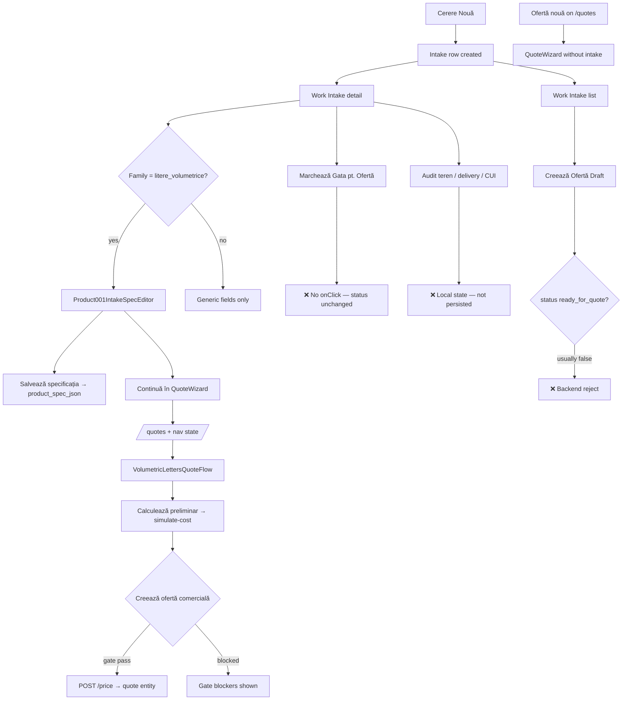
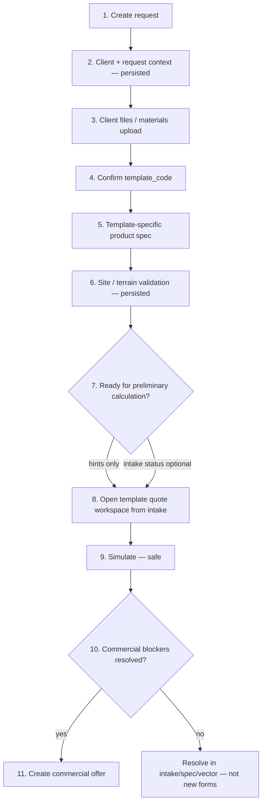

# Work Intake → Quote → Offer — Forms, Buttons & Actions Audit

**Date:** 2026-06-07  
**HEAD reference:** `c952293` (volumetric workspace handoff fix)  
**Mode:** Audit + proposal only — **no runtime changes** in this task  
**Scope:** Work Intake list/detail, Cerere Nouă, QuoteWizard, VolumetricLettersQuoteFlow, Oferte page, commercial quote gate  
**Active template reference:** `TPL-VOLUMETRIC-LETTERS` (maturity example — not universal form model)

**Related docs (read first):**

- `docs/architecture/TPL_VOLUMETRIC_LETTERS_CURRENT_STATE.md`
- `docs/architecture/TEMPLATE_SPECIFIC_FORM_ARCHITECTURE_AUDIT.md`
- `docs/architecture/TPL_VOLUMETRIC_LETTERS_INPUT_CONTRACT_AUDIT.md`
- `docs/architecture/PRODUCTSYSTEM_TEMPLATE_ONBOARDING_PLAYBOOK.md`

---

## 1. Purpose

This audit inventories every form, button, handoff, and data flow between **Cerere Nouă → Work Intake → Quote workspace → Ofertă comercială**. It answers whether each surface has a clear purpose, whether fields have a single owner, and why the current UI still feels like old forms patched together.

**Goals:**

1. Full button/action inventory with conditions, data read/write, and risk.
2. Full form inventory with ownership and duplication analysis.
3. Field ownership matrix (authoritative owner per field).
4. Current vs recommended journey maps.
5. P0/P1/P2 recommendations and next build scope.

**Out of scope:** pricing, CostEngine, readiness policy changes, quote/order creation, runtime refactors, generalizing volumetric fields to all templates.

---

## 2. Current problem

The operator experience mixes **four layers** without clear boundaries:

| Layer | Intended role | What happens today |
|-------|---------------|-------------------|
| Request / CRM | Client, channel, assignment, delivery | Partially captured; **most IntakeDetail edits are not persisted** |
| Template-specific product spec | `product_spec_json` for one template | Works for volumetric via `Product001IntakeSpecEditor` + save |
| Quote calculation | Effective `quote_input`, simulate, commercial gate | Split across intake prep panel, `VolumetricLettersQuoteFlow`, legacy `QuoteWizard` |
| Commercial offer document | Priced quote entity, PDF, send | `POST /price`, Oferte list — **separate from preliminary simulate** |

**Owner concern (validated in code):**

- Repeated inputs (dimensions, mounting, RAL, geometry, terrain) appear in intake, quote workspace, and legacy wizard paths.
- Buttons look actionable but **do not mutate backend** (status, terrain, template confirm, delivery).
- Three different ways to reach “quote” without a single primary path.
- `product_family` string gates the volumetric form; `template_code` is not stored on the intake row.
- “Calcul preliminar” is not a dedicated intake button — only “Continuă în QuoteWizard” / “Calculează preliminar” in quote workspace.

---

## 3. Entry point / button inventory

| # | Button / action | Location | Opens / does | Data required | Data produced | Risk / problem | Recommendation |
|---|-----------------|----------|--------------|---------------|---------------|----------------|----------------|
| 1 | **Cerere Nouă** | `WorkIntake.tsx`, `Dashboard.tsx` | Opens `NewIntakeDialog` | Live DB (`canMutateIntake`) | New `intake_requests` row + optional `product_spec_json` | Dashboard button navigates to `/quotes` on second action — inconsistent | **Keep** as primary create entry; unify Dashboard CTA with Work Intake |
| 2 | **Instrumentează Comanda** | `WorkIntake.tsx` side panel | `navigate(/intake/:id)` | Any intake | None | OK navigation | **Keep** secondary |
| 3 | **Preia în Analiză** | `WorkIntake.tsx` | *No handler* | `status === new` | None | Dead button | **Wire** to `updateIntakeStatus(in_review)` or hide |
| 4 | **Marchează Gata pt. Ofertă** | `WorkIntake.tsx`, `IntakeDetail.tsx` | *No handler* | Local validation lists | None — status never updates | **P0:** Button enables visually but never calls `updateIntakeStatus(ready_for_quote)` | **Wire** to backend status transition + persist prerequisites |
| 5 | **Solicită Info Suplimentar** | `WorkIntake.tsx` | *No handler* | `in_review` | None | Dead button | Wire to `needs_info` or hide |
| 6 | **Revino la Analiză** | `WorkIntake.tsx` | *No handler* | `needs_info` | None | Dead button | Wire or hide |
| 7 | **Creează Ofertă Draft** | `WorkIntake.tsx` | `POST /quotes/from-intake/{id}` | `status === ready_for_quote`, live DB | Draft quote entity | Competes with QuoteWizard; backend requires `ready_for_quote` but #4 never sets it | **Secondary** after status wiring; link to intake in Oferte |
| 8 | **Confirmă sugestia** | `IntakeDetail.tsx` → `BackendAssistSection` | `setAppliedSuggestionId` (local only) | Template assist API response | None persisted | Operator thinks template is confirmed; intake has no `template_code` field | **Persist** `confirmed_template_code` on intake or spec metadata |
| 9 | **Interogare fiscală backend** | `IntakeDetail.tsx` → `IdentitySection` | SmartBill / fiscal lookup | CUI | Local `companyData` | Does not update client entity automatically | **Keep** assistive; clarify “lookup only” |
| 10 | **Salvează specificația** | `Product001IntakeSpecEditor` | `intakesApi.update(product_spec_json)` | Live DB intake row | `product_spec_json` | Only reliable intake mutation on detail page | **Keep** primary save for template spec |
| 11 | **Continuă în QuoteWizard** | `Product001IntakeSpecEditor` (prep panel) | `navigate(/quotes, { openWizard, templateCode, productSpec, … })` | `TPL-VOLUMETRIC-LETTERS` family | Opens volumetric workspace | Bypasses `ready_for_quote`; does not require save first | **Primary** simulate path; rename to “Deschide ofertare preliminară”; optional save-before-navigate |
| 12 | **Ofertă nouă** | `Quotes.tsx` header | `setWizardOpen(true)` | None | Opens `QuoteWizard` modal/workspace | Starts **without** intake context; duplicates template/client pick | **Secondary** for ad-hoc quotes; hide or prefill when `fromIntake` |
| 13 | **Calculează preliminar** | `VolumetricLettersQuoteFlow` right rail | `POST /simulate-cost` | Effective `quote_input`, `template_id`, optional `intake_id` | Simulation result, `quote_gate` in response | Safe (`persisted=false`); correct | **Primary** in quote workspace |
| 14 | **Creează ofertă comercială** | `VolumetricLettersQuoteFlow`, generic `QuoteWizard` Step 4 | `POST /entities/quotes/price` | `can_create_commercial_quote === true` | Priced quote entity | Correctly gated on backend | **Primary final** CTA when gate passes |
| 15 | **Închide** | `VolumetricLettersQuoteFlow`, `QuoteWizard` | `onClose` | — | Returns to Oferte list | OK | **Keep** |
| 16 | **Înapoi la cerere** | `VolumetricLettersQuoteFlow` | Link to `/intake/:id` | `intakeRequestId` | Navigation only | OK | **Keep** |
| 17 | **Generează Link Unic** | `IntakeDetail.tsx` → `AuditTerenSection` | *UI placeholder* | — | Unknown / not wired in audit | May not persist photos | Audit attachment API contract |
| 18 | **Analizează layere SVG** | `VectorStudioPanel` / intake spec | Vector assets API | SVG paste / file metadata | Analysis summary in spec on save | Does not auto-fill geometry (correct) | **Keep** in intake only |
| 19 | **Delivery type chips** | `IntakeDetail`, `WorkIntake` list | Local `useState` only | — | **Not persisted** | Duplicates delivery in NewIntakeDialog | **Persist** on intake row or remove from detail until wired |
| 20 | **Terrain audit fields** | `IntakeDetail` → `AuditTerenSection` | Local `audit` state | — | **Not persisted** | Same checks reappear as read-only-ish checkboxes in quote workspace | **Single owner:** intake terrain section; quote shows summary only |
| 21 | **Quote list actions** (send/accept/convert) | `Quotes.tsx` | `updateQuoteStatus`, `createOrderFromQuote` | Priced quote | Order/status change | Out of intake scope but linked | Document as **Offer lifecycle** — separate from intake |
| 22 | **Mergi la Oferte** | `IntakeDetail` `NextStepPanel` | `navigate(/quotes)` | `status === ready_for_quote` | No wizard state | Does not open workspace or pass intake | Pass `openWizard` + intake context when template known |

**Duplicate actions (same intent, different paths):**

| Intent | Path A | Path B | Path C |
|--------|--------|--------|--------|
| Preliminary cost | Continuă în QuoteWizard → Calculează preliminar | Ofertă nouă → generic wizard simulate | — |
| Create quote entity | Creează ofertă comercială (after gate) | Creează Ofertă Draft (from-intake, needs `ready_for_quote`) | — |
| Mark intake ready | Marchează Gata pt. Ofertă (broken) | — | — |

---

## 4. Form inventory

### 4.1 Cerere Nouă (`NewIntakeDialog.tsx`)

| Attribute | Value |
|-----------|-------|
| **Purpose** | Create client (if needed) + minimal intake row |
| **Primary decision** | Who is the client; which product family |
| **Fields** | Client mode; contact; `product_family`; description; dimensions (free text); quantity; channel; priority; delivery_type; notes; optional embedded `Product001IntakeSpecEditor` draft |
| **Required** | Client; family; description; quantity |
| **Duplicated elsewhere** | Description/dimensions vs volumetric spec; family vs template assist |
| **Data source** | User input; `productFamiliesApi` |
| **Data destination** | `POST intake_requests` (+ `product_spec_json` if volumetric family) |
| **Generic / specific** | Generic shell + conditional template-specific embed |
| **Affects** | Request context; seeds `product_spec_json` |
| **Problems** | No `template_code` on create; dimensions string redundant when spec has `width_mm` |
| **Recommendation** | After family select, show **confirmed template** step; drop free-text dimensions for volumetric family |

### 4.2 Work Intake list (`WorkIntake.tsx`)

| Attribute | Value |
|-----------|-------|
| **Purpose** | Pipeline view + quick preview |
| **Fields shown** | Status, client, description, delivery override (local), actions |
| **Problems** | Side panel actions mostly non-functional; delivery override not saved |
| **Recommendation** | List shows: client, family, **confirmed template**, simulate-ready hint, status; primary action = open detail |

### 4.3 Work Intake detail — base (`IntakeDetail.tsx`)

| Attribute | Value |
|-----------|-------|
| **Purpose** | Full request instrumentation |
| **Primary decision** | Is request complete for handoff to quote? |
| **Fields** | Summary bar (client, contact, family, description, assigned); delivery chips; identity/CUI; backend assist; totem-specific branches |
| **Required for “Gata pt. Ofertă”** | Audit teren complete; assigned; description; dimensions (free text) |
| **Duplicated** | Description/dimensions vs `product_spec_json`; delivery vs create form |
| **Persistence** | **Almost none** except via child spec editor |
| **Generic / specific** | Generic wrapper |
| **Problems** | **P0:** gate button non-functional; terrain/assignment/description not saved; validation uses legacy `dimensions` string while volumetric uses structured mm fields |
| **Recommendation** | Split into clear sections (see §11); persist each section; volumetric requests should not require free-text `dimensions` if spec envelope is complete |

### 4.4 Client identification / SmartBill (`IdentitySection` in `IntakeDetail.tsx`)

| Attribute | Value |
|-----------|-------|
| **Purpose** | Optional fiscal lookup before production |
| **Owner** | Client / CRM (B) |
| **Persistence** | Lookup result local; CUI optional at intake |
| **Recommendation** | Read-only summary in quote workspace; edit stays here |

### 4.5 Delivery / mounting / terrain (`AuditTerenSection`, delivery chips)

| Attribute | Value |
|-----------|-------|
| **Purpose** | Site validation for install jobs |
| **Owner** | Site/terrain (D) |
| **Fields** | Address (Maps), photos link, power, totem extras |
| **Affects** | Intake readiness UX; **not** CostEngine |
| **Problems** | Local state only; duplicated as `terrainChecks` in quote flow (defaults false, readonly in practice) |
| **Recommendation** | Persist `intake_site_audit_json`; quote workspace shows **read-only** progress from intake |

### 4.6 Template suggestion (`BackendAssistSection`)

| Attribute | Value |
|-----------|-------|
| **Purpose** | Suggest `template_code` from backend assist |
| **Owner** | Template selection (E) |
| **Problems** | Confirm is cosmetic (local state) |
| **Recommendation** | Save `confirmed_template_code`; drive which spec form renders |

### 4.7 Product-specific — TPL-VOLUMETRIC-LETTERS (`Product001IntakeSpecEditor.tsx`)

| Attribute | Value |
|-----------|-------|
| **Purpose** | Capture production + quote-prefill spec |
| **Primary decision** | What product are we building; is vector/geometry ready |
| **Sections** | 11 numbered blocks (text, envelope, geometry, construction, finish, RAL, illumination, mounting, vector studio, quote prep) |
| **Owner** | Template spec (F) + files (C) for vector |
| **Data destination** | `product_spec_json` |
| **Affects** | Quote prefill; readiness warnings; **not** direct CostEngine until mapped to `quote_input` |
| **Problems** | Geometry fields duplicate quote workspace; cost-tagged fields educate operator but still re-editable in quote |
| **Recommendation** | **Keep** as authoritative product spec; quote workspace = effective calculation layer with prefill + override |

### 4.8 Vector Studio (`VectorStudioPanel` inside spec editor)

| Attribute | Value |
|-----------|-------|
| **Purpose** | File readiness, layer mapping, manual review |
| **Owner** | Files/materials (C) + readiness (I) |
| **Must not** | Invent geometry into CostEngine without valid extraction |
| **Recommendation** | Intake-only; quote shows status summary |

### 4.9 Quote workspace — volumetric (`VolumetricLettersQuoteFlow.tsx`)

| Attribute | Value |
|-----------|-------|
| **Purpose** | Method of calculation, effective quote input, simulate, commercial gate |
| **Primary decision** | How to calculate (vector / manual geometry / quick estimate) |
| **Fields** | Context strip; method cards; dims + geometry; collapsed cost options; collapsed terrain checks; right rail |
| **APIs** | `POST /simulate-cost`; `POST /quotes/price` |
| **Safe / final** | Simulate = safe; commercial = final gated |
| **Problems** | Re-asks dims/geometry/RAL/mounting already in spec; terrain checkboxes redundant |
| **Recommendation** | Approved model (§11); default collapsed “review effective values” |

### 4.10 Quote workspace — generic (`QuoteWizard.tsx`)

| Attribute | Value |
|-----------|-------|
| **Purpose** | Multi-step wizard for non-volumetric templates (ACP archived path still in code) |
| **Delegation** | Routes to `VolumetricLettersQuoteFlow` when `preferredTemplateCode === TPL-VOLUMETRIC-LETTERS` |
| **Problems** | Dead ACP field tables; 4-step duplicate of volumetric fields when intake handoff incomplete |
| **Recommendation** | Generic wizard only for future templates via registry; do not use for volumetric |

### 4.11 Oferte list / detail (`Quotes.tsx`)

| Attribute | Value |
|-----------|-------|
| **Purpose** | Commercial document lifecycle (draft → priced → sent → accepted → order) |
| **Forms** | `QuoteCommercialDocument`, PDF, output snapshots, send dialog |
| **Problems** | “Ofertă nouă” ignores intake; no prominent source-intake link on cards |
| **Recommendation** | Create from intake when possible; show `intake_code` on every quote card |

---

## 5. Field ownership matrix

**Legend:** Owner categories — A Client/CRM · B Request context · C Files/materials · D Site/terrain · E Template · F Template spec · G Quote calc input · H Production metadata · I Readiness · J System

| Field | Current location(s) | Current owner | Recommended owner | Prefill? | Editable in quote? | Blocks simulate? | Blocks commercial? | Notes |
|-------|---------------------|---------------|-------------------|----------|-------------------|------------------|-------------------|-------|
| `client_name` | Intake, quote workspace strip | B | A | Yes → quote context | No (display) | No | No | |
| `contact_person` | Intake summary | A | A | Display | No | No | No | |
| CUI / fiscal identity | IdentitySection | A | A | No | No | No | At order accept |
| `code` / request id | Intake | B | B | — | Read-only | No | No | |
| `description` | Intake entity (string) | B | B | Display | No | No | No | Redundant with `spec.text` for volumetric |
| `dimensions` (free text) | Intake entity | B | **Deprecate for volumetric** | No | No | No | No | **P0:** conflicts with `width_mm` etc. |
| `channel`, `priority` | Intake | B | B | No | No | No | No | |
| `delivery_type` | NewIntake + local chips | B | B | Display in quote | No | No | No | **Not persisted** on detail edits |
| `assigned_to` | Intake | B | B | No | No | No | No | Gate requires but not editable on detail |
| `status` | Intake | B | B | — | — | No | **Yes** for `from-intake` quote | **Never updated by UI** |
| `product_family` | Intake | E (weak) | E | — | No | No | No | Should not gate spec form alone |
| `confirmed_template_code` | *Missing* | — | E | — | No | No | No | **Add**; set by Confirmă sugestia |
| `product_spec_json` | Intake | F | F | → quote effective state | Review override in G | Indirect | Via vector/metadata gates | Authoritative product capture |
| `width_mm`, `height_mm`, `depth_mm` / `return_depth_mm` | Spec + quote workspace | F → G | F owns capture; G owns effective | Yes | Yes (effective) | Yes if missing | Yes | Envelope in F; calc in G |
| `letter_face_area_m2`, `letter_perimeter_m`, `letter_count` | Spec + quote workspace | F → G | Same | Yes | Yes | Yes | Yes | Never from vector unless valid extraction |
| `face_finish_type`, Oracal metadata | Spec + quote cost options | F/H | F capture; G if priced | Yes | Yes | Partial | Metadata blockers | |
| `paint_ral_*`, `paint_tube_count` | Spec + quote | F/H → G | Same | Yes | Yes | Tubes need RAL | Yes | |
| `selected_psu_watts`, illumination | Spec + quote | F → G | Same | Partial | Yes | Yes | No | |
| `mounting_system`, bars, Forex template | Spec + quote | F → G | Same | Yes | Yes | Partial | Partial | |
| `back_bevel_enabled`, miter flags | Spec | F/H | F | Yes | Optional in G | If priced | No | Production metadata |
| Vector file / mapping / manual review | Spec Vector Studio | C/I | C/I | Status → quote | No edit in quote | No | **Yes** commercial | |
| Site address, photos, power | AuditTerenSection + quote terrain | D | D | Summary in quote | No | No | No (context) | Persist audit JSON |
| `terrainChecks` in quote flow | `VolumetricLettersQuoteFlow` | D (wrong) | D intake only | From audit | Remove as inputs | No | No | **P1:** display-only mirror |
| `margin_pct`, `vat_pct`, `discount_pct` | Quote workspace | G | Offer layer | Defaults | Yes | No | No | Commercial doc concern |
| `can_create_commercial_quote` | Backend `quote_gate` | J/I | J | — | — | — | **Authoritative** | UI must not bypass |
| Simulate total | `simulate-cost` response | J | J | — | Read-only | — | — | 844.41 EUR baseline |

---

## 6. Current flow map



**Step-by-step assessment:**

| Step | Present? | Clear? | Repeats data? | Blocks too early? | Hides requirements? | Data preserved? |
|------|----------|--------|---------------|-------------------|---------------------|-----------------|
| 1 Create request | Yes | OK | — | No | — | Yes (DB) |
| 2 Open detail | Yes | Busy UI | — | — | Gate copy vs broken button | Partial |
| 3 Client/CUI | Yes | OK | — | — | — | Partial |
| 4 Delivery/terrain | Yes | OK | — | Blocks “Gata” | — | **No** |
| 5 Confirm template | Partial | Misleading | — | — | — | **No** |
| 6 Product spec | Yes (volumetric) | Good v1 | Later in quote | — | — | Yes on save |
| 7 Mark ready | UI only | **Broken** | — | Too strict on free-text dims | — | **No** |
| 8 Preliminary quote | Yes | Good after c952293 | Yes | No (by design) | Final gate late (correct) | Nav state only |
| 9 Commercial quote | Yes | OK | — | Gate enforced | — | Creates entity |
| 10 Oferte list | Yes | Weak intake link | — | — | — | Yes |

---

## 7. Recommended flow map



**Principles:**

1. **One primary path:** Intake → template workspace → simulate → commercial.
2. **`ready_for_quote`** = intake operations complete (terrain, assignment, template, spec saved) — **distinct** from `can_create_commercial_quote`.
3. **Ad-hoc** “Ofertă nouă” remains secondary (no intake).
4. **No field asked twice** unless labeled “effective override for this calculation.”

---

## 8. Duplicate / useless / misleading inputs

| Field / control | Current issue | Recommended action | Priority |
|---------------|---------------|-------------------|----------|
| `dimensions` (free text on intake) | Required for gate while volumetric has `width_mm`/`height_mm` | Drop gate dependency for volumetric when envelope in spec | **P0** |
| `description` vs `spec.text` | Two text fields | Single owner: `spec.text` for volumetric; description = internal note | **P1** |
| Delivery type chips on detail | Not saved | Persist `delivery_type` on change | **P0** |
| Terrain checkboxes in quote workspace | Duplicate audit section; not CostEngine inputs | Read-only mirror from persisted audit | **P1** |
| RAL / PSU / mounting in intake + quote | Necessary prefill but looks like re-entry | Collapsed “effective values” with prefill badges | **P1** |
| `Confirmă sugestia` | Implies template locked | Persist confirmation; show badge on intake header | **P0** |
| `Marchează Gata pt. Ofertă` | Implies status change | Wire `updateIntakeStatus` + explain difference vs commercial gate | **P0** |
| Generic `QuoteWizard` Step 2 dims | Third copy for volumetric handoff | Never shown for volumetric (already delegated) | **P2** (done) |
| `assigned_to` | Required but not editable on detail | Editable select + save | **P0** |
| Photo link generator | Unclear if functional | Wire or mark “coming soon” | **P1** |
| Work Intake list delivery override | Local only | Remove until persisted | **P1** |
| `Creează Ofertă Draft` vs commercial | Two create-quote paths | Document: draft = empty shell; commercial = priced after gate | **P1** |

---

## 9. Button logic and gate logic

### 9.1 What does “Marchează Gata pt. Ofertă” mean?

**Intended (governance + UI copy):** Intake request context is complete for the **sales handoff** — terrain audited, assignment, description, dimensions, product spec saved.

**Actual:** UI validation only; **no status transition**; `updateIntakeStatus` in `dataStore.ts` is never called from these buttons.

**vs quote readiness:** Backend `ready_for_quote` on **template/dossier** (ProductReadinessService) and `can_create_commercial_quote` (volumetric policy) are **separate** and enforced on `POST /price` only.

### 9.2 “Calcul preliminar” / “Calculează preliminar”

| Label | Where | Meaning |
|-------|-------|---------|
| *Not on intake* | — | No button with this label on Work Intake detail |
| Continuă în QuoteWizard | Intake prep panel | Navigate to quote workspace (not calculate yet) |
| Calculează preliminar | Volumetric right rail | `POST /simulate-cost`, `persisted=false` |
| Calcul preliminar (header) | Generic `QuoteWizard` when `isVolumetricPreliminary` | Legacy modal title |

**Safe before final blockers?** Yes — simulate is explicitly safe; commercial button stays disabled until `can_create_commercial_quote`.

### 9.3 “Ofertă Nouă” vs intake handoff

| Entry | Starts from | Template/client |
|-------|-------------|-----------------|
| Ofertă nouă | Empty wizard | User selects |
| Continuă în QuoteWizard | Intake `product_spec_json` | Fixed `TPL-VOLUMETRIC-LETTERS` |
| Creează Ofertă Draft | Intake row | Backend `from-intake` |

**Problem:** Three entry points; only middle preserves spec cleanly.

### 9.4 Recommended button hierarchy

**Work Intake list**

| Status | Primary | Secondary | Hidden |
|--------|---------|-----------|--------|
| new | Instrumentează | Preia în Analiză | Marchează Gata |
| in_review | Instrumentează | Marchează Gata (when valid) | Draft quote |
| ready_for_quote | Instrumentează | Creează Draft / Open quote workspace | — |
| needs_info | Instrumentează | Solicită info | — |

**Work Intake detail (volumetric)**

| Stage | Primary | Secondary |
|-------|---------|-----------|
| Spec incomplete | Salvează specificația | — |
| Spec saved | **Deschide ofertare preliminară** (rename from Continuă…) | Marchează Gata pt. Ofertă |
| Ready for quote status | Deschide ofertare | Mergi la Oferte (with context) |

**Quote workspace (volumetric)**

| Stage | Primary | Secondary |
|-------|---------|-----------|
| No simulation | Calculează preliminar | Închide |
| Simulated, gate blocked | Calculează preliminar (recalc) | Înapoi la cerere |
| Gate pass | Creează ofertă comercială | Calculează preliminar |

**Oferte**

| Context | Primary |
|---------|---------|
| From intake | View priced quote / Send |
| Ad-hoc | Ofertă nouă |

**Disabled button UX:** Every disabled primary should show **why** (tooltip or inline) — especially commercial gate blockers (already partially done in right rail).

---

## 10. Proposed form architecture

```
┌─────────────────────────────────────────────────────────────┐
│ 1. Work Intake base form                                    │
│    Owner: A/B/D/C — client, request, terrain, attachments   │
│    Persist: intake row + site_audit_json + template_code      │
└───────────────────────────┬─────────────────────────────────┘
                            │ prefill / link
┌───────────────────────────▼─────────────────────────────────┐
│ 2. Template-specific product form (per template_code)         │
│    Owner: F/H — product_spec_json                           │
│    TPL-VOLUMETRIC-LETTERS → Product001IntakeSpecEditor      │
└───────────────────────────┬─────────────────────────────────┘
                            │ safe prefill
┌───────────────────────────▼─────────────────────────────────┐
│ 3. Quote workspace (per template_code)                      │
│    Owner: G — effective quote_input, method, simulate       │
│    Context: read-only A/B/C/D; override with userEditedKeys │
└───────────────────────────┬─────────────────────────────────┘
                            │ gate pass
┌───────────────────────────▼─────────────────────────────────┐
│ 4. Offer form (Oferte)                                      │
│    Owner: commercial doc — margin/VAT/terms/PDF/send        │
└─────────────────────────────────────────────────────────────┘

        ┌──────────────────────┐
        │ 5. Reference catalogs │  (future: RAL, Oracal — not in scope)
        └──────────────────────┘
```

**Rules:**

- Data flows **forward**; later forms review effective values, do not re-own intake fields.
- Photos/materials = context unless explicitly processed (vector analysis).
- CostEngine inputs live only in layer 3 (quote workspace effective payload).
- Commercial creation ≠ simulation.

---

## 11. Proposed UI model

### Work Intake list item

- Client · family · **template_code** (if confirmed) · status · priority
- Badge: “Simulate ready” / “N missing for quote” (from spec prep helper)
- Primary: **Open**

### Work Intake detail sections (order)

1. **Request summary** — id, status, assignee (editable), priority, channel  
2. **Client / context** — client, contact, CUI assist  
3. **Client materials** — attachments list (future); vector file summary  
4. **Delivery / terrain** — persisted audit  
5. **Product / template** — assist + **confirmed template**  
6. **Template-specific spec** — `Product001IntakeSpecEditor` when `template_code === TPL-VOLUMETRIC-LETTERS`  
7. **Readiness for preliminary calculation** — prep panel (existing)  
8. **Actions** — Save spec · **Open quote workspace** · Mark ready for quote  

### Volumetric quote workspace (approved)

1. Context strip (client, intake, template, source)  
2. Client materials compact (collapsed)  
3. **Cum vrei să calculezi?**  
4. Active method panel  
5. Effective values (with prefill indicators)  
6. Right rail — simulate status, gate, total, CTAs  

### Oferte

- Create from intake when `ready_for_quote` or after commercial quote created  
- Card shows `intake_code` link  
- Document fields only (validity, terms, send) — not client/template re-entry  

---

## 12. P0 / P1 / P2 recommendations

### P0 — blocking / confusing

1. Wire **Marchează Gata pt. Ofertă** to `updateIntakeStatus(ready_for_quote)` with persisted prerequisites.  
2. Persist **delivery_type**, **assigned_to**, **terrain audit** (or remove gates until persisted).  
3. Persist **Confirmă sugestia** as `confirmed_template_code` on intake.  
4. Stop requiring free-text **`dimensions`** when volumetric `product_spec_json` has envelope.  
5. Clarify single **primary** path: intake → quote workspace → simulate → commercial.  
6. Pass intake context when **Mergi la Oferte** from ready intake.

### P1 — UX / data consistency

1. Rename **Continuă în QuoteWizard** → “Deschide ofertare preliminară”.  
2. Quote workspace: terrain = read-only summary from intake audit.  
3. Collapse duplicate cost fields behind “Effective values (from intake)”.  
4. Show **intake link** on all quotes created from intake.  
5. Remove or wire dead list buttons (Preia în Analiză, Solicită Info).  
6. Optional: prompt save before navigate to quote workspace.

### P2 — polish / future

1. Template form registry in dossier (`intake_form_schema_json`).  
2. Remove archived ACP paths from generic `QuoteWizard`.  
3. Catalog selectors (RAL, Oracal) — reference only.  
4. Side preview on Work Intake list with prep summary.

---

## 13. What must not be implemented yet

- Pricing / rate / currency changes  
- CostEngine formula or component changes  
- Readiness policy relaxation (`can_create_commercial_quote` bypass)  
- Fake geometry from photos or unvalidated vector  
- Universal volumetric form for non-volumetric templates  
- Full template form registry migration (until next approved build)  
- Quote/order creation during audit/testing  

---

## 14. Next build recommendation

**Build: “Intake persistence & handoff coherence” (no pricing)**

1. Add `confirmed_template_code` (+ optional `site_audit_json`) to intake persistence API usage.  
2. Wire status transitions and editable assignment on detail page.  
3. Unify gate validation: volumetric uses spec envelope instead of free-text dimensions.  
4. Intake primary CTA → quote workspace with save-if-dirty guard.  
5. Oferte: show intake provenance; `from-intake` draft only when status is `ready_for_quote`.  
6. Quote workspace: terrain read-only from intake; prefill badges on effective fields.  
7. Tests: button handlers call correct APIs; handoff state; no duplicate required fields for WI-SMOKE-P001.

**Do not** merge intake and quote into one form — keep four layers with clear ownership.

---

## 15. Validation (audit task)

| Check | Result |
|-------|--------|
| Runtime files changed | **None** (docs only) |
| Quote/order created | **No** |
| Entity counts unchanged | intakes=11, quotes=7, orders=8 |
| HEAD includes c952293, a6c1480, 8292871, 98bda64, 012408a | **Yes** |

---

---

## 16. Build result — Intake Persistence & Handoff Coherence (2026-06-07)

**Build:** `fix: persist intake readiness and quote handoff context` (runtime + migration `s42`)

### Implemented

| P0 item | Result |
|---------|--------|
| `confirmed_template_code` persistence | Migration `s42` + **Confirmă sugestia** → PUT intake |
| `delivery_type` persistence | Detail chips + list via API |
| `assigned_to` persistence | Editable field; flushed on mark-ready |
| `site_audit_json` persistence | Terrain section → PUT; quote workspace read-only |
| **Marchează Gata pt. Ofertă** | Status chain `new`→`in_review`→`ready_for_quote` (no quote created) |
| Volumetric dimensions gate | Structured `product_spec_json` envelope; no free-text `dimensions` required |
| Primary CTA | **Deschide ofertare preliminară** → `VolumetricLettersQuoteFlow` with intake context |
| Status buttons (list) | Preia în Analiză / Solicită Info / Revino la Analiză wired |
| Quote provenance | Quote cards show `din cerere {code}` when linked |

### Distinctions preserved

- **`ready_for_quote` (intake)** ≠ **`can_create_commercial_quote` (quote gate)**
- Terrain/photos = context only — not CostEngine inputs
- No pricing / CostEngine / readiness policy changes

### QA

See `docs/qa/BUILD_INTAKE_PERSISTENCE_HANDOFF_COHERENCE.md`.

*End of audit.*
