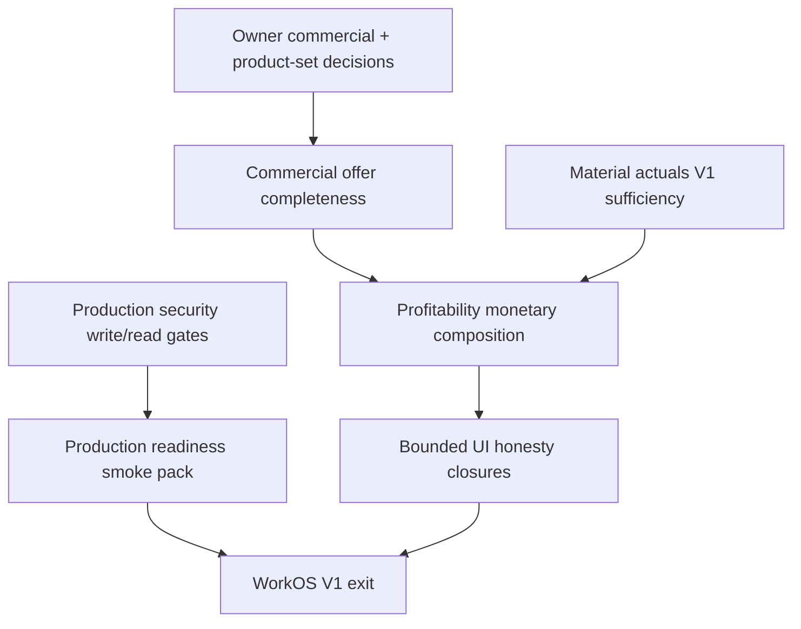

# WORKOS — Master Finalization Roadmap V1

**Status:** ACTIVE — primary V1 finalization navigator  
**Date:** 2026-08-09  
**Owner GO:** `AUTHORIZE_WORKOS_MASTER_FINALIZATION_ROADMAP_V1`  
**Baseline HEAD:** `8f6e9f8c` accepted commercial tip; security closure lands on this branch after that tip (`feat/f7i-owner-rate-activation`)  
**Principle:** `DONE ENOUGH FOR V1 > PERFECT EVERYWHERE`

> **Use this document** for current V1 finalization priority and next-build selection.  
> **Use** [`21_WORKOS_IMPLEMENTATION_ROUTE.md`](./21_WORKOS_IMPLEMENTATION_ROUTE.md) for detailed historical implementation/architecture route — not as competing “current status” SoT. Doc 21 spine tables are partly stale vs Aug 2026 execution/labor closures.

---

## 1. Purpose

Answer, from **repo/runtime truth**:

> What is the shortest correct path from today’s WorkOS to a V1 that operators can actually use?

This roadmap is practical, evidence-based, and living. It is **not** a micro-task backlog and **not** permission to implement without a separate Owner GO.

---

## 2. V1 definition (practical)

**WorkOS V1** = Letters Slice 1 can run end-to-end with honest commercial totals, frozen sold scope, executable plan, controlled people/machine shop-floor reality, actual costs where declared, and a deterministic post-job profitability read — on a single-tenant SQLite deployment with safe authz.

### Required E2E chain

```text
Intake V6 (Letters)
  → ProductDefinition / ProductAggregate
  → CPP + EIC (side-by-side)
  → Quote Snapshot V2 → Accept → Order Snapshot V2
  → ExecutionPlan V2 + operational materialization (sold-scope)
  → Eligibility → Assignment (Phase B)
  → Controlled sessions (Execution Reality)
  → MachineRun observe (runtime)
  → Actual labor cost (frozen) + actual material (when used)
  → Profitability monetary composition (fail-closed gaps)
  → Operator-usable UI + production smoke + critical authz
```

### Explicitly NOT required for V1

- REASSIGNMENT_PHASE_E, MachineRun PAUSE/RESUME  
- Capacity Stage 1 activation  
- ACM treatments / Logo-as-sold-root / cassette ACM  
- Internal SVG/DWG/DXF analyzer  
- PostgreSQL migration  
- Payroll ↔ session merge  
- Perfect Product System Form Builder  
- Advanced Profitability analytics / dashboards polish  

---

## 3. Current state summary (accepted recent truth)

Verified against worklogs/QA at HEAD `0fb723b2`:

| Claim | Status |
|-------|--------|
| MACHINE_RUN_V1 | STABLE_BASELINE_AFTER_HARDENING |
| CONTROLLED_EMPLOYEE_ASSIGNMENT_COMMAND_SAFETY | PASS |
| CONTROLLED_EXECUTION_SESSION_TASK_REALITY_COMMAND_SAFETY | PASS |
| LEGACY_SESSION_WRITE_PATH_ASSIGNMENT_GATE_CLOSURE | PASS |
| ACTIVE_LEGACY_UNSAFE | 0 |
| PROFITABILITY_ACTUAL_LABOR_INPUT_CLOSURE | PASS |
| LABOR_COST_RATE_SNAPSHOT_AUTHORITY | PASS |
| HISTORICAL_RATE_STABILITY | PROVEN |
| PROFITABILITY_ACTUAL_LABOR_COST_READINESS | READY |
| PROFITABILITY_MONETARY_CALCULATION | PARTIAL_BLOCKED (currency EUR/RON) |
| REASSIGNMENT_PHASE_E | DEFERRED |
| CAPACITY_STAGE_1 | IMPLEMENTED_INACTIVE |
| QA_MUTATIONS (this GO) | 0 |
| COMMERCIAL_OFFER | DONE_FOR_V1 |
| PRODUCTION_SECURITY_WRITE_GATE | DONE_FOR_V1 |
| MATERIAL_ACTUALS_V1 | DONE_FOR_V1 |
| PROFITABILITY_ACTUAL_MATERIAL_COST_READINESS | READY |
| MACHINE_COST_V1 | DECLARE_NA_FOR_V1 (Owner confirmed) |
| OTHER_DIRECT_COST_V1 | DECLARE_NA_FOR_V1 (Owner confirmed) |
| PROFITABILITY_MONETARY_COMPOSITION | BUILT_BUT_BLOCKED_BY_CURRENCY |
| PROFITABILITY_CURRENCY_AUTHORITY | PASS_DECISION_PREP — wait Owner A/B/C |
| WORKOS_V1_COMPLETION_ESTIMATE | ~87% |

---

## 4. Domain matrix

| Domain | Current status | Required V1 | What is proven | Exact missing V1 piece | Blocker | Reopen? |
|--------|----------------|-------------|----------------|------------------------|---------|---------|
| A. Intake V6 | DONE_FOR_V1 | YES | Letters path + EUR presentation + adjustments | List chrome mixed RON aggregates (non-blocking) | — | NO |
| B. Product System | PARTIAL_NON_BLOCKING | CONDITIONAL | VL v2 template truth; freeze at EIC lab stop | Broader catalog polish | Product-set expansion only | NO |
| C. ProductDefinition | DONE_FOR_V1 | YES | Builder compile + guards | — | — | NO |
| D. ProductAggregate | DONE_FOR_V1 | YES | task_rules / WC pilot | — | — | NO |
| E. Pricing Registry | PARTIAL_NON_BLOCKING | CONDITIONAL | F7I honesty + F7I.1 provisional rates | Hub/tab legacy cleanup | Step 12 | NO for V1 |
| F. CPP / EIC | DONE_FOR_V1 | YES | EUR native + fail-closed mix; Snapshot embed | ACM/Logo out of V1 | — | NO |
| G. Quote Snapshot V2 | DONE_FOR_V1 | YES | Freeze/accept path | Preview vs official labeling | — | NO |
| H. Order Snapshot V2 | DONE_FOR_V1 | YES | EUR\|RON convert; net/VAT/gross envelope; no_reprice | Thin ACM scope if activated | — | NO |
| I. ExecutionPlan | DONE_FOR_V1 | YES | Preview/persist V2 | — | — | NO |
| J. Task graph / materialize | PARTIAL_NON_BLOCKING | YES | Controlled materialize + sold-scope | Broad unscoped materialize policy | Owner GO if expanding | NO controlled path |
| K. Eligibility / assignment | DONE_FOR_V1 | YES | Phase B safety PASS | Live workshop soak | — | NO |
| L. Sessions / Reality | DONE_FOR_V1 | YES | Single writer; bridges gated; END≠complete | — | — | NO |
| M. MachineRun runtime | DONE_FOR_V1 | YES | Command lifecycle + UI | Cost authority (separate) | — | NO runtime |
| N. Scheduling | PARTIAL_NON_BLOCKING | NO | Order-centric execution UI | Advanced schedule | — | NO |
| O. Capacity Stage 1 | IMPLEMENTED_INACTIVE_BY_DECISION | NO | Code present, inactive | Activation | Owner Option D | NO |
| P. Actual material cost | DONE_FOR_V1 | YES | Freeze-on-write StockMovement; material_input helper; historical stability PROVEN | Operator capture discipline for Letters jobs | — | NO inventory program |
| Q. Actual labor cost | DONE_FOR_V1 | YES | Time + historical rate freeze | Monetary Profitability rollup | — | NO |
| R. Actual machine cost | DECLARE_NA_FOR_V1 | NO (V1) | Runtime exists; Owner N/A for cost | — | — | Later if INCLUDE |
| S. Other/service actuals | DECLARE_NA_FOR_V1 | NO (V1) | Explicit N/A_FOR_V1 (not zero) | — | — | Later if INCLUDE |
| T. Profitability monetary | PARTIAL_V1_BLOCKER | YES | Composition + N/A + UI; same-currency COMPLETE | Historical FX / unify currency for Letters EUR vs RON | currency_mismatch_no_fx | After currency authority |
| U. HR / Pontaj boundary | DONE_FOR_V1 | YES | Separation proven | — | Salary≠job cost | NO |
| V. Utilaje registry | PARTIAL_NON_BLOCKING | YES | Registry + MR link | Capacity util% honesty | — | Bounded |
| W. Modules / Governance | PARTIAL_NON_BLOCKING | YES | Truth Control Center | Minor label drift | — | Docs sync |
| X. Operator UI | PARTIAL_NON_BLOCKING | YES | Letters spine usable | Dense screens; ACM/Logo | — | Bounded only |
| Y. Legacy / dead | DONE_FOR_V1 (safety) | YES (safety) | Session legacy gated; intake-v5 unmounted; HR salary gated | Residual list chrome / hub cleanup | — | NO reopen for V1 |
| Z. Production readiness | PARTIAL_V1_BLOCKER | YES | Local stack + CI subset; security write-gate DONE | Owner SQLite confirm; secrets; smoke pack | Deploy misconfig | Bounded |

**Counts (exact):** DONE_FOR_V1 = 14 · OPEN/PARTIAL_V1_BLOCKER = 2 (T currency, Z prod readiness) · PARTIAL_NON_BLOCKING = 8 · DECLARE_NA_FOR_V1 = 2 (R,S) · IMPLEMENTED_INACTIVE = 1 · DEFERRED (Phase E / PAUSE) = Later

---

## 5. CLOSED_FOR_V1

Do **not** reopen unless concrete defect / V1 blocker / integrity issue.

| Domain | Why closed | Proof | LATER extensions |
|--------|------------|-------|------------------|
| ProductDefinition / Aggregate (Letters) | Compile path proven | builder/aggregate services; F7A | Multi-template |
| Quote/Order Snapshot V2 | Freeze/accept/no_reprice | snapshot services; sold-scope reader | ACM/Logo sold roots |
| ExecutionPlan V2 | Persist/preview | EP services + QA fixtures | Advanced scheduling |
| Assignment Phase B | Safety PASS | `2026-08-09_controlled_employee_assignment_*` | Phase C/D soak; Phase E |
| Sessions / Reality writer | Single authority; bridges gated | `5034f762` / `811557c6` arc | Pause/block redesign |
| MachineRun runtime V1 | Stable baseline | MachineRun harden worklog | PAUSE/RESUME; cost |
| Actual labor time | Proven | `7dfc2013` | — |
| Labor rate snapshot | Historical stability PROVEN | `0fb723b2` | Rate editor UX |
| HR/Pontaj boundary | Separation | Owner decision docs | Payroll reconciliation |
| Commercial offer currency/rates (Letters) | EUR native + fail-closed mix; Order EUR\|RON; revenue envelope | `WORKOS_V1_COMMERCIAL_OFFER_CURRENCY_AND_RATE_CLOSURE` | Quotes list aggregate currency polish; `printed_vinyl` |
| Production security write-gate | Intake V5 unmounted; HR cost projection gated; anonymous critical writes = 0 | `WORKOS_V1_PRODUCTION_SECURITY_WRITE_GATE_CLOSURE` | External pentest LATER; APP_ENV discipline in smoke pack |
| Material actuals sufficiency | Frozen StockMovement + material_input; planned≠actual; historical PROVEN | `WORKOS_V1_MATERIAL_ACTUALS_SUFFICIENCY` | Warehouse/MRP LATER; operator issue discipline |

---

## 6. OPEN_V1_REQUIRED

| Domain | Missing capability | Dependency | Arch risk | UI | Schema | Size |
|--------|-------------------|------------|-----------|----|--------|------|
| Profitability monetary | Composition + N/A done; **EUR/RON currency gate blocks Letters** | Labor/material/revenue READY; Owner N/A machine/other | MEDIUM | SMALL | NONE | SMALL (currency authority) |
| Production readiness pack | Owner SQLite record; secrets; smoke; APP_ENV discipline | Security DONE | LOW | NONE | NONE | SMALL |
| Machine cost (if required) | Dated machine cost policy | MachineRun runtime | HIGH | SMALL | LIKELY | LARGE |

If Owner declares machine/other costs **N/A for V1 Letters jobs**, machine/other drop to CONDITIONAL → LATER.

---

## 7. LATER_NOT_REQUIRED_FOR_V1

Verified against current truth:

- REASSIGNMENT_PHASE_E  
- MachineRun PAUSE / RESUME  
- Capacity Stage 1 activation  
- ACM face treatments / Logo sold root / cassette ACM  
- Advanced machine telemetry / auto-batching  
- Employee optimization / efficiency scoring  
- Advanced payroll coupling / FX sophistication  
- Advanced Profitability analytics dashboard polish  
- Pricing hub full legacy kill (Step 12) — unless it creates active money bypass  
- PostgreSQL migration (unless Owner chooses multi-tenant cloud)  
- Form Builder / Product System lab expansion  
- Internal graphic analyzer  

---

## 8. PROFITABILITY_INPUT_MATRIX

| Input | Readiness | Evidence |
|-------|-----------|----------|
| Revenue | READY | Frozen `accepted_commercial_total` + currency; net/VAT/gross envelope when Quote had them |
| Labor | READY | Closed sessions + finalize → frozen `ActualLaborCostLine` |
| Material | READY | Freeze-on-write StockMovement + material_input; fail-closed if unused/missing cost |
| Monetary composition | PARTIAL | Same-currency DONE; Letters EUR/RON BLOCKED; machine/other N/A_FOR_V1 |
| Machine | N_A_FOR_V1 | Owner `DECLARE_NA_FOR_V1` — not zero |
| Other | N_A_FOR_V1 | Owner `DECLARE_NA_FOR_V1` — not zero |
| Provenance | PARTIAL | Labor/material strong; N/A explicit for machine/other |
| Currency | PARTIAL | Snapshot currency + labor RON; no FX |
| Historical stability | PARTIAL→strong on labor | Labor PROVEN; full P&L rollup NOT_STARTED |

```text
PROFITABILITY_REVENUE_READINESS = READY
PROFITABILITY_ACTUAL_LABOR_COST_READINESS = READY
PROFITABILITY_MONETARY_CALCULATION = NOT_STARTED
```

---

## 9. Product coverage

| Template / family | Class |
|-------------------|-------|
| `TPL-VOLUMETRIC-LETTERS_v2` | **V1_REQUIRED** |
| Letters + ACM shell (no treatments) | **V1_OPTIONAL** / CONDITIONAL |
| ACM treatments / logo-on-ACM | **LATER** |
| `TPL-VOLUMETRIC-LOGO_v1` sold root | **OWNER_DECISION_REQUIRED** (default LATER) |
| `TPL-ACM-CASSETTED-PANEL` | **LATER** |
| WorkIntake V2 / QuoteWizard as money authority | **ARCHIVED** for V1 spine (V6 canonical) |

---

## 10. Owner decisions required

1. **V1 product set lock** — Letters-only vs Letters+ACM-shell; Logo in or out.  
2. ~~Complete offer currency law~~ **RESOLVED for V1** — native EUR ops (no invent FX); Order convert accepts EUR\|RON.  
3. ~~Provisional rates~~ **RESOLVED for V1** — F7I.1 provisional retained as V1-acceptable with honesty labels.  
4. **Residual finishes** — `printed_vinyl` remains fail-closed/LATER; Oracal 641 live at 6.5 EUR (registry Owner confirmed).  
5. **SQLite as V1 production DB** — confirm laboratory/single-tenant freeze (Postgres LATER).  
6. ~~**Machine actual cost in V1**~~ **RESOLVED** — `DECLARE_NA_FOR_V1`.  
7. ~~**Other direct cost in V1**~~ **RESOLVED** — `DECLARE_NA_FOR_V1`.  
8. **Profitability currency composition** — **OWNER_DECISION_REQUIRED** (prep: `2026-08-09_workos_v1_profitability_currency_composition_authority.md`).  
   Card: **[A]** costs RON→EUR @ Order-convert FX stamp (agent rec) · **[B]** revenue→RON derived · **[C]** named reporting currency · **[D]** reopen commercial (not rec).  
   `HISTORICAL_FX_AUTHORITY = MISSING` today; live Settings `eur_to_ron_rate` is **not** safe at P&L view.

Do **not** ask Owner to decide technical implementation details agents can resolve.

---

## 11. Dependency graph (remaining V1)



Closed upstream (do not re-enter): PD/PA → Snapshot → EP → Assign → Session → Labor cost → MachineRun runtime.

---

## 12. Critical path (max ~8 nodes)

1. ~~Owner commercial/currency law + commercial offer completeness~~ **DONE** (`WORKOS_V1_COMMERCIAL_OFFER_CURRENCY_AND_RATE_CLOSURE`)  
2. ~~Production security gates (intake-v5 + HR salary read authz)~~ **DONE** (`WORKOS_V1_PRODUCTION_SECURITY_WRITE_GATE_CLOSURE`)  
3. ~~Material actuals V1 sufficiency~~ **DONE** (`WORKOS_V1_MATERIAL_ACTUALS_SUFFICIENCY`)  
4. Profitability currency composition authority (EUR revenue vs RON actuals — no invent FX)  
5. Bounded operator UI honesty (quotes list currency aggregates; execution density)  
6. Production readiness pack (SQLite confirm, secrets, smoke)  
7. V1 exit criteria verification  

---

## 13. Next 3 builds (ordering only — not authorized)

### NEXT_RECOMMENDED_BUILD

```text
WAIT_FOR_OWNER_DECISION — PROFITABILITY_CURRENCY_POLICY (A/B/C)
```

Then bounded wire GO (stamp FX at Order convert + Profitability RM normalize) → return immediately to `PROFITABILITY_MONETARY_COMPOSITION_V1` for PASS.

**Why:** Authority audit complete (`PASS_DECISION_PREP`). No canonical historical FX for P&L exists yet; Owner must pick A/B/C before product wiring.

### BUILD_AFTER_NEXT

```text
WORKOS_V1_PRODUCTION_READINESS_SMOKE_PACK
```

Owner SQLite confirm, secrets posture, Letters E2E smoke (after monetary unblocked).

### BUILD_AFTER_THAT

```text
WORKOS_V1_BOUNDED_UI_HONESTY_CLOSURES
```

Quotes list currency aggregates + dense execution chrome.

---

## 14. V1 exit criteria

1. Letters Intake V6 → PD/PA → CPP/EIC → Snapshot → Order works with honest totals (or explicit incomplete status).  
2. Commercial snapshots historically stable (no live reprice).  
3. ExecutionPlan materializes sold-scope operational tasks.  
4. Operator can assign eligible employee and run controlled sessions.  
5. MachineRun observe path usable for required shop machines.  
6. Actual labor cost frozen and historically stable.  
7. Actual material cost available or fail-closed when used.  
8. Profitability monetary read model shows available categories; never invents.  
9. No active unauthenticated commercial/execution write bypass.  
10. HR salary fields not readable by arbitrary authenticated roles.  
11. Required UI flows discoverable (intake, quotes, orders, execution, machine-runs, shop-floor).  
12. Capacity / Phase E / PAUSE remain inactive or deferred without false “live” claims.  
13. Owner SQLite (or alternate) decision recorded; production smoke passes.  
14. Modules/Governance labels match closed-domain truth.  

---

## 15. Completion estimate

```text
WORKOS_V1_COMPLETION_ESTIMATE = ~85%

ARCHITECTURAL_FOUNDATION = 9/10
V1_FUNCTIONAL_CLOSURE    = 8.5/10
OPERATOR_UI_CLOSURE      = 6/10
PRODUCTION_READINESS     = 7/10
```

**What dominates remaining work:** profitability monetary composition (+ Owner machine/other decision), then production smoke — not Inventory/security/labor re-hardening.

---

## 16. UI finalization (domain-level)

| Area | Class |
|------|-------|
| `/intake`, `/intake-v6/...` Letters | USABLE_FOR_V1 |
| `/quotes`, `/orders` | USABLE_FOR_V1 |
| `/execution/machine-runs` | USABLE_FOR_V1 |
| `/shop-floor` | USABLE_FOR_V1 |
| `/modules`, `/governance` | USABLE_FOR_V1 |
| `/inventory/pricing` | NEEDS_BOUNDED_CLOSURE |
| `/execution` detail density | NEEDS_BOUNDED_CLOSURE |
| `/utilaje` (capacity messaging) | NEEDS_BOUNDED_CLOSURE |
| Logo/ACM intake completeness | NEEDS_BOUNDED_CLOSURE / LATER |

No redesign-every-screen program.

---

## 17. Legacy / dead pieces (roadmap level)

| Class | Items |
|-------|-------|
| V1_BLOCKING | _(none remaining in legacy auth class — security write-gate closed)_ |
| V1_NON_BLOCKING | QuoteWizard/CostEngine as money authority (marked legacy); `/operator`/`/tablet` compat |
| LATER_CLEANUP | Pricing hub tab debt; Product System planned shells; demo routes; external pentest |

---

## 18. Deployment / security (V1-critical)

- **SQLite** = current canonical runtime; Postgres supported-in-code, **not** required for V1 if Owner confirms single-tenant.  
- **Security write-gate:** DONE_FOR_V1 (`intake-v5` unmounted; HR salary/cost projection gated).  
- **Residual deploy risk:** wrong `APP_ENV` → dev auth bypass (existing BUILD 20 fail-closed) — covered in production readiness pack.  
- No giant security program — do not reopen SSO/MFA/SIEM for V1.

---

## 19. Modules / Governance drift (list only)

- Reality node: labor CLOSED / rates PROVEN — keep aligned.  
- Production security: auth authority = JWT/`get_current_user`; permission authority = `PERMISSION_MATRIX`; operational employee projection vs `employee.view_hr_cost`; Intake V5 = DEPRECATED_NOT_MOUNTED.  
- Post-Job limitation text may still say “labor $ open” while labor freeze is READY — sync when monetary composition lands.  
- Doc 21 materialization/session rows are stale vs Aug 2026 — superseded by this roadmap for priority.

Trivial factual sync only; no feature work beyond security closure evidence.

---

## 20. Relation to doc 21

| Document | Role |
|----------|------|
| **This file** | Current V1 finalization SoT / priority navigator |
| `21_WORKOS_IMPLEMENTATION_ROUTE.md` | Historical controlled implementation route + deep architecture |
| `20_ROADMAP_STEPS_7G_TO_12.md` | Step catalog (historical) |

Do not maintain two competing “what next” roadmaps.

---

## 21. Update protocol

**Update after:** major domain closure; architecture/status change; blocker added/removed; Owner changes V1 scope.  

**Do not update after:** tiny tests; cosmetic fixes; minor QA reruns.

Keep this document short enough to stay useful.

---

## 22. Latest security GO constraints (honored)

```text
DB_SCHEMA_CHANGES = 0
NEW_ALEMBIC = NO
RBAC_PLATFORM = NO
SSO_MFA = NO
QA_MUTATIONS = 0
PUSH = NO
COMMERCIAL_BEHAVIOR_CHANGED = NO
EXECUTION_BEHAVIOR_CHANGED = NO
```
