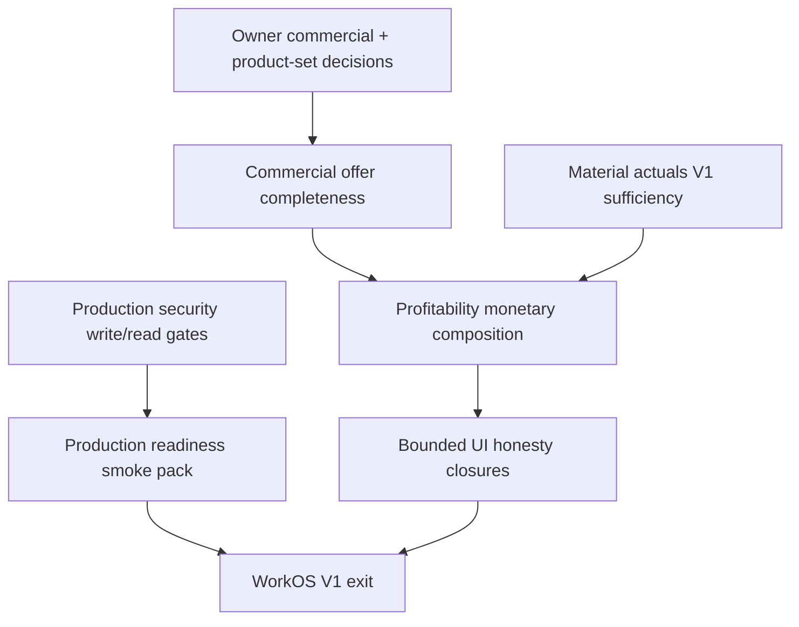

# WORKOS — Master Finalization Roadmap V1

**Status:** ACTIVE — primary V1 finalization navigator  
**Date:** 2026-08-09  
**Owner GO:** `AUTHORIZE_WORKOS_MASTER_FINALIZATION_ROADMAP_V1`  
**Baseline HEAD:** `0fb723b2` (`feat/f7i-owner-rate-activation`)  
**Principle:** `DONE ENOUGH FOR V1 > PERFECT EVERYWHERE`

> **Use this document** for current V1 finalization priority and next-build selection.  
> **Use** [`21_WORKOS_IMPLEMENTATION_ROUTE.md`](./21_WORKOS_IMPLEMENTATION_ROUTE.md) for detailed historical implementation/architecture route — not as competing “current status” SoT. Doc 21 spine tables are partly stale vs Aug 2026 execution/labor closures.

---

## 1. Purpose

Answer, from **repo/runtime truth**:

> What is the shortest correct path from today’s WorkOS to a V1 that operators can actually use?

This roadmap is practical, evidence-based, and living. It is **not** a micro-task backlog and **not** permission to implement without a separate Owner GO.

---

## 2. V1 definition (practical)

**WorkOS V1** = Letters Slice 1 can run end-to-end with honest commercial totals, frozen sold scope, executable plan, controlled people/machine shop-floor reality, actual costs where declared, and a deterministic post-job profitability read — on a single-tenant SQLite deployment with safe authz.

### Required E2E chain

```text
Intake V6 (Letters)
  → ProductDefinition / ProductAggregate
  → CPP + EIC (side-by-side)
  → Quote Snapshot V2 → Accept → Order Snapshot V2
  → ExecutionPlan V2 + operational materialization (sold-scope)
  → Eligibility → Assignment (Phase B)
  → Controlled sessions (Execution Reality)
  → MachineRun observe (runtime)
  → Actual labor cost (frozen) + actual material (when used)
  → Profitability monetary composition (fail-closed gaps)
  → Operator-usable UI + production smoke + critical authz
```

### Explicitly NOT required for V1

- REASSIGNMENT_PHASE_E, MachineRun PAUSE/RESUME  
- Capacity Stage 1 activation  
- ACM treatments / Logo-as-sold-root / cassette ACM  
- Internal SVG/DWG/DXF analyzer  
- PostgreSQL migration  
- Payroll ↔ session merge  
- Perfect Product System Form Builder  
- Advanced Profitability analytics / dashboards polish  

---

## 3. Current state summary (accepted recent truth)

Verified against worklogs/QA at HEAD `0fb723b2`:

| Claim | Status |
|-------|--------|
| MACHINE_RUN_V1 | STABLE_BASELINE_AFTER_HARDENING |
| CONTROLLED_EMPLOYEE_ASSIGNMENT_COMMAND_SAFETY | PASS |
| CONTROLLED_EXECUTION_SESSION_TASK_REALITY_COMMAND_SAFETY | PASS |
| LEGACY_SESSION_WRITE_PATH_ASSIGNMENT_GATE_CLOSURE | PASS |
| ACTIVE_LEGACY_UNSAFE | 0 |
| PROFITABILITY_ACTUAL_LABOR_INPUT_CLOSURE | PASS |
| LABOR_COST_RATE_SNAPSHOT_AUTHORITY | PASS |
| HISTORICAL_RATE_STABILITY | PROVEN |
| PROFITABILITY_ACTUAL_LABOR_COST_READINESS | READY |
| PROFITABILITY_MONETARY_CALCULATION | NOT_STARTED |
| REASSIGNMENT_PHASE_E | DEFERRED |
| CAPACITY_STAGE_1 | IMPLEMENTED_INACTIVE |
| QA_MUTATIONS (this GO) | 0 |

---

## 4. Domain matrix

| Domain | Current status | Required V1 | What is proven | Exact missing V1 piece | Blocker | Reopen? |
|--------|----------------|-------------|----------------|------------------------|---------|---------|
| A. Intake V6 | PARTIAL_V1_BLOCKER | YES | Letters operator path; PD handoff; F7E/F7F finish integrity | Honest complete offer (currency mix + residual rates) | Owner currency/rates | NO shell |
| B. Product System | PARTIAL_NON_BLOCKING | CONDITIONAL | VL v2 template truth; freeze at EIC lab stop | Broader catalog polish | Product-set expansion only | NO |
| C. ProductDefinition | DONE_FOR_V1 | YES | Builder compile + guards | — | — | NO |
| D. ProductAggregate | DONE_FOR_V1 | YES | task_rules / WC pilot | — | — | NO |
| E. Pricing Registry | PARTIAL_NON_BLOCKING | CONDITIONAL | F7I honesty + F7I.1 provisional rates | Hub/tab legacy cleanup | Step 12 | NO for V1 |
| F. CPP / EIC | PARTIAL_V1_BLOCKER | YES | Engines + Snapshot embed | Complete totals / FX or EUR ops | Owner commercial law | Rates only |
| G. Quote Snapshot V2 | DONE_FOR_V1 | YES | Freeze/accept path | Preview vs official labeling | — | NO |
| H. Order Snapshot V2 | DONE_FOR_V1 | YES | Sold-scope freeze; no_reprice | Thin ACM scope if activated | — | NO |
| I. ExecutionPlan | DONE_FOR_V1 | YES | Preview/persist V2 | — | — | NO |
| J. Task graph / materialize | PARTIAL_NON_BLOCKING | YES | Controlled materialize + sold-scope | Broad unscoped materialize policy | Owner GO if expanding | NO controlled path |
| K. Eligibility / assignment | DONE_FOR_V1 | YES | Phase B safety PASS | Live workshop soak | — | NO |
| L. Sessions / Reality | DONE_FOR_V1 | YES | Single writer; bridges gated; END≠complete | — | — | NO |
| M. MachineRun runtime | DONE_FOR_V1 | YES | Command lifecycle + UI | Cost authority (separate) | — | NO runtime |
| N. Scheduling | PARTIAL_NON_BLOCKING | NO | Order-centric execution UI | Advanced schedule | — | NO |
| O. Capacity Stage 1 | IMPLEMENTED_INACTIVE_BY_DECISION | NO | Code present, inactive | Activation | Owner Option D | NO |
| P. Actual material cost | PARTIAL_V1_BLOCKER | YES | Movement freeze closed-job | Platform-complete for all jobs | Missing unit cost fail-closed | Bounded only |
| Q. Actual labor cost | DONE_FOR_V1 | YES | Time + historical rate freeze | Monetary Profitability rollup | — | NO |
| R. Actual machine cost | NOT_STARTED_V1_REQUIRED | CONDITIONAL | Runtime exists | Dated machine cost policy | Cost ≠ runtime | Later if N/A |
| S. Other/service actuals | NOT_STARTED_V1_REQUIRED | CONDITIONAL | Fail-closed N/A | Declared other-direct ledger | — | Later if N/A |
| T. Profitability monetary | NOT_STARTED_V1_REQUIRED | YES | RO models; labor READY | Composition + operator view | Gaps fail-closed | After inputs |
| U. HR / Pontaj boundary | DONE_FOR_V1 | YES | Separation proven | — | Salary≠job cost | NO |
| V. Utilaje registry | PARTIAL_NON_BLOCKING | YES | Registry + MR link | Capacity util% honesty | — | Bounded |
| W. Modules / Governance | PARTIAL_NON_BLOCKING | YES | Truth Control Center | Minor label drift | — | Docs sync |
| X. Operator UI | PARTIAL_NON_BLOCKING | YES | Letters spine usable | Dense screens; ACM/Logo | — | Bounded only |
| Y. Legacy / dead | PARTIAL_V1_BLOCKER | YES (safety) | Session legacy gated | intake-v5 mounted unauth; HR salary reads any-auth | Production multi-role | Bounded |
| Z. Production readiness | PARTIAL_V1_BLOCKER | YES | Local stack + CI subset | Owner SQLite confirm; secrets; smoke; authz | Deploy misconfig | Bounded |

**Counts (exact):** DONE_FOR_V1 = 11 · OPEN/PARTIAL_V1_BLOCKER = 6 · PARTIAL_NON_BLOCKING = 8 · NOT_STARTED_V1_REQUIRED = 3 · IMPLEMENTED_INACTIVE = 1 · DEFERRED (cross-cutting Phase E / PAUSE) = listed in Later

---

## 5. CLOSED_FOR_V1

Do **not** reopen unless concrete defect / V1 blocker / integrity issue.

| Domain | Why closed | Proof | LATER extensions |
|--------|------------|-------|------------------|
| ProductDefinition / Aggregate (Letters) | Compile path proven | builder/aggregate services; F7A | Multi-template |
| Quote/Order Snapshot V2 | Freeze/accept/no_reprice | snapshot services; sold-scope reader | ACM/Logo sold roots |
| ExecutionPlan V2 | Persist/preview | EP services + QA fixtures | Advanced scheduling |
| Assignment Phase B | Safety PASS | `2026-08-09_controlled_employee_assignment_*` | Phase C/D soak; Phase E |
| Sessions / Reality writer | Single authority; bridges gated | `5034f762` / `811557c6` arc | Pause/block redesign |
| MachineRun runtime V1 | Stable baseline | MachineRun harden worklog | PAUSE/RESUME; cost |
| Actual labor time | Proven | `7dfc2013` | — |
| Labor rate snapshot | Historical stability PROVEN | `0fb723b2` | Rate editor UX |
| HR/Pontaj boundary | Separation | Owner decision docs | Payroll reconciliation |

---

## 6. OPEN_V1_REQUIRED

| Domain | Missing capability | Dependency | Arch risk | UI | Schema | Size |
|--------|-------------------|------------|-----------|----|--------|------|
| Commercial complete offer | Currency law + residual/provisional rate honesty | Owner decisions | MEDIUM | SMALL | NONE | MEDIUM |
| Production security gates | Auth-lock/remove intake-v5; permission-gate HR salary reads | None | LOW | NONE | NONE | SMALL |
| Actual material platform | Consistent freeze + valuation for V1 jobs | Inventory facts | MEDIUM | SMALL | POSSIBLE | MEDIUM |
| Profitability monetary | Compose revenue + labor + material; fail-closed machine/other | Labor READY; material PARTIAL; revenue PARTIAL | MEDIUM | SMALL–MATERIAL | NONE | MEDIUM |
| Production readiness pack | Owner SQLite record; secrets; smoke; APP_ENV discipline | Security gates | LOW | NONE | NONE | SMALL |
| Machine cost (if required) | Dated machine cost policy | MachineRun runtime | HIGH | SMALL | LIKELY | LARGE |

If Owner declares machine/other costs **N/A for V1 Letters jobs**, machine/other drop to CONDITIONAL → LATER.

---

## 7. LATER_NOT_REQUIRED_FOR_V1

Verified against current truth:

- REASSIGNMENT_PHASE_E  
- MachineRun PAUSE / RESUME  
- Capacity Stage 1 activation  
- ACM face treatments / Logo sold root / cassette ACM  
- Advanced machine telemetry / auto-batching  
- Employee optimization / efficiency scoring  
- Advanced payroll coupling / FX sophistication  
- Advanced Profitability analytics dashboard polish  
- Pricing hub full legacy kill (Step 12) — unless it creates active money bypass  
- PostgreSQL migration (unless Owner chooses multi-tenant cloud)  
- Form Builder / Product System lab expansion  
- Internal graphic analyzer  

---

## 8. PROFITABILITY_INPUT_MATRIX

| Input | Readiness | Evidence |
|-------|-----------|----------|
| Revenue | PARTIAL | Prefer `order_snapshot_v2.accepted_commercial_total`; fallback `order.total_amount` |
| Labor | READY | Closed sessions + finalize → frozen `ActualLaborCostLine` |
| Material | PARTIAL | Movement freeze closed-job; not all jobs complete |
| Machine | BLOCKED / CONDITIONAL | Runtime ≠ cost; fail-closed until policy |
| Other | BLOCKED / CONDITIONAL | `other_direct_not_declared` |
| Provenance | PARTIAL | Labor/material strong; machine/other weak |
| Currency | PARTIAL | Snapshot currency + labor RON; no FX |
| Historical stability | PARTIAL→strong on labor | Labor PROVEN; full P&L rollup NOT_STARTED |

```text
PROFITABILITY_REVENUE_READINESS = PARTIAL
PROFITABILITY_ACTUAL_LABOR_COST_READINESS = READY
PROFITABILITY_MONETARY_CALCULATION = NOT_STARTED
```

---

## 9. Product coverage

| Template / family | Class |
|-------------------|-------|
| `TPL-VOLUMETRIC-LETTERS_v2` | **V1_REQUIRED** |
| Letters + ACM shell (no treatments) | **V1_OPTIONAL** / CONDITIONAL |
| ACM treatments / logo-on-ACM | **LATER** |
| `TPL-VOLUMETRIC-LOGO_v1` sold root | **OWNER_DECISION_REQUIRED** (default LATER) |
| `TPL-ACM-CASSETTED-PANEL` | **LATER** |
| WorkIntake V2 / QuoteWizard as money authority | **ARCHIVED** for V1 spine (V6 canonical) |

---

## 10. Owner decisions required

1. **V1 product set lock** — Letters-only vs Letters+ACM-shell; Logo in or out.  
2. **Complete offer currency law** — EUR ops **or** provenance FX (resolves `COMMERCIAL_CURRENCY_MIX_UNRESOLVED`).  
3. **Provisional rates** — Keep F7I.1 provisional as V1-acceptable, or require published finals.  
4. **Residual finishes** — Oracal 641 / printed_vinyl (and any remaining vocabulary).  
5. **SQLite as V1 production DB** — confirm laboratory/single-tenant freeze (Postgres LATER).  
6. **Machine/other actual cost in V1** — REQUIRED vs N/A fail-closed for Letters pilot.

Do **not** ask Owner to decide technical implementation details agents can resolve.

---

## 11. Dependency graph (remaining V1)



Closed upstream (do not re-enter): PD/PA → Snapshot → EP → Assign → Session → Labor cost → MachineRun runtime.

---

## 12. Critical path (max ~8 nodes)

1. Owner V1 scope + commercial law decisions  
2. Commercial offer completeness closure  
3. Production security gates (intake-v5 + HR salary read authz)  
4. Material actuals V1 sufficiency  
5. Profitability monetary composition (labor+material+revenue; machine/other N/A or deferred)  
6. Bounded operator UI honesty (pricing/execution density only where blocking)  
7. Production readiness pack (SQLite confirm, secrets, smoke)  
8. V1 exit criteria verification  

---

## 13. Next 3 builds (ordering only — not authorized)

### NEXT_RECOMMENDED_BUILD

```text
WORKOS_V1_COMMERCIAL_OFFER_CURRENCY_AND_RATE_CLOSURE
```

**Why (3–6 lines):**  
Letters structural spine is already done. The remaining commercial V1 blocker is honest complete offer totals (currency mix + residual/provisional rates). Closing this unlocks credible Quote → Order handoff value and unblocks Profitability revenue quality. It is not another execution/labor hardening pass. Requires the Owner decisions in §10 first; implementation stays bounded to commercial honesty — not ACM/Logo expansion.

### BUILD_AFTER_NEXT

```text
WORKOS_V1_PRODUCTION_SECURITY_WRITE_GATE_CLOSURE
```

Auth-lock or unmount `intake-v5`; permission-gate employee salary/cost reads. Small, high integrity, unblocks deploy.

### BUILD_AFTER_THAT

```text
PROFITABILITY_MONETARY_COMPOSITION_V1
```

Compose READY labor + PARTIAL material + PARTIAL revenue into deterministic actual cost/margin with fail-closed gaps. No dashboard redesign.

---

## 14. V1 exit criteria

1. Letters Intake V6 → PD/PA → CPP/EIC → Snapshot → Order works with honest totals (or explicit incomplete status).  
2. Commercial snapshots historically stable (no live reprice).  
3. ExecutionPlan materializes sold-scope operational tasks.  
4. Operator can assign eligible employee and run controlled sessions.  
5. MachineRun observe path usable for required shop machines.  
6. Actual labor cost frozen and historically stable.  
7. Actual material cost available or fail-closed when used.  
8. Profitability monetary read model shows available categories; never invents.  
9. No active unauthenticated commercial/execution write bypass.  
10. HR salary fields not readable by arbitrary authenticated roles.  
11. Required UI flows discoverable (intake, quotes, orders, execution, machine-runs, shop-floor).  
12. Capacity / Phase E / PAUSE remain inactive or deferred without false “live” claims.  
13. Owner SQLite (or alternate) decision recorded; production smoke passes.  
14. Modules/Governance labels match closed-domain truth.  

---

## 15. Completion estimate

```text
WORKOS_V1_COMPLETION_ESTIMATE = ~70%

ARCHITECTURAL_FOUNDATION = 9/10
V1_FUNCTIONAL_CLOSURE    = 7/10
OPERATOR_UI_CLOSURE      = 6/10
PRODUCTION_READINESS     = 5/10
```

**What dominates remaining work:** commercial completeness (Owner-gated), security/production gates, material+profitability monetary composition — not more MachineRun/session/labor deep-dives.

---

## 16. UI finalization (domain-level)

| Area | Class |
|------|-------|
| `/intake`, `/intake-v6/...` Letters | USABLE_FOR_V1 |
| `/quotes`, `/orders` | USABLE_FOR_V1 |
| `/execution/machine-runs` | USABLE_FOR_V1 |
| `/shop-floor` | USABLE_FOR_V1 |
| `/modules`, `/governance` | USABLE_FOR_V1 |
| `/inventory/pricing` | NEEDS_BOUNDED_CLOSURE |
| `/execution` detail density | NEEDS_BOUNDED_CLOSURE |
| `/utilaje` (capacity messaging) | NEEDS_BOUNDED_CLOSURE |
| Logo/ACM intake completeness | NEEDS_BOUNDED_CLOSURE / LATER |

No redesign-every-screen program.

---

## 17. Legacy / dead pieces (roadmap level)

| Class | Items |
|-------|-------|
| V1_BLOCKING | `intake-v5` router auto-mounted without auth; HR salary fields on any-auth GET list/detail |
| V1_NON_BLOCKING | QuoteWizard/CostEngine as money authority (marked legacy); `/operator`/`/tablet` compat |
| LATER_CLEANUP | Pricing hub tab debt; Product System planned shells; demo routes |

---

## 18. Deployment / security (V1-critical)

- **SQLite** = current canonical runtime; Postgres supported-in-code, **not** required for V1 if Owner confirms single-tenant.  
- **Security blockers:** wrong `APP_ENV` → dev auth; intake-v5 unauth; HR salary read over-broad.  
- No giant security program — close only V1-critical gates.

---

## 19. Modules / Governance drift (list only)

- Reality node: labor CLOSED / rates PROVEN — keep aligned.  
- Post-Job limitation text may still say “labor $ open” while labor freeze is READY — sync when monetary composition lands.  
- Doc 21 materialization/session rows are stale vs Aug 2026 — superseded by this roadmap for priority.

Trivial factual sync only; no feature work in this GO.

---

## 20. Relation to doc 21

| Document | Role |
|----------|------|
| **This file** | Current V1 finalization SoT / priority navigator |
| `21_WORKOS_IMPLEMENTATION_ROUTE.md` | Historical controlled implementation route + deep architecture |
| `20_ROADMAP_STEPS_7G_TO_12.md` | Step catalog (historical) |

Do not maintain two competing “what next” roadmaps.

---

## 21. Update protocol

**Update after:** major domain closure; architecture/status change; blocker added/removed; Owner changes V1 scope.  

**Do not update after:** tiny tests; cosmetic fixes; minor QA reruns.

Keep this document short enough to stay useful.

---

## 22. This GO constraints (honored)

```text
PRODUCT_CODE_CHANGES = 0
DB_SCHEMA_CHANGES = 0
NEW_ENDPOINTS = 0
NEW_UI_FEATURES = 0
RUNTIME_MUTATIONS = 0
QA_MUTATIONS = 0
```
