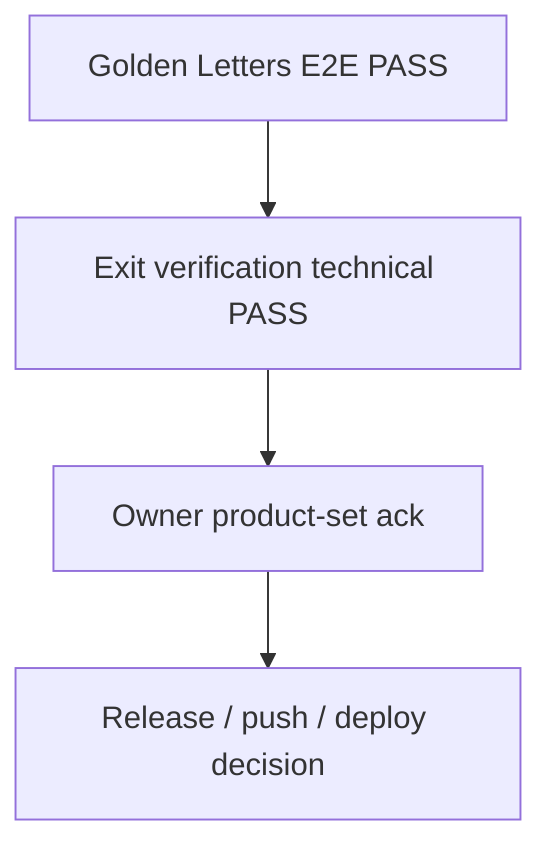

# WORKOS — Master Finalization Roadmap V1

**Status:** ACTIVE — primary V1 finalization navigator  
**Date:** 2026-08-10  
**Owner GO:** `AUTHORIZE_WORKOS_MASTER_FINALIZATION_ROADMAP_V1` (living navigator)  
**Baseline HEAD:** `71ec5b2b` (Golden Letters E2E PASS; Exit resume recorded) · branch `feat/f7i-owner-rate-activation`  
**Principle:** `DONE ENOUGH FOR V1 > PERFECT EVERYWHERE`

> **Use this document** for current V1 finalization priority and next-build selection.  
> **Use** [`21_WORKOS_IMPLEMENTATION_ROUTE.md`](./21_WORKOS_IMPLEMENTATION_ROUTE.md) for detailed historical implementation/architecture route — not as competing “current status” SoT. Doc 21 spine tables are partly stale vs Aug 2026 execution/labor closures.

---

## 1. Purpose

Answer, from **repo/runtime truth**:

> What is the shortest correct path from today’s WorkOS to a V1 that operators can actually use?

This roadmap is practical, evidence-based, and living. It is **not** a micro-task backlog and **not** permission to implement without a separate Owner GO.

---

## 2. V1 definition (practical)

**WorkOS V1** = Letters Slice 1 can run end-to-end with honest commercial totals, frozen sold scope, executable plan, controlled people/machine shop-floor reality, actual costs where declared, and a deterministic post-job profitability read — on a single-tenant SQLite deployment with safe authz.

### Required E2E chain

```text
Intake V6 (Letters)
  → ProductDefinition / ProductAggregate
  → CPP + EIC (side-by-side)
  → Quote Snapshot V2 → Accept → Order Snapshot V2
  → ExecutionPlan V2 + operational materialization (sold-scope)
  → Eligibility → Assignment (Phase B)
  → Controlled sessions (Execution Reality)
  → MachineRun observe (runtime)
  → Actual labor cost (frozen) + actual material (when used)
  → Profitability monetary composition (DONE — Policy A)
  → Operator-usable UI + production smoke + critical authz
```

### Explicitly NOT required for V1

- REASSIGNMENT_PHASE_E, MachineRun PAUSE/RESUME  
- Capacity Stage 1 activation  
- ACM treatments / Logo-as-sold-root / cassette ACM  
- Internal SVG/DWG/DXF analyzer  
- PostgreSQL migration  
- Payroll ↔ session merge  
- Perfect Product System Form Builder  
- Advanced Profitability analytics / dashboards polish  

---

## 3. Current state summary (accepted recent truth)

Verified against worklogs/QA at HEAD `71ec5b2b` (Exit resume 2026-08-10):

| Claim | Status |
|-------|--------|
| MACHINE_RUN_V1 | STABLE_BASELINE_AFTER_HARDENING |
| CONTROLLED_EMPLOYEE_ASSIGNMENT_COMMAND_SAFETY | PASS |
| CONTROLLED_EXECUTION_SESSION_TASK_REALITY_COMMAND_SAFETY | PASS |
| LEGACY_SESSION_WRITE_PATH_ASSIGNMENT_GATE_CLOSURE | PASS |
| ACTIVE_LEGACY_UNSAFE | 0 |
| PROFITABILITY_ACTUAL_LABOR_INPUT_CLOSURE | PASS |
| LABOR_COST_RATE_SNAPSHOT_AUTHORITY | PASS |
| HISTORICAL_RATE_STABILITY | PROVEN |
| PROFITABILITY_ACTUAL_LABOR_COST_READINESS | READY |
| PROFITABILITY_MONETARY_CALCULATION | DONE_FOR_V1 (Policy A wired) |
| REASSIGNMENT_PHASE_E | DEFERRED |
| CAPACITY_STAGE_1 | IMPLEMENTED_INACTIVE |
| QA_MUTATIONS (this GO) | 0 |
| COMMERCIAL_OFFER | DONE_FOR_V1 (currency truth closure 2026-08-10) |
| PRODUCTION_SECURITY_WRITE_GATE | DONE_FOR_V1 |
| MATERIAL_ACTUALS_V1 | DONE_FOR_V1 |
| PROFITABILITY_ACTUAL_MATERIAL_COST_READINESS | READY |
| MACHINE_COST_V1 | DECLARE_NA_FOR_V1 (Owner confirmed) |
| OTHER_DIRECT_COST_V1 | DECLARE_NA_FOR_V1 (Owner confirmed) |
| PROFITABILITY_MONETARY_COMPOSITION | DONE_FOR_V1 |
| PROFITABILITY_CURRENCY_POLICY | A (RON costs → EUR @ Order-convert stamp) |
| BOUNDED_UI_HONESTY | DONE_FOR_V1 (Light Theme systemic closure 2026-08-10) |
| PRODUCTION_READINESS | DONE_FOR_V1 |
| SQLITE_V1_STATUS | ACCEPTED (DEC-DATABASE-01; single-tenant) |
| WORKOS_V1_EXIT_VERIFICATION | TECHNICALLY_READY_OWNER_ACK_PENDING |
| WORKOS_V1_STATUS | NOT_FINALIZED_UNTIL_OWNER_ACK |
| WORKOS_V1_COMPLETION_ESTIMATE | ~99% (technical exit PASS; product-set Owner ack remaining) |
| LIGHT_THEME_V1 | DONE_FOR_V1 |
| UI_HONESTY_V1 | DONE_FOR_V1 |
| GOLDEN_LETTERS_E2E_FINAL_PROOF | PASS |
| STATUS_RECONCILIATION_LABOR_MONEY | DOCUMENTED (Golden path ≠ DECLARE_NA; READY unchanged) |

---

## 4. Domain matrix

| Domain | Current status | Required V1 | What is proven | Exact missing V1 piece | Blocker | Reopen? |
|--------|----------------|-------------|----------------|------------------------|---------|---------|
| A. Intake V6 | DONE_FOR_V1 | YES | Letters path + EUR presentation + adjustments | List chrome mixed RON aggregates (non-blocking) | — | NO |
| B. Product System | PARTIAL_NON_BLOCKING | CONDITIONAL | VL v2 template truth; freeze at EIC lab stop | Broader catalog polish | Product-set expansion only | NO |
| C. ProductDefinition | DONE_FOR_V1 | YES | Builder compile + guards | — | — | NO |
| D. ProductAggregate | DONE_FOR_V1 | YES | task_rules / WC pilot | — | — | NO |
| E. Pricing Registry | PARTIAL_NON_BLOCKING | CONDITIONAL | F7I honesty + F7I.1 provisional rates | Hub/tab legacy cleanup | Step 12 | NO for V1 |
| F. CPP / EIC | DONE_FOR_V1 | YES | Letters EUR commercial truth + Golden CPP/Quote/Order match | Residual finish mix LATER; Adaos vs snapshot-authoritative freeze noted | — | NO |
| G. Quote Snapshot V2 | DONE_FOR_V1 | YES | Freeze/accept path | Preview vs official labeling | — | NO |
| H. Order Snapshot V2 | DONE_FOR_V1 | YES | EUR\|RON convert; net/VAT/gross envelope; no_reprice | Thin ACM scope if activated | — | NO |
| I. ExecutionPlan | DONE_FOR_V1 | YES | Preview/persist V2 | — | — | NO |
| J. Task graph / materialize | PARTIAL_NON_BLOCKING | YES | Controlled materialize + sold-scope | Broad unscoped materialize policy | Owner GO if expanding | NO controlled path |
| K. Eligibility / assignment | DONE_FOR_V1 | YES | Phase B safety PASS | Live workshop soak | — | NO |
| L. Sessions / Reality | DONE_FOR_V1 | YES | Single writer; bridges gated; END≠complete | — | — | NO |
| M. MachineRun runtime | DONE_FOR_V1 | YES | Command lifecycle + UI | Cost authority (separate) | — | NO runtime |
| N. Scheduling | PARTIAL_NON_BLOCKING | NO | Order-centric execution UI | Advanced schedule | — | NO |
| O. Capacity Stage 1 | IMPLEMENTED_INACTIVE_BY_DECISION | NO | Code present, inactive | Activation | Owner Option D | NO |
| P. Actual material cost | DONE_FOR_V1 | YES | Freeze-on-write StockMovement; material_input helper; historical stability PROVEN | Operator capture discipline for Letters jobs | — | NO inventory program |
| Q. Actual labor cost | DONE_FOR_V1 | YES | Time + rate snapshot + finalize → ActualLaborCostLine; RM can include labor | Golden E2E did not call finalize (see Exit Record reconciliation) | — | NO |
| R. Actual machine cost | DECLARE_NA_FOR_V1 | NO (V1) | Runtime exists; Owner N/A for cost | — | — | Later if INCLUDE |
| S. Other/service actuals | DECLARE_NA_FOR_V1 | NO (V1) | Explicit N/A_FOR_V1 (not zero) | — | — | Later if INCLUDE |
| T. Profitability monetary | DONE_FOR_V1 | YES | Composition + N/A + Policy A FX stamp; historical stability | — | — | NO |
| U. HR / Pontaj boundary | DONE_FOR_V1 | YES | Separation proven | — | Salary≠job cost | NO |
| V. Utilaje registry | PARTIAL_NON_BLOCKING | YES | Registry + MR link | Capacity util% honesty | — | Bounded |
| W. Modules / Governance | PARTIAL_NON_BLOCKING | YES | Truth Control Center | Minor label drift | — | Docs sync |
| X. Operator UI | DONE_FOR_V1 | YES | UI honesty + Light Theme systemic closure; Quotes EUR honesty | P2/P3 polish POST_V1 | — | NO |
| Y. Legacy / dead | DONE_FOR_V1 (safety) | YES (safety) | Session legacy gated; intake-v5 unmounted; HR salary gated | Residual list chrome / hub cleanup | — | NO reopen for V1 |
| Z. Production readiness | DONE_FOR_V1 | YES | Detached start; Alembic; build; backup/restore; smoke pack | Cloud rollout LATER | — | NO for V1 lab |

**Counts (exact):** DONE_FOR_V1 = 17 · OPEN/PARTIAL_V1_BLOCKER = 0 · PARTIAL_NON_BLOCKING = 6 · DECLARE_NA_FOR_V1 = 2 (R,S) · IMPLEMENTED_INACTIVE = 1 · DEFERRED (Phase E / PAUSE) = Later · EXIT = TECHNICALLY_READY_OWNER_ACK_PENDING

---

## 5. CLOSED_FOR_V1

Do **not** reopen unless concrete defect / V1 blocker / integrity issue.

| Domain | Why closed | Proof | LATER extensions |
|--------|------------|-------|------------------|
| ProductDefinition / Aggregate (Letters) | Compile path proven | builder/aggregate services; F7A | Multi-template |
| Quote/Order Snapshot V2 | Freeze/accept/no_reprice | snapshot services; sold-scope reader | ACM/Logo sold roots |
| ExecutionPlan V2 | Persist/preview | EP services + QA fixtures | Advanced scheduling |
| Assignment Phase B | Safety PASS | `2026-08-09_controlled_employee_assignment_*` | Phase C/D soak; Phase E |
| Sessions / Reality writer | Single authority; bridges gated | `5034f762` / `811557c6` arc | Pause/block redesign |
| MachineRun runtime V1 | Stable baseline | MachineRun harden worklog | PAUSE/RESUME; cost |
| Actual labor time | Proven | `7dfc2013` | — |
| Labor rate snapshot | Historical stability PROVEN | `0fb723b2` | Rate editor UX |
| HR/Pontaj boundary | Separation | Owner decision docs | Payroll reconciliation |
| Commercial offer currency/rates (Letters) | EUR native + fail-closed mix; Order EUR\|RON; revenue envelope | `WORKOS_V1_COMMERCIAL_OFFER_CURRENCY_AND_RATE_CLOSURE` | Quotes list aggregate currency polish; `printed_vinyl` |
| Production security write-gate | Intake V5 unmounted; HR cost projection gated; anonymous critical writes = 0 | `WORKOS_V1_PRODUCTION_SECURITY_WRITE_GATE_CLOSURE` | External pentest LATER; APP_ENV discipline in smoke pack |
| Material actuals sufficiency | Frozen StockMovement + material_input; planned≠actual; historical PROVEN | `WORKOS_V1_MATERIAL_ACTUALS_SUFFICIENCY` | Warehouse/MRP LATER; operator issue discipline |

---

## 6. OPEN_V1_REQUIRED

| Domain | Missing capability | Dependency | Arch risk | UI | Schema | Size |
|--------|-------------------|------------|-----------|----|--------|------|
| _(none technical)_ | — | — | — | — | — | — |
| Owner product-set ack | Formal LETTERS_ONLY + Logo/ACM LATER lines | Owner chat paste | — | — | — | — |

Technical V1 blockers = 0. Machine/other remain `DECLARE_NA_FOR_V1`.

---

## 7. LATER_NOT_REQUIRED_FOR_V1

Verified against current truth:

- REASSIGNMENT_PHASE_E  
- MachineRun PAUSE / RESUME  
- Capacity Stage 1 activation  
- ACM face treatments / Logo sold root / cassette ACM  
- Advanced machine telemetry / auto-batching  
- Employee optimization / efficiency scoring  
- Advanced payroll coupling / FX sophistication  
- Advanced Profitability analytics dashboard polish  
- Pricing hub full legacy kill (Step 12) — unless it creates active money bypass  
- PostgreSQL migration (unless Owner chooses multi-tenant cloud)  
- Form Builder / Product System lab expansion  
- Internal graphic analyzer  

---

## 8. PROFITABILITY_INPUT_MATRIX

| Input | Readiness | Evidence |
|-------|-----------|----------|
| Revenue | READY | Frozen `accepted_commercial_total` + currency; net/VAT/gross envelope when Quote had them |
| Labor | READY | Closed sessions + finalize → frozen `ActualLaborCostLine` |
| Material | READY | Freeze-on-write StockMovement + material_input; fail-closed if unused/missing cost |
| Monetary composition | DONE | Same-currency + Policy A (RON→EUR via Order stamp) |
| Machine | N_A_FOR_V1 | Owner `DECLARE_NA_FOR_V1` — not zero |
| Other | N_A_FOR_V1 | Owner `DECLARE_NA_FOR_V1` — not zero |
| FX stamp | READY | `profitability_fx_v1` at Order convert; live Settings ignored at P&L |
| Provenance | READY | Labor/material + FX stamp; N/A explicit for machine/other |
| Currency | READY | Policy A EUR reporting; native RON costs; Order FX stamp |
| Historical stability | PROVEN | Labor/material freeze + FX stamp ignore live Settings |

```text
PROFITABILITY_REVENUE_READINESS = READY
PROFITABILITY_ACTUAL_LABOR_COST_READINESS = READY
PROFITABILITY_MONETARY_CALCULATION = DONE_FOR_V1
```

---

## 9. Product coverage

| Template / family | Class |
|-------------------|-------|
| `TPL-VOLUMETRIC-LETTERS_v2` | **V1_REQUIRED** |
| Letters + ACM shell (no treatments) | **V1_OPTIONAL** / CONDITIONAL |
| ACM treatments / logo-on-ACM | **LATER** |
| `TPL-VOLUMETRIC-LOGO_v1` sold root | **OWNER_DECISION_REQUIRED** (default LATER) |
| `TPL-ACM-CASSETTED-PANEL` | **LATER** |
| WorkIntake V2 / QuoteWizard as money authority | **ARCHIVED** for V1 spine (V6 canonical) |

---

## 10. Owner decisions required

1. **V1 product set lock** — **OPEN — sole remaining Owner ack for exit.** Expected line: `WORKOS_V1_PRODUCT_SET = LETTERS_ONLY` (+ Logo/ACM expansion = LATER). Do not infer.  
2. ~~Complete offer currency law~~ **RESOLVED for V1** — native EUR ops (no invent FX); Order convert accepts EUR\|RON.  
3. ~~Provisional rates~~ **RESOLVED for V1** — F7I.1 provisional retained as V1-acceptable with honesty labels.  
4. **Residual finishes** — `printed_vinyl` remains fail-closed/LATER (non-blocking for Letters Oracal path); Oracal 641 live at 6.5 EUR (registry Owner confirmed).  
5. ~~**SQLite as V1 production DB**~~ **RESOLVED for V1 single-tenant** — DEC-DATABASE-01 + readiness pack; cloud Postgres LATER.  
6. ~~**Machine actual cost in V1**~~ **RESOLVED** — `DECLARE_NA_FOR_V1`.  
7. ~~**Other direct cost in V1**~~ **RESOLVED** — `DECLARE_NA_FOR_V1`.  
8. ~~**Profitability currency composition**~~ **RESOLVED** — `PROFITABILITY_CURRENCY_POLICY = A` wired (`profitability_fx_v1` at Order convert).

Do **not** ask Owner to decide technical implementation details agents can resolve.

---

## 11. Dependency graph (remaining V1)



Closed upstream (do not re-enter): Commercial · Light · UI honesty · PD/PA → Snapshot → EP → Assign → Session → Labor authority → MachineRun → Material · Profitability Policy A · Golden E2E.

---

## 12. Critical path (max ~8 nodes)

1. ~~Owner commercial/currency law + commercial offer completeness~~ **DONE**  
2. ~~Production security gates~~ **DONE**  
3. ~~Material actuals V1 sufficiency~~ **DONE**  
4. ~~Profitability currency + monetary composition~~ **DONE** (Policy A)  
5. ~~Bounded operator UI honesty + Light Theme~~ **DONE**  
6. ~~Production readiness pack~~ **DONE**  
7. ~~Golden Letters E2E Final Proof~~ **DONE** (`PASS`)  
8. ~~V1 exit verification resume~~ **TECHNICALLY PASS** — Owner product-set ack pending (`WORKOS_V1_EXIT_RECORD.md`)  

---

## 13. Next 3 builds (ordering only — not authorized)

### NEXT_RECOMMENDED_BUILD

```text
NONE_BEFORE_RELEASE_DECISION
```

**Why:** Technical exit criteria PASS. Remaining gate is Owner product-set acknowledgment only — not a feature build.

### BUILD_AFTER_NEXT

```text
WORKOS_V1_EXIT_OWNER_PRODUCT_SET_ACK
```

(Owner paste only — then `FINALIZED_FOR_AGREED_SCOPE`.)

### BUILD_AFTER_THAT

```text
RELEASE_PUSH_DEPLOY_DECISION or POST_V1 / V1.1 ROADMAP
```

---

## 14. V1 exit criteria

Canonical list (status from Exit resume 2026-08-10 — full matrix in `WORKOS_V1_EXIT_RECORD.md`):

| # | Criterion | Status | Blocker |
|---|-----------|--------|---------|
| 1 | Letters Intake→PD/PA→CPP/EIC→Snapshot→Order honest totals | PASS | — |
| 2 | Commercial snapshots historically stable | PASS | — |
| 3 | ExecutionPlan sold-scope tasks | PASS | — |
| 4 | Assign + controlled sessions | PASS | — |
| 5 | MachineRun observe usable | PASS | — |
| 6 | Actual labor cost frozen/historically stable | PASS | — |
| 7 | Actual material available/fail-closed | PASS | — |
| 8 | Profitability never invents | PASS | — |
| 9 | No unauthenticated commercial/exec write bypass | PASS | — |
| 10 | HR salary not broadly readable | PASS | — |
| 11 | Required UI flows discoverable | PASS | — |
| 12 | Capacity / Phase E / PAUSE deferred honestly | PASS | — |
| 13 | SQLite decision + production smoke | PASS | — |
| 14 | Modules/Governance match closed-domain truth | PASS | — |

```text
EXIT_CRITERIA_BLOCKED = 0
OPEN_V1_TECHNICAL_BLOCKERS = 0
```

Labor money: see Exit Record `STATUS_RECONCILIATION_REQUIRED` — Golden fixture path ≠ DECLARE_NA; READY unchanged.

---

## 15. Completion estimate

```text
WORKOS_V1_COMPLETION_ESTIMATE = ~99%
WORKOS_V1_COMPLETION = NOT_YET_100_UNTIL_OWNER_ACK
TECHNICAL_EXIT_CRITERIA = PASS

ARCHITECTURAL_FOUNDATION = 10/10
V1_FUNCTIONAL_CLOSURE    = 10/10
OPERATOR_UI_CLOSURE      = 10/10
PRODUCTION_READINESS     = 10/10
```

**What remains:** Owner product-set acknowledgment only. Then release/push/deploy decision or POST_V1 / V1.1 roadmap — not another V1 feature build.

---

## 16. UI finalization (domain-level)

| Area | Class |
|------|-------|
| `/intake`, `/intake-v6/...` Letters | USABLE_FOR_V1 |
| `/quotes`, `/orders` | USABLE_FOR_V1 |
| `/execution/machine-runs` | USABLE_FOR_V1 |
| `/shop-floor` | USABLE_FOR_V1 |
| `/modules`, `/governance` | USABLE_FOR_V1 |
| `/inventory/pricing` | NEEDS_BOUNDED_CLOSURE |
| `/execution` detail density | NEEDS_BOUNDED_CLOSURE |
| `/utilaje` (capacity messaging) | NEEDS_BOUNDED_CLOSURE |
| Logo/ACM intake completeness | NEEDS_BOUNDED_CLOSURE / LATER |

No redesign-every-screen program.

---

## 17. Legacy / dead pieces (roadmap level)

| Class | Items |
|-------|-------|
| V1_BLOCKING | _(none remaining in legacy auth class — security write-gate closed)_ |
| V1_NON_BLOCKING | QuoteWizard/CostEngine as money authority (marked legacy); `/operator`/`/tablet` compat |
| LATER_CLEANUP | Pricing hub tab debt; Product System planned shells; demo routes; external pentest |

---

## 18. Deployment / security (V1-critical)

- **SQLite** = current canonical runtime; Postgres supported-in-code, **not** required for V1 if Owner confirms single-tenant.  
- **Security write-gate:** DONE_FOR_V1 (`intake-v5` unmounted; HR salary/cost projection gated).  
- **Residual deploy risk:** wrong `APP_ENV` → dev auth bypass (existing BUILD 20 fail-closed) — covered in production readiness pack.  
- No giant security program — do not reopen SSO/MFA/SIEM for V1.

---

## 19. Modules / Governance drift (list only)

- Reality node: labor CLOSED / rates PROVEN — keep aligned.  
- Production security: auth authority = JWT/`get_current_user`; permission authority = `PERMISSION_MATRIX`; operational employee projection vs `employee.view_hr_cost`; Intake V5 = DEPRECATED_NOT_MOUNTED.  
- Post-Job limitation text may still say “labor $ open” while labor freeze is READY — sync when monetary composition lands.  
- Doc 21 materialization/session rows are stale vs Aug 2026 — superseded by this roadmap for priority.

Trivial factual sync only; no feature work beyond security closure evidence.

---

## 20. Relation to doc 21

| Document | Role |
|----------|------|
| **This file** | Current V1 finalization SoT / priority navigator |
| `21_WORKOS_IMPLEMENTATION_ROUTE.md` | Historical controlled implementation route + deep architecture |
| `20_ROADMAP_STEPS_7G_TO_12.md` | Step catalog (historical) |

Do not maintain two competing “what next” roadmaps.

---

## 21. Update protocol

**Update after:** major domain closure; architecture/status change; blocker added/removed; Owner changes V1 scope.  

**Do not update after:** tiny tests; cosmetic fixes; minor QA reruns.

Keep this document short enough to stay useful.

---

## 22. Latest security GO constraints (honored)

```text
DB_SCHEMA_CHANGES = 0
NEW_ALEMBIC = NO
RBAC_PLATFORM = NO
SSO_MFA = NO
QA_MUTATIONS = 0
PUSH = NO
COMMERCIAL_BEHAVIOR_CHANGED = NO
EXECUTION_BEHAVIOR_CHANGED = NO
```
