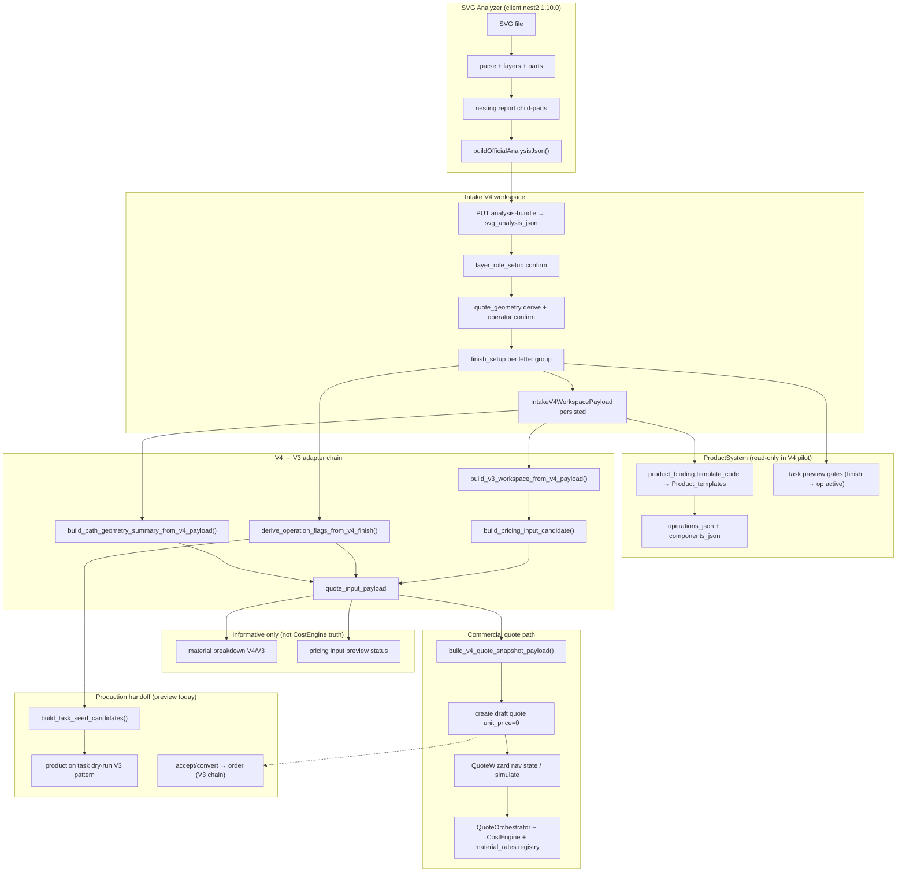

# INTAKE V4 ALIGNMENT AUDIT

**Date:** 2026-06-22  
**Mode:** Read-only — no code changes, no commit  
**Branch:** `local/integration-pr4-plus-svg-path`  
**Auditor:** Cursor agent (repo exploration + external apps)

---

## Repo state at audit time

**Working tree:** dirty (uncommitted). Relevant untracked/modified areas include:

- Full **Intake V4** stack (`backend/services/intake_v4_*`, `frontend/src/lib/intakeV4/`, `frontend/src/components/workos/intake-v4/`, `frontend/src/lib/svgAnalyzer/`)
- **Intake V3** operator SVG upload / file-drop refactors (modified, not V4)
- **`tmp/`** — scratch scripts (must stay uncommitted per project rules)

**Do not treat current V4 code as “released”** — it is active WIP on a feature branch.

---

## 1. Verdict scurt

| Question | Answer |
|----------|--------|
| **Putem implementa Intake V4 acum?** | **Parțial — da pentru pilot volumetric**, nu pentru multi-template production cutover. |
| **Trebuie refactor înainte?** | **Da, pe boundary-uri**, nu pe tot WorkOS. Refactor țintit: contract analyzer ↔ intake ↔ pricing, eliminare dual-truth, stale-state gates. |
| **Ce este blocant?** | (1) Contract stabil `svg_analysis_json` + persist obligatoriu înainte de Review; (2) aliniere finish/geometry între V4 payload, V3 adapter, `quote_input`; (3) invalidare explicită la re-upload (UI + backend); (4) decizie cutover V2/V3/V4; (5) ACM/casetare bond **out of scope** fără template onboarding dedicat; (6) **material breakdown V4 cu prețuri hardcodate** — de aliniat la registry (§19). |
| **Ce este recomandat?** | V4 ca **orchestrator + operator UX**; **nest2/svgAnalyzer 1.10.0** ca engine client; **V3 services** ca adapter chain pricing/production (temporar); **V2** ca sursă de pattern-uri finish/PSU/geometry, nu ca shell. **Un singur analyzer**, template adapters per produs — **nu** analyzer separat per template. |

**Răspuns la întrebarea principală:**

> Intake V4 trebuie construit ca **orchestrator comercial/operator** care consumă un **analysis snapshot** normalizat de la SVG Analyzer (engine), aplică **reguli de template** (litere volumetrice, bond, casetă), și produce **quote_input + production handoff** prin servicii existente (V3 adapters / CostEngine path). **Nu** duplicăm parserul/nesting-ul în formular; **nu** mutăm DXF/CNC export în intake; **nu** amestecăm nesting pe layer.

---

## 2. Harta sistemului curent

| Sistem | Locație principală | Rol actual | Status | Reutilizabil V4 | Observații |
|--------|---------------------|------------|--------|-----------------|------------|
| **Intake V2** | `frontend/src/pages/WorkIntakeV2.tsx`, `frontend/src/components/workos/workIntakeV2/`, `frontend/src/lib/workIntakeV2/` | Operator volumetric pe `/intake-v2/:id`; persistă `intake_requests.product_spec_json` | **ACTIVE** (path of record volumetric) | **Parțial** — finish, PSU, letter groups, geometry field names | Fără workspace snapshot; readiness frontend-only; quote handoff via nav state |
| **Intake V3 hub** | `frontend/src/pages/IntakeV3App.tsx`, `backend/routers/intake_v3_workspaces.py` | Contract-first workspace + ~25 panouri debug + quote chain complet | **ACTIVE** (R&D + guards) | **Parțial** — pricing/production adapters, readiness, material breakdown | Prea multe surse SVG truth; UX fragmentat |
| **Intake V3 operator** | `frontend/src/pages/IntakeV3OperatorWorkspaceApp.tsx`, `operator-workspace/three-step/` | 3-step operator pe `/intake-v3/:id/operator` | **ACTIVE** paralel | **Parțial** — UX patterns, layer role panels | SVG parse **server Python**, nu nest2 |
| **Intake V4** | `frontend/src/pages/IntakeV4OperatorWorkspaceApp.tsx`, `backend/routers/intake_v4_workspaces.py` | Atoms 3-step; client nest2; propriu API/table `intake_v4_workspaces` | **WIP pilot** | **Target shell** | Reutilizează V3 adapters; port nest2 în `lib/svgAnalyzer` |
| **SVG Analyzer (WorkOS lib)** | `frontend/src/lib/svgAnalyzer/` | Engine nest2 1.10.0 embedded | **WIP** | **Da — core engine** | Fără UI standalone; fără export DXF |
| **SVG Analyzer (nest2 app)** | `C:\Users\offic\Desktop\nest2` | Sandbox + DXF/Bond lab + schema 1.10.0 | **Reference / R&D** | **Da — source of truth engine** | Child-parts-only nesting |
| **SVG Analyzer (svg-analyzer-vs)** | `C:\Users\offic\Desktop\svg-analyzer-vs` | Versiune mai veche 1.7.0; nesting layer-group **și** child-parts | **Legacy reference** | **Nu ca canonical** | Regula “nesting doar child parts” e deja în nest2/WorkOS |
| **Pricing / CostEngine** | `backend/services/quotes*`, formula handlers, QuoteWizard | Prețuri, formule, simulate, commercial totals | **PROTECTED** | **Consumă `quote_input`** — nu reimplementa în intake | Fail-closed gates |
| **Production handoff** | V3 `intake_v3_production_*`, task dry-run, accept/convert | Task seeds, readiness order, snapshots | **ACTIVE via V3** | **Parțial** — V4 wrap-uiește dry-run | Child parts → tasks: incomplet în V4 |
| **SVG upload V2** | `backend/services/work_intake_svg_upload_service.py` | Upload + Python layer analysis → spec | **ACTIVE for V2** | **Nu** — alt contract | V4 folosește analysis-bundle client |
| **SVG upload V3** | `intake_v3_svg_analysis_service.py`, workspace attach | Server parse + invalidation | **ACTIVE for V3** | **Nu ca primary V4** | Risc divergență metrici vs nest2 |
| **Template logic** | `WorkIntakeTemplateConfig`, ProductSystem dossier, `TPL-*` registry | Reguli per produs | **Volumetric wired** | **Pattern da, ACM nu** | `TPL-ACM-CASSETTED-PANEL` = future only |
| **Color registry** | `frontend/src/lib/colorRegistry/` | RAL/Oracal UI | **Frontend config** | **Da — UI only** | Nu auto-pricing |

---

## 3. Ce păstrăm din Intake V2

### Logică de domeniu (migrate/refolosi, nu reimplementa)

- **Per-group letter finishes** — `svgLetterGroups.ts`, `V2LetterGroupFinishesSection`, cant depth `[30,60,80,100]`, face `none` = plexiglas brut
- **Artwork policromie / print assignments** — `svgArtworkFinishAssignments.ts` (V4 parțial portat în `intakeV4ArtworkFinish.ts`)
- **Lighting + PSU** — `lightingPlanning.ts`, `psuAllocation.ts`, `volumetricFrontlitIntake.ts` (LED pitch 100 mm, module 1.44 W default)
- **Roll width 1000/1260 mm** — `INTAKE_ROLL_WIDTH_OPTIONS` în `intakeVolumetricSpec.ts`
- **Geometry field naming** — `letter_perimeter_m`, `letter_face_area_m2`, `letter_count`, `width_mm`, `height_mm` → quote_input
- **Readiness / repair panel semantics** — fail-closed, operator confirms geometry before quote
- **ColorRegistrySelect** — Oracal/RAL picker per usage scope
- **Template config pattern** — `WorkIntakeTemplateConfig` / readiness strategy per `TPL-*`

### UI patterns utile

- Unified zone cards (context, SVG, production, readiness) — **concept**, nu layout-ul literal
- `LetterGroupReturnCantFields` — refolosit direct în V4
- Volumetric quote preview (informational) — de readus în V4 Review ca read-only

### Date compatibile producție/ofertare

- `product_spec_json` canonical fields map 1:1 la `quote_input` via `volumetricQuoteInput.ts`
- `psu_configuration[]`, `estimated_led_watts`, `required_psu_watts`
- `face_vinyl_roll_width_mm`, `return_depth_mm`, finish types Oracal/RAL

---

## 4. Ce nu păstrăm din Intake V2

- **Shell UI** — zone scroll 2-column → înlocuit de Atoms 3-step V4
- **Persistență monolit** — tot în `product_spec_json` fără raw vs confirmed split
- **Readiness doar client** — fără server quote guard / dry-run
- **Dual finish model** — global legacy cant/face când există letter groups (`shouldHideLegacyGlobalFinishForm` = debt)
- **SVG upload endpoint V2** — `svg-upload-and-analyze` pe `intake_requests` (V4 are analysis-bundle propriu)
- **Quote handoff via nav state only** — V4 trebuie snapshot server `quote_input_payload`
- **Stale merge complexity** — `vectorUploadLockRef`, refresh races (V4 reducer e mai bun, dar incomplet)
- **Classic `/intake/:id` path** — legacy, nu bază V4
- **Pricing în intake** — V2 n-a avut; V4 tot nu trebuie CostEngine inline

---

## 5. Ce preluăm din SVG Analyzer (nest2 / WorkOS lib)

### Engine (canonical @ schema 1.10.0)

| Capability | Module | Regulă |
|------------|--------|--------|
| SVG parse | `analyzer/parseSvg.ts`, `normalizeSvg.ts` | Layere = top-level `<g>` |
| Geometry document | `analyzeGeometry.ts` | width/height mm, viewBox |
| Layer metrics | `analyzeLayers.ts` | perimeter, area, colors per layer |
| Auto role guess | `guessLayerAutoRole.ts`, `analyzePaint.ts` | face, vinyl, printed_artwork, inner_hole, … |
| Layer role confirmation | `layerRoleConfirmationState.ts` | Operator confirmă — **separat de nesting** |
| Child parts | `part-extractor/extractParts.ts` | Subpath grouping; **unitate nesting** |
| Nesting | `nesting/buildNestingReport.ts` | **Child-parts only**; rolls by layer+color |
| inner_hole / bond derivations | `deriveInnerHolePackage.ts`, `applyBondProductionPlates.ts` | Pentru template-uri viitoare |
| Official JSON | `buildOfficialAnalysisJson.ts` | Snapshot persistat |

### Reguli ferme (confirmate în cod nest2 + `docs/LAYER_ROLES_VS_NESTING.md`)

1. **Nesting = child parts only** — nu layer group, fără selector Layer group/Child parts în producție
2. **Layer = container semantic** — rol pentru clasificare/validare, nu placare nesting
3. **Child part = unitate producție** — geometrie, material hints, sursă layer, validare
4. **Analyzer ≠ formular** — produce snapshot; Intake completează și confirmă

---

## 6. Ce nu mutăm din SVG Analyzer în WorkOS (încă)

- **Standalone React UI** — `SvgAnalyzerPage`, panouri demo nest2/svg-analyzer-vs
- **DXF / Corel / Bond flat pattern export** — `nest2/src/export/*` — rămâne R&D sau technical drawer Phase 4
- **Layer-group nesting mode** — doar în svg-analyzer-vs 1.7.0; **abandonat** canonical
- **Part-level roleGuess** — mutat la layer-only în 1.8+
- **Contour-true nesting** — bbox shelf doar; nu inventa în ERP acum
- **Pricing / inventory mutation** — explicit out of scope analyzer README

---

## 7. Contract propus Intake V4 ↔ SVG Analyzer

### 7.1 Snapshot analysis (persistat ca `svg_analysis_json`)

```json
{
  "schemaName": "svg-analyzer-analysis",
  "schemaVersion": "1.10.0",
  "engineVersion": "nest2-port",
  "createdAt": "2026-06-22T12:00:00.000Z",
  "sourceFileName": "pbl-complex.svg",
  "sourceFileSize": 8421,
  "file": {
    "name": "pbl-complex.svg",
    "hash": "sha256:…",
    "width_mm": 3000,
    "height_mm": 800
  },
  "document": {
    "widthMm": 3000,
    "heightMm": 800,
    "viewBox": "0 0 3000 800"
  },
  "geometry": {
    "perimeterMl": 12.5,
    "boundingAreaSqm": 2.4
  },
  "layers": [
    {
      "id": "litere-volumetrice-1",
      "name": "litere-volumetrice-1",
      "autoRole": "face",
      "paintEvidence": null,
      "perimeterMl": 8.2,
      "filledAreaSqm": 1.1,
      "colors": ["#009640"]
    }
  ],
  "colors": [],
  "layerRoleConfirmation": {
    "schemaVersion": "layer_role_confirmation_v1",
    "confirmationStatus": "complete",
    "layers": [
      {
        "layerKey": "litere-volumetrice-1",
        "autoRole": "face",
        "confirmedRole": "face",
        "confirmationState": "confirmed"
      }
    ]
  },
  "parts": {
    "strategy": "subpath-shape-grouping",
    "items": [
      {
        "partId": "part-001",
        "sourceLayerId": "litere-volumetrice-1",
        "sourceLayerName": "Publi-P",
        "boundsMm": { "width": 420, "height": 580 },
        "perimeterMm": 2100,
        "filledAreaSqm": 0.12,
        "canNest": true,
        "contourBreakdown": { "outer": 1, "inner": 0 }
      }
    ],
    "nestableCount": 10,
    "count": 12
  },
  "nesting": {
    "granularity": "child-parts",
    "rolls": [
      {
        "configId": "vinyl_roll_1260",
        "jobs": [
          {
            "sourceLayerName": "litere-volumetrice-1",
            "colorKey": "651-009640",
            "consumedLengthMm": 8200,
            "efficiencyPercent": 78
          }
        ]
      }
    ],
    "sheets": []
  },
  "metrics": {
    "letter_face_area_m2": 1.1,
    "letter_perimeter_m": 8.2,
    "letter_count": 10,
    "artwork_area_m2": 0.85
  },
  "warnings": [],
  "errors": [],
  "analysis_version": "1.10.0"
}
```

### 7.2 Workspace payload V4 (orchestrator — superset)

```json
{
  "schema_version": "1.0.0",
  "client": { "client_name": "…", "width_mm": null, "height_mm": null },
  "product_binding": { "template_code": "TPL-VOLUMETRIC-LETTERS" },
  "svg_source": {
    "file_name": "pbl-complex.svg",
    "file_hash": "sha256:…",
    "upload_status": "analyzed"
  },
  "svg_analysis_json": { },
  "layer_role_setup": {
    "confirmation_status": "complete",
    "layers": []
  },
  "quote_geometry": {
    "letter_count": 10,
    "letter_perimeter_m": 8.2,
    "face_area_m2": 1.1,
    "artwork_area_m2": 0.85,
    "geometry_source": "nest2_face_layers",
    "confirmed": true
  },
  "finish_setup": {
    "confirmed": true,
    "illuminated": true,
    "letter_group_finishes": [
      {
        "group_key": "litere-volumetrice-1",
        "face_finish_type": "oracal_651",
        "face_vinyl_roll_width_mm": 1260,
        "return_finish_type": "oracal_wrapped",
        "return_depth_mm": 60
      }
    ]
  }
}
```

### 7.3 Responsabilități boundary

| Layer | Owns | Must NOT own |
|-------|------|--------------|
| **SVG Analyzer** | parse, layers, parts, nesting prep, warnings, metrics raw | finish prices, quote totals, task assignment, inventory |
| **Intake V4** | template pick, operator confirmations, finish/material choices, persist snapshot, readiness, handoff | path parsing algorithms, CostEngine formulas |
| **Template adapter** | role validation per TPL, operation flags, required fields | SVG DOM walk |
| **Pricing** | rates, formulas, commercial snapshot | SVG analysis |
| **Production** | tasks, execution plans, order readiness | nest2 UI |

### 7.4 Versioning & invalidation rules

- `svg_source.file_hash` change → **invalidate** `finish_setup`, `quote_geometry` derived flags, readiness → `collecting_data`
- `layer_role_setup` change → **recompute** `quote_geometry`, material breakdown, pricing preview
- `finish_setup.confirmed=false` → block Confirm + quote handoff
- Persist analysis **before** allowing Review step (fail-closed gate — see §10)

---

## 8. Intake V2 — răspunsuri obligatorii

| # | Question | Answer |
|---|----------|--------|
| 1 | V2 mai e bază bună pentru V4? | **Referință operațională + libs**, nu shell. Path of record încă V2 pentru volumetric live. |
| 2 | Ce logică migrăm? | Letter groups, finishes, lighting/PSU, roll width, geometry fields, readiness semantics, ColorRegistry integration. |
| 3 | UI patterns utile? | Per-group finish cards, cant fields, repair/readiness, quote preview read-only. |
| 4 | Probleme conceptuale V2? | Mega-blob spec, dual finish models, client-only gates, stale refresh races, no workspace versioning. |
| 5 | Date compatibile producție? | Da — `product_spec_json` → `volumetricQuoteInput.ts` → CostEngine path testat E2E. |

---

## 9. Intake V3 — răspunsuri obligatorii

| # | Question | Answer |
|---|----------|--------|
| 1 | V3 parte din V4? | **Adapters + contract chain da; operator UX nu.** V4 înlocuiește shell-ul V3 operator, nu hub-ul debug (pe termen scurt coexistă). |
| 2 | Logică bună de păstrat? | `build_pricing_input_candidate`, quote guards, dry-run, material breakdown, layer role propagation, accept/convert chain. |
| 3 | Risc amestec operator vs comercial? | **Da** dacă V3 hub rămâne “everything panel” — V4 trebuie să rămână 3-step focused; debug în drawer/route separat. |

---

## 10. SVG Analyzer — răspunsuri obligatorii

| # | Question | Answer |
|---|----------|--------|
| 1 | Integrat direct sau engine separat? | **Engine separat (lib/package), embedded client-side în V4.** Nu server-side re-parse duplicat. |
| 2 | Contract export? | `buildOfficialAnalysisJson` @ 1.10.0 + `layerRoleConfirmation` + hash metadata (§7). |
| 3 | Ce rămâne în analyzer vs Intake? | Analyzer: geometrie/parts/nesting prep. Intake: confirmări, finisaje, prețuri, quote, audit. |
| 4 | Suportă casetare bond? | **Da, în nest2** (`applyBondProductionPlates`, inner_hole package) — necesită **template adapter**, nu analyzer nou. |
| 5 | Risc analyzer per template? | **Foarte mare** — duplicare parse/nesting, metrici incompatibile, QA imposibil. **Un engine, N template adapters.** |

---

## 11. Strategia Intake V4 (orchestrator)

### 11.1 Ce face Intake V4

1. Creează workspace (`intake_v4_workspaces`)
2. Alege template (`TPL-*`) — pilot: volumetric letters only
3. Primește SVG (pick/drop) → rulează engine client
4. Operator confirmă **layer roles** (nu nesting mode)
5. Persistă **analysis bundle** (fail-closed)
6. Operator completează **finisaje per grup** + iluminare job-level
7. Afișează **material breakdown** (informativ), **pricing input preview**, **task dry-run**
8. Confirmă → **draft quote** cu snapshot `quote_input_payload`
9. Păstrează audit: hash fișier, timestamps, confirmed flags

### 11.2 Ce face SVG Analyzer engine

- Parse + measure + classify layers
- Extract child parts (subpath grouping)
- Build nesting report (child parts → rolls/sheets)
- Emit warnings/errors + confidence
- **Nu** scrie în DB WorkOS

### 11.3 Template logic (per `TPL-*`)

| Template | Adapter responsibility |
|----------|------------------------|
| `TPL-VOLUMETRIC-LETTERS` | Roles: face/artwork/ignore; LED by perimeter; cant depth; Oracal face vinyl |
| `TPL-ACM-CASSETTED-PANEL` (future) | Sheet nesting dominant; bond plates; inner_hole illumination; **no letter LED** |
| Casetă luminoasă (future) | Diffuser/backing roles; sheet + edge returns; PSU rules diferite |

**Implementare:** `TemplateIntakeAdapter` interface — `validateRoles`, `deriveQuoteGeometry`, `buildFinishDefaults`, `operationFlags`, `readinessBlockers`.

### 11.4 Pricing / CostEngine

- Intake produce **`quote_input_payload` validat** (V4 → V3 adapter today) — **fără chei comerciale** (`unit_price`, `grand_total`, etc.)
- Pricing rămâne QuoteWizard + `QuoteOrchestrator` + CostEngine + `inventory_materials` registry
- TVA / adaos comercial — **nu** în intake
- Material breakdown V4 = **informativ only**; nu este sursa de adevăr pentru CostEngine
- **Detaliu complet:** §19 (ProductSystem / Prices / WorkOS Integration) — gap-uri registry, flux snapshot → quote → production

### 11.5 Production handoff

- Task seed candidates din ProductSystem + operation flags
- Child parts din `svg_analysis_json.parts` → viitor: map explicit part → task/material line
- Dry-run acum via V3 builder; target: V4-native context cu același contract output
- Accept/convert/order — rămâne V3 chain până la cutover

---

## 12. Template viitor: casetare bond — răspuns ferm

> **Nu facem un al doilea SVG Analyzer.** Folosim **același engine nest2 1.10.0** cu:
> - role mapping diferit (`inner_hole`, bond plate derivations deja în nest2);
> - template adapter `TPL-ACM-CASSETTED-PANEL`;
> - nesting sheet-first + derivations `applyBondProductionPlates`;
> - validări și operation catalog din ProductSystem dossier.

Arhitectura actuală **permite** asta **dacă**:

1. `svg_analysis_json` rămâne template-agnostic
2. Template adapter traduce roles + parts → quote_geometry + finish model
3. V4 workspace payload adaugă `template_code` gates (deja există)
4. ACM **nu** se activează parțial fără build QA dedicat (regulă AGENTS.md)

---

## 13. Audit stale state / re-upload (fără fix)

### 13.1 Simptome raportate

- Dimensiuni vechi după upload fișier nou în Step 2
- Header filename inconsistent
- Material breakdown / pricing pe date vechi

### 13.2 Cauze probabile (cu locație cod)

| Symptom | Probable cause | Location |
|---------|----------------|----------|
| Header arată fișier nou, metrici vechi | Header citește `state.svg` (local); Review citește `payload.quote_geometry` (persisted) — **prioritate persisted** | `IntakeV4Header.tsx`, `IntakeV4ReviewStep.tsx` + `readQuoteGeometryFromPayload` |
| Step 2 accesibil cu analiză veche | `canAccessIntakeV4Step(review)` = true dacă `hasPersistedAnalysis(payload)` **indiferent** de run local nou | `intakeV4Readiness.ts:19-24` |
| Upload nou fără re-persist | Client `ANALYZER_START` resetează local, dar backend păstrează `svg_analysis_json` până la `PUT analysis-bundle` | `intakeV4WorkspaceReducer.ts`, `useIntakeV4Workspace.ts` |
| Progress bar permite Review fără sync | Step gating nu compară `svg_source.file_hash` cu hash local/analysis run id | `canAccessIntakeV4Step` |
| finish_setup vechi după replace | Backend **șterge** `finish_setup` la hash change doar la persist (`save_analysis_bundle`) | `intake_v4_workspace_service.py:326-327` — corect backend, dar UI poate afișa stale înainte |
| Review local state (form, groups) | `IntakeV4ReviewStep` useState reinițializat la remount, dar **derive** din payload vechi dacă step accesat prematur | `IntakeV4ReviewStep.tsx` |
| Material breakdown stale | `useEffect` depinde de `workspace.updated_at` — nu de `analysisRunId` / file hash | `IntakeV4ReviewStep.tsx:238-255` |
| `preserveLocalAnalyzerState` | La `LOAD_SUCCESS`, păstrează analyzer local când payload fără analysis — poate masca reload server | `intakeV4WorkspaceReducer.ts:34-48` |
| Global file drop pe tot workspace-ul | Drop pe Step 2 declanșează import dar utilizatorul poate sări înapoi la Review fără persist | `IntakeV4OperatorWorkspaceFileDrop.tsx` |

### 13.3 Checklist reset la schimbare fișier (stare actuală)

| Asset | Reset local (ANALYZER_START) | Reset backend (persist bundle) | Reset UI Step 2 |
|-------|------------------------------|--------------------------------|-----------------|
| Analiză veche | ✅ | ✅ (la persist) | ⚠️ parțial |
| Dimensiuni | ✅ local | ✅ la persist | ❌ dacă Review cu persisted priority |
| Layer list | ✅ | ✅ | ⚠️ |
| Role assignments | ✅ | ✅ | ⚠️ |
| Child parts (in JSON) | ✅ | ✅ | ⚠️ |
| Material breakdown | ❌ auto | ✅ la updated_at | ❌ |
| Nesting state | ✅ in report | ✅ | ⚠️ |
| Header metadata | ✅ fileName | ✅ svg_source | ✅ |
| finish_setup | ❌ local | ✅ pop on hash change | ❌ until persist |

### 13.4 Recomandare design (pentru viitor, nu implementat)

- Introduce **`analysisEpoch` / `file_hash`** în UI state
- **`canAccessStep(review)`** necesită `persisted.file_hash === local.file_hash` SAU explicit “unsaved analysis” banner
- Review step: **nu prefera** persisted quote_geometry când hash mismatch
- Invalidate breakdown/pricing caches on `analysisRunId` change

---

## 14. Starea Intake V4 WIP (la audit)

### Implementat

- Backend CRUD, analysis-bundle, layer roles, finish setup, material breakdown, pricing preview, dry-run, draft quote
- Frontend 3-step, nest2 client import, letter group finishes, artwork section, geometry panel
- V4→V3 adapter pentru pricing/production

### Lipsă / incomplet vs target

- Hub list `/intake-v4`
- Technical drawer (parts/nesting/DXF preview)
- V2 finish display read-only panel
- Child part → production task mapping explicit
- Template adapters beyond volumetric
- Hydrate reload robust (analysis → analyzer state) — parțial
- E2E stabil pe toate branch-urile CI
- Eliminare dual parser (V4 `POST svg` server path vs client nest2)

---

## 15. Riscuri duplicare (prioritizate)

| Risk | Severity | Mitigation |
|------|----------|------------|
| Dual SVG parser (nest2 client vs V3 Python server) | **HIGH** | Client nest2 = primary; deprecate V4 server svg upload |
| Dual workspace tables V3/V4 | **MEDIUM** | V4 production; V3 hub debug; migration plan |
| Synthetic V3 workspace from V4 adapter drift | **HIGH** | Contract tests; shared schema fixtures |
| Three finish shapes (V2 spec, V3 FinishAssignment, V4 finish_setup) | **HIGH** | Single mapping layer + golden tests |
| Geometry triple path (quote_geometry, path_summary, nest2 JSON) | **MEDIUM** | Single derive function (started in `intake_v4_quote_geometry_service.py`) |
| Nesting cost double-count (roll nest + geometric vinyl m²) | **MEDIUM** | Documented warning `vinyl_from_nesting`; UI clarity |
| ACM premature activation | **HIGH** | Keep out of scope until template onboarding build |

---

## 16. Recomandări implementare (ordine)

### Phase A — Boundary hardening (before feature sprawl)

1. **Analysis persist gate** — Review blocat fără `analysis-bundle` saved + hash match
2. **Roll width + finish fields** — operator-set, nu hardcodat în adapter
3. **Single geometry derive** — material breakdown + pricing + quote_geometry = same function
4. **Deprecate** V4 server-side SVG parse path for operator UX

### Phase B — V2 parity finish

5. V2 finish display read-only in Review
6. Fill-color grouping within primary layer (V2 `svgLetterGroups.ts`)
7. Artwork print upload parity

### Phase C — Production truth

8. Technical drawer: parts list + nesting preview (read-only)
9. Child part → task/material mapping
10. QuoteWizard reads IV4 snapshot from linkage (not only nav state)

### Phase D — Multi-template

11. Extract `TemplateIntakeAdapter` — bond/lightbox behind feature flags
12. ProductSystem dossier gates per template

---

## 17. Blockers before declaring V4 production-ready

1. Stale state fix (§13) — **must**
2. Persist analysis fail-closed — **must**
3. Contract test suite: nest2 fixture → quote_input → dry-run green — **must**
4. Cutover decision: V2 operator vs V4 operator for new work — **product decision**
5. ACM / casetare bond — **explicit out of scope** until template build
6. Frontend TS debt (`validate:frontend` red) — blocks full CI gate but not pilot manual QA
7. **Pricing registry alignment** — V4 `OWNER_FALLBACK_PRICES` vs CostEngine truth; build PF (§19.7) sau delegare V3 breakdown — **must** before treating operator material costs as trustworthy

---

## 18. Concluzie

Intake V4 este direcția corectă: **orchestrator curat + nest2 engine + V3 adapter chain**. Nu trebuie reimplementat analyzerul în formular, nici creat câte un analyzer per template.

**Nu implementa “tot V4” acum** — implementează **boundary-ul**:

- analyzer snapshot in,
- template adapter,
- operator confirmations,
- quote/production handoff out.

V2 rămâne referința operațională live; V3 rămâne contract + debug + lifecycle; svg-analyzer-vs/nest2 rămân sursa engine; **WorkOS `lib/svgAnalyzer`** devine pachetul comun.

**Intake V4 trebuie aliniat cu ProductSystem și Pricing** — nu ca formular izolat cu prețuri hardcodate. Dacă registry-ul nu acoperă un material, se raportează lipsa și se propune build separat (§19.6), nu se extinde hardcoding-ul.

---

## 19. Addendum: ProductSystem / Prices / WorkOS Integration

### 19.1 Principiu de aliniere

| Regulă | Implicație pentru V4 |
|--------|----------------------|
| **Intake = orchestrator + confirmări operator** | Persistă snapshot analysis, finish, geometry confirmată; emite `quote_input_payload` |
| **ProductSystem = definiție produs** | `TPL-*` → `components_json`, `operations_json`, formula handlers, MAT-* codes din dossier |
| **Pricing = registry + CostEngine** | Prețuri din `inventory_materials.unit_cost` (+ variant resolver); **zero hardcode comercial în intake** |
| **Quote = snapshot comercial** | Draft quote cu `quote_input_payload` + linkage IV4; totals via simulate/CostEngine în QuoteWizard |
| **Production = task seeds / execution** | Operation catalog + flags din finish; nu re-derive SVG în production |

**Verdict addendum:** V4 pilot poate continua pe **adapter chain V3** pentru pricing preview și dry-run, dar **material breakdown V4 nu trebuie extins cu prețuri noi hardcodate**. Alinierea la registry trebuie făcută prin build dedicat sau reutilizare directă a `resolve_material_unit_prices` din V3.

---

### 19.2 Flux end-to-end: analysis snapshot → ProductSystem → Pricing → Quote → Production



**Răspuns direct la întrebarea de integrare:** analysis snapshot-ul din SVG Analyzer **nu intră direct** în ProductSystem sau CostEngine. Intră în **`svg_analysis_json`** al workspace-ului V4; template adapter + operator confirmă **`quote_geometry`** și **`finish_setup`**; apoi adapterul V4→V3 produce **`quote_input_payload`** — contractul canonic pe care ProductSystem/Pricing îl consumă deja pentru `TPL-VOLUMETRIC-LETTERS`.

---

### 19.3 Etape pe straturi (ce se transformă unde)

| # | Etapă | Input | Output | Serviciu / modul |
|---|-------|-------|--------|------------------|
| 1 | **Analysis run** | SVG bytes | `OfficialAnalysisJson` 1.10.0 | `frontend/src/lib/svgAnalyzer/` |
| 2 | **Persist bundle** | JSON + `svg_source.file_hash` | `payload.svg_analysis_json`, invalidare finish la hash change | `intake_v4_workspace_service.save_analysis_bundle` |
| 3 | **Layer roles** | layers + operator picks | `layer_role_setup` | V4 API + nest2 `layerRoleConfirmation` |
| 4 | **Quote geometry** | face layers + parts metrics | `quote_geometry` (letter_count, perimeter, areas) | `intake_v4_quote_geometry_service`, `_resolve_v4_quote_geometry` |
| 5 | **ProductSystem bind** | `template_code` | ops/components list, task preview metadata | `intake_v4_product_system_service.resolve_product_template_or_raise` |
| 6 | **Finish model** | letter groups, Oracal/RAL, cant, LED | `finish_setup.confirmed=true` | V4 UI + `intake_v4_finish_adapter` |
| 7 | **Synthetic V3 workspace** | V4 payload | V3-shaped dict for adapters | `build_v3_workspace_from_v4_payload` |
| 8 | **Pricing input** | V3 workspace + path geometry patch | `quote_input_payload` (no price keys) | `intake_v4_pricing_input_service` → `intake_v3_pricing_input_adapter` |
| 9 | **Operation flags** | finish + illuminated | CNC, vinyl, LED, paint flags | `derive_operation_flags_from_v4_finish` |
| 10 | **Material qty (info)** | geometry + finish | rows + optional cost hints | V4: `intake_v4_material_breakdown_service`; V3: `intake_v3_material_quantity_breakdown_service` |
| 11 | **Draft quote** | preview + owner confirm | Quote row `status=draft`, totals=0, snapshot in notes | `intake_v4_commercial_quote_service` |
| 12 | **QuoteWizard** | `quote_input` + nav state | `IntakeProductSpec` prefill → simulate | `intakeV4QuoteHandoff.ts` → QuoteWizard |
| 13 | **CostEngine pricing** | `quote_input` + template | material_rates, labor, commercial totals | `quote_orchestrator`, formula handlers, `volumetric_material_rate_resolver` |
| 14 | **Task preview** | flags + catalog | ordered operation list | `intake_v4_production_preview_service` → `build_task_seed_candidates` |
| 15 | **Order handoff** | quote accept | execution readiness, guarded convert | V3 `intake_v3_*` chain (unchanged in V4 pilot) |

**Chei geometrice din snapshot care alimentează pricing:** `metrics.letter_face_area_m2`, `metrics.letter_perimeter_m`, `metrics.letter_count`, `parts.items[]` (contours), `nesting.rolls[]` (consum vinyl informativ). **Confirmarea operator** pe `quote_geometry.confirmed` este gate-ul comercial — nu metricile raw din analyzer.

---

### 19.4 Boundary-uri de responsabilitate (WorkOS integration)

| Layer | Owns | Consumes from upstream | Must NOT |
|-------|------|------------------------|----------|
| **SVG Analyzer** | Parse, parts, nesting prep, warnings | SVG file | DB, registry, quote totals |
| **Intake V4** | Confirmări, persist, readiness, handoff payloads | analysis snapshot, template_code | CostEngine formulas, `unit_cost` lookup (except via shared V3 breakdown service if wired) |
| **ProductSystem** | Template definition, MAT-* codes, operation catalog, formula params | `template_code` | SVG DOM, operator UX |
| **Pricing / CostEngine** | Rates, simulate, commercial snapshot, variant resolution | `quote_input_payload`, registry rows | Re-parse SVG, invent geometry |
| **QuoteWizard** | Owner review, markup, client terms, final totals | draft quote + `quote_input` | Layer role UI |
| **Production** | Tasks, execution plans, order readiness | operation flags, quote snapshot, dossier rules | nest2 UI, intake form state |

**Linkage quote V4:** `intake_code = IV4-{workspace_id}`; snapshot JSON în notes sub cheia linkage include `quote_input_payload`, `workspace_payload_snapshot`, `operation_flags`, `integrity_rules`. QuoteWizard primește prefill prin **`buildV4QuoteWizardNavState`** — nav state cu `productSpec` derivat din `quote_input`, **nu** din material breakdown V4.

---

### 19.5 Unde se conectează ProductSystem astăzi (V4 pilot)

| Capabilitate | Implementare V4 | Legătură ProductSystem | Limită |
|--------------|-----------------|------------------------|--------|
| Template pick | `product_binding.template_code` | `Product_templates` row | Doar `TPL-VOLUMETRIC-LETTERS` pilot |
| Operations list | `GET …/product-system-binding` | `operations_json` parse | Read-only display + finish gates |
| Task preview | `build_v4_task_preview_response` | Gates on `formula_params.gate` + illumination | **Nu** CostEngine operation costing |
| Production dry-run | Wrap V3 `build_task_seed_candidates` | Static `_operation_catalog()` în V3 adapter | **Nu** full dossier formula path |
| Material lines | Breakdown rows cu `registry_code` | MAT-* din template dossier / seeds | V4 **nu** apelează CostEngine |
| Commercial price | Draft quote `unit_price=0` | QuoteOrchestrator la simulate în Wizard | Intentional fail-closed până la review |

**ProductSystem dossier** (`TPL-VOLUMETRIC-LETTERS`) definește ce materiale și operații există; **Intake** furnizează cantități și finish flags; **Pricing** aplică rate din registry. V4 respectă separarea dacă **nu** tratează material breakdown ca preț final.

---

### 19.6 Gap report: Pricing / Prices registry (critice)

#### 19.6.1 V4 material breakdown — hardcode fără registry lookup

`intake_v4_material_breakdown_service.py` definește **`OWNER_FALLBACK_PRICES`** și aplică direct `unit_price` cu `price_source="owner_fallback"` — **fără** apel la `inventory_materials` (spre deosebire de V3).

| Material key V4 | `registry_code` în V4 | Preț hardcodat | Problema |
|---------------|----------------------|----------------|----------|
| `face_vinyl` / `vinyl_roll` | `MAT-ORACAL-651` | 5 EUR/m² | OK code; **lipsește lookup DB** |
| `plexiglas_face` | `MAT-ACP-FATA-LITERE` | 16 EUR/m² | Idem |
| `forex_backing` | `MAT-SPATE-PVC-LITERE` | 16 EUR/m² | Idem |
| `return_material` | **`MAT-CANT-ALUMINIU`** | 2 EUR/ml | **Cod greșit** — canonical CostEngine: `MAT-PROFIL-LATERAL-LITERE-{30\|60\|80\|100}MM` via `return_depth_mm` |
| `led_modules` | `MAT-LED-MODULE` | 0.5 EUR/buc | Idem lookup |
| `led_psu` | `MAT-LED-PSU-12V` | 25 EUR/buc | CostEngine folosește **variante** `-60W`, `-100W`, … |
| `acm_sheet` | `MAT-ACM-SHEET-1300x900` | 45 EUR/buc | **Out of scope** ACM; prezență prematură în V4 |

**V3 pattern corect** (`intake_v3_material_quantity_breakdown_service.resolve_material_unit_prices`):

1. Rezolvă `registry_code` (inclusiv depth-variant pentru cant)
2. `_lookup_registry_price(db, code)` → `inventory_materials.unit_cost` când `status=active`
3. Doar dacă lipsește → `owner_confirmed_fallback` documentat
4. `price_source` ∈ `{pricing_registry, owner_confirmed_fallback, missing}`

**V4 nu trebuie să inventeze al treilea path** (`owner_fallback` static). Trebuie să **reuseze V3** sau să delegheze complet breakdown-ul la V3 după adapter.

#### 19.6.2 CostEngine — sursa de adevăr comercială (deja existentă)

- `QuoteOrchestrator.create_with_registry()` încarcă material/workcenter rates din DB
- `volumetric_material_rate_resolver.py` — **explicit: no hardcoded prices**; mapează `return_depth_mm` → variant registry code
- Seeds: `seed_volumetric_owner_confirmed_prices.py`, `seed_build4_materials.py` — populate `inventory_materials`

**Implicație:** dacă dev.db nu are rânduri active pentru MAT-*, QuoteWizard/CostEngine eșuează fail-closed — corect. Material breakdown V4 cu fallback 5 EUR/m² **maschează** lipsa registry-ului în UI operator — anti-pattern.

#### 19.6.3 Ce lipsește din registry / foundation (de verificat per env)

| Necesitate | Unde e consumată | Stare tipică dev | Risc |
|------------|------------------|------------------|------|
| MAT-ORACAL-651, MAT-ACP-FATA-LITERE, MAT-SPATE-PVC-LITERE | Breakdown + CostEngine | Seed există; poate lipsi în dev.db ne-seeded | Breakdown V4 arată preț; CostEngine blocked |
| MAT-PROFIL-LATERAL-LITERE-*MM | Cant costing | Seed + resolver | V4 folosește cod generic greșit |
| MAT-LED-PSU-12V-*W | PSU costing | Variant rows în seed | V4 breakdown PSU fix 25 EUR |
| Workcenter / labor rates | Operation costing | Template dossier | Nu e în scope intake |
| RAL/Oracal color → material code | UI only (`colorRegistry`) | Frontend config | **Nu** auto-pricing (AGENTS.md) |

#### 19.6.4 Duplicare logică prețuri (de eliminat)

| Locație | Tip | Acțiune recomandată |
|---------|-----|-------------------|
| `intake_v4_material_breakdown_service.OWNER_FALLBACK_PRICES` | Hardcode | **Remove / replace** cu apel V3 `resolve_material_unit_prices` |
| `intake_v3_material_quantity_breakdown_service.OWNER_CONFIRMED_FALLBACKS` | Fallback documentat post-lookup | Păstrat temporar; migrate to registry-only când seed complet |
| `RETURN_DEPTH_FALLBACK_EUR_ML` (V3) | Tier fallback | Înlocuit de registry variants când rows active |
| CostEngine material_rates | Truth | **Singura sursă comercială** |

---

### 19.7 Build propus separat: **Pricing / Prices Foundation** (sau unificare V3 breakdown)

**Nu extinde Intake V4 cu prețuri noi.** Propunere build dedicat:

| Fază | Scope | Deliverables |
|------|-------|--------------|
| **PF-1 Registry audit** | Inventar MAT-* pentru `TPL-VOLUMETRIC-LETTERS` | Matrix code ↔ `inventory_materials` row ↔ unit ↔ variant keys (`return_depth_mm`, `psu_watts`) |
| **PF-2 Seed / admin path** | Dev + staging parity | Script verificare „all template materials priced”; ProductSystem UI badges (exist parțial) |
| **PF-3 Unified informative breakdown** | V4 + V3 operator | Un singur serviciu: qty derive din geometry + **`resolve_material_unit_prices(db, …)`**; V4 wrapper subțire |
| **PF-4 Intake boundary test** | Contract | pytest: breakdown **never** emits final `grand_total`; CostEngine path separate; `price_source=missing` → UI warning not fake EUR |
| **PF-5 Variant alignment** | Cant + PSU | Elimină `MAT-CANT-ALUMINIU`; aliniere la `PROFILE_DEPTH_MM_TO_VARIANT_CODE` / PSU variants |

**Alternative minime (dacă PF full e prea mare acum):**

- **A)** V4 material breakdown → delegare la `build_iv3_material_breakdown` cu synthetic workspace (same adapter as pricing)
- **B)** V4 breakdown **qty-only** fără coloană preț până la PF-3
- **C)** Afișare `price_source` + blocker „registry missing” ca readiness WRN, nu fallback silent

**Recomandare audit:** **A + C** pentru pilot; **PF full** înainte de declarare production-ready.

---

### 19.8 Ce NU trebuie făcut în Intake V4 (anti-patterns)

1. **Hardcodare prețuri comerciale** în servicii intake (inclusiv „temporar 1260 roll” ca preț)
2. **Tratarea material breakdown ca total ofertă** — operator trebuie redirecționat la QuoteWizard simulate
3. **Duplicare CostEngine formulas** pentru volumetric în V4
4. **Auto-map RAL/Oracal colors → rates** fără registry row explicit
5. **ACM material lines cu preț** înainte de template onboarding build
6. **Extindere OWNER_FALLBACK_PRICES** la noi template-uri — adaugă MAT-* în registry, nu constante Python

---

### 19.9 Checklist aliniere V4 ↔ ProductSystem ↔ Pricing

| # | Criteriu | Stare la audit | Target |
|---|----------|----------------|--------|
| 1 | `quote_input_payload` fără chei comerciale interzise | ✅ V3 adapter validate | Menținut |
| 2 | Geometry în quote_input din același derive ca breakdown | ⚠️ parțial (`_resolve_v4_quote_geometry`) | Phase A single derive |
| 3 | Material breakdown lookup registry înainte de fallback | ❌ V4 hardcode | PF-3 sau delegare V3 |
| 4 | Cant material code = variant by depth | ❌ `MAT-CANT-ALUMINIU` | PF-5 |
| 5 | Draft quote totals = 0, `requires_pricing_review` | ✅ | Menținut |
| 6 | QuoteWizard prefill din snapshot linkage, nu doar nav | ⚠️ nav state primary | Phase C |
| 7 | Task preview din operation flags + ProductSystem gates | ✅ read-only | Extinde cu dossier când multi-template |
| 8 | CostEngine simulate = singur path preț final | ✅ (Wizard) | Documentat operator |
| 9 | Registry missing → fail-closed / warning visible | ❌ V4 maschează cu fallback | PF-4 |
| 10 | ACM pricing lines absent until template build | ⚠️ `acm_sheet` în V4 breakdown | Remove from volumetric pilot |

---

### 19.10 Fișiere cheie integrare (addendum)

| Domeniu | Fișier |
|---------|--------|
| V4 → V3 pricing | `backend/services/intake_v4_pricing_input_service.py`, `intake_v4_finish_adapter.py` |
| V3 pricing adapter | `backend/services/intake_v3_pricing_input_adapter.py` |
| V3 material + registry | `backend/services/intake_v3_material_quantity_breakdown_service.py` |
| V4 material (gap) | `backend/services/intake_v4_material_breakdown_service.py` |
| Draft quote + snapshot | `backend/services/intake_v4_commercial_quote_service.py` |
| ProductSystem read | `backend/services/intake_v4_product_system_service.py` |
| CostEngine registry | `backend/services/quote_orchestrator.py`, `volumetric_material_rate_resolver.py` |
| QuoteWizard handoff | `frontend/src/lib/intakeV4/intakeV4QuoteHandoff.ts`, `IntakeV4ConfirmStep.tsx` |
| Registry seeds | `backend/seeds/seed_volumetric_owner_confirmed_prices.py`, `seed_build4_materials.py` |
| QA precedent V3 breakdown | `docs/qa/BUILD_INTAKE_V3_MATERIAL_QUANTITY_GEOMETRY_AND_MATERIAL_COST_BREAKDOWN_INFORMATIVE.md` |
| Material registry consolidation | `docs/qa/BUILD_MATERIAL_REGISTRY_CONSOLIDATION.md` |

---

## Appendix A — Key file index

### V2
- `frontend/src/pages/WorkIntakeV2.tsx`
- `frontend/src/components/workos/workIntakeV2/WorkIntakeV2Flow.tsx`
- `frontend/src/lib/workIntakeV2/templateConfig/volumetricLettersTemplateConfig.tsx`
- `backend/routers/intake_requests.py`
- `backend/services/work_intake_svg_upload_service.py`

### V3
- `frontend/src/pages/IntakeV3OperatorWorkspaceApp.tsx`
- `backend/routers/intake_v3_workspaces.py`
- `backend/services/intake_v3_pricing_input_adapter.py`
- `backend/services/intake_v3_production_task_dry_run_service.py`

### V4
- `frontend/src/pages/IntakeV4OperatorWorkspaceApp.tsx`
- `frontend/src/lib/intakeV4/useIntakeV4Workspace.ts`
- `frontend/src/lib/intakeV4/intakeV4WorkspaceReducer.ts`
- `frontend/src/lib/intakeV4/intakeV4QuoteHandoff.ts`
- `frontend/src/lib/svgAnalyzer/`
- `backend/routers/intake_v4_workspaces.py`
- `backend/services/intake_v4_finish_adapter.py`
- `backend/services/intake_v4_pricing_input_service.py`
- `backend/services/intake_v4_material_breakdown_service.py`
- `backend/services/intake_v4_commercial_quote_service.py`
- `backend/services/intake_v4_product_system_service.py`
- `backend/services/intake_v4_production_preview_service.py`
- `backend/services/intake_v4_quote_geometry_service.py`
- `docs/qa/BUILD_INTAKE_V4_ATOMS_OPERATOR_WORKSPACE.md`

### External
- `C:\Users\offic\Desktop\nest2\docs\LAYER_ROLES_VS_NESTING.md`
- `C:\Users\offic\Desktop\svg-analyzer-vs\docs\ANALYSIS_JSON_SCHEMA.md`

### Architecture
- `docs/architecture/VOLUMETRIC_WORKINTAKE_V2_MIGRATION_BOUNDARY.md`
- `docs/architecture/INTAKE_V3_ARCHITECTURE_CONTRACTS.md` (if present)
- `AGENTS.md`

---

## Appendix B — Tests worth running before next implementation phase

```powershell
cd backend
.\.venv\Scripts\python.exe -m pytest tests/test_intake_v4_*.py tests/test_intake_v4_material_breakdown.py -q

cd frontend
npx --yes pnpm@8.10.0 exec vitest run src/lib/intakeV4 src/lib/svgAnalyzer
npx --yes pnpm@8.10.0 exec playwright test e2e/intake-v4-pbl-complex-desktop.spec.ts
```

*(Not run as part of this audit unless requested — listed for next phase.)*
