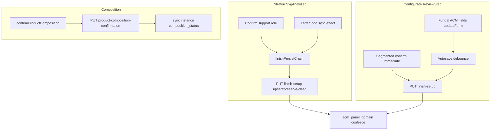

# INTAKE_V6_LARGE_FILES_RESPONSIBILITY_AND_RISK_AUDIT

**Status:** Audit only — STOP la owner gate  
**Date:** 2026-07-20  
**Mode:** read-only (fără cod, refactor, mutări, UI, S0–S2)  
**Premise corectată:** riscul principal **nu** este `IntakeV6OperatorWorkspace.tsx`; este `IntakeV6ReviewStep.tsx` + interpretări locale de status + dual write Montaj/Fundal.

---

## 1. Rezumat

Intake V6 are ~585 fișiere matched pe glob-uri relevante. Dimensiunea în linii **nu** egalează riscul:

| Presupunere inițială | Realitate măsurată |
|----------------------|--------------------|
| OperatorWorkspace e „god” | **~148 LOC, 0 useEffect** — shell legitim |
| SvgAnalyzer e „prea mare” | **~718 LOC** — sensibil, dar write core recent stabilizat (`7c72250`) |
| — | **ReviewStep ~3757 LOC, ~24 useEffect** — blast radius maxim pentru S0–S2 |

**Verdict unic (owner-accepted): B** — extrageri minime **în același build** S0–S2; fără preparatory refactor; fără redesign.

**Extrageri obligatorii (boundaries):**

1. `acmPanel/uiReadModel` (+ resolve coalesce)
2. `IntakeV6ProductComponentList`
3. `IntakeV6AcmPanelInspector`
4. un singur operator patch / write controller

**Freeze S0–S2:** SvgAnalyzer atomic AcmPanel path, letter/logo preserve, `finishPersistChain` — exceptând blocker demonstrat.

**Montare:** list + inspector pe **ReviewStep** ca orchestrator de layout; **nu** owner al logicii AcmPanel.

**Scor direcție: 72/100** (clarity pe boundaries; debt Review rămâne).

---

## 2. Capability inventory

| Capacitate | Disponibilitate | Utilizare | Limitări | Dovadă |
|------------|-----------------|-----------|----------|--------|
| Repo / code search | da | inventar LOC + grep hooks/writes | LOC ≠ complexity | PowerShell scan 585 files |
| Static metrics | da | lines, useEffect, import counts | nu CFG/cyclomatic formal | metrics pe 8 candidați |
| TypeScript language service | available | **NOT USED** (fără refactor) | — | explicit |
| Git history | da | defect themes race/binding/composition/status | sample 25 commits | `git log --grep` |
| Test inventory | da | FE IntakeV6*.test + BE test_intake_v6* | Review Montaj slab acoperit | listări |
| Runtime browser | available | **NOT USED** | audit static | — |
| React DevTools | **NOT USED** | — | — | — |
| API contract refs | da | finish-setup, composition, coalesce | — | code map |
| Screenshots existente | da | AcmPanel UI audit evidence | — | `2026-07-20_acm-panel-operator-config-ui` |
| GitHub context | **NOT USED** | — | — | — |
| Subagenți | da | OW + SvgAnalyzer/Review/hook | verdict = principal | 2 explore agents |

---

## 3. File inventory

### Top FE/BE după linii (Intake V6 matched)

| Rank | Fișier | Linii |
|-----:|--------|------:|
| 1 | `frontend/.../steps/IntakeV6ReviewStep.tsx` | 3757 |
| 2 | `backend/services/intake_v6_workspace_service.py` | 1615 |
| 3 | `frontend/src/lib/intakeV6/intakeV4Api.ts` | 1493 |
| 4 | `frontend/.../IntakeV6LiveCalculationSummary.tsx` | 1255 |
| 5 | `backend/services/intake_v6_quote_to_order_service.py` | 980 |
| 6 | `frontend/src/lib/intakeV6/useIntakeV6FinalHandoff.ts` | 812 |
| 7 | `backend/services/intake_v6_modular_form_contract_service.py` | 791 |
| 8 | `frontend/.../steps/IntakeV6SvgAnalyzerStep.tsx` | 718 |
| 9 | `backend/routers/intake_v6_workspaces.py` | 692 |
| 10 | `frontend/.../IntakeV6ArtworkFinishSection.tsx` | 660 |
| 11 | `frontend/src/lib/intakeV6/useIntakeV6Workspace.ts` | 583 |
| … | `frontend/src/lib/intakeV6/acmPanel/instantiate.ts` | 458 |
| … | `frontend/.../IntakeV6ProductCompositionPanel.tsx` | 353 |
| … | `frontend/.../IntakeV6OperatorWorkspace.tsx` | **148** |
| … | `frontend/.../IntakeV6SegmentedBackgroundPanel.tsx` | 181 |

### Metrici concentrate (candidați S0–S2)

| Fișier | Linii | Hooks~ | useEffect | Write-ish | Imports | Exports |
|--------|------:|-------:|----------:|----------:|--------:|--------:|
| ReviewStep | 3757 | 135 | 24 | 52 | 99 | 1 |
| SvgAnalyzerStep | 718 | 32 | 4–5 | 37 | 30 | 2 |
| useIntakeV6Workspace | 583 | 27 | 5–6 | 49 | 18 | 2 |
| CompositionPanel | 353 | 2 | 0 | 0 | 8 | 1 |
| OperatorWorkspace | 148 | 6 | 0 | 0 | 14 | 1 |
| acmPanel/instantiate | 458 | 0 | 0 | 0 | 10 | 5 |
| SegmentedBackgroundPanel | 181 | 0 | 0 | 1 | 1 | 1 |
| intake_v6_workspace_service | 1615 | — | — | BE | — | — |

---

## 4. Top candidates

| Fișier | Linii | Hooks | Effects | API writes | Responsabilități | Risc / clasă |
|--------|------:|------:|--------:|-----------:|------------------|--------------|
| **ReviewStep** | 3757 | ~135 | 24 | autosave + immediate | form hydrate, Finisaje, Iluminare, Montaj/Fundal, segmented, commercial, previews, composition strip, blockers | **god component + domain+persistence in UI** — needs extraction before/during S0–S2 |
| **workspace_service BE** | 1615 | — | — | finish/composition/coalesce | persistence orchestration | mare, orchestration legitim — touch doar nest sync composition |
| **intakeV4Api** | 1493 | — | — | client API | transport | mare, coerent — **safe to leave** |
| **LiveCalculationSummary** | 1255 | high | many | pricing previews | commercial live | **nu atinge** (pricing boundary) |
| **SvgAnalyzerStep** | 718 | ~32 | 4 | analysis+finish chain | layers UI + ACM write orchestration | race-prone write core — **freeze**; later refactor only |
| **useIntakeV6Workspace** | 583 | ~27 | 5–6 | PUT bus | bootstrap, step, persist API | orchestration legitim — **safe to leave** unless new API |
| **FinalHandoff** | 812 | high | — | quote handoff | confirm→quote | **nu atinge** |
| **CompositionPanel** | 353 | 2 | 0 | none (callback) | recommendation UI + Confirmat badge | **duplicate truth interpretation** — consume uiReadModel |
| **OperatorWorkspace** | 148 | 6 | 0 | 0 | shell/stepper/footer | **safe to leave** |
| **instantiate.ts** | 458 | 0 | 0 | builders | AcmPanel domain FE | **domain — nu muta contract** |
| **SegmentedBackgroundPanel** | 181 | 0 | 0 | via parent | segment confirm UI | reuse nested în inspector |

---

## 5. OperatorWorkspace audit

**Fișier:** [`IntakeV6OperatorWorkspace.tsx`](../../frontend/src/components/workos/intake-v6/IntakeV6OperatorWorkspace.tsx) (~148 LOC)

### Ce face
- Shell page + SmartBanner + Header stepper + Footer
- Mountă un singur step: layers | review | confirm (`hook` bag)
- Nav gates: `continueFromAnalyzer`, `canContinueFromReview`
- Promote template v2 (borderline, off `/intake-v6` paths)
- **0 useEffect**, fără save/finish/AcmPanel/Montaj

### Legitim pentru orchestrator
- Step routing, chrome, footer Next/Back, header status provider jumps

### Nu are ce căuta aici
- Component list, AcmPanel inspector, selected component, validation field rail AcmPanel, Fundal fields, composition honesty logic

### Înainte de S0–S2
- **Nimic de extras** din OW
- **Nu adăuga** list+inspector aici

### Risc dacă adăugăm list+inspector în OW
- **Ridicat:** shell ar absorbă domain Configurare; conflict cu selection pe Straturi; prop explosion; merge conflict inutil

### Owner decision
> OperatorWorkspace rămâne shell subțire; configuratorul **nu** se mută aici.

---

## 6. SvgAnalyzerStep audit

**Fișier:** [`IntakeV6SvgAnalyzerStep.tsx`](../../frontend/src/components/workos/intake-v6/steps/IntakeV6SvgAnalyzerStep.tsx) (~718 LOC)

| Strat | Conținut |
|-------|----------|
| UI | upload, preview, role cards, composition panel mount, offer scope |
| Domain (helpers) | `buildSupportPanelConfirmationPath`, AcmPanel instantiate, preserve merge |
| Persistence orchestration | `finishPersistChain`, `persistFinishPatch`, analysis-before-finish |

### useEffect (4)
| # | Linie~ | Rol | Clasă |
|---|--------|-----|-------|
| 1 | 376 | Auto letter/logo binding sync → persist + preserve | **HIGH RISK** (mitigat de chain) |
| 2 | 497 | Header overlay | SAFE |
| 3 | 503 | Jump handlers | SAFE |
| 4 | 564 | Hydrate selectedContourId | SUSPICIOUS (UI only) |

### Race / stale
- Chain serializează upsert vs letter sync — **nu elimina** în S0–S2
- `segmentedBackgroundRef` previne wipe pe bindings-only
- Clear path incomplet vs `buildAtomicAcmPanelClearPatch` — debt cunoscut; **nu** remediation acum

### Ce trebuie mutat (doar dacă blocker) / ce nu
- **Nu modifica:** atomic upsert, preserve, finishPersistChain, no auto composition
- **Nu plasa** S0–S2 inspector aici
- Composition panel pe Straturi: poate **consuma** uiReadModel (read-only) fără a schimba write path

### Owner decision
> SvgAnalyzer + atomic AcmPanel + letter/logo preserve + finishPersistChain = **înghețate** în S0–S2, exceptând blocker demonstrat.

---

## 7. Alte fișiere (ascunse / mai riscante)

**Mai riscant decât OW și SvgAnalyzer pentru S1–S2: ReviewStep.**

| Candidat | Notă |
|----------|------|
| ReviewStep | #1 — dual write Fundal vs instance; 24 effects; form copy |
| CompositionPanel | status Confirmat vs instance unconfirmed |
| useIntakeV6Workspace | shared bus — regresie lovește tot |
| LiveCalculation / FinalHandoff / quote services | mari dar **out of S0–S2 boundary** |
| intakeV4Api | mare, stabil transport |
| ArtworkFinish / LetterGroups | sibling patterns — **reuse**, nu rescrie |
| MontajClusterShell | shell UI reutilizabil |
| SupportContourGeometryCard | orphan — dead UI; nu reactiva în S0–S2 fără intent |

---

## 8. State ownership map

| State | Owner canonic | Copii locale | Writers | Readers | Risc |
|-------|---------------|--------------|---------|---------|------|
| workspace / payload | BE + `useIntakeV6Workspace` | cache hook | fetch/PUT | all steps | low |
| finish_setup | BE SoT | Review `form` | SvgAnalyzer persist, Review autosave/immediate, coalesce BE | Review, composition, PD | **HIGH** — form vs payload drift |
| layer_role_setup | analysis bundle | reducer în hook | SvgAnalyzer / hook | layers UI | med |
| svg_component_bindings | finish_setup | Review form; SvgAnalyzer merge | role confirm, letter sync, ACP modules | composition merge, PD | **HIGH** race history |
| acm_panel_instance | finish top-level (ideal) | selection + mounting embeds; uneori **doar nest** | atomic upsert; **nu** Review azi | **UI almost none**; PD coalesce | **HIGH** dual-store |
| mounting_solution | finish_setup | Review form config | Review Fundal edits; instantiate | Fundal UI, PD | **HIGH** second write |
| segmented_background | finish_setup | SvgAnalyzer ref | instantiate propose; Review confirm immediate | Segmented panel | med |
| product_composition_recommendation | payload BE | client merge support item | BE + CompositionPanel merge | CompositionPanel | med honesty |
| product_composition_confirmed | workspace API | — | confirmProductComposition | readiness, badges | med vs instance.composition_status |
| selected component | **inexistent** | — | — | — | de creat în Review (session) |
| selected segment | segmented UI local | — | Segmented panel | — | nested under Acm |
| validation issues | footer/guidance + Review blockers | overlay | buildFinalConfirmationBlockers | footer, banner | med jump gaps |
| preview state | step-local | hovered/selected contour | SvgAnalyzer / Review | SVG | low |

**Duplicate / stale:** Review `form` vs payload; instance nest vs top-level; composition Confirmat vs `composition_status`.

---

## 9. Write-path map

| Path | Trigger | Payload | Merge | Concurrency | Idempotency | Risk | Tests |
|------|---------|---------|-------|-------------|-------------|------|-------|
| Atomic AcmPanel upsert | support confirm / Confirm All | instance+selection+mounting+segmented+action | single PUT | finishPersistChain | upsert by contour | med residual | instantiate + support path tests |
| Preserve | letter/logo sync | bindings + preserve shell | PUT | chain after upsert | preserve | med | preserve tests |
| Clear | leave support | clear action (incomplete vs atomic clear) | PUT | — | — | **HIGH** debt | partial |
| Review Fundal fields | input change | mounting_solution.configuration | autosave | revision/request-id | last-write | **HIGH dual vs instance** | commercial tests, not ACM instance |
| Segmented confirm | CTA | segmented_background full | immediate PUT | bypass debounce | status CONFIRMED | med | product-system segmented tests |
| Composition confirm | CTA | composition items | dedicated PUT | — | confirmed flag | **status drift nest** | composition tests |
| BE coalesce | every finish save | action preserve/upsert/clear | server | — | — | low if action set | coalesce pytest |

**S0–S2 target:** un singur operator write controller pentru câmpurile AcmPanel; Fundal nu mai scrie aceleași mm.

---

## 10. useEffect audit (relevant)

### SvgAnalyzer
| Effect | Deps (approx) | Citește | Scrie | API? | Clasă |
|--------|---------------|---------|-------|------|-------|
| Letter/logo sync | layer roles, phase, payload | roles, finish | persistFinishPatch preserve | da | **HIGH RISK** — freeze |
| Overlay / jumps / contour | UI | state | overlay | nu | SAFE |

### useIntakeV6Workspace
| Effect | Rol | Clasă |
|--------|-----|-------|
| Bootstrap / fetch | load WS | SAFE (core) |
| Unsaved analysis autosave | analysis PUT | SUSPICIOUS |
| beforeunload | warn | SAFE |

### ReviewStep (~24 effects)
| Tip | Clasă | Notă |
|-----|-------|------|
| Hydrate form from payload | **HIGH RISK** | gated `localReviewEditsPending` — poate rescrie / bloca |
| Autosave timers | **HIGH RISK** | race cu immediate segmented |
| Preview fetches (many) | SUSPICIOUS | perf + stale |
| Header overlay | SAFE | |
| Tab/commercial sync | SUSPICIOUS | |

**SHOULD BECOME EVENT-DRIVEN:** letter sync (deja partial chain); Review hydrate pe „save ack” nu pe orice payload tick — later, nu prep refactor.

---

## 11. Testability

| Fișier | Unit azi | Integration | Netestabil acum | Extragere doar pentru test? |
|--------|----------|-------------|-----------------|------------------------------|
| uiReadModel (viitor) | ideal 100% status matrix | — | — | **da — obligatoriu** |
| operatorPatch (viitor) | dual-store sync asserts | save/refresh | — | **da — obligatoriu** |
| ReviewStep | commercial settings slice | sparse Montaj ACM | form+24 effects | **nu** extrage tot; extrage inspector |
| SvgAnalyzer | ~270 LOC test | support path | effect race | **nu** rescrie pentru estetică |
| CompositionPanel | badge tests | — | honesty gap | adapt la read model |
| OperatorWorkspace | trivial | — | — | nu |

Mocks care ascund: Review autosave revision id; Composition „Confirmat” fără instance axis.

Runtime fără test: Fundal edit → instance field_authority drift; nest-only composition sync.

---

## 12. Git history și defecte anterioare

Aceleași zone apar repetat:

| Temă | Commits reprezentative | Fișiere |
|------|------------------------|---------|
| ACM instance / atomic write | `7c72250` | SvgAnalyzer, acmPanel/*, BE coalesce |
| SVG truth / segments / reopen | `727430b` | SvgAnalyzer, segmented |
| Support vs commercial mounting | `184b9dc` | Review Montaj |
| Support role / bindings persist | `8aafbd1`, `98f9471` | bindings, finish |
| Status semantics / vocabulary | `b680956`, `30335bb` | guidance, labels |
| Segmented confirm | `41129b6`, `bf2df42` | Review + product-system |

**Concluzie:** fișierele „mari și stabile” (intakeV4Api, LiveCalc) apar rar în bug-uri AcmPanel. **Review + SvgAnalyzer + bindings** apar constant → risc istoric > LOC.

---

## 13. Impact S0 — Truth presentation

| Întrebare | Răspuns |
|-----------|---------|
| Unde stă read modelul? | `frontend/src/lib/intakeV6/acmPanel/uiReadModel.ts` (+ `resolveInstance.ts`) |
| Cine consumă? | CompositionPanel, ComponentList chips, AcmPanelInspector, validation rail |
| Ce elimină? | Confirmat inventat din `product_composition_confirmed` alone; catalog ca „ok” |
| Extragere înainte? | **Da — în același build**, primul slice al S0–S2 |

---

## 14. Impact S1 — Component list + inspector

| Întrebare | Răspuns |
|-----------|---------|
| Selected component owner | state în **ReviewStep** (sau micro-hook `useIntakeV6ProductComponentSelection` local Review) + sessionStorage per WS |
| Cine orchestrează lista? | Review montează `IntakeV6ProductComponentList` |
| Cine orchestrează inspectorul? | Review montează `IntakeV6AcmPanelInspector` când select=acm |
| Props excesive? | Evită: trece `finishSetup` + callbacks `onOperatorPatch` / `onSelect`; nu trece tot `hook` în list |
| Boundary natural | fișiere noi sub `components/.../acm-panel/`; logică status în lib |

**Owner:** Review = mount/orchestrate layout; **nu** owner logică AcmPanel (aia e lib + inspector).

---

## 15. Impact S2 — Configuration

| Întrebare | Răspuns |
|-----------|---------|
| Field groups | secțiuni în AcmPanelInspector |
| Dual write? | Fundal ACP → **read-only summary** + navigate to inspector; edits doar via `operatorPatch` |
| Reuse controls | SegmentedBackgroundPanel nested; field inputs mutate prin același patch builder |
| Evită creștere Review | **nu** inline 800 LOC noi în ReviewStep — mount children |
| Hook/service | `operatorPatch.ts` + optional thin `useAcmPanelOperatorActions` |

---

## 16. Extraction candidates

| Extragere | Motiv | Risc redus | Fișiere | Necesară acum? |
|-----------|-------|------------|---------|----------------|
| `acmPanel/uiReadModel` (+ resolve) | duplicate truth / Confirmat gap | status drift | lib acmPanel | **DA** |
| `IntakeV6ProductComponentList` | sibling discoverability; nu umflă Review | coupling | components/acm-panel | **DA** |
| `IntakeV6AcmPanelInspector` | progressive config; domain UI boundary | god Review | components/acm-panel | **DA** |
| Operator patch/write controller | single write-path; Fundal RO | dual write race | lib acmPanel/operatorPatch | **DA** |
| Validation rail component | jump to section/field | UX | components/acm-panel | DA (în S2, același build) |
| `useIntakeV6ProductComponentSelection` | persist select refresh | stale select | hook mic lângă Review | optional thin |
| `useIntakeV6WorkspaceOrchestrator` | — | — | — | **NU** |
| `useIntakeV6FinishPersistence` split | — | — | — | **NU** (hook e OK) |
| `SvgRoleConfirmationController` | — | — | — | **NU** (freeze) |
| Split ReviewStep god-kill | estetică | merge risk | — | **NU** (later only) |

---

## 17. What stays (nu extrage / nu atinge)

| Locație | Ce rămâne |
|---------|-----------|
| **OperatorWorkspace** | shell, stepper, footer gates |
| **SvgAnalyzerStep** | UI layers + freeze write orchestration |
| **CompositionPanel** | CTA confirm; consumă read model (nu reinventă) |
| **AcmPanel domain** (`types`/`instantiate`/`preserve`/`relations`) | contract; fără enum noi |
| **useIntakeV6Workspace** | API persist bus |
| **BE workspace service** | coalesce; micro sync nest pe composition doar dacă blocker |
| **LiveCalculation / pricing / FinalHandoff** | out of scope |
| **Letter / Artwork finish sections** | neschimbate ca write owners |

---

## 18. Risk matrix

| Risc | Probabilitate | Impact | Dovezi | Mitigare |
|------|---------------|--------|--------|----------|
| Regression Review Montaj | high | high | 3757 LOC, 24 effects | extract inspector; Fundal RO |
| Stale form vs payload | high | high | hydrate + localReviewEditsPending | operatorPatch → saveFinishSetup → refresh |
| Write race SvgAnalyzer | med | high | effect sync + chain | **freeze** chain |
| Duplicate writes Fundal+instance | high | high | audit UI + code map | Fundal summary only |
| Hidden coupling hook bag | med | med | `hook={hook}` | narrow props to new children |
| Status drift composition | high | high | Confirmat vs unconfirmed | uiReadModel honesty |
| Untestable logic in Review | high | med | sparse Montaj tests | unit read model + patch |
| Prop drilling | med | low | dacă totul rămâne în Review | children components |
| Rerender/perf | med | low | many preview effects | don't add more effects in OW |
| Circular imports | low | med | acmPanel ↔ components | lib ← UI only |
| Domain leakage in UI | med | high | status invented in panel | single read model |
| UI duplication Fundal/inspector | high | high | current plan risk | RO summary |
| Legacy surface conflict | high | high | Fundal editable | navigate to inspector |
| Merge conflict Review | high | med | git churn Review | keep new files separate |
| Future LED/totem extensibility | low | med | inactive capabilities | inspector slots, no forms now |

---

## 19. Recommendation

### **B — Extrageri minime în același build S0–S2** (ACCEPTATĂ)

**De ce nu A:** dual write + composition honesty + Review blast radius fac „zero extract” nesigur.

**De ce nu C:** preparatory refactor pe Review ar costa săptămâni și ar bloca valoarea S0–S2; boundaries-urile necesare sunt exact piesele S0–S2.

**De ce nu D:** nu e defect arhitectural sever pe tot modulul — OW e deja corect; domain AcmPanel e coerent; problema e presentation + un write surface greșit.

---

## 20. Owner decisions (înregistrate)

1. **B acceptat** — extrageri minime în același build S0–S2.  
2. **ReviewStep** = montare/orchestrare list + inspector; **nu** owner logică AcmPanel.  
3. **OperatorWorkspace** rămâne shell; configuratorul nu se mută acolo.  
4. **SvgAnalyzer** atomic path + preserve + finishPersistChain = **înghețate** (except blocker demonstrat).  
5. Extrageri obligatorii: `uiReadModel`, `ProductComponentList`, `AcmPanelInspector`, **un** operator patch/write controller.  
6. Fundal/ACP vechi = **read-only summary + navigare spre inspector** — nu al doilea write-path.  
7. **Nu** preparatory refactor separat.  
8. **Nu începe S0–S2 acum** — acest raport e gate.

---

## 21. Roadmap

| Pas | Stare |
|-----|-------|
| Large-files audit | **DONE** (acest document) |
| Owner review pe B + freeze + Fundal RO | **WAITING** |
| S0–S2 implementare (plan separat deja draft) | blocked pe GO |
| Later: ReviewStep decomposition / effect hygiene | after S0–S2 stable |
| Later: clear-path parity atomic clear | separate debt |

---

## 22. Dead pieces

| Piece | Notă |
|-------|------|
| `IntakeV6SupportContourGeometryCard` | orphan — nu montat |
| `IntakeV6AlucobondContourPanel` confirm fără instance | orphan risk dacă reactivat |
| Top-level `acm_panel_instance` absent pe unele WS | nest-only — read coalesce obligatoriu |
| Duplicate Confirmat semantics | de eliminat via uiReadModel |

---

## 23. Opinia sinceră

Nu OperatorWorkspace e problema — e deja unul dintre cele mai sănătoase fișiere din Intake V6. Obsesia pe cele două fișiere din prompt ar fi putut duce la un „prep refactor” greșit. Adevăratul cost e ReviewStep ca magazie + Fundal care scrie pe lângă instanță. B e corect: extrage exact piesele S0–S2, îngheață SvgAnalyzer, nu redesign-ui modulul.

---

## 24. Cat suntem in directia stabilita: **72/100**

| Factor | Scor |
|--------|-----:|
| Claritate ownership OW vs Review vs SvgAnalyzer | 90 |
| Domain AcmPanel readiness | 85 |
| Write-path hygiene azi | 45 |
| Status presentation honesty | 40 |
| Testability pe zona S0–S2 | 55 |
| Owner alignment pe B | 95 |
| Pregătire să înceapă S0–S2 fără prep refactor | 75 |

---

## STOP — Owner gate

Raport finalizat. **Nu** începe S0–S2 din acest mesaj.

Așteaptă GO explicit pe implementarea `WORKOS_ACM_PANEL_OPERATOR_CONFIGURATION_S0_S2` cu boundaries-urile de mai sus.
