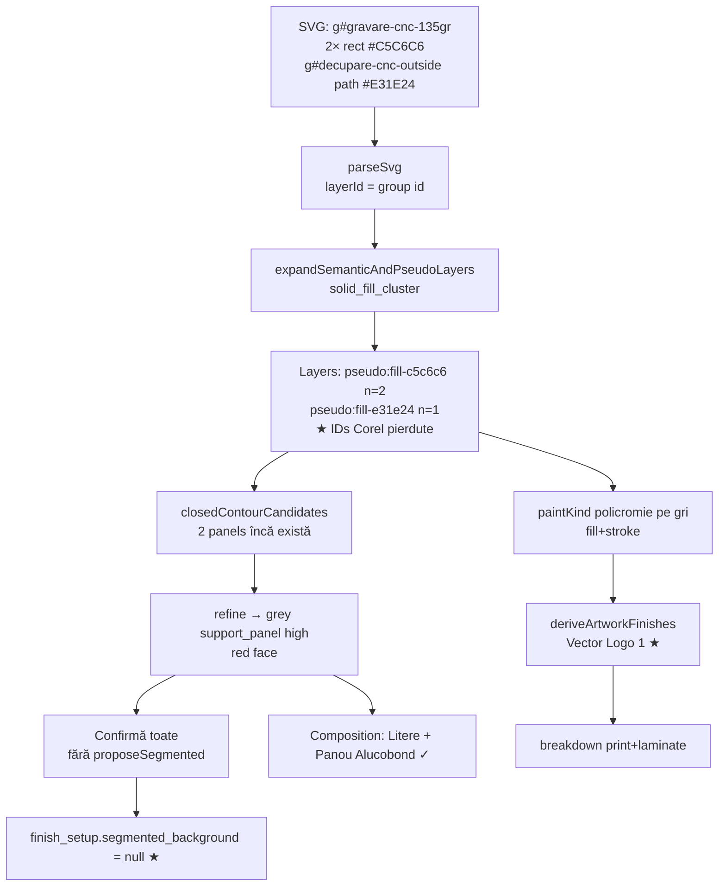
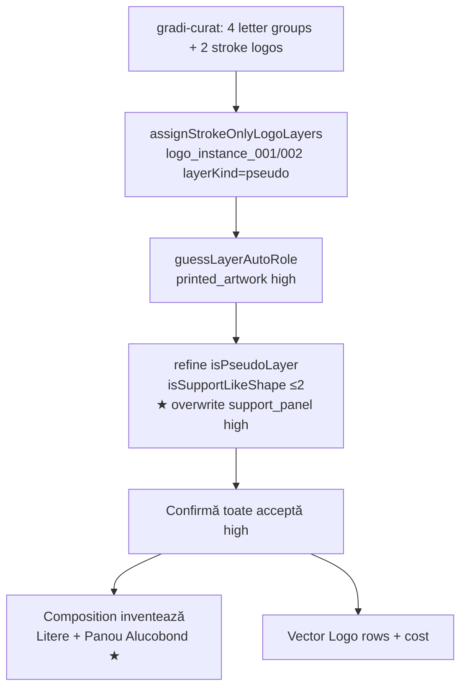

# INTAKE_V6_SVG_TRUTH_AND_REINSPECTION_ROOT_CAUSE_AUDIT

**Status:** Root-cause audit only — **fără implementare**, **fără migration**, **fără UI redesign**  
**Data:** 2026-07-20  
**Fixtures:** Desktop SVG nemodificate + workspaces `IV6-87B98425` / `IV6-3A52D29C` (comparație)  
**Dovezi runtime anterioare:** `docs/audits/_evidence/2026-07-20_intake-v6-real-svg-runtime/`  
**Worklog:** `docs/audits/_evidence/2026-07-20_intake-v6-svg-truth-rca/WORKLOG.md`  
**Owner gate:** STOP — așteaptă decizie

---

## 1. Rezumat executiv

Cele patru defecte **nu** sunt izolate cosmetic. Trei (P1, P2, P3) împart o **criză contractuală a identității de layer**:

1. Analyzer-ul **distruge** gruparea semantică SVG (ID Corel / CNC) în favoarea clusterelor `pseudo:fill-*` / `logo_instance_*` tip `layerKind: pseudo`.
2. Un pas de refine geometric tratează **orice** `pseudo` low-complexity ca `support_panel` **high**, inclusiv stroke-logo deja clasificat `printed_artwork`.
3. Finish/artwork hydration **nu respectă** rolul confirmat și inventează Vector Logo din semnale de paint false (`policromie` = fill+stroke).
4. Segmented ACM există ca propunere pe contururi, dar **Confirmă toate** ocolește calea care o scrie în `finish_setup`.
5. P7 este o **a doua criză de autoritate**: stepperul ✓ citește payload, UI Straturi citește client state, iar `LOAD_SUCCESS` forțează Review după roluri complete.

**Verdict:** adevărul SVG → Product Truth este **nesigur pentru pricing** până se unifică: (a) identity layer / provenance, (b) criterii minime `support_panel`, (c) `logo_presence`, (d) write-path segmented pe confirm bulk, (e) rehidratare + step authority pe Straturi.

Sketch / demo 21st.dev: **irelevante** pentru acest audit.

---

## 2. Traseul E2E real

```text
SVG source (DOM)
  → parseSvg                 [frontend/src/lib/svgAnalyzer/analyzer/parseSvg.ts]
  → normalizeSvg / geometry  [normalizeSvg.ts, analyzeGeometry]
  → expandSemanticAndPseudoLayers   ★ P1 / P4 collapse + logo_instance create
  → analyzeLayers + paint    [analyzeLayers.ts, analyzePaint.ts]  ★ P3 paint policromie
  → detectClosedContourCandidates
  → refineLayerRoleProposalsWithGeometry   ★ P2 overwrite → support_panel high
  → buildLayerRoleConfirmation
  → IntakeV6ClientSvgImport → workspace client state
  → (opțional) handleUpdateLayerRole(support_panel)
        → proposeSegmentedBackgroundFromCandidates → finish_setup.segmented_background
        ★ P1 null când se folosește doar Confirmă toate
  → persistAnalysisBundle (svg_analysis_json + layer_role_setup)
  → product_composition_recommendation (BE)  — logo din roluri logo, support → ACM
  → Review: deriveArtworkFinishesFromAnalyzer   ★ P3 Vector Logo fantomă
  → intake_v4_material_breakdown_service        ★ cost print pe artwork_finishes
  → ProductAggregate / bindings / Montaj UI
  → LOAD_SUCCESS / resolveIntakeV6StepFromReadiness  ★ P7 bounce to review
```

### Diagrama — Fixture ACM (`litere-cu-fundal-acm-segmentat.svg`)



**Punct colaps segmente:** `expandSemanticAndPseudoLayers` fill-cluster (nu contour detector).  
**Punct Vector Logo fantomă:** `deriveArtworkFinishesFromAnalyzer` + `isArtworkLayer` (nu composition BE).

### Diagrama — Fixture gradi-curat



**Punct logo→suport:** `refineLayerRoleProposalsWithGeometry` lines 142–148.  
**Punct Straturi nerehidratat vizual:** `resolveIntakeV6StepFromReadiness` + `LOAD_SUCCESS` → Review; selectors Straturi absente.

---

## 3. Cauza P1 — Segmente ACM pierdute

### Structură reală SVG

| Element | ID grup | Observat |
|---------|---------|----------|
| 2× `<rect>` gri | `gravare-cnc-135gr` | Segmente fundal ACM |
| 1× `<path>` roșu | `decupare-cnc-outside` | Litere |

### Unde se citesc cele două rect

- `parseSvg` walk pe `<g>`: children primesc `layerId = parent g id` (`parseSvg.ts` ~153–185).
- Contururi: `detectClosedContourCandidates` vede **ambele** rect ca candidate (dovadă: `proposeSegmentedBackgroundFromCandidates` returnează `PROPOSED` cu 2 panouri când e apelat).

### Unde se colapsează în `pseudo:fill-c5c6c6`

`expandSemanticAndPseudoLayers` (`semanticAndPseudoLayerExpansion.ts` 345–379):

- Nu e set Ana Maria (≥4 letter groups).
- Nu e preserve Corel `Layer_x0020_N`.
- Cluster pe `fillSolid` → ambele gri → un singur `pseudo:fill-c5c6c6` cu `elementIds.length === 2`.
- `gravare-cnc-135gr` / `decupare-cnc-outside` **nu** sunt în `isSemanticProductionOrArtworkLayerName` (doar logo/letter/artwork/policromie tokens — `layerNameSemantics.ts` 62–68).
- Re-add semantic groups doar dacă `uniqueFills.length <= 1` (388–400) — ACM are 2 fills → **skipped**.

### De ce `segmented_background` rămâne `null`

| Ipoteză | Verdict |
|---------|---------|
| Contururile lipsesc | **Respinsă** — candidați există |
| Layer collapse șterge contururile | **Respinsă** — propunerea funcționează izolat |
| Confirmă toate nu scrie proposal | **Confirmată** |

Propunerea se scrie **doar** în `handleUpdateLayerRole` când `role === "support_panel"` (`IntakeV6SvgAnalyzerStep.tsx` 195–260 → `proposeSegmentedBackgroundFromCandidates` → `persistFinishPatch({ segmented_background })`).

`confirmAllLayerRoles` (`useIntakeV6Workspace.ts` 385–393) actualizează doar confirmation — **zero** call la propose/persist segmented.

### Contract canonic (regulă — nu implementare)

**Nu** fiecare `<rect>` = componentă de produs separată.

Conform modelului deja schițat în `segmentedBackground.ts` (`SegmentedPanel`, `element_bindings`, `does_not_absorb_letter_ownership`):

| Entitate | Rol canonic |
|----------|-------------|
| Ansamblu suport | 1 componentă Product System: ACM boxed / SUPPORT_CONTOUR |
| Segmente | **Geometrii component-owned** (panels[]) sub ansamblu — calcul material/îmbinare separat |
| Litere | Componente distincte; binding pe panel; ownership literă **nu** e absorbit de panel |
| Product Template | Nu mută adevărul; consumă assembly confirmat |

**Identitate de păstrat:** `contour_element_id` / panel_id + provenance grup sursă (ex. `gravare-cnc-135gr`) ca semnal, nu ca template code.

---

## 4. Cauza P2 — `logo_instance_*` → `support_panel` high

### Ce detectează `logo_instance_*`

`assignStrokeOnlyLogoLayers` (`semanticAndPseudoLayerExpansion.ts` 197–236):

- Stroke-only paths → `nextNeutralLogoInstanceId` → `logo_instance_001/002`
- `layerKind: 'pseudo'`, origin `stroke_vector_outline`
- Intent documentat: „logo/artwork candidate; operator must confirm”

### De ce rolul final e `support_panel` high

1. `guessLayerAutoRole` + `isRasterArtworkLayerId(/^logo_instance_\d{3}$/)` → **`printed_artwork` high** (corect).
2. `refineLayerRoleProposalsWithGeometry`:
   - `isPseudoLayer` = true pentru `layerKind === "pseudo"` (**include logo instances**).
   - `isSupportLikeShape` = `complexity <= 2` (closedSubPathCount) — logos stroke simple trec.
   - Sibling letter-like există → `strongSupportIds` → overwrite:

```142:148:frontend/src/lib/svgAnalyzer/analyzer/refineLayerRoleProposalsWithGeometry.ts
    if (strongSupportIds.has(layer.id)) {
      return withRole(
        layer,
        "support_panel",
        "high",
        "Outer/low-complexity solid fill envelope beside letter geometry — propose Contur suport (requires confirmation).",
      );
```

**Semnale folosite la overwrite:** complexity, area/bbox, sibling letters, outer contour match — **nu** numele „logo”. Numele logo e **ignorat** la refine.

**Coliziune reguli:** guess(logo) vs refine(pseudo→support). Refine câștigă fără excepție pentru artwork id.

### Confirmă toate

Acceptă `autoRole`/`high` fără gate pe contradicție name↔role. Propagă greșeala în `layer_role_setup` → composition.

### Propagare produs + cost

- `support_panel` → recommendation `letters_plus_support` / „Litere + Panou Alucobond casetat”
- Bindings SUPPORT_CONTOUR
- Cost intern include linii ACM + (separat) artwork dacă există finish rows
- Golden test **eșuează acum**: `goldenSvgFacts.test.ts` expected `{ face:4, printed_artwork:2 }`, received `{ face:4, support_panel:2 }`

### Dovezi minime pentru `support_panel` (contract propus)

Toate obligatorii (AND), nu OR agresiv:

1. Geometrie tip panel: fill solid dominant **sau** closed outer contour panel-like (nu stroke-outline logo).
2. **Nu** `isRasterArtworkLayerId` / logo origin / printed_artwork candidate.
3. Sibling letter/face distinct.
4. Envelope / outer candidate match **sau** dominant filled area vs letters.
5. Confidence `high` doar dacă (1–4); altfel `medium`/`low` + fără Confirm-all auto-accept.

Un nume care conține `logo` **nu** e suficient pentru support — și **nu** trebuie „excepted” hardcodat doar pe `logo_instance_*`; regula e: **artwork/logo candidates are excluded from support refine**.

---

## 5. Cauza P3 — Vector Logo fantomă

### Unde se creează

| Layer | Owner |
|-------|--------|
| Rând finish | `deriveArtworkFinishesFromAnalyzer` (`intakeV4ArtworkFinish.ts` 129–166) |
| Etichetă „Vector Logo 1” | UI placeholder `genericArtworkDisplayName` (`IntakeV6ArtworkFinishSection.tsx`) |
| Composition BE logo template | **Nu** — pentru ACM fixture composition e letters+support fără `TPL-VOLUMETRIC-LOGO` |

### De ce apare fără logo în SVG

1. Grey ACM: fill `#C5C6C6` + stroke `#2B2A29` → `buildLayerPaintEvidence` → `paintKind = 'policromie'` (`analyzePaint.ts` 30–35).
2. `layerIsArtworkCandidate` true pe policromie.
3. `isArtworkLayer` **nu exclude** `support_panel` confirmat:

```114:121:frontend/src/lib/intakeV6/intakeV4ArtworkFinish.ts
function isArtworkLayer(layer, role): boolean {
  if (role && ARTWORK_ROLES.has(role)) return true;
  if (isArtworkLayerName(layer.name) || isArtworkLayerName(layer.id)) return true;
  if (!layerHasLetterPathGeometry(layer) && layerIsArtworkCandidate(layer)) return true;
  return false;
}
```

Rect-only support → branch 3 → rând `print_laminate`, `confirmed: false` → „Necesită confirmare”.

### Ce este slotul

- **Nu** template default universal.
- **Nu** componentă composition logo.
- **Da** finish slot inventat din paint heuristic + label UI generic.
- Dual path: composition corectă vs finish/cost greșit.

### Contract `logo_presence` (owner)

```text
logo_presence ∈ {
  detected_confirmed,  // confirmed printed_artwork / LOGO binding
  optional_absent,     // zero logo geometry → zero finish rows → zero cost
  slot_available       // affordance goală, neinstantiată, neprețuită
}
```

Owners: binding contract + composition recommendation + finish derivation (**trebuie** să consume același enum). Confirmed `support_panel` / SUPPORT_CONTOUR = hard exclude din artwork.

---

## 6. Cauza P7 — Reinspectare Straturi

### Ce NU este

- Nu e blocare intenționată: `canAccessIntakeV6Step(..., "layers")` returnează **always true** (`intakeV6Readiness.ts` 65–66).
- Nu lipsește API: workspaces au `svg_analysis_json` + `layer_role_setup.complete`.

### Ce este

**Dual authority + step reset:**

| Semnal | Sursă |
|--------|--------|
| Stepper ✓ Straturi | Payload: analysis + `layer_role_setup.complete` |
| File chip / layer rows | Client: `analyzerReport`, `svg.previewSource`, `layerRoleConfirmation` |
| Step după reload | `resolveIntakeV6StepFromReadiness` → `"review"` dacă roles complete (`intakeV6PayloadHydrate.ts` 108–118) |
| `LOAD_SUCCESS` | Rescrie `currentStep` din readiness (`intakeV6WorkspaceReducer.ts` 50–51) — **nu** păstrează intentul operatorului ca `PERSIST_SUCCESS` |

Reopen audit: click Straturi → eventual bounce Review → selectors `intake-v6-file-confirm-chip` / `intake-v6-layer-row-*` absente → `chip=null`, `layers=0`.

Hydrate poate reumple client state **dacă** userul rămâne pe layers și payload e complet; bug-ul principal e **step authority**, nu absența datelor.

### Read-only vs editabil (contract UI)

| Surface | Intent |
|---------|--------|
| Preview / file identity / geometry metrics | Read-mostly |
| Confirmed roles | Editabile cu re-persist; invalidare finish/composition la schimbare |
| Provenance (detectat / propus / confirmat / corectat) | Vizibil mereu |
| Return la Straturi | Întotdeauna permis; arată starea confirmată hidratată, nu empty shell |

---

## 7. Provenance ID-uri SVG (P4)

| ID / semnal | Păstrat exact? | Normalizat? | Influențează clasificarea? | Afișat operator? |
|-------------|----------------|-------------|----------------------------|------------------|
| `gravare-cnc-135gr` | Parse only → **pierdut** la expand | Înlocuit de pseudo fill | Nu (nu e în semantic name set) | Nu |
| `decupare-cnc-outside` | Idem | Idem | Nu | Nu |
| `logo_instance_*` | Inventat de analyzer | Stabil per run | Guess da; refine îl ignoră | Da (Logo N) |
| `pseudo:fill-*` | Inventat | Color hash | Da (support/face) | Da (Element gri/roșu) |
| Grupuri letter (maria…) | Pe gradi (fill semantics / real set) | Partial | face | Da |

**Regulă provenance:**

- **Păstrează** ca `sourceGroupIds[]` / `provenance` pe layer/panel (audit trail).
- **Nu** trata denumiri arbitrare ca adevăr tehnic absolut (ex. nu mapa `gravare-*` → template fără geometrie).
- **Poate influența** clasificarea doar ca semnal soft (boost confidence), după geometrie.
- **Afișează** operatorului ca „proveniență detectată”, separat de rol confirmat.

---

## 8. Impact downstream

| Sistem | P1 ACM segments | P2 logo→support | P3 Vector Logo fantomă | P7 reinspect |
|--------|-----------------|-----------------|------------------------|--------------|
| ProductDefinition / composition | Ansamblu fără panels[] | Panou ACM fals | Composition poate fi OK | Nu direct |
| ProductAggregate | Incomplete assembly | Support template greșit | Dual path finish | — |
| Component ownership | Segmente necalculabile | Ownership suport inventat | Finish ownership greșit | Operator nu poate audita |
| Materiale / ops | CNC panel split lipsă | Ops ACM inutile | Print+laminate false | — |
| Pricing / ofertă | Sub/over pe ACM | Cost ACM + linii | Cost print pe support | — |
| Order snapshot / ExecutionPlan | Plan montaj segmentat absent | Plan support fals | Print tasks fantomă | — |
| Read models / UI | Montaj generic | Titlu produs greșit | Badge „Necesită confirmare” | Empty Straturi |
| Siguranță pricing | **Nesigură** | **Nesigură** | **Nesigură** | Auditabilitate scăzută |

---

## 9. Matrice owner

| ID | Cauză primară | Owner real | Owner secundar | Fișiere cheie | Contract | Sev. | Regresie | Date existente | Migration? | Teste lipsă |
|----|---------------|------------|----------------|---------------|----------|------|----------|----------------|------------|-------------|
| P1a | Color cluster distruge group identity | svgAnalyzer expand | Product Truth ACM | `semanticAndPseudoLayerExpansion.ts` | Layer identity / provenance | Critical | High | Layers pseudo în WS | Remap opțional | Assert group provenance + 2 panels |
| P1b | Confirm All ocolește segmented write | Intake V6 layers UX | BE acm_segmented | `useIntakeV6Workspace.ts`, `IntakeV6SvgAnalyzerStep.tsx` | finish_setup.segmented_background | Critical | High | `segmented_background=null` | Re-propose on reopen | E2E Confirm All → PROPOSED |
| P2 | Refine overwrite pe pseudo logo | svgAnalyzer refine | Layer taxonomy | `refineLayerRoleProposalsWithGeometry.ts` | Min evidence support_panel | Critical | High | Roles confirmed greșit | Re-role remediation | Golden gradi (deja FAIL) |
| P3 | Artwork derive ignoră support + false policromie | Finish hydration FE | Paint evidence | `intakeV4ArtworkFinish.ts`, `analyzePaint.ts` | logo_presence | High | High | artwork_finishes rows | Clear phantom rows | ACM ⇒ 0 artwork rows |
| P7 | LOAD_SUCCESS step reset + dual authority | Intake V6 workspace state | Hydrate | `intakeV6WorkspaceReducer.ts`, `intakeV6PayloadHydrate.ts` | Step authority / reinspect | High | Med | UX only | Nu SQL | Reopen Straturi after LOAD |
| P4 | Semantic name set fără CNC ids | svgAnalyzer semantics | UI labels | `layerNameSemantics.ts` | Provenance display | Medium | Med | Display | Nu | Preserve provenance field |

---

## 10. Strategie unică de remediere (nu implementa)

Ordine obligatorie (domain → analyzer → persistence → UI):

### A. Domain / Product Truth (întâi)

1. Formalizează **layer identity**: `sourceGroupIds`, `elementIds`, `layerKind`, `origin` — clusterul pe culoare nu șterge provenance.
2. Formalizează **support_panel min evidence** (secțiunea 4).
3. Formalizează **logo_presence** + hard-exclude support/face din artwork finishes.
4. Formalizează **segment ownership**: panels = geometrii component-owned sub un support assembly.

### B. Analyzer

5. Exclude artwork/logo candidates din `strongSupportIds` (nu hardcode doar `logo_instance_*` — folosește origin/id/role guess).
6. Nu marca fill+stroke panel ca `policromie` fără fill multicolor real.
7. Păstrează provenance Corel/CNC pe layer chiar după cluster.
8. Opțional: dacă ≥2 closed panels same fill sub același source group → emite panel parts (nu neapărat N product components).

### C. Persistence / write-path

9. Orice confirmare care include `support_panel` (inclusiv Confirm All / continue) trebuie să ruleze aceeași cale ca `handleUpdateLayerRole` pentru SUPPORT_CONTOUR + `proposeSegmentedBackgroundFromCandidates` (fără auto-CONFIRM).
10. Finish derive consumă `logo_presence` / rol confirmat.

### D. Read-model / UI (după A–C)

11. Step authority: click Straturi persistă intent; `LOAD_SUCCESS` nu bounce dacă user a cerut layers; hydrate client report înainte de empty shell.
12. UI arată Detectat / Propus / Confirmat / Corectat — **fără** a face greșeala mai „frumoasă”.
13. Confirm All: blochează auto-accept pe roluri high contradictorii (ex. id logo + support).

### Ce NU e strategie

- Ascundere Vector Logo în CSS.
- Excepție unică pe două fixtures.
- Port vizual 21st / redesign Intake.

---

## 11. Acceptance criteria propuse

### ACM segmentat

- [ ] Cele 2 rect rămân distincte ca `panels[]` / contour ids după analiză+confirm support.
- [ ] Relația ansamblu↔segmente e explicită în finish_setup.
- [ ] `segmented_background.status` ∈ {PROPOSED, CONFIRMED, REJECTED} după confirm support (nu null pe happy path).
- [ ] Zero rânduri artwork pe layer `support_panel`.
- [ ] Operator vede provenance `gravare-cnc-135gr` (sau equivalent) ca semnal.
- [ ] Calcul material pe panel fără a crea 2 product templates.

### gradi-curat

- [ ] 4 grupuri litere rămân `face` (sau letter role).
- [ ] 2 logo → `printed_artwork` (sau unknown/low), **niciodată** `support_panel` din refine.
- [ ] Fără Panou Alucobond fără dovadă panel.
- [ ] Vector Logo rows doar pentru logo detectat; independente.
- [ ] Confidence support pe logo ≠ high artificial.
- [ ] Golden `goldenSvgFacts.test.ts` verde.

### Reinspectare

- [ ] Straturi redeschis după Configurare/refresh arată chip + layers + preview.
- [ ] Confirmed roles vizibile; edit invalidă downstream explicit.
- [ ] Stepper ✓ = payload **și** client hydrated (sau copy clară).
- [ ] Comparație detectat vs confirmat disponibilă.

---

## 12. Test plan

| Tip | Test |
|-----|------|
| Unit analyzer | gradi: no support_panel on logo_instance; ACM: provenance group ids retained; paint: fill+stroke same panel ≠ policromie artwork |
| Unit refine | artwork/logo origin never enters strongSupportIds |
| Unit finish | ACM confirmed support+face ⇒ `deriveArtworkFinishes…length === 0` |
| Unit workspace | Confirm All with support_panel triggers segmented propose path (mock persist) |
| Unit step | After roles complete, SET_STEP(layers) survives subsequent LOAD_SUCCESS |
| Integration BE | composition letters_plus_support without logo template; breakdown without print rows |
| Runtime fixtures | Desktop SVGs nemodificate — cele 2 fișiere; assert UI+payload |
| Golden | `goldenSvgFacts.test.ts` (deja FAIL — regression detector viu) |

**Teste existente care trebuiau să prindă:**

| Test | Stare |
|------|--------|
| `goldenSvgFacts.test.ts` | **FAIL** — P2 |
| `guessLayerAutoRole.supportProposal.test.ts` | PASS — nu assert provenance/segmented/artwork |
| `segmentedBackground*.test.ts` | PASS izolat — nelegat de Confirm All |
| Composition recommendation tests | Nu assert finish isolation |

---

## 13. Riscuri și remediation date

| Risc | Detaliu |
|------|---------|
| Workspace-uri deja confirmate greșit | `IV6-3A52D29C` etc.: roles/composition/cost stale |
| Remediation | Tool: re-run role refine + clear phantom artwork_finishes + re-propose segmented dacă support confirmat; **nu** auto-confirm |
| Migration schema | Probabil nu e nevoie de tabele noi; payload finish/analysis fields |
| Regresie Ana Maria / real semantic set | Orice schimbare expand trebuie gated pe golden + letter fixtures |
| Pricing istoric | Oferte emise pe cost greșit — flag review comercial |

---

## 14. Dovezi

| Tip | Locație |
|-----|---------|
| Runtime screenshots | `docs/audits/_evidence/2026-07-20_intake-v6-real-svg-runtime/case1-*`, `case2-*` |
| Payload slim | `case1-analysis-slim.json`, `case2-analysis-slim.json` |
| Reopen | `reopen-layers-check.json` |
| Audit runtime | `2026-07-20_INTAKE_V6_REAL_SVG_RUNTIME_AUDIT.md` |
| Cod | cite în §§3–6 |
| Golden FAIL | `frontend/src/lib/intakeV6/goldenParity/goldenSvgFacts.test.ts` — received `support_panel: 2` |
| Worklog | `_evidence/2026-07-20_intake-v6-svg-truth-rca/WORKLOG.md` |

---

## 15. Verdict și scoruri

| Scor | Valoare |
|------|---------|
| Încredere cauză P1 | **92/100** |
| Încredere cauză P2 | **95/100** |
| Încredere cauză P3 | **90/100** |
| Încredere cauză P7 | **88/100** |
| Corectitudine actuală SVG → Product Truth | **38/100** |
| Siguranță pricing downstream | **30/100** |
| Cât suntem pe direcția stabilită (truth before UI) | **72/100** |

**Concluzie:** STOP pe UI polish. Următorul GO trebuie să fie **domain + analyzer + write-path**, cu fixtures Desktop ca acceptance, nu redesign.

**Owner decisions așteptate:**

| ID | Întrebare |
|----|-----------|
| R1 | Aprobă contractul panels = geometrii component-owned (nu N product components)? |
| R2 | Aprobă min evidence `support_panel` + exclude artwork candidates din refine? |
| R3 | Aprobă `logo_presence` ca owner unic pentru finish slots? |
| R4 | Confirm All trebuie să declanșeze aceeași cale segmented ca select manual? |
| R5 | Remediation pe workspace-uri existente acum sau doar forward-fix? |

**STOP — așteaptă decizia owner. Nu implementa.**
