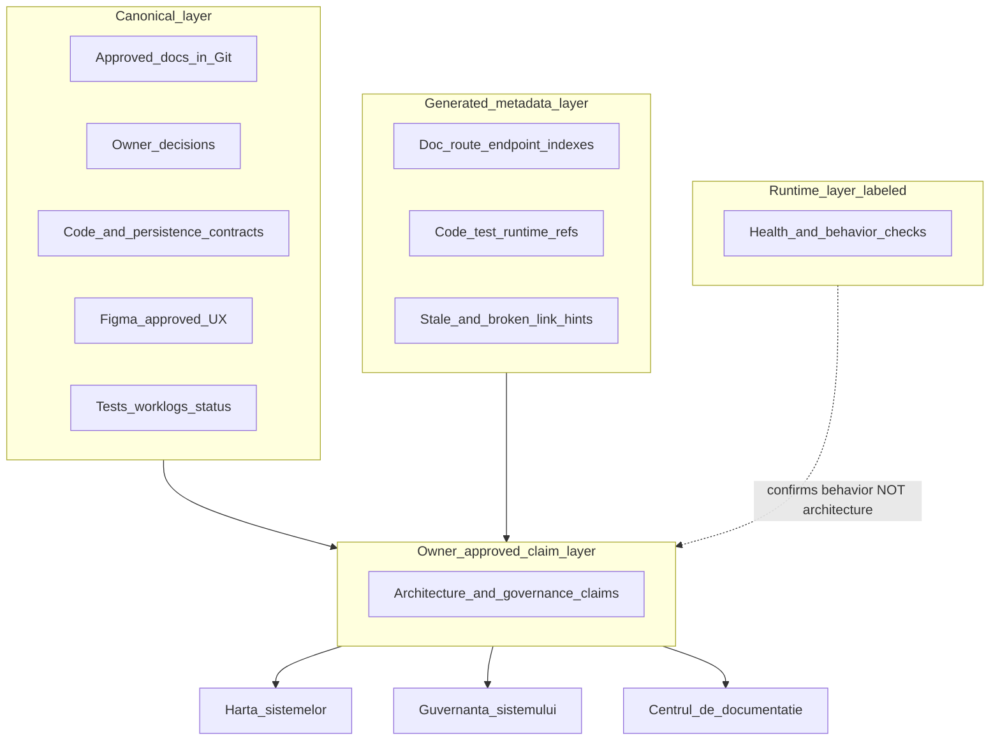

# WorkOS Wave 0 — Foundation and Truth Pages Plan (Consolidated)

> **DIRECTION APPROVED IN PRINCIPLE** · **NOT CANONICAL** · **NOT IMPLEMENTATION AUTHORIZATION**  
> Date: 2026-07-16 · Branch `feature/product-system-active-path-isolation-v1` · HEAD `e4ff30e`  
> Source: Cursor Plan Mode artifact + owner consolidation brief  
> Gates granted: **G-W0-PLAN-CONSOLIDATION**, **GO_W0_B1**, **GO_W0_B3**, **GO_W0_B2_DOCUMENTATION_INDEX_READ_MODEL** (executed)  
> **W0-B1 / B3 / B2 status: IMPLEMENTED** — index: `docs/architecture/WORKOS_DOCUMENTATION_INDEX_READ_MODEL.md`  
> Next gate required: **GO for W0-B4 and/or W0-B5 honesty baseline** (not granted)

---

## OWNER REVIEW CONSOLIDATION — 2026-07-16

### Accepted direction (preserved)

| Decision | Status |
|----------|--------|
| Canonical documentation remains in Git | ACCEPTED |
| Truth pages are read-only projections | ACCEPTED |
| Hybrid architecture (repo docs + allowlisted metadata + labeled runtime + owner-approved claims) | ACCEPTED |
| `/modules` → **Harta sistemelor** (technical alias: Module Chain) | ACCEPTED (display wording subject to registry) |
| `/governance` → **Guvernanța sistemului** (technical alias: System Governance) | ACCEPTED |
| New **Centrul de documentație** at planned route `/documentation` | ACCEPTED (route GO separate) |
| Romanian-first operational UI | ACCEPTED |
| Figma = UX authority where approved | ACCEPTED |
| Page finalization requires system + contract + Figma + UI/UX + terminology + docs + QA | ACCEPTED |
| Waves 1–7 finalize operational pages; Wave 8 matures truth pages | ACCEPTED |
| This approval is **direction only**, not implementation | BINDING |

### Corrections applied vs prior Plan Mode draft

| Prior draft | Correction |
|-------------|------------|
| Build sequence B1→B6→B5→B2→B3/B4→B7→B8 with policies as B6 and honesty as B3/B4 | **Revised:** B1 → B3 (policies) → B2 (doc read model) → B4∥B5 (honesty) → B6 (minimal docs center) → B7 (Figma/UX) → B8 (Wave 1–7 readiness) |
| Four separate plan deliverables | **Reduced:** one consolidated plan + one worklog (no optional contract addendum — schema kept in-plan) |
| Projection rule listed partial fields | **Completed:** full claim + Figma + document relationship schemas |
| Page roles described but overlapping | **Strict responsibility split** + anti-duplication criteria |
| Runtime implied as architecture proof | **Binding rule:** runtime confirms existence/behavior; does **not** prove approved architecture |
| Next step = write 4 docs | **Superseded:** plan consolidated here; next = owner GO for W0-B1 only |
| Older critical path / build table below | **SUPERSEDED** by §12 Revised Build Sequence |

### Implementation recommendation

**W0-B1 / B3 / B2 DONE (2026-07-16).**  
Next: owner review → separate GO for **W0-B4 and/or W0-B5**. Do **not** start B4–B8 without GO.

---

## 1. Verdict and mini decision

**WAVE_0_PLAN_CONSOLIDATED_WITH_OPEN_GATES**

Wave 0 freezes shared rules and metadata contracts so Waves 1–7 can finalize pages without parallel truths. Truth UI never becomes manual architectural SoT. Full truth-page maturity is Wave 8; Wave 0 delivers contracts, policies, honesty baseline, and a minimal Documentation Center after separate GOs.

---

## 2. Current truth (code — preserved)

| Page | Path | Role today | Evidence |
|------|------|------------|----------|
| Module Chain | `frontend/src/pages/ModuleChain.tsx`, `frontend/src/hooks/useModuleChainData.ts` | **STATIC_HYBRID**: hardcoded chain/handoffs + `GET /api/v1/system/health` with public `checks: {}` → misleading green “active” | OD-MC = A; MODULE-INT-01 |
| Governance | `frontend/src/pages/Governance.tsx`, `frontend/src/lib/governanceData.ts` | **STATIC_REFERENCE**: zero API; “25 canonical docs” unsupported; `docs/canonical/` empty | OD-GOV = A; GOV-INT-01 |
| Documentation Center | — | **Absent**. `/documents` = commercial Document Center. Backend `/docs` = FastAPI Swagger | Code inventory |

Nav labels today (EN): Module Chain, Governance — `frontend/src/App.tsx`.

---

## 3. Final Hybrid truth architecture



### Binding runtime rule

> Runtime evidence confirms that an implementation exists or behaves in a certain way. Runtime evidence does **not** automatically prove that the implementation is the approved architecture.  
> A functional legacy route must **not** become canonical only because it returns HTTP 200.

### Layer rules

| Layer | May produce | May not decide alone |
|-------|-------------|----------------------|
| Canonical | Approved architecture, OD, contracts, Figma UX, evidence | — |
| Generated metadata | Indexes, refs, HEAD, stale hints, scans | Architecture ownership / CANONICAL status |
| Owner-approved claims | Architecture + governance assertions with authority | Silent auto-promotion from runtime |
| Runtime | Labeled health/behavior | Canonical architecture |

---

## 4. Truth Metadata Contract (shared — W0-B1 deliverable shape)

One shared read-only model for Harta, Guvernanță, Centru, page gates, and drift detection. **Not implemented in this task.**

### 4.1 Claim schema — fields

| Field | Purpose | Allowed / notes |
|-------|---------|-----------------|
| `claim_id` | Stable unique id | Opaque string; never reuse for different meaning |
| `subject_type` | What the claim is about | `SYSTEM` \| `PAGE` \| `ROUTE` \| `CONTRACT` \| `DOCUMENT` \| `EDGE` \| `OWNERSHIP` \| `POLICY` \| `FIGMA_FLOW` \| `STATUS` \| `TERM` |
| `subject_id` | Subject key | Stable slug / code / path |
| `claim_type` | Kind of assertion | e.g. `OWNS`, `READS`, `WRITES`, `HANDOFF`, `FORBIDDEN`, `FREEZE`, `BOUNDARY`, `STATUS`, `AUTHORITY`, `TERMINOLOGY` |
| `claim_text` | Human-readable assertion (EN technical OK) | Non-empty |
| `display_label_ro` | Operator-facing Romanian label | Required for UI projection |
| `technical_alias` | Secondary EN/tech name | Optional; e.g. "Module Chain" |
| `authority_type` | Authority category | See §4.2 |
| `authority_reference` | Pointer to authority artifact | Path, OD id, Figma node, code symbol |
| `authority_rank` | Precedence for conflict | Integer; higher wins within policy ladder |
| `owner_type` | Who owns the claim | `OWNER` \| `SYSTEM_OWNER` \| `DOC_OWNER` \| `UNASSIGNED` |
| `owner_reference` | Owner id/name/doc | Required unless `UNASSIGNED` + `OWNER_REVIEW_REQUIRED` |
| `status` | Lifecycle | See §4.3 |
| `valid_from` | Start of validity | ISO date/time |
| `valid_until` | Optional expiry | ISO or null |
| `last_validated_at` | Last validation event | ISO; **not** file mtime |
| `validated_against` | What was checked | e.g. HEAD, test id, runtime URL, OD id |
| `evidence_refs` | Evidence list | Structured refs |
| `document_path` | Primary doc path | Repo-relative or null |
| `code_refs` | Code symbols/paths | Array |
| `runtime_refs` | Runtime checks/URLs | Array; labeled |
| `test_refs` | Tests | Array |
| `figma_refs` | Figma refs | Array of §5 objects |
| `related_systems` | System ids | Array |
| `related_pages` | Page/route ids | Array |
| `related_contracts` | Contract ids | Array |
| `supersedes` | Prior claim ids | Array |
| `superseded_by` | Successor claim id | Or null |
| `drift_status` | Drift classification | See §4.4 |
| `drift_reason` | Short explanation | Required if not ALIGNED / NOT_VALIDATED |
| `owner_decision_required` | Needs owner | boolean |
| `visibility_class` | Who may see in UI | See §4.5 |

**Reject claims missing:** owner or authority, source (`authority_reference` or evidence), `status`, `last_validated_at` (or explicit `NOT_VALIDATED`), evidence, and supersession fields when replacing prior claims.

### 4.2 `authority_type`

| Value | Meaning |
|-------|---------|
| `OWNER_DECISION` | Explicit owner OD / GO |
| `CANONICAL_ARCHITECTURE` | Approved canonical architecture doc |
| `CODE_CONTRACT` | Executable contract in code |
| `PERSISTENCE_CONTRACT` | DB/schema persistence contract |
| `FIGMA_APPROVED` | Approved Figma flow/frame |
| `RUNTIME_EVIDENCE` | Observed behavior (never sole architecture authority) |
| `TEST_EVIDENCE` | Automated/manual test proof |
| `RECENT_WORKLOG` | Supporting recent worklog |
| `SUPPORTING_DOCUMENT` | Non-canonical supporting doc |
| `REFERENCE_ONLY` | Informational; not binding |

### 4.3 Claim `status`

`CURRENT` · `CURRENT_WITH_GUARDS` · `PARTIAL` · `PROPOSED` · `STALE` · `SUPERSEDED` · `CONTRADICTORY` · `OWNER_REVIEW_REQUIRED` · `UNKNOWN`

### 4.4 `drift_status`

`ALIGNED` · `CODE_DRIFT` · `RUNTIME_DRIFT` · `FIGMA_DRIFT` · `DOCUMENTATION_DRIFT` · `TERMINOLOGY_DRIFT` · `MULTI_SOURCE_CONFLICT` · `NOT_VALIDATED`

### 4.5 `visibility_class`

`OPERATOR_SAFE` · `ADMIN_ONLY` · `OWNER_ONLY` · `INTERNAL_TECHNICAL` · `RESTRICTED` · `HIDDEN_FROM_UI`

### 4.6 Entity types (same contract family)

Beyond claims, W0-B1 must define typed records for:

- **system** (id, display_label_ro, technical_alias, status, owns/does_not_own summary refs)
- **page** (route, role, system, readiness class)
- **edge** (from, to, edge_class, contract, identity, freeze_policy, trigger)
- **document** (see §8)
- **evidence** (type, ref, captured_at, result)
- **figma** (see §5)

Edge classes (Harta): `DIRECT` · `INDIRECT` · `RESOURCE_PROVIDER` · `TECHNICAL_CONSUMER` · `COMMERCIAL_CONSUMER` · `FROZEN_DOWNSTREAM` · `OPERATIONAL_CONSUMER` · `BOUNDARY_ONLY` · `REFERENCE_ONLY` · `NO_CURRENT_LINK`

---

## 5. Figma Metadata Contract

Figma is never “a URL only.” Minimum reference:

| Field | Purpose |
|-------|---------|
| `figma_file_key` | File key |
| `figma_file_name` | Human name |
| `figma_page_name` | Page within file |
| `figma_node_id` | Node id (`14:15` form) |
| `figma_flow_name` | Named flow if any |
| `figma_flow_status` | Flow lifecycle |
| `figma_approval_status` | Approval (not inferred from node existence) |
| `figma_last_reviewed_at` | Last owner/review date |
| `runtime_route` | Mapped route if any |
| `runtime_component` | Mapped component if any |
| `drift_type` | None / runtime / doc / accepted deviation |
| `drift_description` | Text |
| `owner_decision_required` | boolean |

**Supported relationships:** one page → many frames; one flow → many pages; superseded frames; partial flows; runtime divergence; owner-approved deviations.

**Figma flow statuses:** `APPROVED` · `APPROVED_WITH_NOTES` · `PARTIAL` · `PROPOSED` · `EXPLORATORY` · `REJECTED` · `SUPERSEDED` · `NOT_FOUND`

**Policy (page completion):** Approved → KEEP / VALIDATE_RUNTIME / COMPLETE_MISSING_STATES. Partial → document gaps. Two flows → compare authority, no arbitrary merge. Missing → PROPOSED before page FINAL + owner review. Drift → classify bug vs stale Figma vs accepted deviation vs OD.

Known anchors (keep): MASTER file `911Q6oRKcEursrRoT4Qj0h`; Intake Configurare `0CDPIuqoaZ1OQgNnvNyl1F`; MASTER roadmap/acceptance nodes `14:14` / `14:15` (maps, not full truth-page screen specs).

---

## 6. Truth page responsibility split

### A. Harta sistemelor (`/modules`)

**Primary question:** Cum sunt conectate sistemele, paginile și contractele?

**Owns projection of:** systems, pages, nodes, edges, handoffs, providers, consumers, identities, freeze points, typed relationships, runtime status **clearly separated** from architecture, evidence links.

**Must not primarily display:** full documents, complete OD history, policy text walls, editable business rules.

### B. Guvernanța sistemului (`/governance`)

**Primary question:** Cine deține adevărul și ce reguli trebuie respectate?

**Owns projection of:** ownership, writers/readers, SoT policy, forbidden paths, owner gates, authority ladder, freeze rules, page finalization policy, terminology policy, architecture decisions, unresolved contradictions.

**Must not primarily display:** system graph navigation, full document corpus, operational dashboards, editable policies.

### C. Centrul de documentație (`/documentation` planned)

**Primary question:** Unde este definit, explicat și demonstrat adevărul?

**Owns projection of:** document index/details, authority, status, supersession, related systems/pages/contracts/Figma/code/API/tests/QA/worklogs, history, validation state.

**Must not become:** architecture editor, governance page, system map, parallel CMS, unrestricted renderer for entire repo.

### Anti-duplication acceptance

| Criterion | Pass if |
|-----------|---------|
| AD-1 | A handoff appears as **edge** on Harta; full policy text lives on Guvernanță or Centru, not duplicated as conflicting posters |
| AD-2 | Document body opens in Centru; Harta/Guvernanță show **links + claim summaries** only |
| AD-3 | Ownership matrix lives on Guvernanță; Harta shows owner **badge/link**, not full decision history |
| AD-4 | Runtime strip only on Harta (and optionally Centru evidence); Guvernanță does not fake live module health |
| AD-5 | Same `claim_id` projected in multiple UIs must share one metadata record |

---

## 7. Documentation Center — relationship-aware (not only Markdown viewer)

Route candidate: **`/documentation`** (avoid `/docs` Swagger, `/documents` commercial).

Document record (eventually):

`document_id`, `title`, `path`, `category`, `authority`, `status`, `owner`, `created_at`, `updated_at`, `last_validated_at`, `supersedes`, `superseded_by`, `systems`, `pages`, `routes`, `contracts`, `figma_refs`, `code_refs`, `api_refs`, `test_refs`, `qa_refs`, `worklog_refs`, `runtime_refs`, `drift_status`, `visibility_class`

**Distinguish:** body rendering · metadata · relationships · validation · authority.

**Rule:** Allowlisted path ≠ automatic `CANONICAL_CURRENT`. Authority and status come from claim/document metadata, not folder membership alone.

Categories (index): architecture, systems, pages, contracts, Figma, roadmap, owner decisions, UI/UX, terminology, QA, worklogs, runtime evidence, archive/reference.

---

## 8. Shared foundation policies (W0-B3)

**Binding artifacts (implemented):**  
`docs/architecture/WORKOS_PAGE_COMPLETION_FOUNDATION.md` · `docs/architecture/WORKOS_UI_TERMINOLOGY_REGISTRY.md`  

Summary retained below for plan continuity; **if conflict, foundation docs win**.

### 8.1 Documentation Impact Gate (permanent)

Every future build answers whether system/contract/ownership/route/flow/UI/term/status/dependency/freeze/Figma changed → which docs/maps/evidence/truth pages update. No `COMPLETE` without classification:

`NO_DOC_IMPACT` · `WORKLOG_ONLY` · `STATUS_UPDATE` · `PAGE_MAP_UPDATE` · `CONTRACT_DOC_UPDATE` · `FIGMA_REFERENCE_UPDATE` · `TERMINOLOGY_UPDATE` · `CANONICAL_ARCHITECTURE_UPDATE` · `OWNER_DECISION_REQUIRED`

### 8.2 Page Definition of Done

A page is FINAL only if **all** hold:

1. **System** — role, owner, reads/writes, upstream/downstream, contracts, no parallel SoT  
2. **Functional** — real data, working actions, validations, permissions, loading/error/empty/blocked/success, no dead buttons  
3. **E2E** — entry, action, persistence, confirm, handoff, identity, downstream verify  
4. **Figma** — flow/node found, approval status, drift resolved or accepted  
5. **UI/UX** — shared patterns, navigation, hierarchy, feedback  
6. **Language** — Romanian-first, registry, no arbitrary mixed language, translation-ready  
7. **Documentation** — maps, Figma ref, contract impact, status, worklog, evidence  
8. **QA** — tests, runtime, fixture, screenshots, owner verification, isolated commit  

HTTP 200 alone is never enough.

### 8.3 Status vocabulary (projection)

- **System:** OPERATIONAL · OPERATIONAL_PARTIAL · PREVIEW_ONLY · REFERENCE_ONLY · STATIC · BLOCKED · LEGACY · UNKNOWN  
- **Page readiness:** READY_TO_FINALIZE · READY_AFTER_UPSTREAM · REQUIRES_CONTRACT_FIX · REQUIRES_FIGMA · REQUIRES_RUNTIME_FIX · REFERENCE_ONLY · NO_CHANGE_NOW  
- **Document:** CANONICAL_CURRENT · SUPPORTING_CURRENT · RECENT_EVIDENCE · DIRECTION_ONLY · REFERENCE · STALE · SUPERSEDED · CONTRADICTORY · OWNER_REVIEW_REQUIRED  
- **Figma:** see §5  

### 8.4 Romanian-first display metadata

Conventions on every UI-projected entity:

- `display_label_ro` — default operator label  
- `technical_alias` — secondary EN/tech  
- `translation_key` — future i18n key (e.g. `system_map.title`)  
- `description_ro` — short help  

Example: `display_label_ro: "Harta sistemelor"` · `technical_alias: "Module Chain"` · `translation_key: "system_map.title"`

**Prohibit:** page-specific duplicate translations; hardcoded RO/EN forks in separate components; technical ids as default user-facing labels without justification.

**i18n direction (no framework in Wave 0 without G-W0-I18N):** `ro` default locale; gradual keys; registry shared; fallback RO → technical EN last; backend errors mapped at boundary; never mix translation with contract changes.

Seed terms: study registry `docs/qa/workos-complete-page-system-figma-direction-study-v1/03_UI_UX_ROMANIAN_TERMINOLOGY_REGISTRY.md` — wording not finalized here unless already owner-approved.

### 8.5 UI/UX foundation (rules only)

Keep AppShell/sidebar; unify PageHeader, status badges, empty/loading/error/blocked/stale; Intake wizard = Configurare Figma SoT; truth pages = reference density. Later candidates: StatusBadge, EvidenceChip, DriftBanner — **no component implementation in plan consolidation**.

### 8.6 Automatable vs human

- **Auto:** routes, endpoints, doc index, dates, HEAD, tests, runtime GETs, broken links, terminology scans, stale hints  
- **Human/owner:** canonical authority, ownership, boundaries, Figma approval, final terms, archive, declaring page FINAL  

---

## 9. Permanent update mechanism

### Build completion input (required structured section)

Every future build produces:

- systems / pages / routes / contracts / owners affected  
- Figma / terminology / documents / status affected  
- evidence produced; runtime checks; tests  
- superseded claims; new or changed claims  

### Later automation targets (contracts must support; not all in W0-B1)

Route/endpoint inventory · document indexing · broken refs · terminology scan · stale validation · Figma ref validation · code↔doc link validation · truth-page refresh  

---

## 10. Security requirements

| Control | Requirement |
|---------|-------------|
| Path allowlist | Strict curated paths only |
| Normalization | Resolve + compare against allowlist roots |
| Traversal | Reject `..`, absolute escape, symlink escape |
| Markdown | Sanitize before HTML |
| Raw HTML | Deny or tightly allowlist |
| External links | Policy: allowlist schemes; warn on unknown |
| Attachments | Default deny unless typed allow |
| Secrets | Exclude / scan; never serve `.env`, keys, credentials |
| Visibility | Map `visibility_class` → RBAC |
| Operator subset | OPERATOR_SAFE only by default |
| Admin/owner corpus | ADMIN_ONLY / OWNER_ONLY / RESTRICTED |
| No `docs/` StaticFiles dump | Forbidden |
| No repo write from UI | Forbidden |
| No WYSIWYG architecture edit | Forbidden |
| API | Read-only document/claim APIs only |
| Audit | Document-read audit only if justified (defer) |

---

## 11. Freshness and validation

| Date type | Meaning | Not proof of |
|-----------|---------|--------------|
| File modification date | FS mtime | Claim currency |
| Git commit date | When path last changed in Git | Architecture approval |
| Claim validation date | `last_validated_at` | — |
| Runtime check date | When health/behavior checked | Architecture approval |
| Figma review date | `figma_last_reviewed_at` | Runtime correctness |
| Owner approval date | OD/GO timestamp | Continuous runtime health |

**Stale triggers:** validation TTL · related Git HEAD change · related contract change · route change · Figma ref change · explicit supersession · runtime contradiction  

| Rule | Deterministic? |
|------|----------------|
| HEAD moved since `validated_against` | YES |
| `valid_until` passed | YES |
| Superseded_by set | YES |
| Related route removed from router inventory | YES (with inventory) |
| Runtime contradicts claim text | PARTIAL — needs review |
| Authority conflict multi-source | PARTIAL — OWNER_REVIEW_REQUIRED |
| Terminology mismatch scan | HINT — review |

---

## 12. Revised build sequence

| Build | Objective | UI? | Depends |
|-------|-----------|-----|---------|
| **W0-B1** | Truth Metadata Contract (claims, documents, systems, pages, edges, Figma, evidence, status, drift) | No UI rebuild; no backend index yet | G-W0-B1 |
| **W0-B3** | Shared foundation policies: DoD, Figma policy, Doc Impact Gate, status vocab, RO terminology, i18n prep | Docs/templates only | **DONE** — `WORKOS_PAGE_COMPLETION_FOUNDATION.md` + terminology registry |
| **W0-B2** | Documentation index + read model: allowlisted discovery, metadata, relationships, safe RO API, HEAD/freshness | No rich portal | **DONE** — `WORKOS_DOCUMENTATION_INDEX_READ_MODEL.md` + registry + API |
| **W0-B4** | Harta sistemelor honesty baseline | Minimal honesty UI | G-W0-B4; after B1 (+ B2 if edges from index) |
| **W0-B5** | Guvernanța honesty baseline | Minimal honesty UI | G-W0-B5; parallel with B4 |
| **W0-B6** | Minimal Documentation Center | Safe route + index/detail | G-W0-B6; after B2 + security |
| **W0-B7** | Truth pages Figma/UX | Plan + owner review; edits need G-W0-B7 | After B4/B5 responsibilities clear |
| **W0-B8** | Wave 1–7 readiness gate | Verification only | After B1–B7 foundations |

### Critical path

```text
W0-B1 → W0-B3 → W0-B2 → (W0-B4 ∥ W0-B5) → W0-B6 → W0-B7 → W0-B8
```

**Parallelism:** B3 research may start alongside B1 drafting but must not fork the schema. B4∥B5 after contracts stable. Figma research early; final flow decisions after B4/B5. B6 depends on read model + security. **Do not** parallelize simultaneous edits to shared contracts.

### Per-build template (use when implementing)

Objective · Operational value · Current truth · Systems/pages · Contracts · Candidate files · Research-before-code · Allowed/Forbidden · Owner gates · Tests · Runtime/Figma verification · Doc impact · RO impact · Acceptance · Worklog · Commit boundary · Rollback · Dependencies · Parallel tasks · Exit criteria

### Candidate files (later implementation — not this task)

`ModuleChain.tsx`, `useModuleChainData.ts`, `Governance.tsx`, `governanceData.ts`, `App.tsx`, new documentation page + allowlist, optional read-only backend doc index (never full `docs/` StaticFiles).

---

## 13. Honesty baseline acceptance criteria

### `/modules` (Harta) — W0-B4

1. No module/system shown green/active without an actual check  
2. Architecture status and runtime status visually separated  
3. Incomplete coverage explicitly labeled (`PARTIAL` / `REFERENCE_ONLY` / `OWNER_REVIEW_REQUIRED`)  
4. Every displayed handoff has a source  
5. Every runtime value has a check or is labeled unavailable  
6. Demo data not presented as production evidence  
7. No write capability introduced  
8. Relationships typed (edge classes)  
9. Last validation visible  

### `/governance` (Guvernanța) — W0-B5

1. Unsupported “25 canonical docs” claim removed  
2. Every governance claim has authority and source  
3. Owner decisions distinguishable from runtime facts  
4. Contradictory claims marked  
5. Stale claims marked  
6. No policy editor / feature-flag / approval engine  
7. Authority ladder visible  
8. Last validation visible  

### `/documentation` — W0-B6

1. Only allowlisted documents visible  
2. Rendering sanitized  
3. Authority and status visible  
4. Related systems/pages/contracts visible  
5. Source path visible  
6. Stale/superseded labeled  
7. No edit capability  
8. No unrestricted filesystem access  

---

## 14. Relation to Waves 1–8

| Wave | How Wave 0 helps |
|------|------------------|
| 1 Product System | DoD, terminology, claims, doc gate |
| 2 Form / Intake | Figma policy + RO UI rules |
| 3 PD / Aggregate | Ownership + forbidden rules on Guvernanță |
| 4 Pricing / Inventory | Resource edges on Harta |
| 5–6 Quote / Order / EP | Freeze points + DoD |
| 7 Utilaje / Employees / Attendance | Figma-missing policy before FINAL |
| 8 | Full truth-page maturity |

Incomplete Wave 0 maps must stay labeled PARTIAL — never pretend Wave 8 completeness.

---

## 15. Owner gates

| Gate | Meaning | Status after this task |
|------|---------|------------------------|
| **G-W0-PLAN-CONSOLIDATION** | Consolidated plan accepted for review | **GRANTED** (this task) |
| **G-W0-B1-TRUTH-CONTRACT** | Implement W0-B1 metadata contract artifacts | **GRANTED + IMPLEMENTED** (2026-07-16) |
| **G-W0-B2-DOC-READ-MODEL** | Doc index / RO API | **GRANTED + IMPLEMENTED** (2026-07-16) |
| **G-W0-B3-POLICIES** | Enforce DoD/Figma/DocGate/term in process | **GRANTED + IMPLEMENTED** — foundation + terminology registry |
| **G-W0-B4-SYSTEM-MAP** | Harta honesty baseline | OPEN |
| **G-W0-B5-GOVERNANCE** | Guvernanță honesty baseline | OPEN |
| **G-W0-B6-DOCUMENTATION-CENTER** | Route + minimal center | OPEN |
| **G-W0-B7-FIGMA** | Truth-page Figma edits | OPEN |
| **G-W0-I18N** | i18n framework / mass string move | OPEN |
| **G-W0-CANONICAL-STATUS** | Canonical status mutations | OPEN |
| **G-W0-ARCHIVE** | Archive/replace docs | OPEN |
| **G-W0-IMPLEMENTATION-START** | Blanket start (prefer per-build GO) | OPEN |

---

## 16. Risks

| Risk | Mitigation |
|------|------------|
| Metadata becomes shadow SoT | Authority + owner mandatory for binding claims |
| Expose all `docs/` | Allowlist + visibility_class |
| Fake greens persist | B4 acceptance criteria measurable |
| Page overlap / duplicate posters | Responsibility split + AD-1…AD-5 |
| Scope creep to Wave 8 UI | Honesty baseline only until Wave 8 |

---

## 17. Documentation output (this consolidation)

| File | Action |
|------|--------|
| `docs/plans/2026-07-16-workos-wave-0-foundation-truth-pages-plan.md` | **CREATE** (consolidated single plan) |
| `docs/worklog/realignment/2026-07-16_workos_wave_0_foundation_truth_pages_plan_mode.md` | **CREATE/UPDATE** |
| Separate Truth Metadata Contract addendum | **NOT CREATED** — schema in §4–5 of this plan |
| Second Wave 0 plan | **FORBIDDEN** — not created |

Cursor Plan Mode artifact remains historical input; **this file is the single Wave 0 plan of record for owner GO**.

---

## 18. Forbidden scope (this task and until next GO)

No W0-B1 implementation · no FE/BE/DB/Figma/i18n/routes/parser/metadata API · no Module Chain/Governance/Documentation Center code · no archive/canonical mutation · no page finalization · no `/ce-work` · no auto-commit.

---

## 19. Next safe step

**Owner reviews this consolidated plan → explicit `GO_W0_B1_TRUTH_METADATA_CONTRACT`.**

Do not start W0-B1 until that GO.
