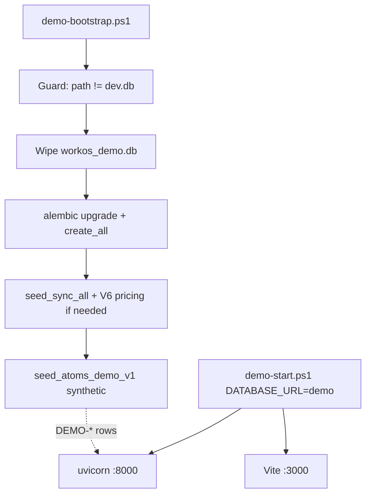

# feat: Atoms reproducible WorkOS demo environment V1

## Goal Capsule

Give Atoms a **safe, reproducible** WorkOS demo: fresh clone → install → wipe/rebuild isolated demo DB → seed synthetic Letters V1 data → start real backend + frontend → audit real UI routes — **without** Owner `backend/dev.db` and **without** real PII.

**Authority:** Owner GO `AUTHORIZE_WORKOS_ATOMS_REPRODUCIBLE_DEMO_ENVIRONMENT_V1` · V1 frozen `FINALIZED_FOR_AGREED_SCOPE` / `LETTERS_ONLY` · baseline `f9b3f47a`.

**Stop when:** deterministic demo bootstrap + start docs work; route smoke proven; PII scan pass; tests for DB guard; commits local only; **no push**.

**Product Contract preservation:** N/A (bootstrap from Owner GO) — scope affirmed 2026-08-10: wipe-and-rebuild · full inventory · Golden extract-only.

---

## Product Contract

### Summary

Compose existing registry/template seeds + a new deterministic Atoms demo seed (golden Gradi payload extract) into a dedicated demo SQLite file. Real Product System / CPP / Quote / Order / Execution / Profitability code paths only. No fake frontend, no demo pricing engine, no binary DB commit.

### Requirements

| ID | Requirement |
|----|-------------|
| R1 | Dedicated demo DB path ≠ `backend/dev.db`; hard fail-closed if bootstrap targets `dev.db` |
| R2 | Wipe-and-rebuild demo DB each bootstrap (delete demo DB file(s) then recreate) |
| R3 | Deterministic fixed `DEMO-*` identities for discoverability (not frontend hardcodes) |
| R4 | Synthetic data only — no real clients/employees/salaries/emails/phones; no workforce seed PII leakage |
| R5 | Reuse `seed_sync_all` (+ V6 pricing seed if required) and canonical commercial rules; no duplicate pricing truth |
| R6 | Extract golden Gradi fixture semantics only; do **not** run `run_golden_letters_e2e_final_proof_v1.py` as demo seed |
| R7 | Full UI inventory: clients, intake V6 Letters (+ draft), quotes/orders EUR, execution, assignment/session, machine-run if safe, material actual, profitability read model, modules/governance natural |
| R8 | Real backend + real frontend; demo auth via existing development-bound mechanisms only |
| R9 | Windows PowerShell bootstrap + start that reuse stack start without forcing `dev.db` |
| R10 | Docs: `docs/operations/WORKOS_ATOMS_DEMO_ENVIRONMENT.md` for Atoms |
| R11 | Small tests: demo DB guard, no `dev.db` path, critical fixture existence / rebuild |
| R12 | Evidence + worklog; `DB_SCHEMA_CHANGES=0` · `PRODUCT_TRUTH_MUTATIONS=0` · no push |

### Actors

- **Atoms auditor** — clones repo, bootstraps demo, browses UI
- **Agent operator** — runs bootstrap/start on Windows for Owner/Atoms

### Key flows

1. Clone → install deps → `demo-bootstrap` → `demo-start` → login → browse routes  
2. Re-run bootstrap → wipe demo DB → identical `DEMO-*` identities  

### Acceptance examples

- Bootstrap against `dev.db` path → **fails closed**
- After bootstrap, `/quotes` shows EUR demo quote; `/intake-v6/<DEMO>/operator` loads Letters workspace
- Repeat bootstrap yields same stable codes
- `git status` never stages `*.db` / `dev.db`

### Scope boundaries

**In:** demo seed/scripts/docs/tests/evidence; gitignore for generated demo DB; launcher env isolation.

**Out:** push/PR/merge/deploy; schema migrations; pricing/product-truth/execution contract changes; Light/Commercial reopen; Capacity activation; ACM/Logo expansion; committed binary SQLite; running Golden E2E proof as seed; workforce real-name seed.

---

## Planning Contract

### Key Technical Decisions

| Decision | Choice | Rationale |
|----------|--------|-----------|
| Architecture | **Option A** — migrations/bootstrap + deterministic seed | Avoids binary DB; reproducible |
| Rebuild | Wipe demo DB file then seed | Affirmed; strongest determinism |
| Demo DB path | `backend/demo/workos_demo.db` (generated, gitignored) | Clear isolation from `dev.db` |
| Guard | Resolve absolute paths; refuse if demo path resolves to `dev.db` or basename `dev.db` | Fail closed |
| Registries | Run existing `seed_sync_all` (+ `seed_intake_v6_unified_pricing` if needed for V6) | Real pricing bootstrap |
| Letters content | Deepcopy `intake_v6_golden_gradi` payload + analysis JSON + finish overrides; fixed workspace id/code | Golden extract-only |
| Quote/Order/Execution | Seed via **real service APIs** (same as production code paths) with fixed DEMO codes where APIs allow; freeze timestamps if needed for codes | No demo engines |
| Employees | New synthetic DEMO employees only — **do not** call `seed_operational_workforce_registry` | Avoid PII leakage |
| Auth | Existing `__DEV_BYPASS_TOKEN__` / development JWT pattern; document only | No production auth weaken |
| Start | New `scripts/demo-start.ps1` (or thin wrapper) setting `DATABASE_URL` to demo DB; **must not** call paths that overwrite to `dev.db` without override | Scripts today hardcode `dev.db` |
| Binary DB | Not committed | Affirmed |

### Assumptions

- Hybrid `create_all` + `alembic upgrade head` against demo DB is sufficient (`ALEMBIC_HEAD = s67_machine_run_execution_status`).
- Fixed UUID/codes for workspace/quote/order can be injected where services accept them; if a service always timestamps quote codes, document the discoverable DEMO prefix filter and stabilize what we can (workspace/client/employee codes first).
- MachineRun: include only if existing V1 path can seed without schema/behavior change; otherwise document N/A with natural empty/usable machine-runs list.
- Continue on branch `feat/f7i-owner-rate-activation` (already holds V1 baseline).

### High-Level Technical Design

### Risks

| Risk | Mitigation |
|------|------------|
| Seed forces live `dev.db` | Guard + dedicated scripts |
| Workforce PII via `seed_sync_all` | Audit pipeline; skip or replace workforce step for demo; synthetic employees only |
| Non-deterministic quote codes | Prefer fixed codes; document discovery by `DEMO-` prefix |
| DEC-009 / materialize gate | Avoid Golden gate swap; use approved materialize path or seed EP/tasks via safe existing services |
| Long seed runtime | Accept for V1 demo; keep inventory focused |

### Deferred to Follow-Up

- Cross-platform bash wrappers (Windows primary)
- Idempotent upsert mode
- Atoms UI/UX audit GO itself

---

## Implementation Units

### U1. Demo paths, gitignore, fail-closed DB guard

**Goal:** Isolate demo DB and refuse `dev.db`.  
**Requirements:** R1, R12  
**Dependencies:** none  
**Files:**
- `backend/demo/README.md` (create)
- `.gitignore` (ensure generated demo DB ignored; `*.db` already covers)
- `backend/demo/db_guard.py` or `backend/scripts/_demo_db_guard.py` (create)
- `backend/tests/test_atoms_demo_db_guard.py` (create)

**Approach:** Canonical path `backend/demo/workos_demo.db`. Resolve absolute; fail if equals `backend/dev.db` or name is `dev.db`. Export helpers for bootstrap.  
**Test scenarios:**
- Happy: demo path accepted
- Error: `dev.db` absolute/relative rejected
- Error: symlink/same-file if detectable on Windows skipped if hard — at least basename + resolved path check  
**Verification:** pytest guard tests pass.

### U2. Bootstrap + start PowerShell scripts

**Goal:** Windows one-command bootstrap and start using demo DB.  
**Requirements:** R8, R9  
**Dependencies:** U1  
**Files:**
- `scripts/demo-bootstrap.ps1` (create)
- `scripts/demo-start.ps1` (create)
- optionally thin reuse of venv/python resolution from `scripts/_workos-python.ps1`

**Approach:** Bootstrap: set env → guard → delete demo db (+ `-wal`/`-shm`) → alembic upgrade → invoke seed orchestrator. Start: set `DATABASE_URL` to demo, `APP_ENV=development`, JWT local secret, start FE+BE detached pattern from `dev-detached.ps1` **without** hardcoding `dev.db` (copy structure, swap path).  
**Execution note:** Prefer runtime smoke over unit tests for scripts.  
**Verification:** bootstrap creates `workos_demo.db` only; start health `:8000` + `:3000`.

### U3. Registry bootstrap composition (no pricing fork)

**Goal:** Demo DB has real Letters pricing/templates.  
**Requirements:** R5  
**Dependencies:** U1, U2  
**Files:**
- `backend/scripts/seed_atoms_demo_v1.py` (orchestrator entry; create)
- may call `seed_sync_all` / existing seed modules

**Approach:** From empty demo DB after migrations: run `seed_sync_all` but **exclude or stub** `seed_operational_workforce_registry` if it injects real names — replace with synthetic DEMO employees in U4. Ensure V6 unified pricing seed runs if required for Intake V6. Do not add parallel commercial rules.  
**Verification:** Pricing registry / materials present; no duplicate rate tables invented.

### U4. Synthetic DEMO dataset seed (full inventory)

**Goal:** Full GO inventory with fixed `DEMO-*` identities via real services.  
**Requirements:** R2–R7  
**Dependencies:** U3  
**Files:**
- `backend/scripts/seed_atoms_demo_v1.py` (main)
- `backend/demo/data/` optional tiny synthetic SVG copy or reference to golden fixture paths
- reuse `backend/tests/fixtures/intake_v6_golden_gradi/*` read-only

**Approach:**
1. Clients: `DEMO-CLIENT-001`… (3–5) synthetic
2. Employees: synthetic roles/eligibility; no payroll fields with real data
3. Intake V6: complete Letters from golden extract + one draft/incomplete
4. Product Truth confirm on complete path only
5. Quote EUR via real handoff/snapshot/accept paths; stabilize codes (`DEMO-QUOTE-EUR-001` etc.) where API allows
6. Order from accepted quote; EP + assignment + session minutes + material actual + profitability-actual read
7. Draft + sent/active quote variants for list UX
8. Never mutate historical golden `4888fddb-…`; never call Golden E2E runner

**Execution note:** Smoke-first on services; if a step needs DEC-009 pilot registration, use the smallest safe existing pattern without leaving process-global gate dirty.  
**Test scenarios:**
- After seed, DEMO workspace/client/quote/order exist
- Repeat bootstrap → same DEMO codes  
**Verification:** seed summary JSON lists all DEMO ids.

### U5. Atoms operations doc + env example guidance

**Goal:** Atoms can follow a short runbook.  
**Requirements:** R10  
**Dependencies:** U2, U4  
**Files:**
- `docs/operations/WORKOS_ATOMS_DEMO_ENVIRONMENT.md` (create)
- pointer in `backend/demo/README.md`

**Approach:** purpose, bootstrap, start, auth, routes+IDs, synthetic proof, limitations, reset (re-run bootstrap), freeze note. `.env.example` style snippets only — no committed `.env`.  
**Verification:** doc lists exact DEMO URLs after seed.

### U6. Safety tests + PII scan + evidence pack

**Goal:** Prove guard, rebuild, no PII, routes smoke.  
**Requirements:** R11, R12  
**Dependencies:** U1–U5  
**Files:**
- `backend/tests/test_atoms_demo_bootstrap_safety.py` (create/extend)
- `docs/qa/workos-atoms-reproducible-demo-environment-v1/` (evidence)
- `docs/worklog/realignment/2026-08-10_workos_atoms_reproducible_demo_environment_v1.md`

**Approach:** Targeted pytest; bootstrap twice for rebuild proof; route smoke (browser or HTTP) recording IDs; scan seed files for emails/phones/real names/tokens; screenshots for key routes.  
**Execution note:** Browser smoke for listed routes.  
**Verification:** PASS criteria from Owner GO §35.

### U7. Commits (local only)

**Goal:** Land implementation + docs/evidence without push.  
**Requirements:** R12  
**Dependencies:** U1–U6  
**Files:** git only  
**Approach:** Prefer `feat(demo): add reproducible Atoms WorkOS demo environment` (+ optional docs evidence commit). No push/PR/tag.  
**Verification:** `git status` clean for intended files; remote unchanged for this task.

---

## Verification Contract

1. Guard pytest: reject `dev.db`
2. `demo-bootstrap.ps1` → PASS; DB at `backend/demo/workos_demo.db` only
3. Repeat bootstrap → same DEMO codes
4. `demo-start.ps1` → `/health` + FE 200
5. Route smoke matrix (Owner GO §23) with recorded IDs
6. PII scan PASS on committed demo files
7. Confirm no schema migration files added; no pricing rule edits; no product-truth template mutations beyond seed rows
8. `GITHUB_PUSH = NO`

---

## Definition of Done

- [ ] All U1–U7 complete
- [ ] `WORKOS_ATOMS_REPRODUCIBLE_DEMO_ENVIRONMENT_V1 = PASS` evidence recorded
- [ ] Atoms doc usable standalone
- [ ] No push

---

## Appendix — Research breadcrumbs

- DB: SQLite · `backend/dev.db` · hybrid create_all · Alembic `s67_machine_run_execution_status`
- Seeds: `backend/scripts/seed_sync_all.py`, `backend/seeds/*`
- Golden extract: `backend/tests/fixtures/intake_v6_golden_gradi/`
- Unsafe: Golden E2E runner, DEC-009 gate swap, workforce real names, mock_data as SoT
- Audits: DB / seed / Golden explore agents (2026-08-10)
