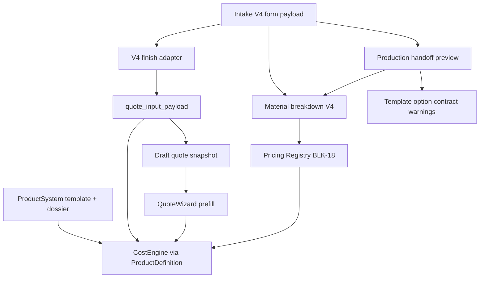

# BUILD_TPL_VOLUMETRIC_LETTERS_BLUEPRINT_DOSSIER_AND_OPTION_CANONICALIZATION_PACK

**Date:** 2026-06-22  
**Status:** PASS (scoped audit + template option contract adapter)  
**Branch:** `local/integration-pr4-plus-svg-path`  
**HEAD before:** `1234c7f70f52f01bfb07e81319623fc826b31411`  
**Commit:** none (awaiting user confirmation)

---

## Working tree before (off-scope dirty — do NOT include in commit)

V2/V3 operator workspace, AuthContext, `tmp/`, untracked E2E off-scope, atoms docs — unchanged.

---

## Files audited (read-only)

### ProductSystem core
- `backend/services/product_system_service.py`
- `backend/services/product_template_contract.py`
- `backend/services/product_blueprint_dossier_service.py`
- `backend/services/product_readiness_service.py`
- `backend/data_models/product_contracts.py`
- `backend/models/product_templates.py`
- `backend/models/product_blueprint_dossier.py`
- `frontend/src/pages/ProductSystem.tsx`
- `frontend/src/pages/BlueprintDossierStudio.tsx`
- `docs/architecture/PRODUCTSYSTEM_TEMPLATE_ONBOARDING_PLAYBOOK.md`

### TPL-VOLUMETRIC-LETTERS
- `backend/seeds/seed_build4_templates.py`
- `backend/seeds/seed_tpl_volumetric_letters_dossier.py`
- `backend/seeds/seed_volumetric_owner_confirmed_prices.py`
- `docs/intake-v3/templates/TPL-VOLUMETRIC-LETTERS/*`
- `docs/architecture/TPL_VOLUMETRIC_LETTERS_CURRENT_STATE.md`
- `docs/architecture/TPL_VOLUMETRIC_LETTERS_INPUT_CONTRACT_AUDIT.md`
- `docs/architecture/TPL_VOLUMETRIC_LETTERS_COSTING_LOGIC_AUDIT.md`

### Intake V4
- `backend/schemas/intake_v4.py`
- `backend/services/intake_v4_finish_adapter.py`
- `backend/services/intake_v4_pricing_input_service.py`
- `backend/services/intake_v4_material_breakdown_service.py`
- `backend/services/intake_v4_production_handoff_preview_service.py`
- `frontend/src/components/workos/intake-v4/steps/IntakeV4ReviewStep.tsx`
- `frontend/src/lib/intakeV4/intakeV4QuoteHandoff.ts`
- `frontend/src/lib/volumetricQuoteInput.ts`

### Commercial chain
- `backend/services/quote_orchestrator.py`
- `backend/services/cost_engine_service.py`
- `frontend/src/components/workos/quotes/QuoteWizard.tsx`

---

## Files modified (in-scope)

| File | Change |
|------|--------|
| `backend/services/intake_v4_template_option_contract_service.py` | **New** — V4 → template option contract + canonical matrix |
| `backend/services/intake_v4_production_handoff_preview_service.py` | Merge contract warnings into handoff preview |
| `backend/tests/test_intake_v4_template_option_contract.py` | **New** — contract + integration tests |
| `docs/qa/BUILD_TPL_VOLUMETRIC_LETTERS_BLUEPRINT_DOSSIER_AND_OPTION_CANONICALIZATION_PACK.md` | This document |

**Not touched:** CostEngine formulas, Pricing registry, ProductSystem storage, V2/V3 dirty, ExecutionTask, stock, ACM/bond, template editor, dynamic form.

---

## ProductSystem current model

```txt
ProductSystem current model:
- source files:
  - backend/services/product_system_service.py (ProductDefinition builder)
  - backend/models/product_templates.py (operational BOM)
  - backend/models/product_blueprint_dossier.py (extended dossier)
  - backend/data_models/product_contracts.py (DTO laws)
- docs:
  - docs/architecture/PRODUCTSYSTEM_TEMPLATE_ONBOARDING_PLAYBOOK.md
  - docs/architecture/TPL_VOLUMETRIC_LETTERS_CURRENT_STATE.md
- backend services:
  - ProductSystemService, ProductBlueprintDossierService, ProductReadinessService
  - ProductSystemLinkageValidator, ProductSystemCostSimulationService
- frontend pages:
  - /product-system (ProductSystem.tsx)
  - /product-system/blueprint-dossier (BlueprintDossierStudio.tsx)
  - /product-system/dossier-completion
- DB entities:
  - product_templates, product_families, product_blueprint_dossier
- template storage:
  - product_templates.components_json / operations_json / required_materials_json
  - dossier JSON columns (variants, task_rules, costengine_mapping, output_blocks)
- blueprint/dossier location:
  - DB: product_blueprint_dossier (1:1 template_id)
  - Docs: docs/intake-v3/templates/TPL-VOLUMETRIC-LETTERS/
  - Seed: backend/seeds/seed_tpl_volumetric_letters_dossier.py
- pricing link:
  - inventory_materials + workcenter_rates (Pricing Registry)
  - BLK-18 via QuoteOrchestrator.create_with_registry()
- CostEngine link:
  - ProductSystemService → ProductDefinition → CostEngineService.calculate()
  - dossier costengine_mapping_json (structural map, no prices)
- production link:
  - dossier task_rules_json (design-time)
  - order snapshot → ExecutionPlan (runtime, frozen)
  - Intake V4 production handoff preview (read-only derivative)
- laws / invariants:
  - ProductSystem defines product, NOT cost
  - Missing data → blockers, no silent defaults
  - Only TPL-VOLUMETRIC-LETTERS owner-valid for live quote/pricing
  - Template visible ≠ functional without full chain alignment
- gaps:
  - Intake V4 form captures subset of dossier variants
  - Production preview uses catalog doc codes, not dossier operation_keys 1:1
  - Multi-group finish collapse in pricing adapter
  - Face thickness variants (4–10 mm) not in template
```

---

## What is Blueprint?

Three concepts — do not conflate:

1. **Product Blueprint Dossier** — `product_blueprint_dossier` table; extended production/commercial documentation per template (variants, task rules, CostEngine mapping, output blocks). UI: BlueprintDossierStudio.
2. **Readiness “blueprint” alias** — `ProductReadinessDTO.entity_type="blueprint"` refers to template identity for readiness gates.
3. **Order Production Blueprint** — runtime operator view (`order_production_blueprint_service.py`); execution layer, not design-time ProductSystem.

**Canonical product blueprint (DTO):** `ProductDefinition` produced by `ProductSystemService` — cost-free structural shape for CostEngine.

---

## What is Dossier?

**Dossier = structured production/commercial documentation** in `product_blueprint_dossier`, 1:1 with `product_templates`.

| Layer | Table | Purpose |
|-------|-------|---------|
| Operational template | `product_templates` | Components, operations, materials — CostEngine structure |
| Blueprint Dossier | `product_blueprint_dossier` | Variants, task rules, CostEngine mapping, quote readiness, output blocks |

For `TPL-VOLUMETRIC-LETTERS`: seeded by `seed_tpl_volumetric_letters_dossier.py`, documented in `docs/intake-v3/templates/TPL-VOLUMETRIC-LETTERS/`.

---

## Application laws for templates (V4 must respect)

1. **Template is source of truth** for product options (`variants_json`, BUILD4 components, quote_input contract).
2. **Form must not invent final options** without template mapping — emit warnings when discovered-only.
3. **Pricing must not invent materials/operations** outside template + Pricing Registry.
4. **CostEngine computes commercial cost** — Intake V4 does not.
5. **Material breakdown V4** = quote estimate / audit only (`quote_estimate_not_stock`).
6. **Production handoff preview** = read-only derivative; no ExecutionTask, no stock.
7. **Real task generation** = separate future build with guards and confirmation.
8. **Stock consumption** = separate from quote estimate.
9. **BLK-18 / `/inventory/pricing`** = administrable price source (`load_material_pricing_dict`).
10. **Important variants** must trace: `template option → material intent → pricing code → operation → preview/task seed`.

**Hash sync:** read-only preview endpoints do **not** enforce strict analysis hash sync; **real handoff** (draft quote / commercial quote) must use strict gates.

---

## Where is TPL-VOLUMETRIC-LETTERS?

| Location | Content |
|----------|---------|
| `product_templates.template_code` | Operational BOM (6 components, formula-gated ops) |
| `product_blueprint_dossier` | Variants, task_rules, costengine_mapping |
| `backend/seeds/seed_build4_templates.py` | Component/operation/material definitions |
| `frontend/src/lib/activeTemplateScope.ts` | `OWNER_VALID_ACTIVE_TEMPLATE_CODE` |
| `backend/schemas/intake_v4.py` | `PILOT_V4_TEMPLATE_CODE` |
| Dossier doc pack | `docs/intake-v3/templates/TPL-VOLUMETRIC-LETTERS/` |

---

## Template linkage chain



---

## Dossier variants (template-owned)

From `seed_tpl_volumetric_letters_dossier._variants()`:

| option_key | allowed_values | default |
|------------|----------------|---------|
| `back_bevel_enabled` | false, true | false |
| `face_finish_type` | none, oracal_651, printed_vinyl, printed_laminated_vinyl | none |
| `mounting_template_enabled` | true, false | true |
| `mounting_system` | direct_wall, steel_bars, aluminum_bars, acm_panel | direct_wall |
| `mounting_bar_profile` | 30x30x1.5 | 30x30x1.5 |
| `return_depth_mm` | 30, 60, 80, 100 | 60 |
| `selected_psu_watts` | 60, 100, 160, 200 | 100 |

---

## Intake V4 form options inventory (summary)

| Field | In template? | Status |
|-------|--------------|--------|
| Geometry (area, perimeter, count) | yes (quote_input) | aligned |
| Face Oracal 651 | yes | aligned |
| Face Oracal 641 / 8500 | partial (maps to 651 pricing) | partial |
| Print + laminate | yes | aligned |
| Return depth 30/60/80/100 | yes | aligned |
| Return Oracal wrapped | partial (operation flags) | partial |
| RAL paint return | partial (needs paint_tube_count) | partial |
| LED modules | derived | aligned |
| PSU array (V4) vs selected_psu_watts | partial | partial |
| Mounting system / template | yes in template | **missing in V4 form** |
| Back bevel | yes | **missing in V4 form** |
| Multi-group finishes | captured | partial (adapter uses first group) |

Full field list: see Part 4 audit in chat report / subagent inventory.

---

## Canonical mapping matrix (mandatory rows)

Status legend: **aligned** | **partial** | **missing** | **provisional**

| Discovered option | Template option | Material intent | BLK-18 code | CostEngine field | Prod. material job | Prod. op group | Task seed | Status |
|-------------------|-----------------|-----------------|-------------|------------------|-------------------|----------------|-----------|--------|
| Plexiglas față 3 mm | implicit | plexiglas_face | MAT-ACP-FATA-LITERE | letter_face_area_m2 | face_plexiglas_cutting | cnc_cutting | cnc_face_cut | aligned |
| Plexiglas 4–10 mm future | missing | missing | missing | — | — | — | — | missing |
| Forex backing 10 mm | implicit | forex_backing | MAT-SPATE-PVC-LITERE | backing area | forex_backing_cutting | cnc_cutting | cnc_back_cut | aligned |
| Oracal 651 | face_finish_type | face_vinyl | MAT-ORACAL-651 | face_finish_type | oracal_vinyl_cutting | vinyl_print_finish | vinyl_application | aligned |
| Print | printed_vinyl | print_vinyl | MAT-VINYL-PRINT | face_finish_type | print_vinyl_artwork | vinyl_print_finish | vinyl_application | aligned |
| Laminare | printed_laminated_vinyl | laminated_vinyl | MAT-VINYL-PRINT-LAMINATED | face_finish_type | laminate_vinyl_artwork | vinyl_print_finish | vinyl_application | aligned |
| Policromie / artwork | partial | artwork_* | MAT-ACP + profile | geometry | artwork_* | vinyl/cnc | vector_prep | partial |
| Cant 30/60/80/100 mm | return_depth_mm | return_material | MAT-PROFIL-LATERAL-* | return_depth_mm | return_profile_material | return_forming/bonding | return_profile_forming | aligned |
| LED module | derived | led_modules | MAT-LED-MODULE | led_module_count | led_modules_install | led_electrical | led_installation | aligned |
| LED pitch | derived (100 mm CE / 250 mm V4 breakdown) | led_modules qty | MAT-LED-MODULE | led_module_count | led_modules_install | led_electrical | led_installation | partial |
| PSU 60/100/160/200 W | selected_psu_watts | led_psu | MAT-LED-PSU-12V-* | selected_psu_watts | psu_electrical | led_electrical | electrical_wiring | aligned |
| Prepress | vector_prep | — | workcenter_rates | operation gate | — | preflight_qc | vector_prep | aligned |
| CNC face/back | face_cnc_cut / back_cut | — | workcenter_rates | area/perimeter | face/back jobs | cnc_cutting | cnc_*_cut | aligned |
| Vinyl / print ops | vinyl_application | — | workcenter_rates | face_finish_type | vinyl jobs | vinyl_print_finish | vinyl_application | aligned |
| Return forming/bonding | side_forming / return_face_bonding | — | workcenter_rates | perimeter | return job | return_* | return_* | aligned |
| LED / electrical | led_install / electrical | — | workcenter_rates | illumination | led/psu jobs | led_electrical | led/electrical | aligned |
| Assembly | assembly_letters (internal) | — | — | — | — | assembly | letter_assembly | partial |
| Packaging | packaging_letters | — | workcenter_rates | always | — | preflight_qc | delivery_prep | aligned |
| Montaj perete | mounting_system=direct_wall | — | — | mounting_system | — | — | premount (inactive) | missing (V4 form) |
| Montaj structură bare | steel/aluminum_bars | MAT-PREMOUNT-BAR-* | registry | mounting_bar_* | — | assembly | premount_bars | missing (V4 form) |

Full programmatic catalog: `get_canonical_mapping_catalog()` in contract service.

---

## Gaps found

| Gap | Type | Mitigation in this build |
|-----|------|------------------------|
| V4 form missing mounting_system, back_bevel, mounting_template | form gap | `discovered_option_not_canonicalized` info warning |
| V4 psu_configuration[] vs selected_psu_watts | contract mismatch | warning on multi-PSU |
| oracal_641 / oracal_8500 not dossier enum values | partial mapping | `discovered_option_not_canonicalized` |
| RAL return without paint_tube_count | pricing gap | `template_pricing_code_missing` |
| Multi-group finish → first group only in adapter | canonicalization gap | warning |
| Production preview op codes ≠ dossier operation_keys | preview provisional | `production_preview_not_template_backed` |
| LED pitch 250 mm (V4 breakdown) vs 100 mm (CostEngine) | formula divergence | documented partial; not changed |
| Face thickness variants 4–10 mm | template missing | status missing — must not treat as final |

---

## What was implemented

### A. Template option contract service

`backend/services/intake_v4_template_option_contract_service.py`:

- Static canonical matrix (`get_canonical_mapping_catalog()`)
- V4 payload evaluation (`evaluate_v4_template_option_contract()`)
- Warning codes: `template_option_missing`, `template_material_intent_missing`, `template_pricing_code_missing`, `template_operation_mapping_missing`, `form_option_not_template_backed`, `production_preview_not_template_backed`, `discovered_option_not_canonicalized`

### B. Production handoff preview integration

Contract warnings merged into `GET .../production-handoff-preview` via `_collect_blockers_and_warnings()`.

### C. Tests

18 contract tests + 6 existing handoff preview tests.

---

## What remains provisional (must NOT treat as final)

- Intake V4 form field list without dossier variant backing
- Material breakdown quantities (quote estimate only)
- Production handoff preview operation groups / task seeds
- Multi-group finish pricing collapse
- Mounting / back bevel defaults from QuoteWizard after handoff
- Face plexiglas thickness variants not in BUILD4 template

---

## What is forbidden to treat as final without template

- Form-only options (oracal_641, led_strip, artwork paths) without dossier variant
- Material breakdown grand total as commercial offer total
- Production preview task seeds as ExecutionTask creation
- V4 PSU array as production BOM without `selected_psu_watts` confirmation in QuoteWizard

---

## Tests run

```powershell
cd backend
.\.venv\Scripts\python.exe -m pytest tests/test_intake_v4_template_option_contract.py tests/test_intake_v4_production_handoff_preview.py -q
```

**Result:** `24 passed`

Frontend Vitest: omitted — no frontend logic changed.

E2E: not run (follow-up).

---

## PASS criteria

| Criterion | Status |
|-----------|--------|
| ProductSystem audited | ✅ |
| Blueprint / Dossier explained | ✅ |
| Application laws documented | ✅ |
| TPL-VOLUMETRIC-LETTERS identified | ✅ |
| Form options inventoried | ✅ |
| Mapping matrix documented | ✅ |
| Gaps surfaced as warnings | ✅ |
| No parallel ProductSystem | ✅ |
| No final options only in UI | ✅ |
| No ExecutionTask / stock | ✅ |
| Tests pass | ✅ |
| V2/V3 untouched | ✅ |

---

## Recommendation

**Recommend commit** (scoped files only):

```
docs(intake-v4): add volumetric template option contract and canonicalization audit
```

4 files in scope (see Files modified).

---

## Follow-ups

1. Dynamic form from template variants (not this build).
2. Template editor / dossier variant expansion for face thickness, mounting in V4.
3. Align V4 LED pitch with CostEngine formula or document single owner formula.
4. Task generation dry-run wired to dossier task_rules_json.
5. Controlled real ExecutionTask creation (separate build).
6. Stock consumption real (separate from quote estimate).
7. E2E: Review shows contract warnings for partial mappings.
