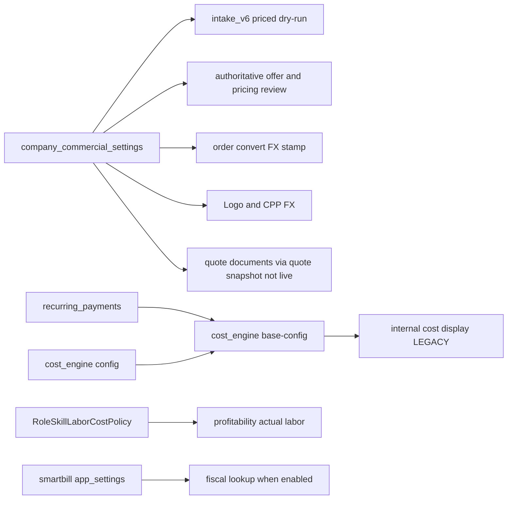

# SETTINGS_CONSUMER_GRAPH

Consumers of Settings-owned (or Settings-adjacent) truth.

---

## A. VAT — five surfaces (Owner lock)

| Surface | Source | Freeze / snapshot | Live Settings re-read? | Evidence |
|---------|--------|-------------------|------------------------|----------|
| **CURRENT DEFAULT VAT** | `company_commercial_settings.default_vat_pct` | none (live) | N/A — is the live value | Settings UI + GET API |
| **QUOTE PERSISTED VAT** | `quote.vat` and/or pricing snapshot `vat_pct` at quote generation | at quote write | No for stored columns | dry-run stamps `vat_policy_source`; quote columns |
| **QUOTE REVIEW / DISPLAY VAT** | `get_default_vat_pct(db)` applied to **frozen CPP net** | CPP frozen; **VAT rate live** | **YES** | `intake_v6_snapshot_authoritative_pricing_review_service.py:318`; `intake_v6_snapshot_authoritative_offer_service.py:403` + comment *“only VAT from settings”* |
| **ORDER SNAPSHOT VAT** | order/commercial freeze path (order snapshot carries commercial totals; VAT policy separate from FX stamp) | at convert / order snapshot | Depends on path; FX stamped separately as `profitability_fx_v1` | convert service |
| **DOCUMENT VAT** | `_resolve_quote_vat_percent` — quote snapshot / `quote.vat`; fallback `DEFAULT_VAT_PCT` constant | document build | **No live Settings GET** (uses quote snapshot) | `quote_document_service.py:693-704` |

### First broken boundary (VAT)

**Not** historical DB mutation of `quote.vat`.  
**Is** read-time re-application of **CURRENT DEFAULT VAT** onto frozen commercial net on authoritative **offer / pricing-review** surfaces.

UI copy on Settings: *„documentele istorice nu se actualizează când schimbi această valoare”* — true for `quote_document_service` snapshot path; **misleading** if operator interprets review/offer totals as frozen VAT when Settings VAT later changes.

---

## B. FX provenance table (Owner lock)

| Consumer | SOURCE | READ_TIME | FREEZE_TIME | SNAPSHOT_LOCATION | FALLBACK | FAIL_CLOSED |
|----------|--------|-----------|-------------|-------------------|----------|-------------|
| Settings FX field | `company_commercial_settings.eur_to_ron_rate` | on load/save | none | DB row | UI default `DEFAULT_EUR_TO_RON_RATE=5` before load | N/A (editor) |
| `get_eur_to_ron_rate()` | same table via `get_settings()` | call time | none | — | returns **5.0** if NULL; `get_or_create` may **persist** 5.0 | **NO** (fail-open default) |
| Quote→Order / convert EUR→RON | `get_eur_to_ron_rate(db)` | convert time | convert | order payload / currency conversion | inherits service default | path-dependent; missing may block some convert guards |
| `profitability_fx_v1` | `get_eur_to_ron_rate` at convert | convert | **order_convert** (`frozen_at` ISO) | Order Snapshot V2 `profitability_fx_v1` | — | **YES** — convert blocked `PROFITABILITY_FX_RATE_MISSING` on failure |
| Logo / CPP canonical conversion | `_canonical_eur_to_ron_rate` (Logo) / CPP normalize | commercial calc time | none (live) unless later snapshotted in commercial artifact | CPP / logo binding notes | **none** | **YES** — NULL → `eur_to_ron_rate_unset` / BLOCKED |
| Intake V6 dry-run FX | `get_eur_to_ron_rate` | dry-run | ephemeral payload | dry-run response `eur_to_ron_rate` | service default 5.0 | soft (uses helper) |
| Manual RON adjustment (`manualAdjustmentRon`) | Intake commercial inputs — **not** Settings FX | operator entry | workspace / offer inputs | commercial inputs / FE calculator | N/A | **Does not consume** Settings `eur_to_ron_rate`; prior Intake audit: FE can mix EUR display with RON adj without FX |

**Conflict:** Logo/CPP fail-closed vs `get_eur_to_ron_rate` fail-open bootstrap — same Settings field, different consumer discipline.

---

## C. Other consumers

---

## D. Non-consumers (important negatives)

- Company mock identity/bank → **not** consumed by quote/order legal document builders as live SoT (documents use other company/snapshot paths — identity on Settings is decorative/static).
- Cost Intern average labour → **not** CPP client-price authority.
- RoleSkill policies → **not** written from Cost Intern tab.
