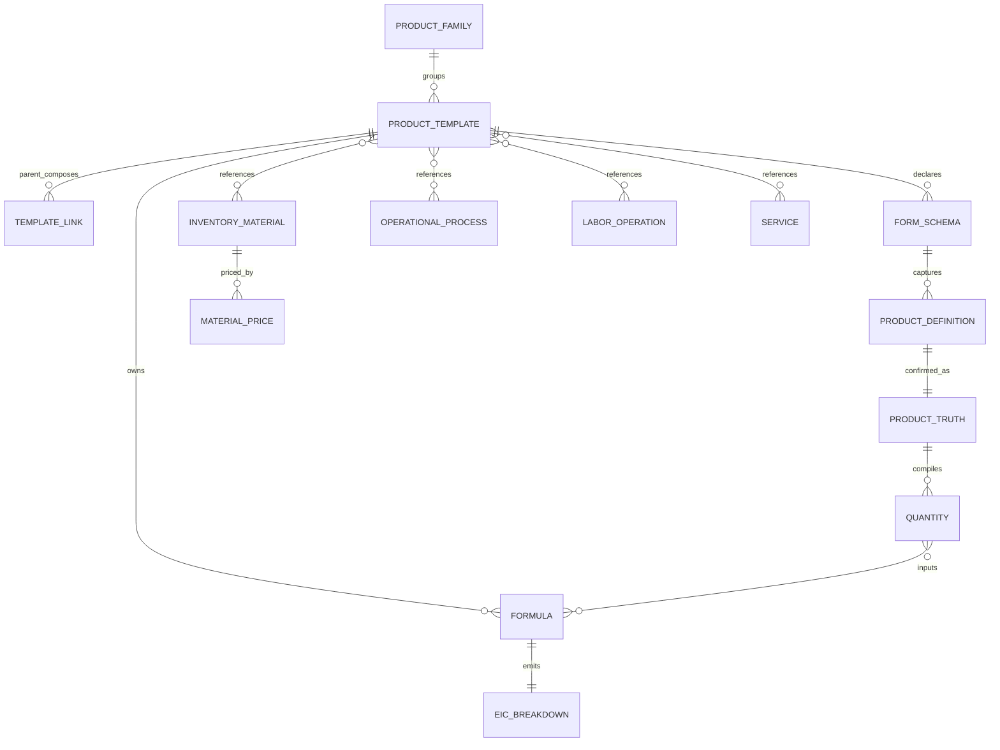

# Domain model

## Purpose
Describe the minimum canonical entities and truth flow for Workflow-ADV.

## Ownership
Workflow-ADV owns the future model. Product Template is the canonical reusable entity; a parallel `ComponentTemplate` is prohibited unless a proven need is accepted.

## Entity relationships

## Entity matrix
| Entity | Owns | Must not own |
|---|---|---|
| Product Family | grouping | technical truth or price |
| Product Template | role, schema, composition, formula ownership | Inventory/material-price truth |
| Template Link | parent-child role and input mapping | copied child technical truth |
| Form Schema | field contract | confirmation or formula execution |
| PD | configuration intent and candidates | final confirmed truth |
| PT | confirmed facts, provenance, revision/hash | silent Analyzer writes |
| Catalog resource | identity/rate/compatibility | product configuration intent |
| Formula/quantity compiler | business calculation | a frontend duplicate calculator |
| EIC breakdown | explainable production cost | markup/offer authority |

## Invariants
- Each technical fact and formula has one owner.
- Child template truth remains child-owned; a parent may map inputs but must not duplicate it.
- PD is mutable intent; PT is confirmed and feeds quantities/cost.
- A selector may resolve to concrete priced variants but has no generic material price.

## Evidence sources
- `GET .../reference-finish-line/contract`
- `GET .../form-field-ownership-map`
- `POST .../templates/{code}/price-breakdown`
- `docs/qa/product-system-reference-complete/runtime/reference_complete.json`

## Limitations
The persisted operational-process catalog shape and Platform model storage remain future implementation decisions. The VL schema is a reference, not a universal UI.

## Do-not-transfer
Do not introduce a ComponentTemplate shadow model, template-local material records, or parent-side copies of child formulas.

## Related docs
- [Template authoring](PRODUCT_TEMPLATE_AUTHORING.md)
- [Child composition](CHILD_TEMPLATE_COMPOSITION.md)
- [Form Schema contract](FORM_SCHEMA_CONTRACT.md)
- [Quantity and Formula contract](QUANTITY_AND_FORMULA_CONTRACT.md)
