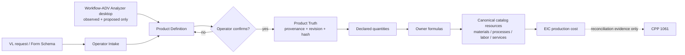

# Request-to-cost flow

## Purpose
Specify the canonical Workflow-ADV path from a VL request to production cost.

## Ownership
Workflow-ADV owns PD/PT, quantity, formula, and EIC contracts. The Analyzer is a separate desktop producer of observed/proposed payloads. Catalog owners own resource identities and rates.

## VL reference fixture
| Field | Value |
|---|---|
| Root template | `TPL-VOLUMETRIC-LETTERS_v2` |
| Child template | `TPL-VOLUM-ALUMINIU_v1` |
| Fixture | `vl_letters_demo_v1` |
| EIC | `923.2` |
| CPP | `1061` — reconciliation only |
| Critical missing | `[]` |
| PSU rule | `MAT-LED-PSU-12V` is `VARIANT_SELECTOR`; use a priced 60/100/160/200W concrete variant |

## Flow gates
| Stage | Required gate | Forbidden shortcut |
|---|---|---|
| Form → PD | typed field data with source/version | hidden page-specific state |
| Analyzer → PD | versioned observed/proposed payload | parser or price calculation in WorkOS |
| PD → PT | operator confirmation and provenance | silent Analyzer/AI write |
| PT → quantities | declared keys and units | frontend recalculation |
| formulas → resources | one formula owner; canonical references | local template prices |
| resources → EIC | concrete compatible rates/variants | generic selector price |
| EIC → CPP | reconciliation only | offer authority |

## Invariants
- The flow stops at EIC, not offer, order, execution, or mobile.
- Parent maps inputs; the child owns its technical truth and formulas.
- EIC includes materials, operational processes, labor, services, consumables, and packaging.
- Current WorkOS proves the laboratory reference only; it is not the Platform architecture.

## Evidence sources
- `GET /api/v1/product-system/reference-complete`
- `GET .../reference-finish-line/contract`
- `GET .../form-field-ownership-map`
- `GET .../analyzer-io-contract`
- `GET .../critical-materials`
- `GET /api/v1/pricing/material-market-prices`
- `POST .../templates/{code}/price-breakdown`
- `docs/qa/product-system-reference-complete/`

## Limitations
The Form Builder, visual add-child, Analyzer desktop application, Supplier Import, offer path, and execution path are deferred. Optional consumables can be unpriced outside the accepted VL closure.

## Do-not-transfer
Do not skip operator confirmation, treat CPP as offer authority, embed an Analyzer/parser in WorkOS, or transfer Lab UI as the Platform flow.

## Related docs
- [Overview](WORKFLOW_ADV_PRODUCT_SYSTEM_OVERVIEW.md)
- [Form Schema contract](FORM_SCHEMA_CONTRACT.md)
- [Product Definition contract](PRODUCT_DEFINITION_CONTRACT.md)
- [Product Truth contract](PRODUCT_TRUTH_CONTRACT.md)
- [Quantity and Formula contract](QUANTITY_AND_FORMULA_CONTRACT.md)
