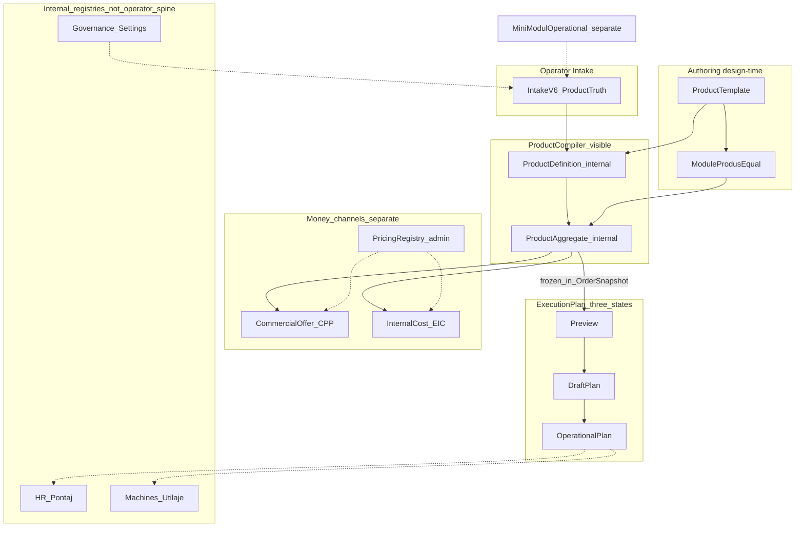

# Plan — WorkOS Product System Simplification Architecture Pass

| Field | Value |
|-------|-------|
| **Date** | 2026-07-23 |
| **Type** | Architecture simplification plan (**docs only** — no functional implementation) |
| **Root** | `C:\w\psiso` |
| **Branch context** | `feature/product-system-active-path-isolation-v1` (Nivel 2B commit `858b10c2`) |
| **Parent evidence** | Audit [`audit__product_system_to_offer_calculation_simplification.md`](./audit__product_system_to_offer_calculation_simplification.md); Nivel 1–2B vocabulary / naming |
| **Forbidden (respected)** | DB rename, migrations, API contract changes, pricing/formula changes, ProductAggregate / ProductDefinition **behavior** changes, Execution materialization, SVG/DWG parsing |

---

## 1. Purpose

Simplify the **operator-visible conceptual model** of WorkOS while **keeping modularity and scalability** in code and registries.

This pass does **not** change runtime compilers, snapshots, or formulas. It proposes a thinner mental model and a display/adapter strategy so the operator sees fewer parallel “systems” for the same job.

---

## 2. Sources analyzed

| Document | Role in this pass |
|----------|-------------------|
| [`03_PRODUCT_DEFINITION_COMPILER.md`](../../architecture/realignment/03_PRODUCT_DEFINITION_COMPILER.md) | PD = product compiler; activates structure; **no price** |
| [`04_PRODUCT_DEFINITION_FLOW.md`](../../architecture/app-flows/04_PRODUCT_DEFINITION_FLOW.md) | Validated read-only builder |
| [`05_PRODUCT_AGGREGATE_FLOW.md`](../../architecture/app-flows/05_PRODUCT_AGGREGATE_FLOW.md) | Aggregate = technical graph + `task_rules`; **not offer** |
| [`04_PRODUCT_AGGREGATE_TECHNICAL_GRAPH.md`](../../architecture/realignment/04_PRODUCT_AGGREGATE_TECHNICAL_GRAPH.md) | Internal expander graph |
| [`08_EXECUTION_PLAN_FLOW.md`](../../architecture/app-flows/08_EXECUTION_PLAN_FLOW.md) | Preview → persist draft → materialize (blocked) |
| [`10_EXECUTION_PLAN_TASK_GRAPH.md`](../../architecture/realignment/10_EXECUTION_PLAN_TASK_GRAPH.md) | Post-order task graph; not commercial |
| [`PRE_ORDER_EXECUTION_PLAN_PREVIEW_BOUNDARY_CONTRACT.md`](../../architecture/product-system/PRE_ORDER_EXECUTION_PLAN_PREVIEW_BOUNDARY_CONTRACT.md) | Pre-order preview ≠ real ExecutionPlan |
| [`12_HR_PONTAJ_EMPLOYEE_COST_BOUNDARY.md`](../../architecture/realignment/12_HR_PONTAJ_EMPLOYEE_COST_BOUNDARY.md) | Internal people; not client price |
| [`14_MACHINES_UTILAJE_CAPACITY_BOUNDARY.md`](../../architecture/realignment/14_MACHINES_UTILAJE_CAPACITY_BOUNDARY.md) | Capacity / feasibility; not client price |
| [`08_PRICING_REGISTRY_SEPARATION.md`](../../architecture/realignment/08_PRICING_REGISTRY_SEPARATION.md) | Classified reference rules; not product truth |
| [`18_GOVERNANCE_SETTINGS_POLICY.md`](../../architecture/realignment/18_GOVERNANCE_SETTINGS_POLICY.md) | Owner GO / freeze / worklog discipline |
| [`21_WORKOS_IMPLEMENTATION_ROUTE.md`](../../architecture/realignment/21_WORKOS_IMPLEMENTATION_ROUTE.md) | Canonical spine + phase gates (note: some status lines stale vs 2026-07 runtime) |
| Nivel 1–2B vocabulary | Product Template → Module produs egale; mini-modul operațional separat |

---

## 3. Cat suntem in directia stabilita

**80/100%**

| Layer | Score | Note |
|------:|------:|------|
| Operator vocabulary Product Template / Module produs | 98% | Closed in Nivel 1–2B (`858b10c2`) |
| Dead “Component Template / Module Template” as UI types | 97% | Negation kept; FE internal `ComponentFirst*` cleaned |
| Canonical commercial spine (Intake → CPP → Snapshot V2) | 88% | Validated; UI still mixes lab/intern/offer signals |
| Conceptual unity “Product Compiler” (PD + Aggregate) | 35% | Exists as two services/docs; **not** one operator concept yet |
| ExecutionPlan as 3 clear states | 55% | Code has preview / persist / materialize; labels & IA incomplete |
| Registries (HR / Machines / Pricing) as background | 60% | Boundaries documented; UI still can feel like parallel product flows |
| DB/API `module_template_*` honesty | 20% | Correctly frozen; adapter layer **proposed**, not built |
| Docs sync vs live spine | 70% | Implementation Route still has stale “7G preview-only” pockets |

**Why not higher:** modularity is correct in code, but the **operator still sees too many named engines** (PD, Aggregate, CPP, EIC, Registry, Lab Closure, Quotes) for one journey. This pass raises the target clarity; it does not yet implement the display layer.

---

## 4. Model simplificat recomandat

### 4.1 Operator spine (what the human should think)

```text
Cerere (Intake)
    → Product Template (singurul template vizibil)
         └─ Module produs egale (față, cant/volum, spate, LED, finisaj, montaj, …)
    → Product Compiler          ← UI name for PD + Aggregate together
    → Ofertă comercială         ← CPP / Snapshot (client money)
    → Cost intern (lab/admin)   ← EIC (separate channel; not “ofertă”)
    → Comandă înghețată
    → ExecutionPlan
         1. Preview
         2. Draft Plan
         3. Operational Plan
    → Execuție reală / pontaj / utilaje (internal)
```

### 4.2 One-page concept map



### 4.3 Concept table (target language)

| Operator / UI name | Meaning | Maps to (code today) |
|--------------------|---------|----------------------|
| **Product Template** | Only visible template type; composes equal product modules | `product_templates` parent / composer rows |
| **Module produs** | Equal structural ownership units under a Product Template | Child `product_templates` + `product_template_module_links` (wire may still say `module_template_*`) |
| **Mini-modul operațional** | Form / intake packaging; **not** a Module produs | Form System / mini-module registry |
| **Product Compiler** | “Compile this job’s technical product” | **ProductDefinition builder** + **ProductAggregate** (two internals, one visible concept) |
| **Ofertă** | Client commercial money | CommercialPriceProposal + Quote Snapshot V2 |
| **Cost intern** | Shop / owner estimate | EstimatedInternalCost (+ BOM adapters) |
| **ExecutionPlan · Preview** | Read-only plan from frozen order snapshot | `POST …/plan-v2/preview/{order_id}` |
| **ExecutionPlan · Draft Plan** | Persisted planned graph; not shop runtime | `POST …/plan-v2/from-order/{order_id}` → `planned_tasks[]` |
| **ExecutionPlan · Operational Plan** | Materialized operational tasks (future; GO-gated) | `operational_tasks[]` after materialize |
| **Registries** | Admin/internal reference data | HR, Machines/Utilaje, Pricing Registry, Inventory |

---

## 5. Ce concepte dispar din UI / operator language

These should **stop being taught as separate product types or parallel journeys**:

| Retire from operator language | Why |
|-------------------------------|-----|
| **Component Template** / **Module Template** as types | Replaced by Module produs; negation already in Control Center |
| **ProductDefinition** vs **ProductAggregate** as two UI products | Merge under **Product Compiler** (stages may remain for admin/debug) |
| **Unified Catalog / five buckets** as primary IA | Already replaced by Canonical Catalog (Nivel 2A/2B) |
| **Laboratory Closure** as if it were the offer | Lab readiness ≠ ofertă; keep admin-only |
| **Pricing Registry** as an Intake step | Admin reference; operator consumes compiled offer, not the hub |
| **HR / Pontaj / Utilaje** as offer inputs | Internal capacity & actuals; never client price drivers |
| **“Module Template code”** in operator copy | Prefer “Module produs code / template code” via display layer |
| Pre-order **task list as ExecutionPlan** | Pre-order technical preview stays ephemeral; real plan starts post-order |

Keep visible, but **clearly secondary / admin**:

- EIC panels, cost-BOM preview, dossier contracts, candidate Module produs sets (readonly)
- Governance / Control Center honesty labels

---

## 6. Ce rămâne intern în cod (scalabil, neschimbat acum)

| Internal artifact | Keep | Reason |
|-------------------|------|--------|
| `product_definition_builder_service.py` | Yes | Compiler stage A — activation / readiness |
| `product_aggregate_service.py` + `task_contract.task_rules` | Yes | Compiler stage B — expandable graph for CPP/EIC/plan |
| Separate CPP vs EIC services | Yes | Commercial ≠ internal cost (non-negotiable) |
| Quote / Order Snapshot V2 freeze | Yes | Immutability spine |
| `execution_plan_v2_*` preview / persist / materialize services | Yes | Three states already encoded |
| Wire fields `module_template_*`, `*_module_template_code` | Yes (for now) | API/DB contract — adapter only until Nivel 3 GO |
| Template codes `TPL-COMP-*`, `TPL-LETTERS-COMPOSER_v1` | Yes | Stable identities, not UI type names |
| Mini-module registry codes | Yes | Operational packaging ≠ Module produs |
| HR / Machines / Pricing Registry schemas | Yes | Internal registries; boundary docs stay authoritative |
| Governance GO / freeze / worklog discipline | Yes | How change is authorized |

**Scalability preserved by:** equal Module produs composition under one Product Template; compiler producing a job-specific graph; snapshots freezing authority; registries remaining pluggable without entering the operator spine.

---

## 7. Ce NU merită redenumit acum

| Item | Decision | Why |
|------|----------|-----|
| DB columns / JSON keys `module_template_*` | **Do not rename** | High blast radius; freeze/reference risk; no operator benefit until adapter exists |
| API paths `/product-definition`, `/aggregate` | **Do not merge endpoints yet** | Behavior must stay; UI can call both under one label |
| Service class names `ProductDefinition*` / `ProductAggregate*` | **Defer** | Rename later if desired; zero operator value now |
| Route `/product-system/components` | **Optional later** | Label already Module produs; path id is cosmetic |
| `CommercialPriceProposal` / `EstimatedInternalCost` class names | **Keep** | Correct separation; only UI chrome needs clearer “Ofertă” vs “Cost intern” |
| Pricing Registry table keys / rate IDs | **Keep** | Formula/registry freeze |
| Historical worklogs / QA folders named `component_first` | **Keep** | Evidence; do not rewrite history |

---

## 8. Propunere Nivel 3: rename real vs adapter layer

### 8.1 Recommended default for next phase after this plan

**Prefer Adapter / Display Layer first** (low risk), **real DB/API rename later** only with explicit owner GO + migration plan.

### 8.2 Adapter / display layer (recommended next engineering slice)

| Concern | Adapter behavior |
|---------|------------------|
| FE copy & tables | Map `module_template_code` → label “Module produs code” via vocabulary helpers (extend `productTemplateModulesVocabulary`) |
| Admin/debug panels | Show wire key in monospace secondary line; primary line uses Module produs language |
| Product Compiler UI | Single shell: tabs or stages `Compile · Definition` / `Compile · Graph` that call existing PD + Aggregate APIs **unchanged** |
| ExecutionPlan UI | Explicit badges: Preview / Draft Plan / Operational Plan mapped to existing endpoints / `tasks_json` sections |
| API clients | Keep TypeScript field names as wire; never invent parallel write DTOs |

**Out of adapter scope:** changing JSON shapes, renaming OpenAPI fields, Alembic, seed rewrites.

### 8.3 Real rename (only if adapter proves insufficient)

| Rename class | When justified | Cost |
|--------------|----------------|------|
| DB `module_template_*` → `product_module_*` (example) | Multi-quarter cleanup after adapter + dual-read period | **High** — migrations, snapshots, seeds, FE types, pytest fixtures |
| Merge HTTP routes into `/product-compiler/*` | Only after UI shell proven; keep aliases | **Medium** |
| Rename Python services | Cosmetic; do last | **Low–medium** (import churn) |

**Verdict for Nivel 3 now:** **Adapter layer YES (plan → future build); real rename NO** until freeze/unfreeze policy allows and dual-read is proven.

---

## 9. Risc estimat

| Risk | Level | Mitigation |
|------|-------|------------|
| Operator still sees PD + Aggregate as two products | Medium | Product Compiler shell (labels only) before any API merge |
| Docs drift (Implementation Route stale statuses) | Medium | Doc sync build; do not “fix” by changing formulas |
| Premature `module_template_*` rename | **High** | Forbidden until adapter + GO; this plan defaults to adapter |
| Collapsing CPP into Aggregate language | **High** | Keep money channels separate in UI forever |
| Calling pre-order preview “Operational Plan” | **High** | Enforce three-state vocabulary; materialize remains GO-gated |
| Treating HR/Machines as offer inputs | **High** | Boundary docs + Governance; UI placement = admin/execution only |
| Scope creep into materialization / formula work | **High** | This pass is docs-only; next builds must restate forbidden list |

**Overall risk of adopting this conceptual model (docs + future display-only builds):** **Low–Medium**.  
**Overall risk of jumping to Nivel 3 DB rename now:** **High — do not**.

---

## 10. Următorul build recomandat

**Name (suggested):** `PRODUCT_COMPILER_DISPLAY_SHELL_V1` (docs + FE labels / IA only)

**In:**

1. Product System / Intake admin surfaces: one **Product Compiler** section that presents PD + Aggregate as stages (existing GET APIs).
2. Execution detail: badge the three states Preview / Draft Plan / Operational Plan (read-only; no materialize).
3. Extend vocabulary helpers for wire→display of `module_template_*` (adapter layer start).
4. Soften leftover “Laboratory / Registry” chrome so Ofertă vs Cost intern vs Compiler are unmistakable.
5. Short doc sync note on `21_WORKOS_IMPLEMENTATION_ROUTE.md` status table (stale 7G lines) — documentation only.

**Out / still forbidden:**

- DB/API rename, migrations
- PD/Aggregate behavior, formulas, CPP/EIC rules
- Execution materialize / sessions
- SVG/DWG / Analyzer ownership changes

**Not the next build:** Nivel 3 real rename; Pricing Registry 7I redesign; Employee Mobile.

---

## 11. Alignment with Governance

Per [`18_GOVERNANCE_SETTINGS_POLICY.md`](../../architecture/realignment/18_GOVERNANCE_SETTINGS_POLICY.md):

- This pass is **owner-facing architecture** under worklog discipline.
- No frozen commercial path is altered.
- Any later display-shell build still needs a scoped BUILD/worklog and must not claim Execution or offer authority.

---

## 12. Summary verdict

| Question | Answer |
|----------|--------|
| Keep modularity? | **Yes** — equal Module produs under one Product Template; mini-modul separate |
| Keep scalability? | **Yes** — compiler stages + registries + frozen snapshots stay |
| Simplify operator language? | **Yes** — Product Compiler; three ExecutionPlan states; registries background |
| Touch Nivel 3 storage now? | **No** — adapter/display first |
| Implementation in this pass? | **None** — this file only |

**Direction after this plan (conceptual clarity target locked):** **80/100%**  
Closing the remaining gap is mostly **display/IA + honest docs**, not more engines.

---

## 13. Appendix — three ExecutionPlan states (mapping)

| State | Operator meaning | Runtime today | Writes |
|-------|------------------|---------------|--------|
| **Preview** | “If we planned from this frozen order, tasks would look like this” | `POST /api/v1/execution/plan-v2/preview/{order_id}` | None (`no_write`) |
| **Draft Plan** | “Saved planned graph for this order” | `POST /api/v1/execution/plan-v2/from-order/{order_id}` → `planned_tasks[]` | Plan row / `tasks_json` |
| **Operational Plan** | “Shop-floor task instances exist” | `operational_tasks[]` after materialize | **Blocked** — owner GO (DEC-009 etc.) |

Pre-order technical preview (Intake) is **not** one of these three states; it remains a separate ephemeral boundary ([pre-order contract](../../architecture/product-system/PRE_ORDER_EXECUTION_PLAN_PREVIEW_BOUNDARY_CONTRACT.md)).

---

## 14. Appendix — Product Compiler stages (internal)

| Stage | Internal name | Operator-facing line |
|-------|---------------|----------------------|
| A | ProductDefinition | “Ce module / ce valori sunt active pentru job” |
| B | ProductAggregate | “Graful tehnic + reguli de task pentru plan/cost” |
| — | *(together)* | **Product Compiler** |

Neither stage prices the client offer. CPP/EIC remain downstream readers.
